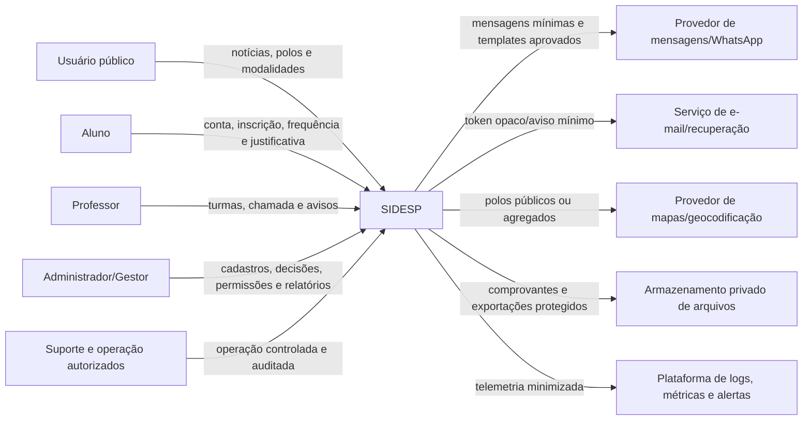
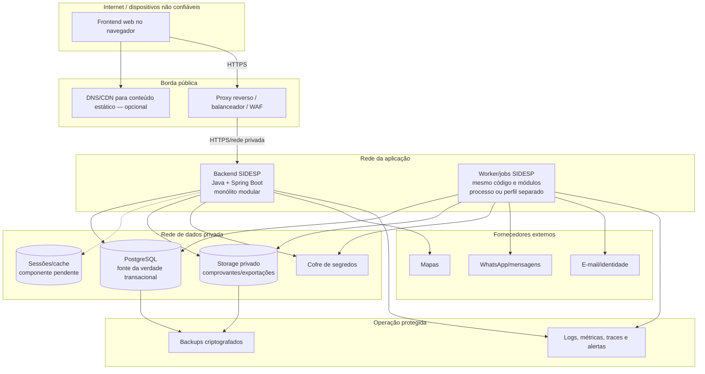
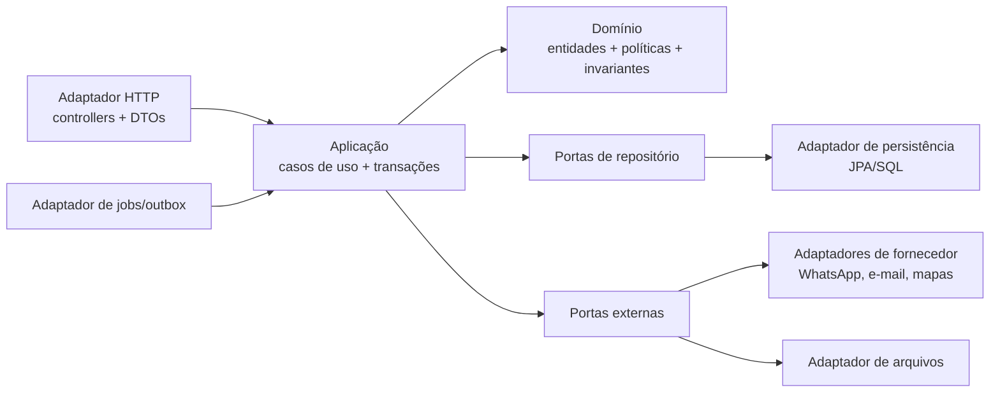
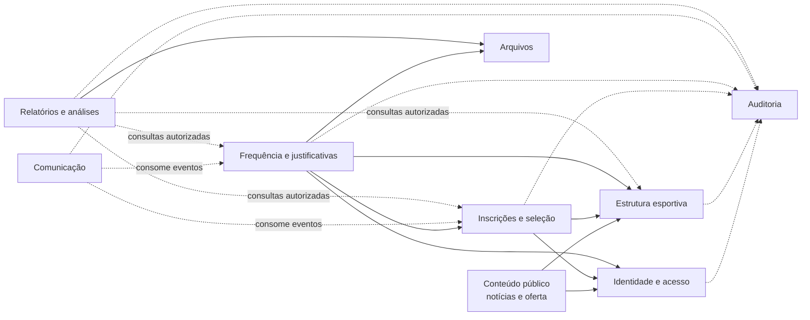
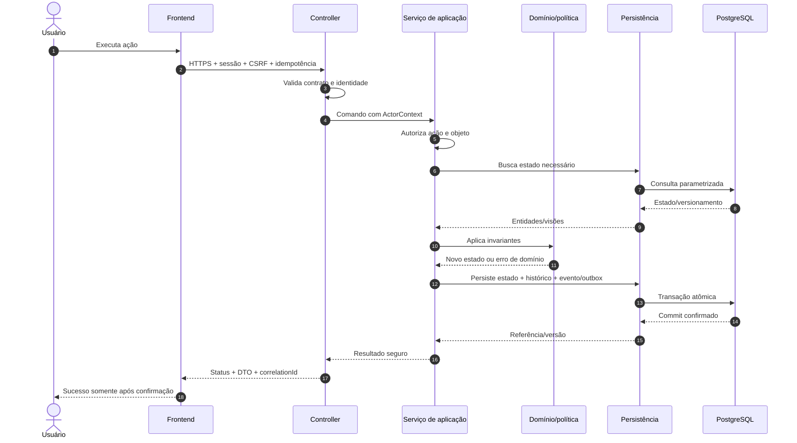
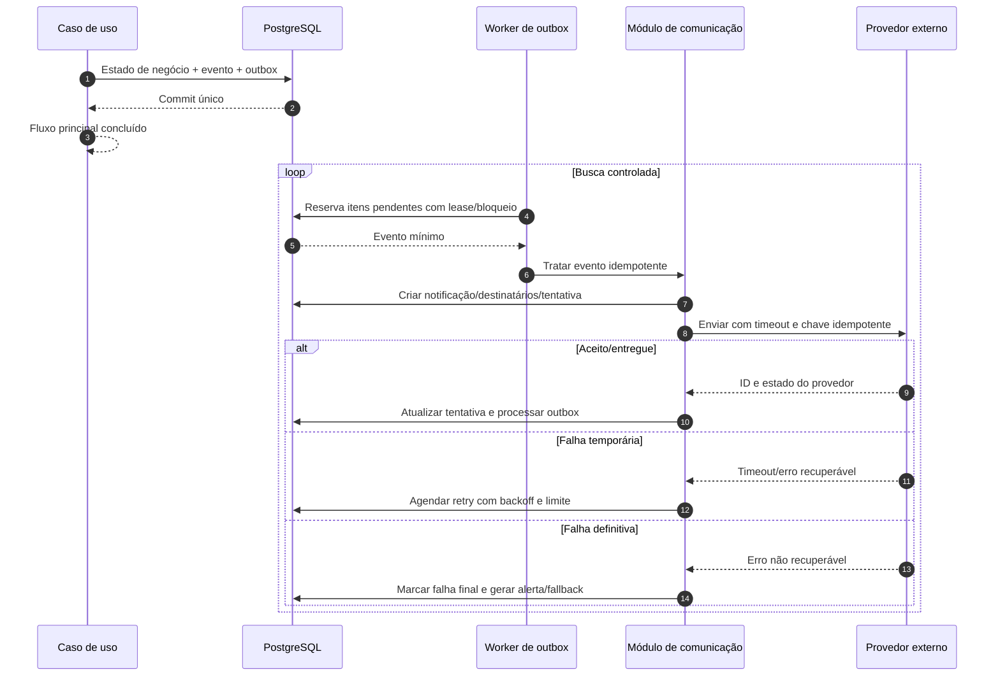
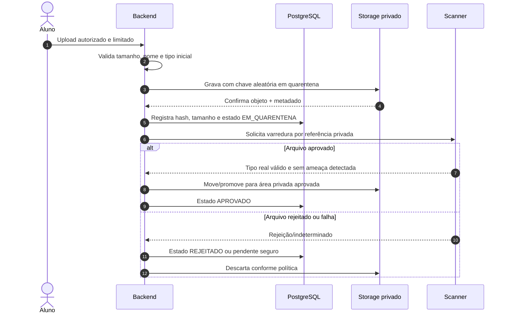
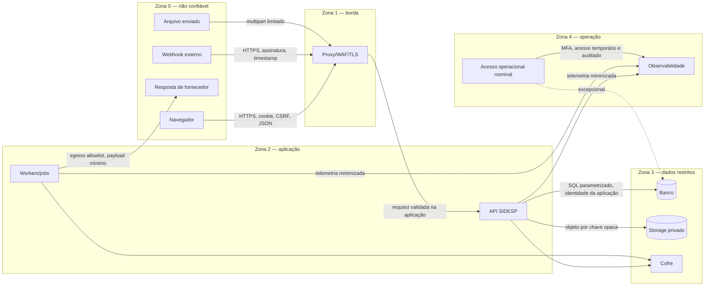
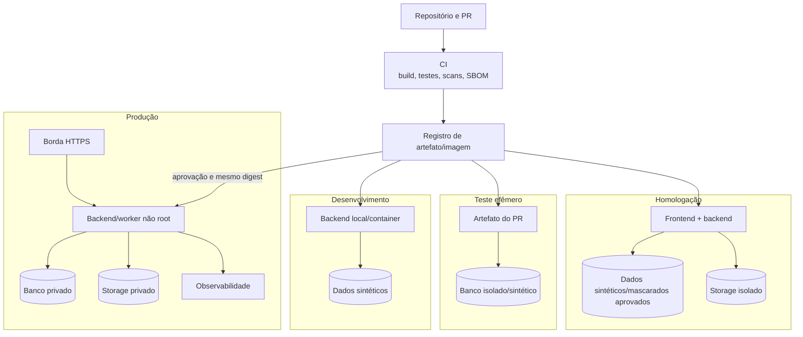

# Arquitetura de Software — SIDESP

> **SIDESP — Sistema Integrado de Desenvolvimento Esportivo Público**

## Identificação do documento

| Campo | Valor |
| --- | --- |
| Documento | Arquitetura de Software |
| Projeto | SIDESP — Sistema Integrado de Desenvolvimento Esportivo Público |
| Versão | `0.1.0` |
| Data | 13/08/2026 |
| Status | **Rascunho — arquitetura proposta, ainda não aprovada para produção** |
| Classificação | Uso interno |
| Responsável sugerido | Arquitetura/Liderança técnica |
| Revisores necessários | Produto, Backend, Frontend, Dados, Segurança, Privacidade e Operações |
| Documentos relacionados | `LEVANTAMENTO_DE_REQUISITOS.md`, `CASOS_DE_USO.md`, `CLASSES_OU_COMPONENTES.md`, `ATIVIDADES.md`, `../database/BANCO_DE_DADOS.md` e `SEGURANCA.md` |

## Aprovações

| Papel | Responsável | Situação | Data |
| --- | --- | --- | --- |
| Product Owner/Secretaria | Lívia Andrade | Pendente | — |
| Liderança técnica | Heitor Leite | Pendente | — |
| Backend | Heitor Leite | Pendente | — |
| Frontend | A definir | Pendente | — |
| Segurança e privacidade | A definir | Pendente | — |
| Operações/Infraestrutura | A definir | Pendente | — |

## 1. Objetivo e escopo

Este documento explica a estrutura técnica planejada do SIDESP, suas fronteiras de responsabilidade, fontes da verdade, integrações, fluxos de dados e decisões que devem ser preservadas durante o desenvolvimento.

A arquitetura descreve o produto completo, inclusive frontend, dados e serviços externos. A implementação de código inicialmente tratada pelo grupo deste repositório será o **backend em Java/Spring Boot**. A tecnologia do frontend, o provedor de hospedagem e os fornecedores externos ainda dependem de decisão formal.

O documento deve permitir responder:

- onde autenticação e autorização são aplicadas;
- quais componentes podem acessar cada dado;
- onde permanecem estado, arquivos e segredos;
- como requisições repetidas evitam efeitos duplicados;
- como notificações, jobs e exportações funcionam sem corromper o fluxo principal;
- como o serviço se comporta quando banco, internet ou fornecedor falham;
- como implantar, observar, recuperar e evoluir a solução com segurança.

## 2. Estado das decisões arquiteturais

| Decisão | Direção inicial | Status |
| --- | --- | --- |
| Estilo do backend | Monólito modular, orientado a domínios, com portas e adaptadores | **Proposto** |
| Linguagem/backend | Java em versão LTS homologada e Spring Boot | Confirmado quanto à família tecnológica; versões pendentes |
| Interface principal | API HTTP REST/JSON, documentada por OpenAPI | Proposto |
| Frontend | Aplicação web responsiva consumindo a API | Requisito confirmado; framework pendente |
| Autenticação web | Sessão opaca mantida no servidor e cookie seguro | Proposto/preferencial em `SEGURANCA.md` |
| Autorização | RBAC com validação adicional por objeto, vínculo e vigência no backend | Proposto; matriz de permissões pendente |
| Banco | PostgreSQL `16.x` ou versão estável homologada | Proposto no modelo de dados |
| Migrações | Flyway, scripts versionados | Proposto |
| Arquivos | Storage privado; banco guarda metadados e autorização | Proposto |
| Assíncrono inicial | Outbox transacional e workers no mesmo produto | Proposto |
| Broker de mensagens | Não faz parte da baseline inicial | Adiar até necessidade comprovada |
| Integrações | Portas internas e adaptadores por fornecedor | Proposto |
| Implantação | Containers, processo sem estado local e infraestrutura por ambiente | Proposto; provedor pendente |
| Multi-tenancy | Instância de uma única Secretaria | Confirmado pelo escopo atual; revisar se o produto mudar |

Nenhuma versão, fornecedor ou topologia de produção está aprovada somente por aparecer neste documento.

## 3. Contexto e objetivos arquiteturais

O SIDESP centraliza operações atualmente manuais e dispersas: cadastros, oferta esportiva, inscrições, lista de espera, processos seletivos, chamadas, frequência, justificativas, comunicação e informações gerenciais.

Os principais objetivos arquiteturais são:

1. **integridade transacional:** vagas, fila, frequência e decisões não podem divergir sob concorrência ou repetição;
2. **segurança por padrão:** nenhum identificador fornecido pelo cliente concede acesso por si só;
3. **rastreabilidade:** transições críticas preservam autor, instante, motivo e estado;
4. **isolamento de fornecedores:** WhatsApp, mapas, e-mail e geradores de arquivo não entram no domínio;
5. **evolução incremental:** começar com uma unidade implantável simples, mantendo módulos substituíveis;
6. **operação degradada:** falha externa não corrompe nem bloqueia funções independentes;
7. **privacidade:** dados de menores, frequência, comprovantes e exportações recebem acesso e retenção específicos;
8. **portabilidade:** dados, arquivos e contratos permanecem documentados para evitar dependência irreversível.

## 4. Requisitos que dirigem a arquitetura

| Direcionador | Consequência arquitetural |
| --- | --- |
| Autorização por papel, objeto e vínculo | Identidade derivada da sessão; políticas executadas no backend e repetidas em jobs/consumidores |
| Última vaga e fila concorrente | Banco relacional, transações, constraints, bloqueio/controle de versão e idempotência |
| Chamada atômica e correção auditável | Agregado transacional, histórico imutável e concorrência otimista |
| Notificação por evento | Outbox na mesma transação do negócio e worker com retentativa limitada |
| Upload potencialmente sensível | Quarentena, varredura, storage privado e autorização por objeto |
| Relatórios e mapas | Consultas autorizadas, definições versionadas, agregação e supressão de grupos pequenos |
| Conectividade instável nos polos | Resposta só após persistência confirmada; estratégia offline ainda é decisão bloqueadora |
| Segurança e privacidade | Sessão revogável, MFA administrativo, cofre, minimização, auditoria e descarte |
| Metas de desempenho/volume ausentes | Evitar otimização prematura; instrumentar e testar antes de dimensionar cache, réplica ou broker |
| Orçamento e contratação pública | Componentes substituíveis, custos mensuráveis e ausência de dependência não justificada |

Rastreabilidade principal: `RNF-SEG-*`, `RNF-PRI-*`, `RNF-DSP-001`, `RNF-CAP-001`, `RNF-DIS-001`, `RNF-RES-001`, `RNF-CON-001`, `RNF-OBS-001`, `RNF-MAN-001`, `RNF-EXP-001` e `RNF-POR-001`.

## 5. Visão de contexto



### 5.1 Atores e confiança

- Navegadores, dispositivos, redes dos polos, callbacks e respostas de fornecedores são externos e não confiáveis.
- O frontend melhora a experiência, mas não é fronteira de autorização.
- Professores e administradores são usuários autenticados, não componentes confiáveis por padrão.
- O backend é o ponto de aplicação dos contratos, autorização, regras, transações e auditoria.
- Banco, storage, cofre e observabilidade são serviços internos protegidos, cada um com identidade e privilégio próprios.

## 6. Visão de contêineres



### 6.1 Responsabilidades dos contêineres

| Contêiner | Responsabilidade | Não deve fazer |
| --- | --- | --- |
| Frontend web | Apresentação, acessibilidade, navegação, validação de experiência e consumo do contrato | Autorizar, guardar segredo, decidir regra ou persistir credencial em storage JavaScript |
| Borda | TLS, roteamento, limites de conexão/tamanho, headers e proteção complementar | Substituir autorização do backend ou expor endpoints de gestão |
| Backend HTTP | Contrato, sessão, autorização, casos de uso síncronos, transações e resposta | Chamar fornecedor diretamente dentro da transação quando o efeito puder ser assíncrono |
| Worker/jobs | Outbox, retentativas, expirações, cálculos, publicação agendada e geração de arquivos | Criar regra paralela diferente da usada pela API |
| PostgreSQL | Fonte da verdade transacional, constraints, metadados e auditoria | Ser acessível pelo frontend ou por usuário funcional via SQL |
| Storage privado | Conteúdo de comprovantes e exportações | Autorizar sozinho ou usar nome do usuário como caminho |
| Sessão/cache | Sessão revogável, rate limit ou cache aprovado | Virar fonte da verdade de vaga, inscrição, frequência ou permissão |
| Cofre | Segredos e chaves por ambiente/workload | Entregar segredo ao navegador ou registrar valor em log |
| Observabilidade | Telemetria, investigação e alerta | Receber senha, token, comprovante ou dado sensível desnecessário |

## 7. Estilo arquitetural do backend

### 7.1 Monólito modular

O backend começa como uma única base de código e, preferencialmente, uma única unidade de release. Internamente, cada domínio possui fronteira, pacote, modelo e interfaces explícitos.

Essa escolha reduz custo operacional e transações distribuídas no início, sem aceitar um “monólito sem fronteiras”. Um módulo não acessa diretamente tabelas ou classes internas de outro módulo. A colaboração ocorre por serviço de aplicação publicado, porta de consulta ou evento interno.

Microsserviços somente serão considerados quando houver evidência, por exemplo:

- necessidade de escala ou disponibilidade realmente distinta;
- ciclo de implantação independente com equipe responsável;
- isolamento regulatório ou de risco;
- volume assíncrono que não possa ser atendido pelo worker/outbox;
- medição mostrando que a separação compensa rede, consistência e operação adicionais.

### 7.2 Portas e adaptadores



Regras de dependência:

- domínio não depende de Spring, JPA, HTTP, SDK de fornecedor ou storage;
- controller não implementa regra de negócio nem acessa repositório diretamente;
- serviço de aplicação coordena autorização contextual, transação, idempotência e eventos;
- adaptadores dependem das portas definidas pela aplicação/domínio;
- entidade JPA não é serializada diretamente na API;
- DTOs usam allowlist e não recebem dono, papel, auditoria ou estado controlado pelo servidor;
- jobs invocam os mesmos casos de uso e políticas do fluxo HTTP.

## 8. Módulos do produto



| Módulo | Responsabilidades | Dados que controla |
| --- | --- | --- |
| `public-content` | Notícias publicadas, detalhes públicos, consulta pública de polos/modalidades | Notícias e versões; projeções públicas |
| `identity-access` | Cadastro, credencial, sessão, recuperação, papéis, permissões e responsáveis | Usuários, perfis, credenciais, sessões, vínculos e RBAC |
| `sports-catalog` | Polos, modalidades, regras, turmas, agendas, aulas e vínculos de professor | Estrutura esportiva e vigências |
| `enrollment` | Elegibilidade, inscrição, fila, oferta, seleção, exceção e histórico | Inscrições, espera, ofertas e candidaturas |
| `attendance` | Chamada, diário, frequência, correção, justificativa e apuração de faltas | Frequência, decisões e metadados do comprovante |
| `communication` | Eventos, destinatários, templates, tentativas, callbacks e fallback | Notificações, outbox e entrega |
| `reporting` | Indicadores, filtros, agregação, mapas, resultados e exportações | Definições e resultados derivados |
| `files` | Quarentena, varredura, armazenamento, download autorizado e descarte | Metadados técnicos e acesso ao objeto privado |
| `audit` | Registro imutável/minimizado de ações críticas | Eventos de auditoria e correlação |

### 8.1 Regras entre módulos

- Um módulo é proprietário das alterações em suas tabelas.
- Consulta cruzada simples usa porta de leitura; alteração cruzada usa caso de uso publicado ou evento.
- Comunicação não consulta listas arbitrárias recebidas do frontend; resolve destinatários a partir do evento e dos módulos proprietários.
- Reporting não altera domínio operacional e não acessa credenciais, sessões ou conteúdo de comprovante.
- Files não decide sozinho se um usuário pode baixar; o módulo proprietário fornece a política do objeto.
- Shared kernel deve conter apenas tipos realmente transversais, como `Identifier`, `Clock`, `ActorContext`, resultado e código de erro. Entidades de negócio não entram nele.

### 8.2 Estrutura de pacotes proposta

```text
<pacote-base>.sidesp
├── identity
│   ├── api
│   ├── application
│   ├── domain
│   └── infrastructure
├── sports
├── enrollment
├── attendance
├── communication
├── reporting
├── files
├── audit
└── shared
    ├── application
    ├── domain
    └── infrastructure
```

Cada módulo repete a separação `api/application/domain/infrastructure`. O pacote-base oficial será definido ao criar o projeto; o exemplo não deve ser copiado como namespace definitivo sem decisão.

## 9. Frontend e código público no navegador

O frontend é uma aplicação web responsiva e acessível. Seu framework e hospedagem ainda não estão definidos.

Responsabilidades:

- renderizar telas e estados de sucesso, vazio, validação, indisponibilidade e acesso negado;
- executar validação de experiência, sem substituir validação do servidor;
- enviar cookie de sessão somente pelo mecanismo do navegador;
- enviar proteção CSRF conforme contrato;
- preservar `correlationId` recebido para suporte sem expor detalhes internos;
- aplicar acessibilidade WCAG 2.2 AA nos fluxos críticos, conforme requisito proposto.

Tudo enviado ao navegador é público, inclusive:

- JavaScript, HTML, CSS, source maps publicados e assets;
- URL/base pública da API;
- flags de interface e configurações serializadas;
- chaves explicitamente públicas de mapa, somente se o fornecedor permitir e com restrição por origem/API.

Nunca são enviados ao frontend:

- senha de banco, segredo de sessão, chave de API privada ou segredo de webhook;
- credencial de storage, chave de assinatura ou connection string;
- decisão de autorização baseada apenas na interface;
- caminho físico, bucket interno ou metadado restrito de arquivo;
- hash de senha/token ou detalhe administrativo desnecessário.

O frontend não persiste session ID, access token ou refresh token em `localStorage`, `sessionStorage`, IndexedDB, Cache API ou URL.

## 10. APIs e contratos

### 10.1 Estilo do contrato

- API HTTP REST/JSON sob prefixo versionado, inicialmente proposto como `/api/v1`.
- OpenAPI versionado é a fonte do contrato HTTP e deve permanecer sincronizado com rotas e DTOs.
- Compatibilidade deve ser preservada dentro da versão; mudança incompatível exige nova versão ou janela formal de depreciação.
- Datas usam ISO 8601; instantes preservam offset/UTC; apresentação usa `America/Sao_Paulo` após ratificação.
- Identificadores externos são UUIDs opacos e nunca funcionam como autorização.
- Paginação, filtro e ordenação usam allowlists e limites aprovados.
- Respostas não serializam entidades de persistência diretamente.

### 10.2 Status e erros

| Situação | Resposta esperada |
| --- | --- |
| Sucesso de leitura | `200` |
| Criação concluída | `201` com referência segura |
| Processamento assíncrono aceito | `202` com recurso de acompanhamento |
| Operação idempotente sem corpo | `204` ou resposta original documentada |
| Entrada inválida | `400`/`422`, conforme convenção única aprovada |
| Não autenticado | `401` sem revelar dado |
| Não autorizado | `403`; `404` pode ser usado para não revelar existência conforme política |
| Conflito/versão/estado | `409` |
| Limite excedido | `429` com `Retry-After` quando aplicável |
| Falha interna | `500` com código seguro e correlação |
| Dependência indisponível | `502`/`503` somente quando o fluxo depender dela |

Erros seguem Problem Details (`application/problem+json`) ou formato equivalente aprovado, contendo código estável, mensagem segura, status, caminho lógico e `correlationId`. Stack trace, SQL, caminho interno e segredo não chegam ao cliente.

### 10.3 Cabeçalhos e controles

- `Idempotency-Key` ou identificador de comando em inscrição, cancelamento, confirmação, chamada, decisão, exportação e envio manual.
- `If-Match`/versão equivalente pode proteger alterações concorrentes de recursos administrativos.
- CSRF obrigatório para operação mutável autenticada por cookie.
- CORS por allowlist exata de origem, método e header em cada ambiente.
- Limites de corpo, arquivo, filtros, paginação e resposta aplicados na borda e no backend.
- Correlation ID é aceito somente em formato limitado ou gerado novamente pelo servidor.

## 11. Identidade, autenticação e autorização

### 11.1 Autenticação

A baseline preferencial é sessão opaca no servidor:

1. login recebe CPF ou e-mail e senha por HTTPS;
2. o backend normaliza o identificador e responde de forma antienumeração;
3. a credencial é verificada por hash de senha aprovado;
4. sessão nova é criada/rotacionada no servidor;
5. o navegador recebe cookie `Secure`, `HttpOnly`, `SameSite` aprovado, sem `Domain` e preferencialmente `__Host-`;
6. logout, recuperação, mudança de senha, revogação e incidente invalidam a sessão no servidor.

MFA administrativo é requisito proposto e bloqueador de produção administrativa; tecnologia e recuperação ainda dependem de decisão. OAuth/OIDC ou JWT somente entram mediante ADR e modelo de ameaças.

### 11.2 Ponto real de autorização

A autorização é aplicada no backend em duas etapas complementares:

1. **serviço de aplicação/política:** valida papel e permissão para executar o caso de uso;
2. **regra contextual/repositório:** limita o objeto pelo aluno autenticado, vínculo vigente do professor, turma, estado e escopo administrativo.

Exemplos:

- aluno consulta inscrição por `sessao.usuarioId`, não por `alunoId` aceito livremente;
- professor registra chamada somente se o vínculo com a turma estiver vigente na data aplicável;
- administrador parcial precisa da permissão específica e não pode elevar a si próprio;
- visualizar relatório não concede automaticamente exportar;
- acessar justificativa não concede acesso ao comprovante;
- job, worker e webhook usam identidade técnica e as mesmas invariantes do negócio.

Spring Security pode aplicar autenticação, CSRF, sessão e autorização de entrada. A decisão final por objeto permanece no caso de uso/domínio e é testada contra BOLA/IDOR.

## 12. Processamento síncrono

Operações interativas simples são síncronas quando podem concluir dentro da meta aprovada sem depender de fornecedor externo.



Se o commit não for confirmado, o frontend não exibe sucesso. Em estado desconhecido por perda de conexão, a operação é consultada/repetida pela mesma chave idempotente.

## 13. Processamento assíncrono, outbox e jobs

### 13.1 Outbox transacional

Notificação, publicação externa e outros efeitos não essenciais ao commit principal usam outbox:



Garantias:

- estado de negócio e outbox são gravados na mesma transação;
- entrega interna é pelo menos uma vez, portanto todo consumidor é idempotente;
- worker reserva itens por lease/bloqueio e recupera trabalho abandonado;
- retry usa backoff, jitter, limite e classificação de erro;
- dead-letter lógico/falha final fica visível e possui reprocessamento administrativo auditado;
- evento contém apenas dados mínimos e referências, nunca comprovante, token ou segredo;
- aceitação pelo provedor e entrega ao destinatário são estados distintos.

### 13.2 Jobs previstos

| Job | Gatilho | Regra de segurança/confiabilidade |
| --- | --- | --- |
| Publicar notícia agendada | Horário aprovado | Condição atômica por estado/instante; idempotente |
| Expirar oferta de vaga | `expira_em` | Lock/versão; passa ao próximo uma única vez |
| Apurar faltas | Chamada/correção e competência | Regra versionada; não cancela com pendência indefinida |
| Reprocessar outbox | Intervalo/fila | Lease, limite e telemetria |
| Atualizar entrega por callback | Webhook assinado | Identificador único, timestamp e replay protection |
| Gerar exportação | Solicitação autorizada | Revalida permissão; arquivo parcial não fica disponível |
| Descartar arquivos/exports | Expiração/retenção | Relatório de descarte e reconciliação com storage |
| Revogar/limpar sessão e token | Expiração/revogação | Inutilização imediata e limpeza posterior |

### 13.3 Mensageria

Um broker externo não é necessário na primeira baseline. O outbox no banco e worker atendem o estágio atual com menos componentes. Se volume, isolamento ou disponibilidade exigirem broker, o evento publicado continuará vindo do outbox; a adoção exige ADR, contrato de schema, particionamento, retenção, dead-letter, autenticação e custo.

## 14. Persistência e estado

### 14.1 Fontes da verdade

| Informação | Fonte da verdade | Observação |
| --- | --- | --- |
| Usuário, papel e permissão | PostgreSQL do módulo de identidade | Cache nunca autoriza após revogação sem estratégia explícita |
| Polo, modalidade, turma e aula | PostgreSQL do módulo esportivo | Alteração preserva vigência/histórico |
| Inscrição, fila e oferta | PostgreSQL do módulo de inscrição | Constraints/transações resolvem concorrência |
| Chamada e frequência | PostgreSQL do módulo de frequência | Uma chamada por aula; correções não apagam histórico |
| Justificativa/decisão | PostgreSQL; conteúdo no storage privado | Metadado e estado autorizam o objeto |
| Evento e entrega | PostgreSQL/outbox | O provedor externo não é fonte do evento de negócio |
| Arquivo | Metadado no PostgreSQL e conteúdo no storage | Estado `DISPONIVEL/APROVADO` só após confirmação e hash |
| Resultado de relatório | Dados operacionais + versão de indicador/filtro | Exportação é derivada e temporária |
| Sessão | Armazenamento revogável aprovado | Tecnologia pendente; não usar sessão local da instância |
| Contrato HTTP | OpenAPI versionado | Implementação e testes devem detectar divergência |

### 14.2 Banco e transações

- PostgreSQL é a proposta de banco relacional, conforme `../database/BANCO_DE_DADOS.md`.
- Flyway é a proposta para migrações; a aplicação não executa DDL com sua conta comum.
- Transação cobre o agregado e os registros de histórico/outbox diretamente relacionados.
- Isolamento, lock e índice são escolhidos por caso; não se usa transação longa durante chamada externa.
- Consultas são parametrizadas; filtro/ordenação dinâmica usa allowlist.
- JPA pode atender persistência comum; SQL explícito é permitido em consulta crítica/analítica mediante encapsulamento, teste e revisão.
- O pool de conexões possui limite menor que a capacidade segura do banco e métricas de espera/uso.

### 14.3 Arquivos



Tipos, tamanho, scanner e retenção permanecem bloqueadores para produção do upload.

## 15. Cache e invalidação

Cache não faz parte da fonte da verdade e será adicionado apenas com objetivo e medição.

Baseline proposta:

- notícias publicadas, polos e modalidades podem usar cache HTTP (`ETag`, `Last-Modified`, `Cache-Control`) e CDN com TTL curto;
- dados autenticados, frequência, posição na fila, permissões e comprovantes não são cacheados no navegador como conteúdo offline por padrão;
- cache de servidor, se necessário, usa chave que inclui versão/escopo de autorização e TTL limitado;
- mudança ou inativação publica invalidação; expiração é fallback, não única garantia para revogação crítica;
- permissão, sessão e oferta de vaga não dependem de valor stale;
- falha do cache deve degradar para a fonte da verdade, sem derrubar o banco por avalanche; aplicar limites e proteção contra stampede.

Redis ou equivalente não é decisão aprovada. Pode ser escolhido para sessões, rate limit e cache somente após definir disponibilidade, persistência, segregação e operação de falha.

## 16. Integrações externas

### 16.1 Padrão comum

Cada integração possui uma porta interna e um adaptador. O domínio conhece resultados normalizados, não SDKs ou códigos específicos do fornecedor.

Controles mínimos:

- fornecedor, contrato, país, suboperadores, retenção, SLA, custo e portabilidade aprovados;
- credencial própria por ambiente no cofre;
- allowlist de destino e proteção contra SSRF;
- TLS, timeout curto, retry apenas em falha segura, circuit breaker e limite de concorrência;
- request/response validados e limitados;
- idempotência e correlação sem conteúdo pessoal em log;
- dashboard/alerta e modo degradado documentado;
- troca de fornecedor implementada por novo adaptador, preservando porta e domínio.

### 16.2 WhatsApp/mensagens

- chamado por worker, fora da transação do fluxo principal;
- envia template e parâmetros mínimos, nunca comprovante, CPF completo, senha ou token;
- webhook público dedicado valida assinatura, timestamp e identificador único antes de alterar tentativa;
- callback repetido é ignorado idempotentemente;
- “enviado ao provedor” não é “entregue”;
- falha final aciona fallback aprovado e fica visível ao suporte;
- fornecedor, consentimento/base, opt-out, templates, custo e fallback ainda bloqueiam a integração produtiva.

### 16.3 E-mail/recuperação

- mensagem de recuperação contém token opaco de uso único e curta duração;
- resposta inicial não revela existência de conta;
- link usa HTTPS, não registra token e invalida sessões quando a política determinar;
- provedor e domínio/remetente dependem de decisão.

### 16.4 Mapas/geocodificação

- somente endereço/coordenada pública de polo ou agregados aprovados atravessam a fronteira;
- posição/endereço de aluno ou responsável nunca é enviado;
- falha mantém lista textual/tabular;
- chave pública no frontend somente se classificada assim pelo fornecedor e restrita por origem/API.

### 16.5 Excel/PDF

- gerador recebe modelo de saída autorizado, não entidade completa;
- planilha neutraliza formula injection;
- PDF não incorpora script, anexo ativo ou recurso remoto desnecessário;
- geração ocorre em processo limitado, com timeout, memória e tamanho máximos;
- arquivo parcial é descartado e nunca publicado como sucesso.

## 17. Fronteiras de confiança e fluxos de dados



| Fronteira | Dados permitidos | Controles principais |
| --- | --- | --- |
| Navegador → borda/backend | Campos do DTO, cookie, CSRF, arquivo permitido | HTTPS, limites, validação, CORS, rate limit, autenticação |
| Backend → banco | Dados de domínio necessários | Rede privada, identidade de workload, menor privilégio, SQL parametrizado |
| Backend → storage | Conteúdo/arquivo e chave opaca | Quarentena, criptografia, bucket privado, hash, IAM |
| Worker → fornecedor | Template e parâmetros mínimos | Cofre, egress allowlist, timeout, idempotência, contrato |
| Fornecedor → webhook | ID de evento e estado documentados | Assinatura, timestamp, replay protection, schema |
| Aplicação → observabilidade | Evento técnico minimizado | Redação/mascaramento, acesso, retenção, integridade |
| Operação → ambiente | Comando aprovado e evidência | Identidade nominal, MFA, bastion/canal protegido, auditoria |

## 18. Segurança arquitetural

`SEGURANCA.md` é a baseline normativa detalhada. A arquitetura deve preservar:

- TLS em trânsito e redes privadas para banco, storage e management;
- sessão opaca revogável, proteção CSRF e cookies seguros;
- MFA e step-up para administração/ações críticas após aprovação;
- autorização no backend por ação, objeto, vínculo, vigência e campo;
- rate limit na borda e aplicação, com proteção específica por fluxo;
- validação allowlist, DTOs, encoding, SQL parametrizado e prevenção de mass assignment;
- storage privado, quarentena, scanner e download reautorizado;
- segregação de contas da aplicação, migração, backup, analytics e suporte;
- segredo em cofre, injetado em runtime, distinto por ambiente;
- logs/auditoria sem senha, token, cookie, comprovante ou dado excessivo;
- CI com testes, SAST, SCA, secret scan, imagem/IaC scan, SBOM e artefato reproduzível;
- procedimento de rotação/revogação de segredo e sessão comprometidos.

### 18.1 Revogação

| Evento | Ação arquitetural |
| --- | --- |
| Logout | Revogar sessão no armazenamento central e expirar cookie |
| Troca/recuperação de senha | Rotacionar credencial e revogar sessões conforme política |
| Remoção de papel/inativação | Invalidar autorização e sessões afetadas; não aguardar cache longo |
| Segredo exposto | Revogar/rotacionar no cofre, atualizar workloads, investigar logs e redeploy se necessário |
| Chave de fornecedor comprometida | Revogar no fornecedor, trocar no cofre e validar callbacks/uso anormal |
| Incidente com dado | Conter acessos, preservar evidência, acionar fluxo de incidente e encarregado |

## 19. Privacidade e residência de dados

- O backend coleta somente os campos aprovados para a finalidade documentada.
- Dados de saúde ainda não entram no modelo enquanto finalidade, campos, base e acesso não forem aprovados.
- Comprovante é potencialmente sensível e fica separado do acesso comum a aluno/frequência.
- Relatório e mapa aplicam minimização, versão do indicador e limiar de agregação.
- Fornecedor recebe somente dados mínimos; transferência internacional e suboperadores exigem avaliação.
- País/região de banco, storage, backup, logs e fornecedores deve ser registrado antes da contratação/produção.
- Produção não é copiada para desenvolvimento; dados sintéticos são o padrão.
- Retenção e descarte seguem `../database/BANCO_DE_DADOS.md`; prazos ainda são bloqueadores.
- Analytics de frontend, se adotado, não recebe CPF, telefone, e-mail, identificador desnecessário, frequência ou conteúdo sensível.

## 20. Observabilidade

### 20.1 Sinais

| Sinal | Conteúdo mínimo |
| --- | --- |
| Logs | Timestamp, nível, ambiente, serviço/módulo, código do evento, correlação e resultado minimizado |
| Métricas | Taxa, erro, duração, saturação, conexões, filas/outbox, jobs, storage e dependências |
| Traces | Caminho entre borda, API, banco e adaptadores sem payload pessoal |
| Auditoria | Ator, ação, alvo, instante, resultado, motivo/antes-depois quando necessário |
| Health | Liveness do processo e readiness das dependências essenciais |

### 20.2 Health checks

- Liveness verifica se o processo executa, sem consultar fornecedor externo.
- Readiness verifica capacidade de receber tráfego e dependências essenciais, principalmente banco e armazenamento de sessão.
- WhatsApp, e-mail e mapas não retiram a API inteira de readiness quando há modo degradado.
- Detalhes de Actuator/management ficam em porta/rede protegida; endpoint público retorna apenas estado mínimo.

### 20.3 Indicadores iniciais

- p50/p95/p99 de endpoints por caso de uso;
- taxa de `2xx`, `4xx`, `401`, `403`, `409`, `429` e `5xx`;
- uso/espera do pool de banco e duração de transações;
- itens de outbox pendentes, idade do item mais antigo e falhas finais;
- tempo e falha de jobs, exportações e scanner;
- taxa de entrega, timeout, callback inválido e circuit breaker por fornecedor;
- quantidade/tamanho de uploads e rejeições;
- autenticação falha, recuperação, revogação e ações administrativas críticas;
- sucesso, duração e idade do último backup/restore testado.

Alertas precisam de severidade, responsável, canal, cobertura e runbook. Retenção e plataforma estão pendentes.

## 21. Disponibilidade, resiliência e desempenho

### 21.1 Baseline de resiliência

- Instâncias HTTP não mantêm estado crítico em disco/memória local.
- Sessão, idempotência, outbox e locks necessários permanecem em serviço central aprovado.
- Timeouts existem em todas as chamadas externas e consultas críticas.
- Retry só ocorre quando seguro e idempotente; não é infinito.
- Circuit breaker limita falha de fornecedor e bulkhead/limite de concorrência protege recursos.
- Banco usa transações curtas, índices revisados e pool limitado.
- Worker processa em lotes limitados e permite backpressure.
- Storage e banco são reconciliados quando uma operação parcial ocorrer.

### 21.2 Comportamento degradado

| Falha | Comportamento esperado |
| --- | --- |
| WhatsApp indisponível | Operação principal permanece confirmada; tentativa fica pendente/falha e fallback aprovado é acionado |
| Mapas indisponíveis | Exibir lista textual de polos; demais módulos continuam |
| Gerador PDF/Excel falha | Solicitação marca falha; nenhum arquivo parcial disponível |
| Scanner indisponível | Arquivo permanece em quarentena e não pode ser baixado como aprovado |
| Storage indisponível | Upload/exportação falha ou permanece pendente sem sucesso falso; cadastros independentes continuam quando seguro |
| Banco indisponível | Operações dependentes falham rapidamente com resposta segura; não confirmar mutação |
| Sessão/cache indisponível | Negar com segurança ou ficar indisponível; não aceitar sessão não verificável |
| Observabilidade indisponível | Aplicação não vaza dados nem bloqueia transação comum, mas gera alerta local/operacional e limita operação de risco conforme política |
| Conexão cai durante chamada | Não exibir sucesso não confirmado; reconsulta/reenvio idempotente; modo offline depende de `Q-018` |

### 21.3 Escalabilidade

- Backend pode escalar horizontalmente atrás do balanceador após centralizar sessão/estado.
- Workers escalam por reserva exclusiva de itens e limite global por fornecedor.
- Banco escala primeiro por índices, consultas, pool e capacidade; réplica de leitura somente com consistência e autorização definidas.
- Arquivos não transitam por memória sem limite; upload/download usam streaming controlado quando aprovado.
- CDN/cache atende conteúdo público, não dados sensíveis.
- Particionamento, réplica analítica e broker somente entram após volume e teste demonstrarem necessidade.

Metas p95, carga, volume, disponibilidade, RPO e RTO ainda são bloqueadoras para dimensionamento final.

## 22. Backup, recuperação e continuidade

- Banco e arquivos possuem backup criptografado e segregado segundo RPO aprovado.
- Restore é testado periodicamente em ambiente isolado; backup não testado não conta como recuperação.
- Metadado e objeto precisam ser reconciliáveis no ponto restaurado.
- Segredos/chaves necessários ao restore têm recuperação separada e protegida.
- Após restore, sessões, tokens, ofertas, links e arquivos expirados são revalidados para não reativar acesso antigo.
- Procedimento mede RTO, integridade, contagens e funcionamento de identidade, inscrição, frequência, outbox, auditoria e storage.
- Correções comuns de release usam rollback/roll-forward de aplicação; restauração de dados só ocorre após avaliar perda e reconciliação.

RPO, RTO, frequência, retenção, região e responsáveis permanecem pendentes.

## 23. Implantação por ambiente



| Ambiente | Finalidade | Dados e segredos | Promoção |
| --- | --- | --- | --- |
| Local/dev | Desenvolvimento rápido | Sintéticos e segredos locais fictícios/próprios | Sem acesso a produção |
| Teste efêmero | Testes de PR e integração | Sintéticos; nenhum segredo de produção | Criado/destruído pelo pipeline |
| Homologação | Aceite integrado e desempenho controlado | Isolados; mascarados somente por exceção formal | Artefato candidato versionado |
| Produção | Serviço real | Dados e segredos reais, rede privada e acesso nominal | Aprovação, gates e mesmo artefato/digest |

### 23.1 Topologia de produção proposta

- frontend estático em hospedagem/CDN aprovada ou servido separadamente da API;
- proxy/balanceador termina TLS e encaminha somente rotas necessárias;
- backend e worker em containers mínimos, usuário não root e filesystem somente leitura quando viável;
- banco, storage, cofre e management em rede privada;
- egress limitado aos fornecedores aprovados;
- infraestrutura como código versionada e revisada;
- provedor, região, orquestrador e custo ainda não definidos.

## 24. CI/CD e cadeia de suprimentos

Pipeline mínimo:

1. validar formatação, compilação e testes unitários;
2. executar testes de arquitetura/módulos e integração;
3. validar OpenAPI e migrações;
4. executar SAST, SCA/licenças e secret scanning;
5. analisar imagem, IaC e configurações;
6. gerar SBOM, checksum e evidência do artefato;
7. publicar artefato imutável em registro aprovado;
8. implantar em ambiente isolado e executar smoke/contrato;
9. exigir aprovações e gates antes de produção;
10. promover o mesmo digest, registrar deploy e observar pós-implantação.

Dependência, Action, imagem, plugin, SDK, MCP ou ferramenta de IA também integra a cadeia de suprimentos e deve ter origem, versão, licença e risco avaliados.

## 25. Estratégia arquitetural de testes

| Camada | Testes esperados |
| --- | --- |
| Domínio | Invariantes, estados, elegibilidade, faltas, oferta e agregação |
| Aplicação | Autorização contextual, idempotência, transação, compensação e auditoria |
| Módulos | Regras de dependência e proibição de acesso interno indevido, preferencialmente automatizadas |
| Persistência | Constraints, concorrência, locks, queries, migração e rollback/roll-forward |
| API | OpenAPI, DTOs, erros, paginação, limites, CSRF, CORS e mass assignment |
| Segurança | Autenticação, BOLA/IDOR, acesso vertical, rate limit, upload, webhook e exportação |
| Integração | Contrato com adaptadores simulados e sandbox aprovado, timeout/retry/circuit breaker |
| Assíncrono | Outbox, redelivery, lease, falha final, replay e reprocessamento |
| Operação | Health, métricas, logs minimizados, backup/restore e modo degradado |
| Desempenho | Concorrência da última vaga, chamada em volume, relatórios e filas com carga aprovada |

Uma estratégia de testes própria ainda deve ser documentada; esta seção define apenas requisitos arquiteturais mínimos.

## 26. Decisões e ADRs

As decisões abaixo precisam de ADR próprio antes de serem tratadas como aceitas.

| ADR proposto | Decisão | Estado |
| --- | --- | --- |
| `ADR-001` | Adotar monólito modular em vez de microsserviços na baseline | Proposto |
| `ADR-002` | Adotar REST/JSON + OpenAPI como contrato principal | Proposto |
| `ADR-003` | Usar sessão opaca no servidor em vez de token no navegador | Proposto |
| `ADR-004` | Usar PostgreSQL e Flyway | Proposto |
| `ADR-005` | Usar outbox transacional e worker antes de broker externo | Proposto |
| `ADR-006` | Armazenar comprovantes/exportações em storage privado | Proposto |
| `ADR-007` | Aplicar portas/adaptadores e módulos por domínio | Proposto |
| `ADR-008` | Manter arquitetura single-tenant no escopo atual | Proposto |
| `ADR-009` | Selecionar framework e estratégia de hospedagem do frontend | Pendente |
| `ADR-010` | Selecionar sessão/cache, cofre, observabilidade e hospedagem | Pendente |
| `ADR-011` | Selecionar fornecedores de WhatsApp, e-mail, mapas e scanner | Pendente |
| `ADR-012` | Definir estratégia para chamada com conectividade instável | Pendente/bloqueador |

ADRs substituídos permanecem no histórico com referência à decisão sucessora; não devem ser apagados.

## 27. Limites conhecidos, riscos e dívida técnica

| ID | Limite/risco | Impacto | Tratamento |
| --- | --- | --- | --- |
| `ARQ-RIS-001` | Regra de faltas conflitante/incompleta | Cancelamento e alerta incorretos | Resolver `Q-001/Q-005` antes do job produtivo |
| `ARQ-RIS-002` | Estratégia offline não definida | Perda/duplicidade de chamada | Resolver `Q-018`; não exibir sucesso falso |
| `ARQ-RIS-003` | Matriz de permissões ausente | Escalada ou bloqueio operacional | Aprovar RBAC/segregação antes dos endpoints críticos |
| `ARQ-RIS-004` | MFA, cofre e sessão não escolhidos | Controle de acesso incompleto | ADR e teste antes de administração produtiva |
| `ARQ-RIS-005` | WhatsApp/fallback não contratado | Avisos não entregues e dependência | Manter porta/adaptador e bloquear integração real |
| `ARQ-RIS-006` | Upload/retention/scanner pendentes | Exposição de dado ou malware | Bloquear fluxo produtivo até aprovação |
| `ARQ-RIS-007` | Fórmulas e limiar analítico ausentes | Relatório divergente/reidentificação | Aprovar dicionário de indicadores e privacidade |
| `ARQ-RIS-008` | Volume, p95, SLO, RPO e RTO ausentes | Infraestrutura sub/superdimensionada | Medir protótipo e aprovar metas antes da contratação |
| `ARQ-RIS-009` | Provedor/região não escolhidos | Custo, residência e operação incertos | Comparar opções no rito de contratação e registrar ADR |
| `ARQ-RIS-010` | Monólito pode perder fronteiras internas | Acoplamento e evolução lenta | Testes arquiteturais, ownership de módulos e revisão |
| `ARQ-RIS-011` | Outbox no banco cresce sem controle | Latência e custo | Índice, lotes, retenção, métricas e plano de broker se necessário |
| `ARQ-RIS-012` | Relatórios no banco operacional podem competir com transações | Lentidão | Limites; consultas otimizadas; réplica/analítico após evidência |

## 28. Procedimento seguro de evolução

Toda alteração arquitetural relevante deve:

1. identificar requisitos, casos de uso, dados e ameaças afetados;
2. registrar decisão em ADR com opções, consequências, segurança, custo e rollback;
3. atualizar OpenAPI, modelo de dados, segurança e diagramas antes ou junto da mudança;
4. preservar compatibilidade ou publicar plano de versionamento/depreciação;
5. usar migração expand/contract para banco e manter caminho recuperável;
6. implementar atrás de configuração/feature flag segura quando houver risco de rollout;
7. testar contrato, autorização, concorrência, falha externa, observabilidade e recuperação;
8. promover o mesmo artefato por ambientes e observar métricas após implantação;
9. possuir rollback de aplicação ou roll-forward documentado; nunca improvisar alteração manual em produção;
10. remover código/configuração antiga somente após confirmar migração e ausência de consumidores.

Mudanças que exigem ADR/revisão reforçada incluem banco, autenticação, sessão, frontend, fornecedor, região, mensageria, cache, storage, criptografia, multi-tenancy, exposição de API e divisão em serviços.

## 29. Rastreabilidade consolidada

| Área arquitetural | Requisitos/casos | Documentos de apoio |
| --- | --- | --- |
| Contexto e módulos | `RF-PUB-*`, `RF-IDN-*`, `RF-INS-*`, `RF-FRQ-*`, `RF-JUS-*`, `RF-ADM-*`, `RF-COM-*`, `RF-REL-*` | Casos de uso e classes/componentes |
| Identidade e autorização | `RF-IDN-002/003/004`, `RF-ADM-007`, `RN-016/017/022`, `RNF-SEG-001/003/004/005` | Segurança, fluxos 1/2/9 de atividades |
| Concorrência e transação | `RF-INS-001` a `RF-INS-004`, `RF-FRQ-003/006`, `RN-009` a `RN-012`, `RN-019`, `RNF-RES-001` | Modelo de dados, fluxos 3 a 7 |
| Arquivos | `RF-JUS-001`, `RF-REL-002`, `RN-004`, `RNF-SEG-006`, `RNF-PRI-002`, `RNF-EXP-001` | Segurança e modelo de dados |
| Comunicação/assíncrono | `RF-COM-001`, `RF-COM-002`, `RF-COM-003`, `RF-COM-004`, `RF-INS-004`, `RF-JUS-003`, `RN-020/025`, `RNF-RES-001` | Fluxo 8 e classes de comunicação |
| Relatórios/análises | `RF-REL-001`, `RF-REL-002`, `RF-REL-003`, `RNF-PRI-003`, `RNF-DSP-001`, `RNF-CAP-001` | Modelo de dados e fluxo 10 |
| Operação e recuperação | `RNF-DIS-001`, `RNF-OBS-001`, `RNF-POR-001` | Segurança, modelo de dados e fluxo 11 |
| Conectividade | `RNF-CON-001`, `Q-018` | Atividades, segurança e `ADR-012` futuro |

## 30. Pendências bloqueadoras

| ID | Pendência | Bloqueia |
| --- | --- | --- |
| `Q-001/Q-005` | Regras de falta, justificativa e ordem de eventos | Apuração/cancelamento automático |
| `Q-003` | Prazo e fallback de oferta | Job de expiração e comunicação |
| `Q-007/Q-008` | Saúde, menores e vínculo de responsável | Campos/acessos sensíveis |
| `Q-009/Q-017` | WhatsApp, base, templates, opt-out e fallback | Integração produtiva |
| `Q-010/Q-011` | Senha, MFA, sessão e matriz de permissões | Identidade/administração produtiva |
| `Q-013/Q-014` | Indicadores, campos e limiar | Relatórios e mapas produtivos |
| `Q-015/Q-016` | Retenção, volumes, p95, SLO, RPO e RTO | Dimensionamento e produção |
| `Q-018` | Operação offline/parcial | Chamada em conectividade instável |
| `ARQ-Q-001` | Framework e hospedagem do frontend | Build, CORS, CSP e deploy do frontend |
| `ARQ-Q-002` | Provedor, região e topologia de hospedagem | Infraestrutura, residência, custo e continuidade |
| `ARQ-Q-003` | Cofre, sessão/cache e observabilidade | Segredos, revogação, rate limit e operação |
| `ARQ-Q-004` | Scanner, storage e tipos/tamanho de arquivo | Upload produtivo |
| `ARQ-Q-005` | Estratégia de release, domínio e certificados | Primeira homologação pública/produção |

## 31. Critérios de aprovação

- [ ] Objetivos, contexto e módulos correspondem ao produto aprovado.
- [ ] Monólito modular e regras de dependência foram aceitos pela equipe.
- [ ] Frontend, backend, banco, storage, sessão/cache e integrações possuem responsáveis.
- [ ] Autenticação, MFA, sessão, CSRF e matriz de autorização foram aprovados.
- [ ] Contrato OpenAPI, erros, idempotência, paginação e limites foram definidos.
- [ ] Outbox, workers, jobs, retries e falha final foram revisados.
- [ ] Modelo de dados, transações, migrações e ownership de tabelas estão coerentes.
- [ ] Upload, exportação, WhatsApp, mapas e e-mail possuem fornecedor/contrato seguro ou continuam bloqueados.
- [ ] Logs, métricas, traces, auditoria, alertas e runbooks foram planejados.
- [ ] SLO, capacidade, RPO, RTO, backup e restore foram aprovados/testáveis.
- [ ] Ambientes, rede, cofre, CI/CD, artefatos e acesso operacional foram definidos.
- [ ] Privacidade, residência, retenção e transferências foram revisadas.
- [ ] Riscos, dívidas e ADRs possuem responsável e prazo.
- [ ] Diagramas refletem o estado **proposto**, sem serem apresentados como implantação existente.

## 32. Histórico de versões

| Versão | Data | Alteração | Autor |
| --- | --- | --- | --- |
| `0.1.0` | 13/08/2026 | Arquitetura inicial: contexto, monólito modular, camadas, módulos, APIs, outbox, dados, integrações, implantação, segurança e operação | Heitor Leite |
