# Diagramas de Atividades dos Fluxos Críticos — SIDESP

> **SIDESP — Sistema Integrado de Desenvolvimento Esportivo Público**  
> Fluxos funcionais e operacionais críticos, com decisões, falhas, segurança, auditoria, integrações e compensações.

## Identificação do documento

| Campo | Valor |
| --- | --- |
| Projeto | SIDESP — Sistema Integrado de Desenvolvimento Esportivo Público |
| Órgão demandante | Secretaria de Esportes de Guaratinguetá |
| Documentos relacionados | `LEVANTAMENTO_DE_REQUISITOS.md`, `CASOS_DE_USO.md`, `CLASSES_OU_COMPONENTES.md`, `SEGURANCA.md` |
| Responsável técnico | Heitor Leite — Tech Lead |
| Responsável de negócio | Secretaria de Esportes — representante nominal pendente |
| Versão | `0.1.0` |
| Data | 13/08/2026 |
| Classificação | Interna |
| Status | Rascunho — fluxos propostos, ainda não implementados |
| Próxima revisão | Após resolução das pendências da seção 16 ou mudança de fluxo, integração, permissão ou regra |

## Aprovações

| Papel | Responsável | Situação | Data |
| --- | --- | --- | --- |
| Responsável de negócio | Pendente | Não aprovado | — |
| Product Owner | Lívia Andrade | Pendente de revisão | — |
| Tech Lead | Heitor Leite | Pendente de revisão | — |
| QA | Micael Phillipini | Pendente de revisão dos caminhos e erros | — |
| Segurança/Privacidade | Pendente | Não avaliado | — |
| Operações | Pendente | Não avaliado | — |

## 1. Objetivo e escopo

Este documento descreve a sequência dos processos de maior risco, complexidade ou impacto no SIDESP. Os diagramas representam o produto completo e separam responsabilidades entre atores, frontend, backend, persistência, processos automáticos e sistemas externos.

Foram priorizados:

1. autenticação e criação de sessão;
2. recuperação de conta;
3. inscrição, processo seletivo e lista de espera;
4. oferta e confirmação de vaga;
5. chamada e diário de aula;
6. justificativa de falta e comprovante;
7. apuração automática de faltas e cancelamento;
8. notificações e WhatsApp;
9. alteração de permissões administrativas;
10. relatórios, exportação e download;
11. incidente de segurança com dados pessoais.

## 2. Convenções dos diagramas

| Elemento | Significado |
| --- | --- |
| Retângulo arredondado | Início, fim ou resultado terminal |
| Retângulo | Atividade |
| Losango | Decisão com condições nomeadas |
| Linha contínua | Sequência normal |
| Linha tracejada | Evento assíncrono, notificação ou retorno externo |
| Raia | Responsável pela atividade |
| `ROLLBACK` | Transação desfeita integralmente |
| `COMPENSAÇÃO` | Ação posterior que reverte/neutraliza um efeito já confirmado |
| `IDEMPOTENTE` | Repetição retorna o mesmo efeito ou estado, sem duplicidade |

Todos os fluxos estão no estado **Proposto**. Uma pendência destacada não deve ser preenchida por decisão técnica isolada.

### 2.1 Regras comuns

- Toda operação protegida começa com sessão válida e autorização verificada no backend.
- O frontend não determina permissão nem estado final do negócio.
- Erros devem ser seguros, úteis e acompanhados de correlation ID quando aplicável.
- Ações críticas devem gerar auditoria sem senha, token, comprovante ou dado sensível desnecessário.
- Operações repetíveis devem usar idempotência e transação/constraint conforme risco.
- Eventos externos e assíncronos devem tolerar timeout, repetição e entrega fora de ordem.
- A confirmação ao usuário só ocorre depois da persistência necessária ou informa explicitamente estado pendente.

## 3. Fluxo crítico 1 — autenticação e criação de sessão

| Campo | Valor |
| --- | --- |
| Status | Proposto; MFA e tempos de sessão pendentes |
| Atores | Usuário cadastrado, frontend, API, banco/session store e provedor de MFA quando adotado |
| Casos/requisitos | `UC-IDN-02`; `RF-IDN-002`; `RN-017`; `RNF-SEG-001/003/004/005` |
| Segurança | `SEG-IDN-*`, `SEG-SES-*`, `SEG-API-006/007`, `SEG-LOG-*` |
| Pendências | `Q-010`, `PSEG-003` |

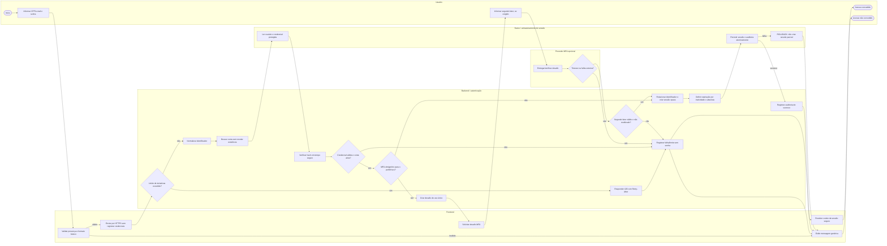

### 3.1 Aceite e exceções

- conta inexistente, senha errada, conta inativa e identificador inválido produzem resposta externa indistinguível.
- falha/timeout de MFA não cria sessão parcial.
- sessão é criada apenas após todos os fatores exigidos.
- login repetido cria sessões distintas ou revoga/limita conforme política; nunca reutiliza ID fixado pelo cliente.
- cookie deve ser `Secure`, `HttpOnly`, `SameSite` e opaco.

## 4. Fluxo crítico 2 — recuperação de conta

| Campo | Valor |
| --- | --- |
| Status | Proposto; canal, expiração e política de revogação pendentes |
| Atores | Usuário, frontend, backend, banco e serviço de recuperação |
| Casos/requisitos | `UC-IDN-03`; `RF-IDN-003`; `SE003` |
| Segurança | `SEG-IDN-002/009/010`, `SEG-SES-006`, `SEG-API-007` |
| Pendências | `Q-010`, `PSEG-003` |

```mermaid
flowchart LR
    subgraph U["Usuário"]
        direction TB
        U0(["Início"])
        U1["Informar CPF ou e-mail"]
        U2["Abrir link/código recebido"]
        U3["Definir nova senha"]
        U4(["Acesso recuperado"])
        U5(["Recuperação não concluída"])
    end

    subgraph F["Frontend"]
        direction TB
        F1["Enviar solicitação por HTTPS"]
        F2["Sempre exibir resposta neutra"]
        F3["Enviar token e nova senha"]
        F4["Orientar novo login"]
        F5["Exibir token inválido/expirado sem detalhe interno"]
    end

    subgraph B["Backend"]
        direction TB
        B1{"Rate limit excedido?"}
        B2["Normalizar identificador"]
        B3["Buscar conta e canal previamente verificado"]
        B4{"Conta elegível?"}
        B5["Invalidar token anterior da mesma finalidade"]
        B6["Gerar token aleatório e armazenar somente hash"]
        B7["Enviar token pelo canal verificado"]
        B8["Validar hash, finalidade, uso único e expiração"]
        B9{"Token válido?"}
        B10["Validar nova senha e lista de comprometidas"]
        B11{"Senha válida?"}
        B12["Atualizar hash da senha e consumir token"]
        B13["Revogar sessões conforme política"]
        B14["Registrar auditoria"]
    end

    subgraph D["Banco"]
        direction TB
        D1["Persistir hash do token e expiração"]
        D2["Transação: senha + token usado + sessões revogadas"]
        D3["ROLLBACK em qualquer falha"]
    end

    subgraph X["Serviço de e-mail/canal aprovado"]
        direction TB
        X1{"Entrega aceita?"}
        X2["Registrar falha para suporte sem revelar conta"]
    end

    U0 --> U1 --> F1 --> B1
    B1 -->|"sim"| F2
    B1 -->|"não"| B2 --> B3 --> B4
    B4 -->|"não"| F2
    B4 -->|"sim"| B5 --> B6 --> D1 --> B7 --> X1
    X1 -->|"não/timeout"| X2 --> F2
    X1 -->|"sim"| F2
    F2 --> U2 --> U3 --> F3 --> B8 --> B9
    B9 -->|"não"| F5 --> U5
    B9 -->|"sim"| B10 --> B11
    B11 -->|"não"| F5
    B11 -->|"sim"| B12 --> B13 --> D2
    D2 -->|"falha"| D3 --> F5
    D2 -->|"sucesso"| B14 --> F4 --> U4
```

### 4.1 Aceite e exceções

- CPF sozinho nunca redefine senha.
- solicitação inicial não revela se a conta existe.
- token expirado, usado ou de outra finalidade falha.
- transação incompleta não altera senha nem consome o token parcialmente.
- logs não contêm token nem senha.

## 5. Fluxo crítico 3 — solicitação de inscrição

| Campo | Valor |
| --- | --- |
| Status | Proposto; simultaneidade, idade e processo seletivo parcialmente pendentes |
| Atores | Aluno, frontend, backend e banco |
| Casos/requisitos | `UC-INS-01/02/03`; `RF-INS-001/002`; `RN-001`, `RN-008`, `RN-009`, `RN-012`, `RN-018` |
| Segurança | `SEG-AUTZ-003/004`, `SEG-API-007/008`, `SEG-RES-002` |
| Pendências | `Q-002`, `Q-004`, `Q-012` |

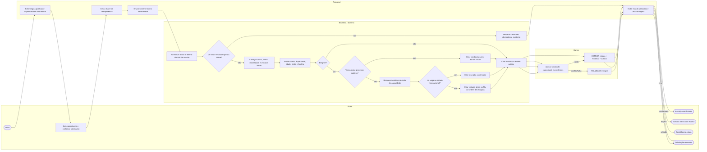

### 5.1 Aceite e concorrência

- disponibilidade exibida antes do clique é informativa; a decisão definitiva ocorre na transação.
- duas solicitações pela última vaga não podem ultrapassar a capacidade.
- repetir a mesma chave retorna o resultado já persistido.
- o mesmo aluno não possui inscrição ou entrada ativa duplicada na turma.
- candidatura não confirma vaga antes da decisão administrativa.

## 6. Fluxo crítico 4 — oferta e confirmação de vaga

| Campo | Valor |
| --- | --- |
| Status | Proposto; prazo e fallback pendentes |
| Atores | Processo automático, aluno, backend, banco e serviço de notificação |
| Casos/requisitos | `UC-AUT-01`, `UC-INS-05/07`; `RF-INS-004`; `RN-010`, `RN-011` |
| Segurança | `SEG-API-008`, `SEG-RES-002/003`, `SEG-WA-*` |
| Pendências | `Q-003`, `Q-009`, `Q-017`, `Q-021` |

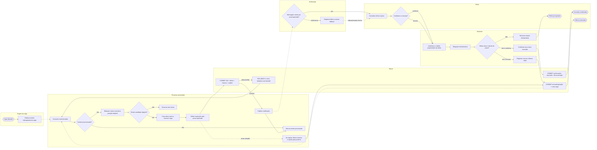

### 6.1 Aceite e compensação

- uma vaga mantém no máximo uma oferta ativa.
- falha de mensagem não oferece a vaga simultaneamente ao próximo; o fallback e o prazo devem ser definidos.
- confirmação concorrente com expiração produz um único estado final transacional.
- recusa/expiração gera nova vaga de forma idempotente.

## 7. Fluxo crítico 5 — chamada e diário de aula

| Campo | Valor |
| --- | --- |
| Status | Proposto; estratégia de conectividade instável pendente |
| Atores | Professor, frontend, backend, banco e processo de apuração |
| Casos/requisitos | `UC-PRF-02/03`; `RF-FRQ-002/003/004`; `RN-013`, `RN-014`, `RN-019` |
| Segurança | `SEG-AUTZ-003/006`, `SEG-API-008`, `SEG-RES-008` |
| Pendências | `Q-005`, `Q-018`, `Q-020` |

```mermaid
flowchart LR
    subgraph P["Professor"]
        direction TB
        P0(["Início da chamada"])
        P1["Selecionar turma e aula"]
        P2["Marcar presença/falta por aluno"]
        P3["Preencher conteúdo e observações"]
        P4["Confirmar salvamento"]
        P5(["Chamada salva e bloqueada para professor"])
        P6(["Chamada não salva"])
    end

    subgraph F["Frontend"]
        direction TB
        F1["Carregar apenas turmas vinculadas"]
        F2["Validar preenchimento completo"]
        F3["Gerar chave idempotente da aula"]
        F4{"Há conectividade?"}
        F5["Enviar chamada por HTTPS"]
        F6["Manter rascunho/estado pendente conforme decisão futura"]
        F7["Exibir sucesso somente após confirmação do backend"]
        F8["Exibir erro e preservar dados permitidos"]
    end

    subgraph B["Backend"]
        direction TB
        B1["Autenticar professor"]
        B2["Validar vínculo vigente com turma/aula"]
        B3{"Autorizado?"}
        B4["Validar aula, alunos, estados e conteúdo obrigatório"]
        B5{"Entrada completa e válida?"}
        B6["Bloquear chamada da aula"]
        B7{"Chamada já salva para a chave?"}
        B8["Criar chamada, diário e registros de frequência"]
        B9["Criar auditoria e eventos de apuração"]
        B10["Retornar estado existente sem duplicar"]
    end

    subgraph D["Banco"]
        direction TB
        D1["Aplicar unicidade aula/chamada e aluno/registro"]
        D2["COMMIT atômico: chamada + diário + frequência + outbox"]
        D3["ROLLBACK integral"]
    end

    subgraph W["Processo automático"]
        direction TB
        W1["Consumir eventos após commit"]
        W2["Recalcular faltas de forma idempotente"]
    end

    P0 --> P1 --> F1 --> P2 --> P3 --> F2
    F2 -->|"inválido"| F8 --> P6
    F2 -->|"válido"| P4 --> F3 --> F4
    F4 -->|"não"| F6 --> P6
    F4 -->|"sim"| F5 --> B1 --> B2 --> B3
    B3 -->|"não"| F8
    B3 -->|"sim"| B4 --> B5
    B5 -->|"não"| F8
    B5 -->|"sim"| B6 --> B7
    B7 -->|"sim"| B10 --> F7 --> P5
    B7 -->|"não"| B8 --> B9 --> D1
    D1 -->|"falha"| D3 --> F8
    D1 -->|"válido"| D2 --> F7
    D2 -.-> W1 --> W2
```

### 7.1 Aceite e exceções

- conteúdo vazio impede chamada inteira; não existe chamada salva sem diário.
- professor sem vínculo recebe negação mesmo alterando identificador na requisição.
- repetição da chave retorna a chamada existente.
- professor não altera chamada salva; correção segue fluxo administrativo com justificativa.
- o ramo sem conectividade permanece explicitamente pendente: não pode mostrar sucesso falso.

## 8. Fluxo crítico 6 — justificativa de falta e comprovante

| Campo | Valor |
| --- | --- |
| Status | Proposto; elegibilidade, formatos, retenção e scanner pendentes |
| Atores | Aluno, frontend, backend, storage privado, scanner e administrador |
| Casos/requisitos | `UC-JUS-01/02`, `UC-ADM-09`, `UC-AUT-04`; `RF-JUS-*`; `RN-003/004/024/025` |
| Segurança | `SEG-ARQ-*`, `SEG-AUTZ-006/007`, `SEG-PRI-*` |
| Pendências | `Q-001`, `Q-005`, `Q-007`, `Q-015`, `Q-016`, `PSEG-007` |

```mermaid
flowchart LR
    subgraph A["Aluno"]
        direction TB
        A0(["Início"])
        A1["Selecionar falta própria"]
        A2["Informar descrição mínima e escolher comprovante"]
        A3(["Justificativa em análise"])
        A4(["Envio recusado"])
        A5(["Decisão recebida"])
    end

    subgraph F["Frontend"]
        direction TB
        F1["Validar extensão/tamanho preliminar"]
        F2["Enviar metadados e conteúdo por HTTPS"]
        F3["Exibir protocolo sem URL pública do arquivo"]
        F4["Exibir motivo seguro"]
    end

    subgraph B["Backend"]
        direction TB
        B1["Autenticar aluno e validar propriedade da frequência"]
        B2["Validar falta, elegibilidade, prazo e duplicidade"]
        B3{"Elegível?"}
        B4["Validar allowlist, tipo real, tamanho e nome"]
        B5{"Arquivo estruturalmente permitido?"}
        B6["Gerar nome/chave aleatória e metadados"]
        B7["Criar justificativa somente após arquivo aprovado"]
        B8["Registrar auditoria sem conteúdo do arquivo"]
        B9["Autorizar administrador específico por objeto"]
        B10{"Administrador autorizado?"}
        B11["Disponibilizar arquivo protegido para análise"]
        B12["Validar decisão e motivo"]
        B13["Persistir decisão e evento de notificação"]
    end

    subgraph S["Storage e scanner"]
        direction TB
        S1["Armazenar em quarentena sem execução"]
        S2["Verificar malware e conteúdo"]
        S3{"Arquivo aprovado?"}
        S4["Mover para área privada aprovada"]
        S5["Excluir/reter evidência mínima conforme política"]
    end

    subgraph D["Banco"]
        direction TB
        D1["COMMIT: justificativa + arquivo + auditoria"]
        D2["ROLLBACK e excluir arquivo órfão"]
        D3["COMMIT: decisão + auditoria + outbox"]
    end

    subgraph ADM["Administrador"]
        direction TB
        M1["Abrir fila de justificativas"]
        M2["Analisar comprovante"]
        M3{"Aceitar ou recusar?"}
        M4(["Acesso administrativo negado"])
    end

    subgraph N["Notificação"]
        direction TB
        N1["Notificar decisão sem anexar comprovante"]
    end

    A0 --> A1 --> A2 --> F1
    F1 -->|"inválido"| F4 --> A4
    F1 -->|"válido"| F2 --> B1 --> B2 --> B3
    B3 -->|"não"| F4
    B3 -->|"sim"| B4 --> B5
    B5 -->|"não"| F4
    B5 -->|"sim"| B6 --> S1 --> S2 --> S3
    S3 -->|"não"| S5 --> F4
    S3 -->|"sim"| S4 --> B7 --> B8 --> D1
    D1 -->|"falha"| D2 --> F4
    D1 -->|"sucesso"| F3 --> A3
    D1 -.-> M1 --> B9 --> B10
    B10 -->|"não"| M4
    B10 -->|"sim"| B11 --> M2 --> M3 --> B12 --> B13 --> D3
    D3 -.-> N1 -.-> A5
```

### 8.1 Aceite e compensação

- arquivo rejeitado nunca alcança o estado “em análise”.
- falha após upload deve remover/quarentenar o arquivo órfão de forma rastreável.
- professor não acessa arquivo nem decisão.
- download exige autorização atual; chave de storage não é exposta.
- decisão e evento de notificação são atômicos ou usam outbox.

## 9. Fluxo crítico 7 — apuração de faltas, alertas e cancelamento

| Campo | Valor |
| --- | --- |
| Status | Proposto; regras de contagem e tratamento de justificativa pendente são bloqueadores |
| Atores | Processo automático, backend, banco, aluno, responsável e notificação |
| Casos/requisitos | `UC-AUT-02`, `UC-AUT-03`; `RF-COM-002/003`; `RN-002/003/005/006/007` |
| Segurança | `SEG-RES-002/003`, `SEG-LOG-*`, `SEG-PRI-004/005` |
| Pendências | `Q-001`, `Q-005`, `Q-008` |

```mermaid
flowchart LR
    subgraph E["Evento de origem"]
        direction TB
        E0(["Chamada salva ou corrigida"])
        E1["Publicar evento após commit"]
    end

    subgraph W["Processo automático"]
        direction TB
        W1["Consumir evento com idempotência"]
        W2["Carregar inscrição, modalidade e competência"]
        W3["Recalcular ausências e justificativas vigentes"]
        W4{"Regra aprovada e dados consistentes?"}
        W5["Marcar pendência e alertar operação"]
        W6{"Atingiu limiar de alerta sem alerta anterior?"}
        W7["Criar evento de alerta"]
        W8{"Ultrapassou limite aplicável?"}
        W9{"Há justificativa válida ou em análise?"}
        W10["Aguardar decisão/reprocessar posteriormente"]
        W11["Bloquear inscrição e revalidar cálculo"]
        W12["Cancelar inscrição uma única vez"]
        W13["Liberar vaga e criar evento para lista de espera"]
        W14["Registrar resultado processado"]
    end

    subgraph D["Banco"]
        direction TB
        D1["COMMIT alerta + auditoria + outbox"]
        D2["COMMIT cancelamento + histórico + vaga + outbox"]
        D3["ROLLBACK e nova tentativa controlada"]
    end

    subgraph N["Notificação"]
        direction TB
        N1["Resolver aluno e responsável vigente se menor"]
        N2["Enviar pelos canais aprovados"]
        N3["Registrar entrega/falha"]
    end

    subgraph U["Aluno / responsável"]
        direction TB
        U1(["Alerta recebido"])
        U2(["Cancelamento comunicado"])
    end

    E0 --> E1 -.-> W1 --> W2 --> W3 --> W4
    W4 -->|"não"| W5 --> W14
    W4 -->|"sim"| W6
    W6 -->|"sim"| W7 --> D1
    W6 -->|"não"| W8
    D1 -->|"falha"| D3 --> W1
    D1 -->|"sucesso"| N1 --> N2 --> N3 -.-> U1
    D1 --> W8
    W8 -->|"não"| W14
    W8 -->|"sim"| W9
    W9 -->|"válida"| W14
    W9 -->|"em análise"| W10 --> W14
    W9 -->|"não existe/recusada"| W11 --> W12 --> W13 --> D2
    D2 -->|"falha"| D3
    D2 -->|"sucesso"| N1 --> N2 --> N3 -.-> U2
    D2 -. "vaga liberada" .-> W14
```

### 9.1 Aceite e cautelas

- enquanto `Q-001` e `Q-005` não forem resolvidas, o sistema não deve cancelar automaticamente em produção.
- evento repetido não duplica alerta ou cancelamento.
- justificativa em análise segue tratamento aprovado; o diagrama propõe aguardar por segurança.
- correção administrativa pode exigir compensação: reativar inscrição ou corrigir fila apenas por fluxo formal e auditado.
- responsável só recebe dados do menor ao qual está validamente vinculado.

## 10. Fluxo crítico 8 — entrega de notificações por WhatsApp

| Campo | Valor |
| --- | --- |
| Status | Proposto; fornecedor, contrato, templates e fallback pendentes |
| Atores | Serviço de negócio, outbox/worker, provedor de WhatsApp, webhook e suporte |
| Casos/requisitos | `UC-COM-01`, `UC-COM-02`, `UC-COM-03`; `RF-COM-001/004`; `RN-020` |
| Segurança | `SEG-WA-*`, `SEG-INT-*`, `SEG-SEG-*`, `SEG-LOG-*` |
| Pendências | `Q-009`, `Q-017`, `PSEG-008` |

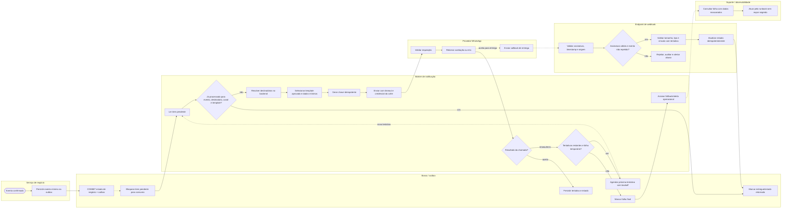

### 10.1 Aceite e exceções

- evento de negócio nunca depende de uma transação distribuída com o WhatsApp.
- “aceita pelo provedor” não é “entregue”.
- webhook inválido ou repetido não altera estado.
- retry é limitado e usa a mesma chave idempotente.
- mensagem não contém CPF completo, comprovante, saúde, token ou segredo.
- falha final fica visível e aciona fallback aprovado.

## 11. Fluxo crítico 9 — alteração de permissões administrativas

| Campo | Valor |
| --- | --- |
| Status | Proposto; matriz e segunda aprovação pendentes |
| Atores | Administrador total, frontend, backend, banco e usuário afetado |
| Casos/requisitos | `UC-ADM-12`; `RF-ADM-007`; `RN-017`, `RN-022` |
| Segurança | `SEG-IDN-007/008`, `SEG-AUTZ-002/005/010`, `SEG-OPS-*` |
| Pendências | `Q-010`, `Q-011`, `PSEG-002/003` |

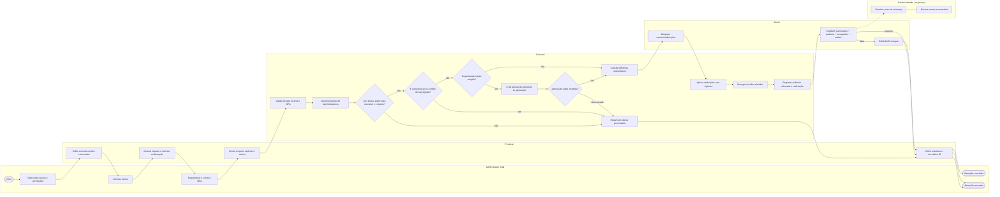

### 11.1 Aceite e segurança

- ocultar opção no frontend não substitui a autorização.
- ator não concede permissão que não possui ou autoeleva a própria conta.
- alteração crítica exige autenticação recente e MFA.
- sessões afetadas são revogadas após mudança relevante.
- antes/depois, autor, aprovador, motivo e instante ficam auditados.

## 12. Fluxo crítico 10 — relatório, exportação e download

| Campo | Valor |
| --- | --- |
| Status | Proposto; fórmulas, campos, limiar, volume e retenção pendentes |
| Atores | Gestor autorizado, frontend, backend, processo assíncrono, banco e storage privado |
| Casos/requisitos | `UC-REL-01`, `UC-REL-02`, `UC-REL-03`; `RF-REL-001/002/003`; `RNF-PRI-003`, `RNF-EXP-001` |
| Segurança | `SEG-EXP-*`, `SEG-MAP-*`, `SEG-AUTZ-008`, `SEG-API-004/007` |
| Pendências | `Q-013`, `Q-014`, `Q-015`, `Q-016`, `PSEG-009` |

```mermaid
flowchart LR
    subgraph G["Gestor autorizado"]
        direction TB
        G0(["Início"])
        G1["Selecionar tipo, período, filtros e formato"]
        G2(["Relatório disponível"])
        G3["Solicitar download"]
        G4(["Arquivo baixado"])
        G5(["Solicitação recusada ou falhou"])
    end

    subgraph F["Frontend"]
        direction TB
        F1["Exibir somente filtros/formato permitidos"]
        F2["Enviar solicitação sem lista arbitrária de campos"]
        F3["Exibir estado de processamento"]
        F4["Enviar pedido de download autenticado"]
        F5["Exibir erro seguro"]
    end

    subgraph B["Backend"]
        direction TB
        B1["Autenticar e autorizar tipo, campos e exportação"]
        B2["Validar período, filtros, volume e rate limit"]
        B3{"Solicitação válida?"}
        B4["Criar solicitação classificada e idempotente"]
        B5["Registrar auditoria sem conteúdo do relatório"]
        B6["No download, revalidar usuário, permissão e expiração"]
        B7{"Download autorizado e não expirado?"}
        B8["Gerar acesso temporário protegido ou transmitir arquivo"]
    end

    subgraph W["Worker de relatórios"]
        direction TB
        W1["Bloquear solicitação pendente"]
        W2["Consultar somente dados/colunas autorizados"]
        W3["Aplicar fórmula versionada"]
        W4["Agregar e suprimir grupos pequenos"]
        W5{"Risco de reidentificação ou volume excessivo?"}
        W6["Recusar/ajustar agregação e auditar"]
        W7{"Formato solicitado?"}
        W8["Gerar PDF sem conteúdo ativo"]
        W9["Gerar Excel e neutralizar fórmulas"]
        W10["Validar integridade, tamanho e classificação"]
        W11["Remover artefato parcial e marcar falha"]
    end

    subgraph D["Banco"]
        direction TB
        D1["COMMIT solicitação + filtros + auditoria"]
        D2["Persistir resultado, versão dos dados e estado"]
        D3["Marcar disponível com expiração"]
        D4["Marcar falha sem arquivo parcial"]
    end

    subgraph S["Storage privado"]
        direction TB
        S1["Armazenar com nome/chave aleatória"]
        S2["Aplicar criptografia, acesso privado e retenção"]
        S3["Excluir ao expirar e registrar descarte"]
    end

    G0 --> G1 --> F1 --> F2 --> B1 --> B2 --> B3
    B3 -->|"não"| F5 --> G5
    B3 -->|"sim"| B4 --> B5 --> D1 -.-> W1
    D1 --> F3
    W1 --> W2 --> W3 --> W4 --> W5
    W5 -->|"sim"| W6 --> D4 --> F5
    W5 -->|"não"| W7
    W7 -->|"PDF"| W8 --> W10
    W7 -->|"Excel"| W9 --> W10
    W10 -->|"inválido/falha"| W11 --> D4
    W10 -->|"válido"| D2 --> S1 --> S2 --> D3 -.-> G2
    G2 --> G3 --> F4 --> B6 --> B7
    B7 -->|"não"| F5 --> G5
    B7 -->|"sim"| B8 --> G4
    D3 -. "prazo atingido" .-> S3
```

### 12.1 Aceite e proteção de dados

- permissão de visualização não concede automaticamente exportação.
- definição de indicador, filtros e versão dos dados acompanham o resultado.
- grupos pequenos são suprimidos; localização individual não aparece no mapa.
- falha não deixa arquivo parcial disponível.
- Excel neutraliza formula injection; PDF não executa conteúdo ativo.
- download revalida permissão e expiração, mesmo se o usuário possuir link anterior.

## 13. Fluxo crítico 11 — incidente de segurança com dados pessoais

| Campo | Valor |
| --- | --- |
| Status | Proposto; responsáveis e contatos pendentes |
| Atores | Monitoramento, segurança, operações, controlador, encarregado/jurídico e comunicação |
| Origem | `SEGURANCA.md`, seção 30; LGPD e regulamentação vigente da ANPD |
| Segurança | `SEG-VUL-*`, `SEG-LOG-*`, `SEG-OPS-*`, `SEG-PRI-*` |
| Pendências | `PSEG-001`, `PSEG-010`, `PSEG-012` |

```mermaid
flowchart LR
    subgraph M["Monitoramento / pessoa notificante"]
        direction TB
        M0(["Evento ou relato detectado"])
        M1["Registrar horário, fonte e correlation ID"]
        M2["Acionar canal de incidente sem reproduzir segredo"]
    end

    subgraph S["Segurança / comando de incidente"]
        direction TB
        S1["Confirmar recebimento e iniciar registro restrito"]
        S2["Classificar severidade e nomear responsável"]
        S3["Preservar logs, artefatos e cadeia de custódia"]
        S4["Identificar sistemas, período, dados e titulares afetados"]
        S5{"Incidente confirmado?"}
        S6["Documentar falso positivo e ajustar detecção"]
        S7["Coordenar contenção"]
        S8["Investigar causa, alcance e variantes"]
        S9["Definir erradicação e critérios de recuperação"]
    end

    subgraph O["Operações / desenvolvimento autorizado"]
        direction TB
        O1["Isolar workload, conta, rota ou integração"]
        O2["Revogar sessão/segredo e bloquear abuso"]
        O3["Aplicar correção por artefato confiável"]
        O4["Restaurar/recuperar em ambiente controlado"]
        O5["Executar testes de integridade e monitoramento reforçado"]
        O6{"Recuperação validada?"}
        O7["Reverter/continuar contenção e corrigir"]
    end

    subgraph P["Controlador, encarregado e jurídico"]
        direction TB
        P1["Avaliar natureza dos dados e impacto aos titulares"]
        P2{"Pode causar risco ou dano relevante?"}
        P3["Preparar comunicação preliminar/completa"]
        P4["Decidir e comunicar ANPD/titulares no prazo aplicável"]
        P5["Registrar fundamento da decisão de não comunicar"]
    end

    subgraph C["Comunicação e pós-incidente"]
        direction TB
        C1["Fornecer orientação aprovada e canal de dúvidas"]
        C2["Realizar lições aprendidas"]
        C3["Atualizar riscos, testes, documentos e controles"]
        C4(["Incidente encerrado formalmente"])
    end

    M0 --> M1 --> M2 --> S1 --> S2 --> S3 --> S4 --> S5
    S5 -->|"não"| S6 --> C3 --> C4
    S5 -->|"sim"| S7
    S7 --> O1 --> O2
    S7 --> S8 --> S9 --> O3 --> O4 --> O5 --> O6
    O6 -->|"não"| O7 --> O3
    O6 -->|"sim"| P1
    S4 --> P1 --> P2
    P2 -->|"sim"| P3 --> P4 --> C1
    P2 -->|"não"| P5 --> C2
    C1 --> C2 --> C3 --> C4
```

### 13.1 Aceite e autoridade

- pessoa desenvolvedora, fornecedor ou IA não decide sozinho sobre comunicação regulatória.
- contenção não destrói evidência antes de preservação razoável.
- segredo exposto é revogado/rotacionado; removê-lo do arquivo não é suficiente.
- recuperação só encerra após teste de integridade e monitoramento.
- quando aplicável, comunicação observa o prazo vigente da ANPD e pode ocorrer em etapas.

## 14. Matriz consolidada de rastreabilidade

| Fluxo | Requisitos/regras | Casos de uso | Classes/componentes principais | Testes esperados |
| --- | --- | --- | --- | --- |
| Autenticação | `RF-IDN-002`, `RN-017`, RNFs de segurança | `UC-IDN-02` | `Usuario`, `Credencial`, `Sessao`, `ServicoAutenticacao` | `CT-IDN-*`: enumeração, MFA, rate limit, sessão |
| Recuperação | `RF-IDN-003` | `UC-IDN-03` | `TokenRecuperacao`, `Credencial`, `Sessao` | token expirado/replay, resposta neutra, rollback |
| Inscrição | `RF-INS-001/002`, `RN-001/008/009/012/018` | `UC-INS-02/03` | `Inscricao`, `EntradaListaEspera`, `PoliticaElegibilidade` | concorrência, idempotência, capacidade, seleção |
| Oferta de vaga | `RF-INS-004`, `RN-010/011` | `UC-AUT-01`, `UC-INS-07` | `OfertaVaga`, `ServicoListaEspera` | expiração x confirmação, uma oferta por vaga |
| Chamada | `RF-FRQ-002/003/004`, `RN-013/014/019` | `UC-PRF-02/03` | `Chamada`, `DiarioAula`, `RegistroFrequencia` | vínculo, atomicidade, repetição, queda de rede |
| Justificativa | `RF-JUS-*`, `RN-003/004/024/025` | `UC-JUS-*`, `UC-ADM-09` | `JustificativaFalta`, `ArquivoComprovante`, `DecisaoJustificativa` | upload, malware, IDOR, decisão e compensação |
| Apuração de faltas | `RF-COM-002/003`, `RN-002/005/006/007` | `UC-AUT-02/03` | `PoliticaFaltas`, `Inscricao`, outbox | regra, reprocessamento, justificativa pendente |
| WhatsApp | `RF-COM-001/004`, `RN-020` | `UC-COM-*` | `ItemOutbox`, `TentativaEntrega`, `WhatsAppAdapter` | timeout, retry, assinatura, replay, fallback |
| Permissões | `RF-ADM-007`, `RN-017/022` | `UC-ADM-12` | `Papel`, `Permissao`, `AtribuicaoPapel` | autoelevação, MFA, revogação, auditoria |
| Exportação | `RF-REL-*`, RNFs de privacidade/exportação | `UC-REL-*` | `PoliticaAgregacao`, `ExportacaoRelatorio` | reidentificação, formula injection, expiração |
| Incidente | Controles `SEG-*` | Operacional | comando de incidente, logs, backup e runbook | tabletop, segredo exposto, restore e comunicação |

## 15. Estados finais e compensações

| Fluxo | Sucesso | Falha segura | Compensação/recuperação |
| --- | --- | --- | --- |
| Login | Sessão opaca ativa | Nenhuma sessão e resposta genérica | Revogar sessão se estado posterior ficar inconsistente |
| Recuperação | Senha alterada, token usado e sessões tratadas | Tudo inalterado | Revogar token/sessões em caso de suspeita |
| Inscrição | Inscrição, fila ou candidatura única | Transação desfeita | Reconciliar vaga/fila por job idempotente |
| Oferta | Uma confirmação ou avanço ao próximo | Oferta permanece consistente | Expirar/liberar reserva e reprocessar |
| Chamada | Chamada, diário e registros atômicos | Nenhum registro parcial | Correção administrativa versionada |
| Justificativa | Arquivo aprovado e justificativa em análise | Arquivo rejeitado/órfão removido | Descartar arquivo, reprocessar scanner ou corrigir decisão formalmente |
| Cancelamento por faltas | Cancelamento e vaga liberada uma vez | Pendência operacional sem cancelamento inseguro | Reativação/reconciliação formal se correção mudar cálculo |
| WhatsApp | Entrega rastreada | Falha final visível | Retry limitado e fallback |
| Permissão | Atribuições e revogações atômicas | Nenhuma mudança | Restaurar conjunto anterior por operação auditada |
| Exportação | Arquivo protegido e temporário | Sem arquivo parcial | Excluir temporários e permitir nova solicitação |
| Incidente | Serviço íntegro e risco tratado | Contenção mantida | Rollback/restore e nova correção |

## 16. Pendências que impedem aprovação completa

| ID | Decisão | Diagramas afetados |
| --- | --- | --- |
| `Q-001` | Relação entre limite variável, segunda falta e terceira justificável | 8 e 9 |
| `Q-002` | Significado de duas modalidades e simultaneidade | 5 |
| `Q-003` | Prazo da oferta e fallback | 6 |
| `Q-004` | Data de referência da idade | 5 |
| `Q-005` | Contagem de faltas, correção, aula cancelada e justificativa em análise | 7, 8 e 9 |
| `Q-007/008` | Saúde, menor e responsável | 8 e 9 |
| `Q-009/017` | Fornecedor, obrigatoriedade e fallback do WhatsApp | 6, 9 e 10 |
| `Q-010/011` | Autenticação, MFA, sessão e matriz administrativa | 3, 4 e 11 |
| `Q-012` | Estados e critérios do processo seletivo | 5 |
| `Q-013/014` | Fórmulas, campos e limiar analítico | 12 |
| `Q-015/016` | Retenção, arquivos, volume, RPO/RTO | 8, 12 e 13 |
| `Q-018` | Operação com internet instável | 7 |
| `Q-020/021` | Substituição de professor e reentrada na fila | 6 e 7 |
| `PSEG-001/012` | Responsáveis, modelo de ameaças, runbook e incidentes | 13 |

## 17. Critérios de aprovação

- [ ] Cada decisão possui condição e resultado claramente nomeados.
- [ ] Caminhos de sucesso, validação, autorização, vazio e erro foram revisados.
- [ ] Transações, rollback e compensações foram aprovados pelo Tech Lead.
- [ ] Concorrência e idempotência possuem estratégia testável.
- [ ] Arquivos e dados sensíveis foram avaliados por segurança/privacidade.
- [ ] Timeout, retry, webhook e falha de fornecedor possuem comportamento definido.
- [ ] Auditoria está presente sem registrar conteúdo proibido.
- [ ] Pendências bloqueadoras foram resolvidas ou formalmente aceitas.
- [ ] Diagramas concordam com requisitos, casos de uso, classes e segurança.
- [ ] QA derivou cenários de teste para todos os ramos críticos.
- [ ] Responsáveis de negócio, técnico, segurança, privacidade e operações aprovaram suas competências.

## 18. Histórico de versões

| Versão | Data | Autor | Alterações | Situação |
| --- | --- | --- | --- | --- |
| `0.1.0` | 13/08/2026 | Heitor Leite | Primeira versão com onze fluxos críticos em raias, incluindo sucesso, erros, autorização, concorrência, arquivos, integrações, compensação, auditoria e incidente | Rascunho |
