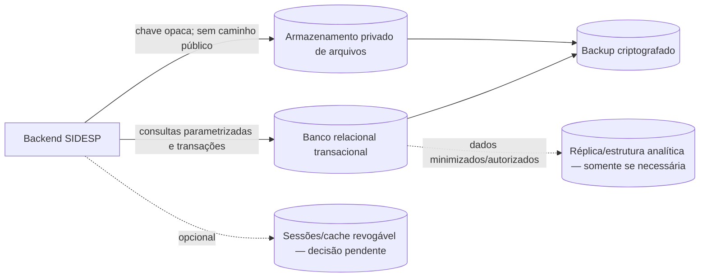
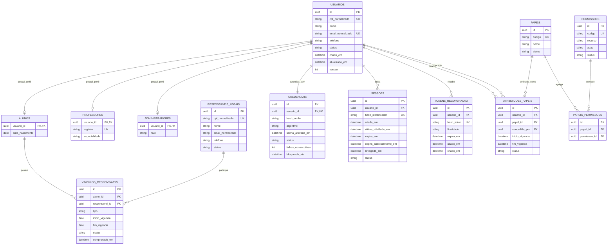
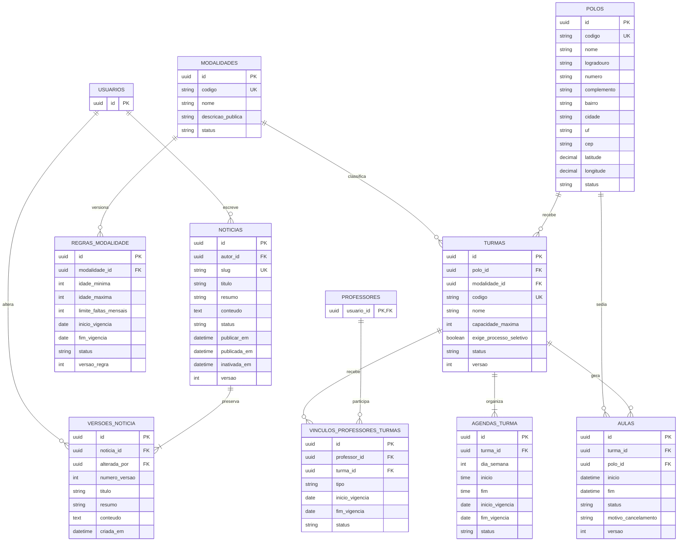
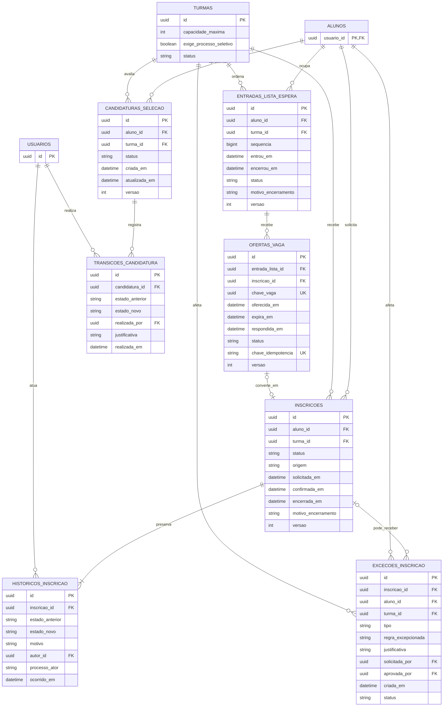
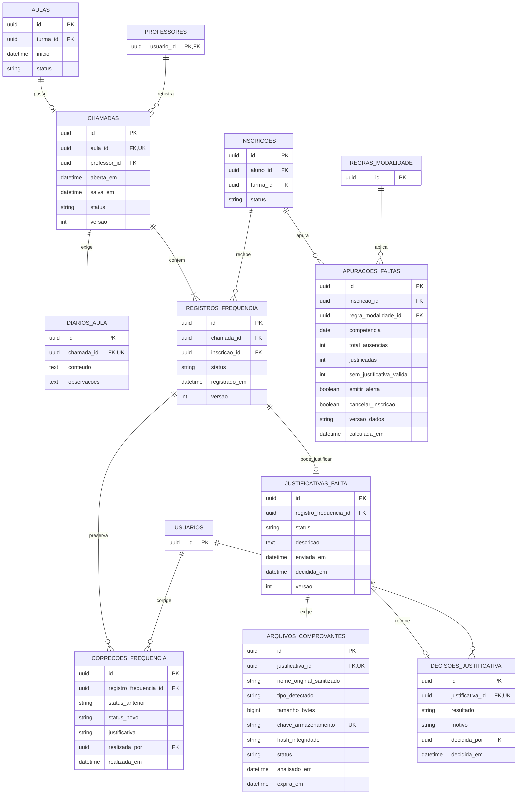
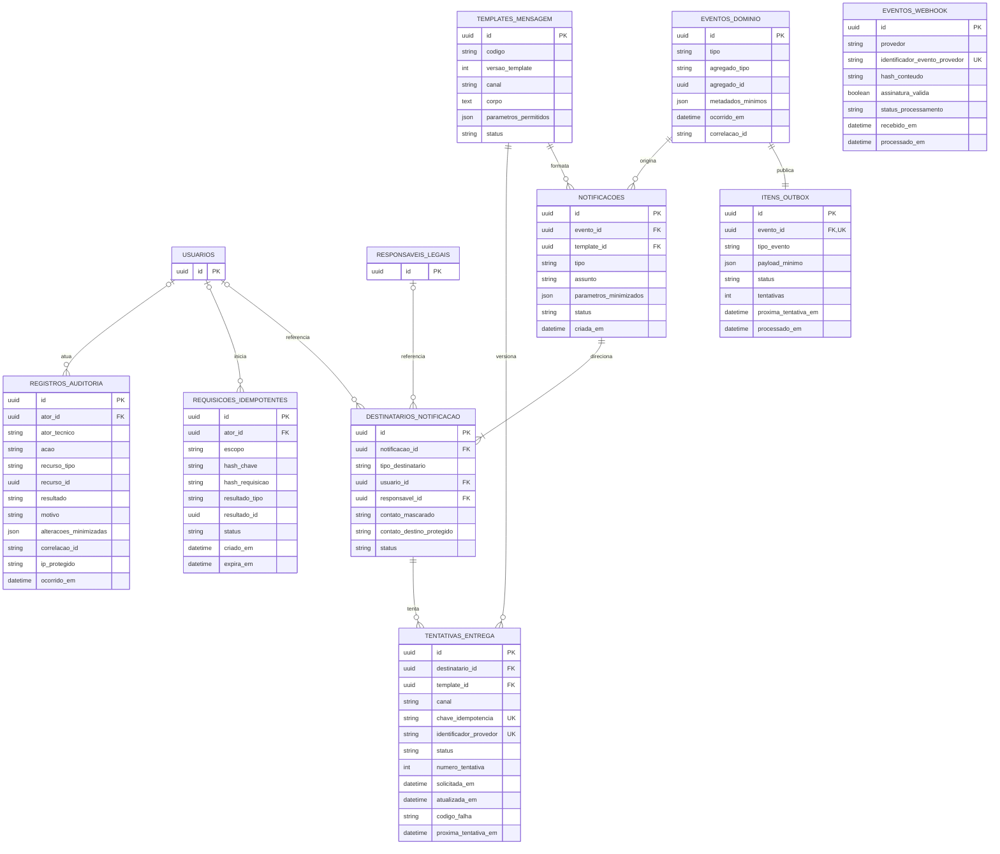
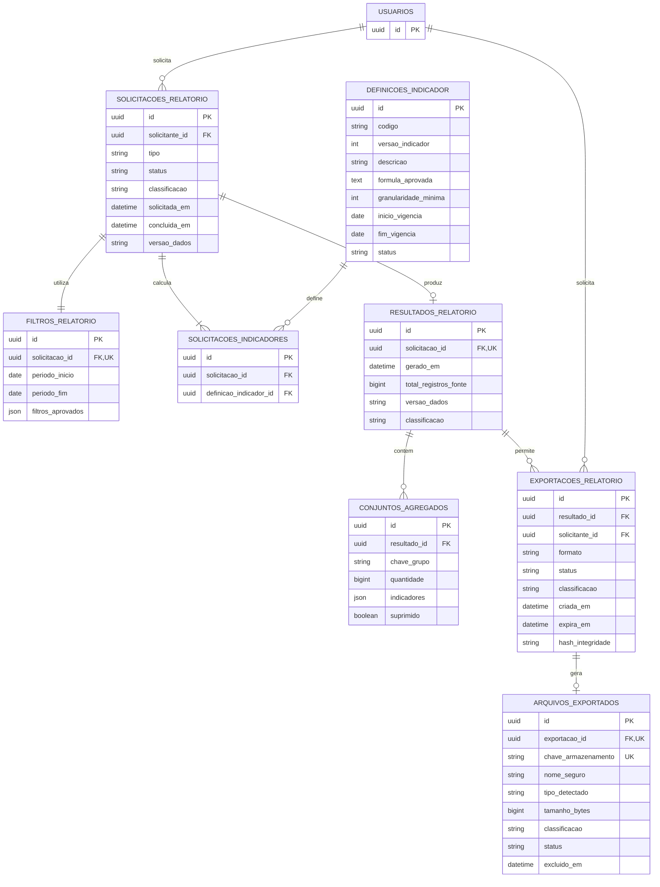

# Modelo de Dados e Diagrama Entidade-Relacionamento — SIDESP

> **SIDESP — Sistema Integrado de Desenvolvimento Esportivo Público**

## Identificação do documento

| Campo | Valor |
| --- | --- |
| Documento | Modelo de Dados e Diagrama Entidade-Relacionamento |
| Projeto | SIDESP — Sistema Integrado de Desenvolvimento Esportivo Público |
| Versão | `0.1.0` |
| Data | 13/08/2026 |
| Status | **Rascunho — proposto, não aprovado para implementação** |
| Classificação | Uso interno |
| Responsável sugerido | Dados/Backend |
| Revisores necessários | Produto, Backend, Segurança, Privacidade e responsável pelo banco |
| Documentos de origem | `LEVANTAMENTO_DE_REQUISITOS.md`, `CASOS_DE_USO.md`, `CLASSES_OU_COMPONENTES.md`, `ATIVIDADES.md` e `SEGURANCA.md` |

## Aprovações

| Papel | Responsável | Situação | Data |
| --- | --- | --- | --- |
| Product Owner/Secretaria | A definir | Pendente | — |
| Liderança técnica | A definir | Pendente | — |
| Backend/Dados | A definir | Pendente | — |
| Segurança e privacidade | A definir | Pendente | — |

Nenhuma tabela, migração ou política descrita neste documento deve ser tratada como aprovada antes do preenchimento das aprovações e da resolução das pendências bloqueadoras.

## 1. Objetivo e escopo

Este documento define o modelo lógico inicial de persistência do SIDESP para todo o produto, abrangendo frontend e backend. Ele descreve entidades, relacionamentos, chaves, restrições, índices, classificação, retenção e controles operacionais necessários para implementar posteriormente o backend em Java/Spring Boot.

O modelo cobre:

- identidade, credenciais, sessões, responsáveis e autorização;
- polos, modalidades, regras, turmas, horários, aulas e notícias;
- inscrições, lista de espera, ofertas e processo seletivo;
- chamada, frequência, correções, justificativas e comprovantes;
- notificações, WhatsApp, outbox e callbacks;
- relatórios, agregações, exportações e mapas de calor;
- auditoria, idempotência, arquivos e rastreabilidade.

Não fazem parte desta versão:

- dados de saúde do aluno, enquanto finalidade, campos, base legal e acesso não forem aprovados;
- presença por QR Code, pois não existe requisito funcional aprovado;
- localização individual de alunos;
- modelo multi-tenant, porque o SIDESP foi documentado como sistema de uma única Secretaria;
- detalhes físicos definitivos de infraestrutura, que dependem do documento de arquitetura.

## 2. Status das decisões

| Tema | Definição nesta versão | Status |
| --- | --- | --- |
| Modelo principal | Relacional e normalizado | Proposto |
| Banco transacional | PostgreSQL `16.x` ou versão estável homologada | Proposto; arquitetura deve aprovar |
| Identificadores | UUID opaco para entidades expostas | Proposto |
| Migrações | Flyway, com scripts versionados e imutáveis após aplicação | Proposto |
| Arquivos | Conteúdo fora do banco relacional; metadados e autorização no banco | Proposto |
| Sessões | Persistência revogável; banco ou armazenamento dedicado a decidir | Pendente |
| Relatórios | Consultas autorizadas sobre dados operacionais; réplica/warehouse somente se necessário | Pendente de volume |
| Fuso de apresentação | `America/Sao_Paulo` | Proposto; negócio deve ratificar |
| Instantes persistidos | UTC com offset/tipo equivalente a `TIMESTAMPTZ` | Proposto |
| Exclusão | Sem exclusão física operacional de registros históricos; descarte conforme política aprovada | Proposto |

O PostgreSQL é uma proposta de baseline, não uma autorização de instalação. Os diagramas usam tipos lógicos que podem ser adaptados sem alterar as regras de negócio.

## 3. Convenções de modelagem

- Tabelas e colunas usam `snake_case`, nomes no plural para tabelas e nomes no singular para conceitos.
- Chaves primárias usam UUID, salvo tabelas de associação que também podem possuir chave composta.
- Todas as chaves estrangeiras devem ser indexadas quando participarem de consulta, autorização ou junção frequente.
- Instantes técnicos usam `TIMESTAMPTZ`; datas sem horário usam `DATE`; horários recorrentes usam `TIME`.
- Estados são persistidos como códigos estáveis e validados por `CHECK` ou tabela de domínio. O código Java não deve depender da ordem numérica de enumerações.
- Entidades mutáveis críticas possuem `versao` para concorrência otimista.
- `criado_em` e `atualizado_em` são obrigatórios nas entidades mutáveis, salvo histórico imutável que use apenas `ocorrido_em`.
- Campos `*_por` apontam para `usuarios.id` quando o ator for humano. Processos automáticos usam ator técnico identificável na auditoria.
- Campos de texto livre possuem limite explícito e não devem receber segredo, diagnóstico, dado de saúde ou conteúdo excessivo.
- Exclusão em cascata não deve apagar histórico. O padrão das FKs históricas é `RESTRICT`; `SET NULL` só é permitido quando a identidade do relacionamento continuar preservada por outro identificador seguro.
- O nome original de arquivo nunca é usado como caminho ou chave física.

### 3.1 Colunas comuns

Quando aplicável, as tabelas de domínio possuem:

| Coluna | Tipo lógico | Regra |
| --- | --- | --- |
| `id` | UUID | PK, gerado no servidor |
| `criado_em` | TIMESTAMPTZ | Obrigatória e definida pelo servidor |
| `atualizado_em` | TIMESTAMPTZ | Obrigatória e atualizada pelo servidor |
| `versao` | INTEGER | `NOT NULL`, inicia em zero, nunca negativa |
| `status` | VARCHAR | Código validado; transição não é aceita livremente da API |

## 4. Visão da persistência

| Componente | Finalidade | Regra de acesso |
| --- | --- | --- |
| Banco relacional | Estado transacional, relacionamentos, metadados e auditoria | Apenas backend e rotinas operacionais autorizadas; nunca público |
| Armazenamento de objetos/arquivos | Comprovantes e exportações | Bucket/área privada; acesso mediado e temporário após autorização por objeto |
| Sessão/cache | Sessões revogáveis, rate limit ou cache, se aprovado | Rede privada, autenticação própria e TTL; não é fonte de verdade de negócio |
| Estrutura analítica | Consultas agregadas caso o volume exija | Dados minimizados; acesso separado; não recebe comprovantes, credenciais ou tokens |

## 5. Diagramas entidade-relacionamento

Os diagramas foram divididos por domínio para preservar legibilidade. Uma entidade repetida em outro diagrama representa a mesma tabela.

### 5.1 Identidade, responsáveis e autorização

### 5.2 Estrutura esportiva e conteúdo público

`REGRAS_MODALIDADE` separa os valores sujeitos a vigência da identidade da modalidade. Essa é uma evolução necessária para impedir que uma alteração de idade ou limite de faltas reescreva a interpretação do histórico.

### 5.3 Inscrições, espera e seleção

### 5.4 Chamada, frequência e justificativas

`APURACOES_FALTAS` registra a regra e a versão dos dados usadas pelo processo automático. A tabela é proposta para tornar alertas e cancelamentos reproduzíveis; seu formato final depende da resolução de `Q-001` e `Q-005`.

### 5.5 Notificações, integração, idempotência e auditoria

### 5.6 Relatórios, agregações e exportações

## 6. Dicionário de tabelas e campos

Os tipos detalhados permanecem lógicos até a aprovação da arquitetura. `Público`, `Interno`, `Pessoal`, `Restrito` e `Sensível` são as classes usadas neste documento. Uma tabela herda a maior classificação de seus campos.

### 6.1 Identidade e acesso

| Tabela | Finalidade e campos específicos | Classificação predominante |
| --- | --- | --- |
| `usuarios` | Identidade comum. `cpf_normalizado` e `email_normalizado` permitem unicidade e autenticação; `nome`, `telefone` e `status` atendem cadastro e contato. | Pessoal/Restrito |
| `alunos` | Especialização 1:1 de usuário. `data_nascimento` permite idade e identificação de menor. | Pessoal/Restrito |
| `professores` | Especialização 1:1. `registro` identifica profissional e `especialidade` informa atuação permitida. | Pessoal/Interno |
| `administradores` | Especialização 1:1. `nivel` registra categoria administrativa; permissões efetivas vêm do RBAC. | Restrito |
| `responsaveis_legais` | Identidade e contato do responsável sem presumir conta própria. | Pessoal/Restrito |
| `vinculos_responsaveis` | Liga menor e responsável, com tipo, vigência, comprovação e estado. | Pessoal/Restrito |
| `credenciais` | Credencial obrigatória e exclusiva de cada usuário, com hash de senha, algoritmo/parâmetros, estado, falhas e bloqueio. Nunca contém senha em claro. | Restrito |
| `sessoes` | Hash do identificador, expirações, atividade e revogação. Não guarda token reutilizável em claro. | Restrito |
| `tokens_recuperacao` | Hash de token de uso único, finalidade, expiração e consumo. | Restrito |
| `papeis` | Catálogo estável de papéis. | Interno |
| `permissoes` | Catálogo de recurso e ação autorizáveis. | Interno |
| `atribuicoes_papeis` | Papel concedido a usuário, vigência, concedente e estado. | Restrito |
| `papeis_permissoes` | Associação N:N entre papel e permissão. | Interno |

### 6.2 Estrutura esportiva e notícias

| Tabela | Finalidade e campos específicos | Classificação predominante |
| --- | --- | --- |
| `polos` | Código, nome, endereço, coordenadas e estado. A API pública expõe apenas campos aprovados. | Público/Interno por campo |
| `modalidades` | Identidade estável, nome, descrição pública e estado. | Público |
| `regras_modalidade` | Versões vigentes de faixa etária e limite mensal de faltas. | Interno |
| `turmas` | Polo, modalidade, capacidade, exigência de seleção e estado. | Público/Interno por campo |
| `agendas_turma` | Dias, horários e vigência da agenda. | Público/Interno por campo |
| `aulas` | Ocorrências da turma, local efetivo, intervalo, estado e motivo operacional. | Interno; parte pode ser pública aos inscritos |
| `vinculos_professores_turmas` | Professor, turma, tipo, vigência e estado usados na autorização por objeto. | Pessoal/Interno |
| `noticias` | Conteúdo atual, autor, agendamento, publicação, inativação e versão. | Público quando publicada; interno antes disso |
| `versoes_noticia` | Cópia histórica de título, resumo e conteúdo, com autor da alteração. | Interno |

### 6.3 Inscrições e processo seletivo

| Tabela | Finalidade e campos específicos | Classificação predominante |
| --- | --- | --- |
| `inscricoes` | Vínculo aluno–turma, origem, estado e instantes de solicitação, confirmação e encerramento. | Pessoal/Confidencial |
| `historicos_inscricao` | Transições imutáveis, motivo e ator humano ou processo. | Pessoal/Restrito |
| `entradas_lista_espera` | Ordem transacional por turma, estado e encerramento; posição é calculada. | Pessoal/Confidencial |
| `ofertas_vaga` | Reserva, prazo, resposta, idempotência e possível conversão em inscrição. | Pessoal/Confidencial |
| `candidaturas_selecao` | Estado do candidato no processo seletivo. | Pessoal/Confidencial |
| `transicoes_candidatura` | Histórico imutável das mudanças no Kanban, com decisor e justificativa. | Pessoal/Restrito |
| `excecoes_inscricao` | Regra excepcionada, justificativa, solicitante, aprovador e objeto afetado. | Pessoal/Restrito |

### 6.4 Frequência, justificativas e arquivos

| Tabela | Finalidade e campos específicos | Classificação predominante |
| --- | --- | --- |
| `chamadas` | Uma chamada por aula, professor responsável, abertura, salvamento, estado e versão. | Pessoal/Confidencial |
| `diarios_aula` | Conteúdo obrigatório e observações minimizadas. | Interno; pode conter dado pessoal se usado incorretamente |
| `registros_frequencia` | Estado de presença por inscrição e chamada. | Pessoal/Confidencial |
| `correcoes_frequencia` | Antes/depois, justificativa, administrador e instante imutáveis. | Pessoal/Restrito |
| `justificativas_falta` | Falta concreta, descrição, estado, envio e decisão. | Pessoal; potencialmente Sensível/Restrito |
| `arquivos_comprovantes` | Metadados, hash, tipo detectado, chave privada, varredura e descarte. O conteúdo fica fora do banco. | Potencialmente Sensível/Restrito |
| `decisoes_justificativa` | Resultado, motivo, decisor e instante. | Pessoal/Restrito |
| `apuracoes_faltas` | Totais, regra aplicada, versão dos dados e efeitos calculados por competência. | Pessoal/Restrito |

### 6.5 Comunicação, integração e controles transversais

| Tabela | Finalidade e campos específicos | Classificação predominante |
| --- | --- | --- |
| `eventos_dominio` | Evento mínimo, agregado, instante e correlação. Não contém comprovante, token ou dado de saúde. | Interno/Confidencial |
| `itens_outbox` | Entrega confiável do evento, tentativas e próximo processamento. | Interno/Restrito |
| `templates_mensagem` | Código, versão, canal, corpo aprovado e parâmetros permitidos. | Interno |
| `notificacoes` | Tipo, template, parâmetros mínimos, estado e evento de origem. | Pessoal/Confidencial |
| `destinatarios_notificacao` | Referência ao titular, tipo, contato mascarado e destino protegido. Exatamente um entre usuário e responsável deve existir. | Pessoal/Restrito |
| `tentativas_entrega` | Canal, idempotência, estado, identificador do provedor, erro normalizado e retentativa. | Pessoal/Restrito |
| `eventos_webhook` | Identificador externo, hash do conteúdo, validação de assinatura e processamento para impedir replay. | Restrito |
| `requisicoes_idempotentes` | Hash da chave e da requisição, escopo, resultado e expiração. Não guarda corpo integral. | Restrito |
| `registros_auditoria` | Ator, ação, alvo, resultado, motivo, mudanças minimizadas, correlação e origem protegida. | Restrito |

### 6.6 Relatórios e exportações

| Tabela | Finalidade e campos específicos | Classificação predominante |
| --- | --- | --- |
| `definicoes_indicador` | Fórmula aprovada e versionada, granularidade e vigência. | Interno |
| `solicitacoes_relatorio` | Solicitante, tipo, estado, classificação e versão dos dados. | Restrito |
| `filtros_relatorio` | Período e filtros aprovados; rejeita chaves arbitrárias. | Herda a solicitação |
| `solicitacoes_indicadores` | Associação da solicitação às versões exatas dos indicadores. | Interno |
| `resultados_relatorio` | Metadados reproduzíveis do resultado, quantidade fonte e classificação. | Herda a maior classificação da fonte |
| `conjuntos_agregados` | Grupos, quantidades, indicadores e supressão contra reidentificação. | Confidencial; Público somente após aprovação |
| `exportacoes_relatorio` | Formato, solicitante, estado, expiração, classificação e integridade. | Restrito |
| `arquivos_exportados` | Metadados do arquivo privado, tipo, tamanho, chave opaca e descarte. | Herda a exportação |

## 7. Chaves, cardinalidades e integridade referencial

| Relação/regra | Cardinalidade ou constraint proposta |
| --- | --- |
| Usuário–perfil | Cada usuário possui no máximo um registro em cada subtipo; combinação de perfis depende da matriz de papéis aprovada. |
| Usuário–credencial | `usuarios 1 : 1 credenciais`; toda conta deve possuir exatamente uma credencial e `credenciais.usuario_id` é obrigatório e único. |
| Aluno–responsável | N:N por `vinculos_responsaveis`, com vigência e comprovação. |
| Papel–permissão | N:N, com unicidade em `(papel_id, permissao_id)`. |
| Professor–turma | N:N por vínculo vigente; sobreposição permitida ou bloqueada conforme `Q-020`. |
| Modalidade–regra | `1 : N`; no máximo uma regra ativa para o mesmo instante. |
| Turma–agenda | `1 : 1..N` para turma ativa; agenda histórica não é apagada. |
| Turma–aula | `1 : N`; `(turma_id, inicio)` deve ser único salvo regra de reposição aprovada. |
| Aluno–inscrição–turma | N:N por `inscricoes`; no máximo uma inscrição ativa do aluno na mesma turma. |
| Turma–fila | `1 : N`; `sequencia` é única dentro da turma. |
| Entrada–oferta | `1 : N` histórico; no máximo uma oferta ativa por entrada e por `chave_vaga`. |
| Candidatura–transição | `1 : N`; transições são imutáveis e ordenadas por instante/ID. |
| Aula–chamada | `1 : 0..1`; `chamadas.aula_id` é único. |
| Chamada–frequência | `1 : N`; `(chamada_id, inscricao_id)` é único. |
| Frequência–justificativa | `1 : 0..1` enquanto reanálise não for aprovada. |
| Justificativa–arquivo | `1 : 1` quando enviada; rascunho pode existir antes do arquivo aprovado. |
| Justificativa–decisão | `1 : 0..1`; modelo muda se houver recurso/reanálise. |
| Evento–outbox | `1 : 1`; gravados na mesma transação. |
| Notificação–destinatário | `1 : 1..N`; destinatários são calculados pelo backend. |
| Destinatário–tentativa | `1 : 0..N`; retentativas não duplicam efeito de negócio. |
| Solicitação–filtro | `1 : 1`; filtros usados ficam preservados. |
| Resultado–exportação | `1 : 0..N`; cada exportação possui no máximo um arquivo válido. |

### 7.1 Ações de chave estrangeira

- `ON DELETE RESTRICT` é o padrão para usuário, aluno, turma, inscrição, chamada, justificativa, notificação e auditoria.
- Exclusão lógica/inativação deve preservar todas as FKs históricas.
- Conteúdo de arquivo pode ser descartado e o metadado permanecer com estado `EXCLUIDO`, sem manter a chave reutilizável.
- Uma FK nunca substitui autorização. Toda leitura ou alteração valida ator, permissão, vínculo e objeto no backend.

## 8. Constraints e invariantes transacionais

### 8.1 Constraints locais

- `usuarios.cpf_normalizado` é único e contém somente CPF normalizado após validação da aplicação.
- `email_normalizado`, quando informado, é comparado sem diferença de maiúsculas/minúsculas e possui unicidade aprovada.
- `idade_minima >= 0`, `idade_maxima >= idade_minima` e `limite_faltas_mensais >= 0`.
- `capacidade_maxima > 0`.
- latitude fica entre `-90` e `90`; longitude entre `-180` e `180`.
- todo intervalo deve satisfazer início anterior ao fim; fim de vigência nulo significa vigência aberta.
- `dia_semana` usa domínio estável de 1 a 7.
- contagens, tentativas, tamanhos e versões não podem ser negativos.
- `arquivos_comprovantes.tamanho_bytes` e `arquivos_exportados.tamanho_bytes` respeitam limites configurados e aprovados.
- somente um dos campos `usuario_id` e `responsavel_id` é preenchido em `destinatarios_notificacao`.
- estado `EM_ANALISE` de justificativa exige comprovante aprovado; a garantia completa ocorre por transação/serviço.
- uma decisão só pode apontar para justificativa vigente e ainda decidível.

### 8.2 Invariantes entre registros

As regras abaixo exigem transação com isolamento, bloqueio, constraint parcial ou estratégia equivalente:

- última vaga não pode confirmar duas inscrições concorrentes;
- fila mantém sequência única e ordenação estável por turma;
- oferta expirada não pode ser confirmada e uma vaga liberada não pode ser consumida duas vezes;
- redução de capacidade abaixo das inscrições confirmadas é bloqueada até plano explícito;
- professor registra chamada somente com vínculo vigente na turma e data;
- chamada, diário, frequências, evento e outbox são confirmados atomicamente;
- correção não sobrescreve histórico e reprocessa efeitos de faltas de forma idempotente;
- cancelamento por faltas ocorre uma vez e não é executado enquanto a regra sobre justificativa pendente estiver indefinida;
- alteração de papel não permite autoelevação e registra concessor, antes/depois e motivo;
- geração de arquivo falha de forma atômica; arquivo parcial nunca recebe estado `DISPONIVEL`.

## 9. Índices propostos

| Tabela | Índice | Justificativa |
| --- | --- | --- |
| `usuarios` | único em `cpf_normalizado`; único funcional em e-mail normalizado quando não nulo | Cadastro, login e prevenção de duplicidade |
| `sessoes` | único em `hash_identificador`; `(usuario_id, status)`; `expira_em` | Autenticação, revogação e limpeza |
| `tokens_recuperacao` | único em `hash_token`; `expira_em` | Consumo único e descarte |
| `atribuicoes_papeis` | `(usuario_id, status, inicio_vigencia, fim_vigencia)` | Autorização por vigência |
| `polos`, `modalidades`, `turmas` | código único e índices de `status`; turma em `(polo_id, modalidade_id, status)` | Consultas públicas e administrativas |
| `regras_modalidade` | `(modalidade_id, inicio_vigencia, fim_vigencia)` e unicidade da versão | Selecionar regra aplicável e preservar histórico |
| `agendas_turma` | `(turma_id, dia_semana, inicio)` | Montagem de agenda e detecção de conflito |
| `aulas` | único proposto em `(turma_id, inicio)`; `(turma_id, status, inicio)` | Agenda, chamada e avisos |
| `vinculos_professores_turmas` | `(professor_id, status, inicio_vigencia, fim_vigencia)` e `(turma_id, status)` | Autorização horizontal |
| `noticias` | único em `slug`; `(status, publicar_em DESC)` | Listagem pública e publicação agendada |
| `inscricoes` | parcial único em `(aluno_id, turma_id)` para estados ativos; `(turma_id, status)`; `(aluno_id, status)` | Duplicidade, capacidade e consultas do aluno |
| `entradas_lista_espera` | único em `(turma_id, sequencia)`; parcial único em `(turma_id, aluno_id)` para estados ativos; `(turma_id, status, sequencia)` | Ordem e próximo elegível |
| `ofertas_vaga` | parcial único em `chave_vaga` quando ativa; `(status, expira_em)` | Reserva, expiração e concorrência |
| `candidaturas_selecao` | parcial único em `(aluno_id, turma_id)` para candidatura ativa; `(turma_id, status, atualizada_em)` | Kanban |
| `chamadas` | único em `aula_id`; `(professor_id, salva_em)` | Uma chamada por aula e histórico do professor |
| `registros_frequencia` | único em `(chamada_id, inscricao_id)`; `(inscricao_id, status)` | Uma marcação e cálculo de faltas |
| `justificativas_falta` | único/condicional em `registro_frequencia_id`; `(status, enviada_em)` | Duplicidade e fila administrativa |
| `apuracoes_faltas` | `(inscricao_id, competencia, calculada_em DESC)` | Reprocessamento reproduzível |
| `itens_outbox` | `(status, proxima_tentativa_em)` | Consumidor e retentativas |
| `tentativas_entrega` | único em `chave_idempotencia`; único quando presente em `(canal, identificador_provedor)`; `(status, proxima_tentativa_em)` | Deduplicação e retry |
| `eventos_webhook` | único em `(provedor, identificador_evento_provedor)` | Proteção contra replay |
| `registros_auditoria` | `(recurso_tipo, recurso_id, ocorrido_em)`; `(ator_id, ocorrido_em)`; `correlacao_id` | Investigação e trilha administrativa |
| `solicitacoes_relatorio` | `(solicitante_id, solicitada_em DESC)`; `(status, solicitada_em)` | Consulta e processamento |
| `exportacoes_relatorio` | `(solicitante_id, criada_em DESC)`; `(status, expira_em)` | Autorização e descarte |

Índices parciais e funcionais citados dependem da aprovação do PostgreSQL. Outra tecnologia deverá oferecer garantia equivalente.

## 10. Estados persistidos

| Conceito | Estados propostos |
| --- | --- |
| Usuário | `PENDENTE`, `ATIVO`, `BLOQUEADO`, `INATIVO` |
| Cadastro operacional | `ATIVO`, `INATIVO` |
| Turma | `PLANEJADA`, `ATIVA`, `SUSPENSA`, `ENCERRADA`, `INATIVA` |
| Aula | `AGENDADA`, `REALIZADA`, `CANCELADA`, `REAGENDADA` |
| Inscrição | `SOLICITADA`, `CONFIRMADA`, `EM_SELECAO`, `CANCELADA`, `ENCERRADA` |
| Lista de espera | `AGUARDANDO`, `COM_OFERTA`, `CONVERTIDA`, `DESISTENTE`, `INELEGIVEL`, `ENCERRADA` |
| Oferta | `ATIVA`, `CONFIRMADA`, `RECUSADA`, `EXPIRADA`, `CANCELADA` |
| Candidatura | `INSCRITA`, `EM_ANALISE`, `PENDENTE`, `APROVADA`, `RECUSADA`, `CANCELADA` |
| Chamada | `ABERTA`, `SALVA`, `CORRIGIDA` |
| Frequência | `PRESENTE`, `AUSENTE`, `DISPENSADO` |
| Justificativa | `EM_RASCUNHO`, `EM_ANALISE`, `ACEITA`, `RECUSADA`, `CANCELADA` |
| Arquivo | `EM_QUARENTENA`, `APROVADO`, `REJEITADO`, `EXPIRADO`, `EXCLUIDO` |
| Entrega | `PENDENTE`, `ENVIADA_AO_PROVEDOR`, `ENTREGUE`, `FALHA_TEMPORARIA`, `FALHA_FINAL` |
| Exportação | `SOLICITADA`, `PROCESSANDO`, `DISPONIVEL`, `FALHA`, `EXPIRADA`, `EXCLUIDA` |

Os estados são candidatos iniciais. A API solicita comandos, não um estado arbitrário; transições são executadas pelo domínio e auditadas.

## 11. Classificação, titular, finalidade e base legal

| Grupo de dados | Titular | Finalidade funcional | Classificação | Base legal |
| --- | --- | --- | --- | --- |
| Identidade e contato | Aluno, responsável, professor ou administrador | Cadastro, autenticação, atendimento e comunicação | Pessoal/Restrito | **Pendente de validação pelo controlador/encarregado** |
| Credencial, sessão e recuperação | Usuário | Controle seguro de acesso | Restrito | Pendente de validação formal |
| Vínculo de responsável e menor | Aluno e responsável | Representação, comunicação e proteção do menor | Pessoal/Restrito | Pendente; exige análise reforçada |
| Inscrição, seleção e espera | Aluno | Gestão de vagas e participação | Pessoal/Confidencial | Pendente de validação formal |
| Frequência e chamada | Aluno e professor | Acompanhamento esportivo e operacional | Pessoal/Confidencial | Pendente de validação formal |
| Justificativa e comprovante | Aluno | Análise da ausência | Potencialmente Sensível/Restrito | Pendente; avaliação de necessidade e proporcionalidade obrigatória |
| Notificação e entrega | Usuário/responsável | Avisos operacionais e eventos do serviço | Pessoal/Confidencial | Pendente, inclusive regras do WhatsApp |
| Auditoria | Usuários e Secretaria | Segurança, responsabilização e investigação | Restrito | Pendente de validação formal |
| Relatório/exportação | Conforme a fonte | Gestão, indicadores e prestação interna | Herda maior classificação | Pendente por relatório e finalidade |
| Polos, modalidades e notícias publicadas | Secretaria/autores | Divulgação do serviço | Público após aprovação/publicação | Validar direitos, autoria e conteúdo |

Este documento não escolhe base legal. A Secretaria, com apoio jurídico e do encarregado, deve registrar finalidade, necessidade, base, compartilhamentos, direitos do titular e retenção antes da produção. Consentimento não deve ser adotado automaticamente quando não for a base adequada.

## 12. Retenção, descarte e direitos do titular

| Dado/objeto | Evento de início | Proposta de descarte | Situação |
| --- | --- | --- | --- |
| Sessão | Criação/revogação/expiração | Tornar inutilizável imediatamente ao revogar/expirar; remover após janela operacional aprovada | Prazo pendente |
| Token de recuperação | Criação/uso/expiração | Invalidar no uso ou expiração e remover após janela antifraude aprovada | Prazo pendente |
| Tentativa de login/rate limit | Tentativa | Agregar ou excluir quando não necessária à segurança | Prazo pendente |
| Cadastro e vínculos | Encerramento da relação | Manter somente pelo período administrativo/legal aprovado; depois anonimizar ou eliminar | Prazo pendente |
| Inscrição, chamada e frequência | Encerramento do ciclo/turma | Preservar histórico necessário e eliminar identificadores quando a finalidade cessar | Prazo pendente |
| Comprovante rejeitado | Rejeição/varredura | Excluir conteúdo da quarentena o mais cedo possível; guardar somente evidência mínima | Limite técnico pendente |
| Comprovante aprovado | Decisão/encerramento | Excluir conteúdo ao fim do prazo aprovado; metadado deve indicar descarte sem chave reutilizável | Prazo pendente |
| Notificação e entrega | Resultado final | Reter estado mínimo; eliminar destino/conteúdo quando deixarem de ser necessários | Prazo pendente |
| Webhook bruto | Processamento | Não persistir corpo integral salvo necessidade aprovada; eliminar evidência transitória | Prazo pendente |
| Exportação | Disponibilização | Expirar automaticamente e excluir conteúdo; reexportar a partir da fonte autorizada | Prazo pendente |
| Auditoria | Ocorrência | Retenção protegida conforme risco e obrigação; anonimização quando compatível | Prazo pendente |
| Backup | Criação | Expirar por rotação; exclusão lógica chega aos backups por ciclo documentado | RPO/RTO e janela pendentes |

Requisição de acesso, correção, anonimização ou exclusão deve:

1. autenticar o solicitante e registrar a requisição;
2. localizar dados por mapa de entidades, sem conceder acesso direto ao banco;
3. avaliar obrigação de preservação e direitos aplicáveis;
4. executar correção, exportação, anonimização ou descarte com aprovação;
5. registrar resultado e propagação para arquivo, réplica, fornecedor e backup conforme política;
6. nunca apagar trilha necessária silenciosamente.

## 13. Criptografia, segredos e chaves

- Conexões usam TLS e validação de certificado em todos os ambientes compartilhados.
- Banco, volumes, backups e armazenamento de arquivos usam criptografia em repouso gerenciada por infraestrutura aprovada.
- Senhas usam algoritmo de hash apropriado para senha e parâmetros versionados; não usam criptografia reversível.
- Tokens e identificadores de sessão são armazenados somente como hash quando tecnicamente aplicável.
- CPF, e-mail, telefone, endereço, destino de mensagem e IP exigem avaliação de criptografia por campo/tokenização conforme modelo de ameaça. Índices não justificam exposição em logs.
- Chaves de criptografia, credenciais do banco e segredo do webhook ficam em cofre aprovado; nunca em Git, `.env` versionado, documentação, frontend ou tabela de configuração comum.
- Rotação de chave deve prever leitura com versão anterior e recriptografia controlada, sem indisponibilizar registros históricos.
- Hash de integridade de arquivo não substitui varredura antimalware nem autorização de download.

## 14. Contas e política de acesso ao banco

| Conta/papel técnico | Permissões máximas propostas |
| --- | --- |
| `sidesp_app` | `SELECT`, `INSERT`, `UPDATE` e operações estritamente necessárias no schema da aplicação; sem DDL, criação de usuário ou leitura de segredo administrativo |
| `sidesp_migrator` | DDL apenas durante pipeline aprovado; não usada pela aplicação em execução |
| `sidesp_readonly_support` | Consultas minimizadas e temporárias, com aprovação e auditoria; sem comprovantes/credenciais por padrão |
| `sidesp_analytics` | Views ou réplica com colunas autorizadas e agregação; sem acesso ao schema restrito |
| `sidesp_backup` | Operações de backup/restore estritamente necessárias, protegidas e auditadas |

Regras obrigatórias:

- a aplicação não usa `root`, `postgres`, `sa` ou equivalente;
- banco e storage não possuem endpoint público;
- administradores funcionais do SIDESP não recebem acesso SQL;
- acesso humano é nominal, temporário, com MFA quando suportado, justificativa e auditoria;
- consultas são parametrizadas; SQL dinâmico usa allowlist de campos e ordenação;
- logs não exibem parâmetros pessoais, hashes, tokens, strings de conexão ou conteúdo de comprovante;
- ambientes de desenvolvimento e teste usam dados sintéticos, não cópia de produção.

### 14.1 Segregação por tenant

O modelo atual é de uma única Secretaria e, portanto, não possui `tenant_id`. Se o produto passar a atender múltiplos órgãos, a mudança exige ADR, migração, política de isolamento, testes de acesso horizontal e derivação do tenant a partir do contexto autenticado — nunca apenas de parâmetro do cliente.

### 14.2 Mascaramento e ambientes não produtivos

- Desenvolvimento, teste, demonstração e treinamento devem usar dados sintéticos por padrão.
- Cópia direta do banco de produção para ambiente não produtivo é proibida.
- Exceção somente pode ocorrer com autorização formal, inventário de campos, ambiente isolado e mascaramento ou pseudonimização antes da liberação aos usuários do ambiente.
- O processo deve preservar a integridade referencial sem manter CPF, e-mail, telefone, endereço, IP, contato de entrega ou texto livre identificável.
- Senhas, sessões, tokens, chaves de storage, comprovantes e arquivos exportados não são copiados; são removidos ou substituídos por artefatos sintéticos.
- O resultado do mascaramento deve ser verificado contra reidentificação e registrado. Mascaramento apenas visual na interface não torna o banco anonimizado nem substitui autorização.

## 15. Migrações, rollback e seeds

- Migrações devem ser versionadas, revisadas e executadas por conta separada da aplicação.
- Script aplicado em ambiente compartilhado não é alterado; correções recebem nova versão.
- Mudanças destrutivas seguem expansão e contração: adicionar estrutura compatível, migrar/verificar dados, mudar aplicação e somente depois remover o legado.
- Toda migração de volume relevante define estimativa de tempo, bloqueios, observabilidade, backup/ponto de restauração e procedimento de interrupção.
- Rollback preferencial é uma correção para frente. Restauração de backup só ocorre com avaliação de perda de dados e reconciliação das operações posteriores.
- Constraints novas são validadas em dados existentes antes de se tornarem obrigatórias.
- Migrações devem ser testadas em cópia representativa, recuperável, minimizada e sem dados reais desnecessários.
- Seeds contêm somente dados sintéticos e claramente fictícios. Não incluir CPF, telefone, e-mail, token, arquivo ou credencial real.
- Catálogos de papel/permissão podem ser seed técnico idempotente; atribuição de administrador inicial ocorre por procedimento seguro e auditado, não por senha fixa no script.

## 16. Backup, restauração e continuidade

- Banco e arquivos precisam de backup coordenado ou mecanismo que permita reconciliar metadado e objeto.
- Backups são criptografados, imutáveis durante a janela aprovada e separados das credenciais da aplicação.
- RPO, RTO, frequência, retenção, região e responsáveis estão pendentes em `Q-016`.
- Teste de restauração deve ocorrer periodicamente em ambiente isolado, com evidência de duração, integridade, quantidade de registros e acesso aos arquivos.
- O teste deve conferir ao menos usuários, turmas, inscrições, chamadas, justificativas, outbox, auditoria e objetos privados.
- Falha parcial entre banco e storage exige reconciliação; não se deve marcar arquivo como disponível antes de confirmar gravação e hash.
- Restauração não pode reativar sessão, token, oferta ou URL expirada sem validação pós-restore.

## 17. Auditoria e observabilidade

`registros_auditoria` deve registrar, no mínimo:

- autenticação relevante, bloqueio, recuperação e revogação;
- criação/inativação de usuário e mudança de papel/permissão;
- gestão de polo, modalidade, regra, turma, aula e vínculo de professor;
- inscrição excepcional, intervenção na fila, oferta e cancelamento automático;
- salvamento/correção de chamada e decisão de justificativa;
- acesso/download de comprovante e exportação;
- geração de relatório sensível e mudança de indicador;
- reprocessamento manual de outbox/notificação;
- ação operacional no banco ou rotina de descarte.

A auditoria registra ator, ação, alvo, instante, resultado, correlação e motivo quando necessário. Não registra senha, token, corpo integral de comprovante, conteúdo sensível da mensagem ou snapshot excessivo. Acesso à própria auditoria também deve ser auditado.

Métricas técnicas usam identificadores de baixa sensibilidade e agregação. Trace distribuído não deve carregar CPF, e-mail, telefone, conteúdo de aula, justificativa ou parâmetros de relatório pessoais.

## 18. Arquivos e armazenamento privado

- Upload entra em quarentena com chave aleatória, tamanho máximo, tipo detectado e hash.
- Extensão e `Content-Type` informados pelo cliente não são confiáveis.
- Scanner aprovado decide promoção ou rejeição; arquivo rejeitado não chega à área definitiva.
- Comprovante e exportação ficam fora de diretório público e não possuem URL permanente.
- Download revalida sessão, permissão, titularidade/objeto, estado e prazo no momento do acesso.
- Nome de download é sanitizado e headers impedem execução inline quando não necessária.
- A chave de armazenamento é restrita, não aparece em DTO público e não contém nome original.
- Exclusão do conteúdo atualiza o metadado atomicamente ou por rotina reconciliável.

## 19. Rastreabilidade

| Domínio do modelo | Requisitos | Casos de uso | Classes/atividades relacionadas |
| --- | --- | --- | --- |
| Identidade e acesso | `RF-IDN-001`, `RF-IDN-002`, `RF-IDN-003`, `RF-IDN-004`, `RF-ADM-007`, `RN-016/017/022` | `UC-IDN-*`, `UC-ADM-12` | Fluxos críticos 1 e 2 de atividades; fluxo 1 de classes |
| Estrutura esportiva e notícias | `RF-PUB-001`, `RF-PUB-002`, `RF-PUB-003`, `RF-ADM-001` a `RF-ADM-006`, `RN-015/021` | `UC-PUB-*`, `UC-ADM-01` a `UC-ADM-05`, `UC-ADM-11`, `UC-AUT-05` | Fluxo 2 de classes; cadastros usados por todos os fluxos |
| Inscrição e espera | `RF-INS-001`, `RF-INS-002`, `RF-INS-003`, `RF-INS-004`, `RF-INS-005`, `RF-INS-006`, `RF-INS-007`, `RF-INS-008`, `RN-001`, `RN-008` a `RN-012`, `RN-018/023` | `UC-INS-*`, `UC-ADM-07/08/13`, `UC-AUT-01` | Fluxos 3 e 4 de atividades; fluxo 3 de classes |
| Frequência e justificativa | `RF-FRQ-001`, `RF-FRQ-002`, `RF-FRQ-003`, `RF-FRQ-004`, `RF-FRQ-005`, `RF-FRQ-006`, `RF-JUS-001`, `RF-JUS-002`, `RF-JUS-003`, `RF-COM-002/003`, `RN-002` a `RN-007`, `RN-013/014/019/024/025` | `UC-FRQ-01`, `UC-PRF-*`, `UC-JUS-*`, `UC-ADM-09/10`, `UC-AUT-02/03/04` | Fluxos 5 a 7 de atividades; fluxo 4 de classes |
| Comunicação | `RF-COM-001`, `RF-COM-002`, `RF-COM-003`, `RF-COM-004`, `RF-INS-004`, `RF-JUS-003`, `RN-006/007/010/011/020/025` | `UC-COM-*`, `UC-AUT-01/02/04` | Fluxo 8 de atividades; fluxo 5 de classes |
| Autorização e auditoria | `RNF-SEG-007`, `RN-017/022`, requisitos administrativos | `UC-ADM-12/13` e casos protegidos | Fluxo 9 de atividades; controles de `SEGURANCA.md` |
| Relatórios e exportações | `RF-REL-001`, `RF-REL-002`, `RF-REL-003`, `RNF-PRI-003`, `RNF-EXP-001` | `UC-REL-*` | Fluxo 10 de atividades; fluxo 6 de classes |
| Incidente e continuidade | RNFs de segurança, privacidade, disponibilidade e recuperação | Processo operacional | Fluxo 11 de atividades; `SEGURANCA.md` |

## 20. Pendências bloqueadoras

| ID | Decisão necessária | Impacto no modelo |
| --- | --- | --- |
| `Q-001`/`Q-005` | Compatibilizar limite, segunda/terceira falta, justificativa pendente e correção | `regras_modalidade`, `apuracoes_faltas`, cancelamentos e notificações |
| `Q-002` | Definir duas modalidades, simultaneidade e conflito de horários | Índice/regra de inscrições ativas e elegibilidade |
| `Q-003` | Prazo de oferta e canal alternativo | `ofertas_vaga.expira_em`, jobs e notificações |
| `Q-004` | Data de referência da idade | Consulta de `regras_modalidade` e elegibilidade |
| `Q-006` | Escopo e dupla aprovação da exceção | `excecoes_inscricao` e segregação de funções |
| `Q-007`/`Q-008` | Dados de saúde, menores e comprovação de responsável | Campos ainda não modelados e acesso a vínculos |
| `Q-009`/`Q-017` | Fornecedor, base, templates e obrigatoriedade do WhatsApp | Destino protegido, callbacks, retenção e fallback |
| `Q-010`/`Q-011` | Política de senha/sessão/MFA e matriz de permissões | Credenciais, sessões, papéis, índices e seeds |
| `Q-012` | Estados e critérios do processo seletivo | Candidaturas, transições e documentos futuros |
| `Q-013`/`Q-014` | Fórmulas, campos, granularidade e limiar | Indicadores, agregações, mapas e exportações |
| `Q-015`/`Q-016` | Retenção, volumes, limites, RPO e RTO | Particionamento, índices, arquivos, backups e descarte |
| `Q-018` | Operação offline/parcial da chamada | Versões, comandos de sincronização e conflitos |
| `Q-020`/`Q-021` | Professores substitutos e reentrada na fila | Unicidade/vigência dos vínculos e entradas de espera |
| Nova | Aprovar PostgreSQL, storage, Flyway e estratégia de sessão | Tipos físicos, extensões, migrações e infraestrutura |
| Nova | Aprovar base legal, direitos e prazos por categoria | Retenção, anonimização, acesso e compartilhamento |

## 21. Critérios de aprovação

- [ ] Vocabulário, entidades e cardinalidades foram validados pela Secretaria.
- [ ] PostgreSQL e componentes de armazenamento foram aprovados na arquitetura.
- [ ] Estados e transições possuem regras testáveis.
- [ ] Matriz de papéis e permissões foi aprovada.
- [ ] Concorrência de vaga, fila, oferta, chamada e idempotência foi revisada pelo backend.
- [ ] Dados pessoais, menores e comprovantes foram revisados pelo controlador/encarregado.
- [ ] Base legal, finalidade, retenção e descarte foram definidos por categoria.
- [ ] Índices e constraints foram revisados com volumes representativos.
- [ ] Estratégia de migração e rollback foi testada.
- [ ] Backup, RPO, RTO e teste de restauração foram aprovados.
- [ ] Arquivos permanecem privados e o fluxo de quarentena foi validado.
- [ ] Auditoria é suficiente e não armazena conteúdo excessivo.
- [ ] DER, requisitos, casos de uso, classes, atividades e segurança estão coerentes.

## 22. Histórico de versões

| Versão | Data | Alteração | Autor |
| --- | --- | --- | --- |
| `0.1.0` | 13/08/2026 | Modelo lógico inicial, DER modular, dicionário, constraints, índices, classificação e operação segura | Equipe SIDESP, com apoio de IA |
