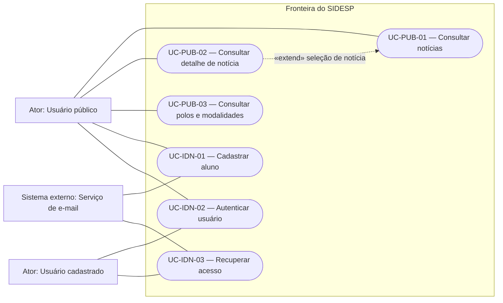
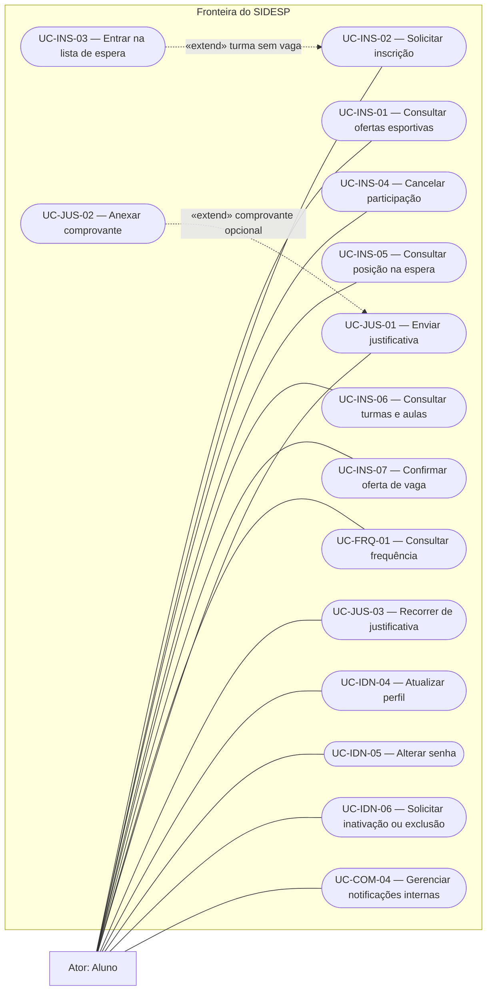
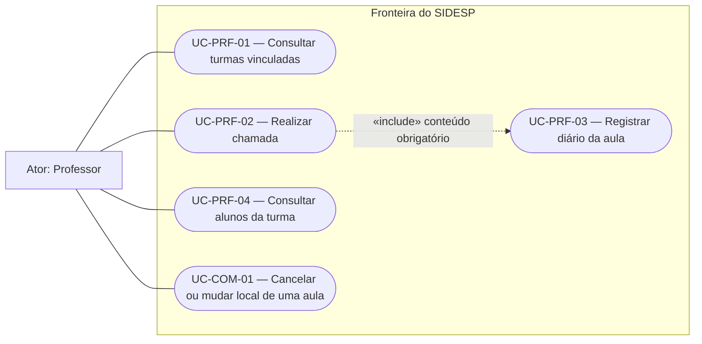
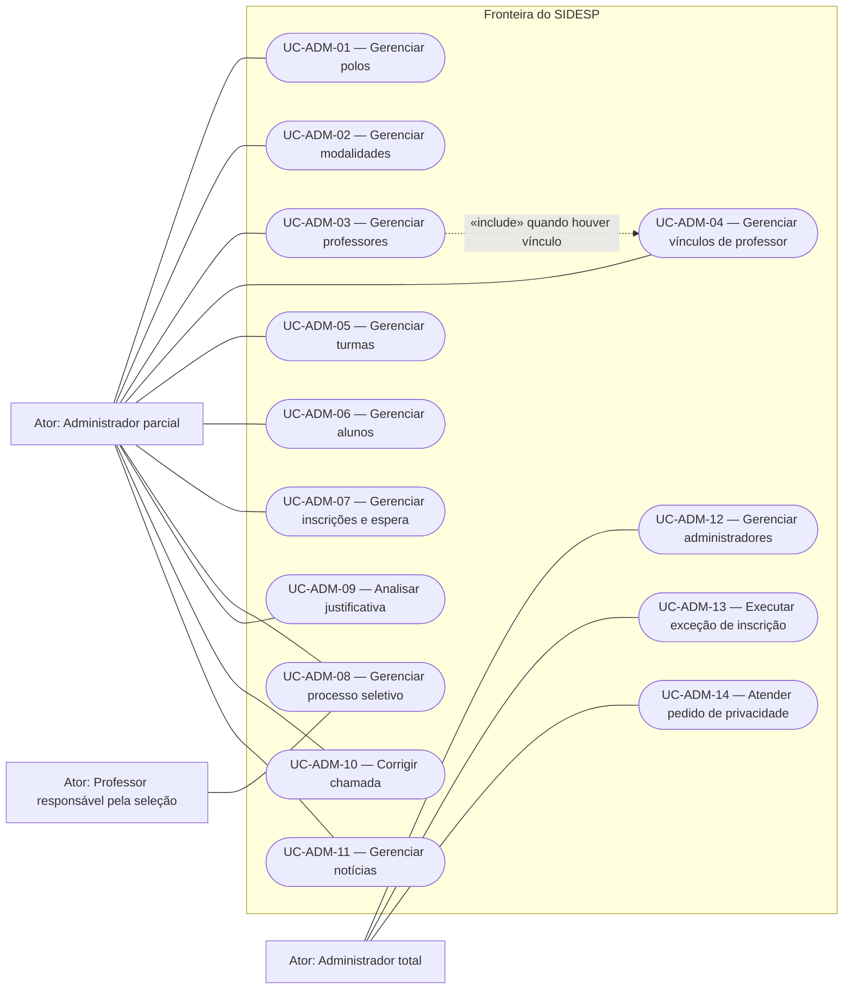
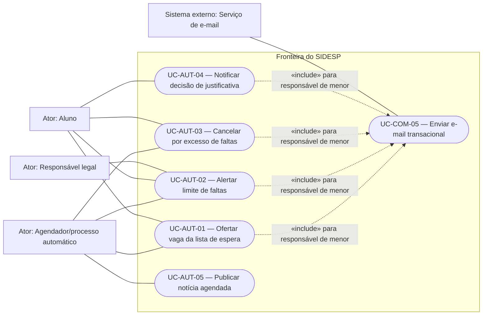

# Casos de Uso — SIDESP

> **SIDESP — Sistema Integrado de Desenvolvimento Esportivo Público**  
> Diagramas e especificações textuais do produto completo, abrangendo frontend, backend e integrações.

## Identificação do documento

| Campo | Valor |
| --- | --- |
| Projeto | SIDESP — Sistema Integrado de Desenvolvimento Esportivo Público |
| Órgão demandante | Secretaria de Esportes de Guaratinguetá |
| Documento relacionado | `LEVANTAMENTO_DE_REQUISITOS.md`, versão `0.2.0` |
| Fonte inicial | Documento de Visão — SIDESP, versão `1.0`, seção 6.3 |
| Responsável de negócio / Scrum Master | Kauãn Raphael |
| Product Owner | Livia Andrade |
| Responsável técnico / Segurança / Privacidade interna | Heitor Leite |
| QA | Micael Phillipini |
| Versão | `0.2.0` |
| Data | 14/08/2026 |
| Classificação | Interna |
| Status | Pronto para revisão — não aprovado |
| Próxima revisão | Revisão formal e aprovação pela equipe |

## Aprovações

| Papel | Responsável | Situação | Data |
| --- | --- | --- | --- |
| Responsável de negócio / Scrum Master | Kauãn Raphael | Pendente de revisão | — |
| Product Owner | Livia Andrade | Pendente de revisão | — |
| Responsável técnico | Heitor Leite | Pendente de revisão | — |
| QA | Micael Phillipini | Pendente de revisão | — |
| Segurança e privacidade interna | Heitor Leite | Pendente de revisão | — |
| Validação institucional de privacidade | Prefeitura/Embrass, antes da implantação real | Fora da aprovação acadêmica atual | — |

## 1. Objetivo e escopo

Este documento representa quem interage com o SIDESP e quais objetivos cada ator pode alcançar. Ele refina os diagramas presentes no Documento de Visão.

Os diagramas foram divididos por domínio para preservar a legibilidade. Todos representam a mesma fronteira de produto. Autenticação, autorização, auditoria, privacidade e validações críticas serão aplicadas no backend, ainda que a interação comece no frontend.

### 1.1 Convenções

- Os IDs atuais seguem o padrão modular `UC-<DOMÍNIO>-<NÚMERO>`.
- Os IDs `UC01` a `UC42` do Documento de Visão são preservados na matriz de rastreabilidade como IDs legados.
- **Proposto:** comportamento planejado e ainda não implementado no produto alvo.
- **Pendente:** comportamento que ainda depende de uma decisão da equipe.
- **Futuro:** comportamento planejado, mas fora da primeira versão.
- Associação contínua indica interação entre ator e caso de uso.
- `«include»` indica comportamento obrigatório e reutilizado pelo caso de origem.
- `«extend»` indica comportamento condicional ou opcional que amplia o caso de destino.
- Autenticação é pré-condição dos fluxos protegidos; não é incluída graficamente em todos eles para evitar relações UML artificiais.
- Os códigos Mermaid são a fonte editável dos diagramas e podem ser renderizados pelo GitHub e por editores compatíveis.

## 2. Atores

| Ator | Tipo | Responsabilidade e limite |
| --- | --- | --- |
| Usuário público | Humano | Consultar conteúdo público e iniciar cadastro ou autenticação. Não acessa dados internos. |
| Usuário cadastrado | Humano abstrato | Generaliza comportamentos comuns de aluno, professor e administrador, como autenticação e recuperação de acesso. |
| Aluno | Humano | Gerenciar a própria participação, consultar os próprios dados e enviar justificativa de falta. |
| Responsável legal | Humano | Não possui conta própria. Confirma o vínculo do menor por e-mail e recebe por e-mail as comunicações importantes da primeira versão. WhatsApp será um canal adicional futuro. |
| Professor | Humano | Atuar somente nas turmas às quais estiver vinculado, realizar chamadas, registrar diário e enviar avisos. |
| Administrador parcial | Humano | Executar somente as funções concedidas individualmente pelo administrador total. |
| Administrador total | Humano | Possuir todas as áreas administrativas, conceder permissões, executar exceções permitidas e corrigir erro administrativo de processo seletivo. |
| Gestor autorizado | Humano | Papel futuro para consultar relatórios e análises, quando esses recursos forem definidos pela Secretaria. |
| Agendador/processo automático | Sistema auxiliar | Disparar eventos temporais e regras automáticas. Não representa um usuário nem substitui autorização. |
| Serviço de e-mail | Sistema externo | Entregar confirmação de cadastro, recuperação de acesso, código de MFA e comunicações importantes ao responsável do aluno menor. |
| Provedor de WhatsApp | Sistema externo futuro | Enviar mensagens adicionais depois da escolha e aprovação do fornecedor. |
| Serviço de mapas | Sistema externo futuro | Exibir mapas e dados agregados quando essa melhoria for aprovada. |

### 2.1 Generalização de atores

- `Aluno`, `Professor`, `Administrador parcial` e `Administrador total` são especializações de `Usuário cadastrado`.
- `Administrador total` herda os casos permitidos ao `Administrador parcial`, mas o inverso é proibido.
- `Gestor autorizado` é um papel de leitura analítica e não recebe automaticamente poderes administrativos.

### 2.2 Glossário técnico

| Termo | Significado neste documento |
| --- | --- |
| Ator | Pessoa, processo automático ou serviço externo que interage com o SIDESP. |
| Caso de uso | Objetivo que um ator alcança ao usar o sistema. |
| Pré-condição | Situação que precisa ser verdadeira antes de iniciar o fluxo. |
| Pós-condição | Situação esperada depois que o fluxo termina. |
| Gatilho | Evento que inicia o caso de uso. |
| `include` | Indica que outro caso de uso é executado obrigatoriamente como parte do fluxo. |
| `extend` | Indica um comportamento adicional que só acontece em uma condição específica. |
| Auditoria | Histórico protegido de quem realizou uma ação, quando, sobre o quê e com qual resultado. |
| Idempotência | Garantia de que repetir a mesma requisição não duplica a operação. |
| Kanban | Painel em colunas que mostra o estado de cada candidatura do processo seletivo. |
| MFA | Segunda verificação usada no login de administradores; no SIDESP, um código enviado por e-mail. |
| Transação | Conjunto de alterações que deve ser concluído por inteiro ou desfeito por inteiro. |
| Operação compensatória | Nova ação registrada para corrigir os efeitos de uma ação anterior que já foi concluída, sem apagar o histórico. |
| E-mail transacional | Mensagem automática gerada por um evento do sistema, como confirmação de cadastro, recuperação ou aviso importante. |
| Retenção | Prazo durante o qual um dado precisa permanecer guardado antes de ser descartado. |

## 3. Diagramas

### 3.1 Contexto, conteúdo público e identidade

### 3.2 Aluno, inscrições, frequência e perfil

### 3.3 Professor e operação das aulas

### 3.4 Administração e gestão operacional

> As associações do administrador parcial indicam capacidades possíveis, não concessão automática. Cada conta parcial recebe somente as permissões concedidas pelo administrador total.

### 3.5 Relatórios e análises futuras

### 3.6 Automações e integrações da primeira versão

WhatsApp, relatórios, exportações, mapa de calor e mapas públicos permanecem documentados como evolução futura e não fazem parte da primeira versão.

## 4. Catálogo e rastreabilidade com o Documento de Visão

| ID atual | Caso de uso | Ator principal | ID legado | Requisitos relacionados | Status |
| --- | --- | --- | --- | --- | --- |
| `UC-PUB-01` | Consultar notícias | Usuário público | `UC01` | `RF-PUB-001` | Proposto |
| `UC-PUB-02` | Consultar detalhe de notícia | Usuário público | `UC02` | `RF-PUB-002` | Proposto |
| `UC-PUB-03` | Consultar polos e modalidades | Usuário público | `UC03` | `RF-PUB-003` | Proposto |
| `UC-IDN-01` | Cadastrar aluno | Usuário público | `UC04` | `RF-IDN-001` | Proposto |
| `UC-IDN-02` | Autenticar usuário | Usuário cadastrado | `UC05` | `RF-IDN-002` | Proposto |
| `UC-IDN-03` | Recuperar acesso | Usuário cadastrado | `UC06` | `RF-IDN-003` | Proposto |
| `UC-IDN-04` | Atualizar perfil | Aluno | `UC16` | `RF-IDN-004` | Proposto |
| `UC-IDN-05` | Alterar senha | Aluno | `UC17` | `RF-IDN-004` | Proposto |
| `UC-IDN-06` | Solicitar inativação ou exclusão | Aluno | Novo | `RF-IDN-004`, `RF-ADM-005` | Proposto |
| `UC-INS-01` | Consultar ofertas esportivas | Aluno | `UC07` | `RF-PUB-003`, `RF-INS-001` | Proposto |
| `UC-INS-02` | Solicitar inscrição | Aluno | `UC08` | `RF-INS-001` | Proposto |
| `UC-INS-03` | Entrar na lista de espera | Aluno | `UC09` | `RF-INS-002` | Proposto |
| `UC-INS-04` | Cancelar participação | Aluno | `UC10` | `RF-INS-003` | Proposto |
| `UC-INS-05` | Consultar posição na espera | Aluno | `UC11` | `RF-INS-002`, `RF-INS-006` | Proposto |
| `UC-INS-06` | Consultar turmas e aulas | Aluno | `UC12` | `RF-INS-005` | Proposto |
| `UC-INS-07` | Confirmar oferta de vaga | Aluno | Novo | `RF-INS-004` | Proposto |
| `UC-FRQ-01` | Consultar frequência | Aluno | `UC13` | `RF-FRQ-001` | Proposto |
| `UC-JUS-01` | Enviar justificativa | Aluno | `UC14` | `RF-JUS-001` | Proposto |
| `UC-JUS-02` | Anexar comprovante | Aluno | `UC15` | `RF-JUS-001` | Proposto |
| `UC-JUS-03` | Recorrer de decisão de justificativa | Aluno | Novo | `RF-JUS-002`, `RF-JUS-003` | Proposto |
| `UC-PRF-01` | Consultar turmas vinculadas | Professor | `UC18` | `RF-FRQ-002` | Proposto |
| `UC-PRF-02` | Realizar chamada | Professor | `UC19` | `RF-FRQ-003` | Proposto |
| `UC-PRF-03` | Registrar diário da aula | Professor | `UC20` | `RF-FRQ-004` | Proposto |
| `UC-PRF-04` | Consultar alunos da turma | Professor | `UC21` | `RF-FRQ-005` | Proposto |
| `UC-COM-01` | Cancelar ou mudar o local de uma aula | Professor | `UC22` | `RF-COM-001` | Proposto |
| `UC-COM-02` | Enviar mensagem via WhatsApp | SIDESP/Provedor | `UC23` | `RF-COM-001`, `RF-COM-004` | Futuro; fornecedor não escolhido |
| `UC-COM-04` | Gerenciar notificações internas | Aluno | Novo | `RF-COM-005` | Proposto |
| `UC-COM-05` | Enviar e-mail transacional | SIDESP/Serviço de e-mail | Novo | `RF-IDN-001/002/003`, `RF-COM-001/002/003` | Proposto |
| `UC-ADM-01` | Gerenciar polos | Administrador autorizado | `UC24` | `RF-ADM-001` | Proposto |
| `UC-ADM-02` | Gerenciar modalidades | Administrador autorizado | `UC25` | `RF-ADM-002` | Proposto |
| `UC-ADM-03` | Gerenciar professores | Administrador autorizado | `UC26` | `RF-ADM-003` | Proposto |
| `UC-ADM-04` | Gerenciar vínculos de professor | Administrador autorizado | `UC27` | `RF-ADM-003` | Proposto |
| `UC-ADM-05` | Gerenciar turmas | Administrador autorizado | `UC28` | `RF-ADM-004` | Proposto |
| `UC-ADM-06` | Gerenciar alunos | Administrador autorizado | `UC30` | `RF-ADM-005` | Proposto |
| `UC-ADM-07` | Gerenciar inscrições e lista de espera | Administrador autorizado | `UC31` | `RF-INS-006` | Proposto |
| `UC-ADM-08` | Gerenciar processo seletivo | Professor ou administrador responsável | `UC32` | `RF-INS-007` | Proposto |
| `UC-ADM-09` | Analisar justificativa | Administrador autorizado | `UC33` | `RF-JUS-002` | Proposto |
| `UC-ADM-10` | Corrigir chamada | Administrador autorizado | Novo | `RF-FRQ-006` | Proposto |
| `UC-ADM-11` | Gerenciar notícias | Administrador autorizado | `UC37` | `RF-ADM-006` | Proposto |
| `UC-ADM-12` | Gerenciar administradores | Administrador total | `UC38` | `RF-ADM-007` | Proposto |
| `UC-ADM-13` | Executar exceção de inscrição | Administrador total autorizado | Novo | `RF-INS-008` | Proposto |
| `UC-ADM-14` | Atender pedido de privacidade | Administrador total | Novo | `RF-IDN-004`, `RF-ADM-005` | Proposto |
| `UC-COM-03` | Consultar histórico de notificações do WhatsApp | Administrador autorizado | `UC39` | `RF-COM-004` | Futuro; depende do WhatsApp |
| `UC-REL-01` | Gerar relatório | Gestor autorizado | `UC34` | `RF-REL-001` | Futuro; conteúdo a definir pela Secretaria |
| `UC-REL-02` | Exportar relatório | Gestor autorizado | `UC35` | `RF-REL-002` | Futuro; conteúdo a definir pela Secretaria |
| `UC-REL-03` | Visualizar mapa de calor | Gestor autorizado | `UC36` | `RF-REL-003` | Futuro; conteúdo a definir pela Secretaria |
| `UC-AUT-01` | Ofertar vaga da lista de espera | Processo automático | `UC29` | `RF-INS-004` | Proposto |
| `UC-AUT-02` | Alertar limite de faltas | Processo automático | `UC41`, `UC42` | `RF-COM-002` | Proposto |
| `UC-AUT-03` | Cancelar por excesso de faltas | Processo automático | `UC40` | `RF-COM-003` | Proposto |
| `UC-AUT-04` | Notificar decisão de justificativa | Processo automático | Novo | `RF-JUS-003` | Proposto |
| `UC-AUT-05` | Publicar notícia agendada | Processo automático | Parte de `UC37` | `RF-ADM-006` | Proposto |

### 4.1 Ajustes em relação ao diagrama original

- `UC01 — Visualizar Tela Inicial` foi refinado como `UC-PUB-01 — Consultar notícias`, pois uma tela é meio de interação, não objetivo de negócio.
- O login foi mantido como caso próprio, mas passou a ser pré-condição dos fluxos protegidos; relações `include` repetidas foram removidas.
- `UC27 — Vincular Professor a Polo/Modalidade` foi refinado para vínculo com turma, coerente com `RN013`, `SE021` e `RF-ADM-003`. Vínculo adicional com polo/modalidade depende de validação.
- `UC29 — Puxar Alunos da Lista de Espera` foi refinado como oferta automática da vaga, preservando ordem, prazo e confirmação.
- Os atores genéricos `Sistema` e `API` foram substituídos por responsabilidades concretas: processo automático, serviço de e-mail e, nas evoluções futuras, provedor de WhatsApp e serviço de mapas.
- `Responsável legal` foi incluído como ator de comunicação, sem conta própria no SIDESP.
- Foram acrescentados casos necessários ao levantamento: confirmar oferta de vaga, recorrer de justificativa, gerenciar notificações internas, enviar e-mail transacional, corrigir chamada, executar exceção administrativa, atender pedido de privacidade, notificar decisão de justificativa e publicar notícia agendada.

## 5. Regras comuns às especificações

- Casos protegidos exigem conta ativa, sessão válida e autorização verificada pelo backend.
- A interface não concede permissão; ocultar botão ou rota não substitui autorização por perfil e objeto.
- Requisições repetidas não podem duplicar inscrições, chamadas, decisões, ofertas ou notificações.
- Erros apresentados ao ator devem ser úteis e seguros, sem revelar dados de terceiros, credenciais ou detalhes internos.
- Eventos críticos devem registrar ator/processo, ação, alvo, instante, resultado e identificador de correlação, respeitando a minimização e os prazos do levantamento de requisitos.
- Os dados mencionados em cada caso são categorias iniciais; campos definitivos dependem do inventário e da avaliação de privacidade.
- Casos da primeira versão permanecem no status `Proposto` até existirem implementação, testes e aceite. Casos fora dela usam o status `Futuro`.

## 6. Especificações textuais — público e identidade

### UC-PUB-01 — Consultar notícias

| Campo | Especificação |
| --- | --- |
| Ator principal | Usuário público |
| Objetivo | Conhecer as notícias já publicadas pela Secretaria. |
| Pré-condições | SIDESP disponível; nenhuma autenticação exigida. |
| Gatilho | O ator acessa a área pública de notícias. |
| Fluxo principal | 1. O sistema identifica o instante atual no fuso aprovado. 2. Recupera somente notícias publicadas e ativas. 3. Ordena conforme regra aprovada. 4. Exibe título, resumo e data. |
| Alternativas e erros | Sem notícias: exibir estado vazio. Falha: exibir indisponibilidade sem conteúdo futuro ou interno. A ordem é pela publicação mais recente e, em empate, pela criação mais recente. |
| Pós-condições | Nenhum dado de negócio é alterado. |
| Permissão, dados e auditoria | Conteúdo público; telemetria não deve identificar usuário sem necessidade. |
| Requisitos relacionados | `RF-PUB-001`, `RN-021`; legado `UC01`. |
| Critério de aceite | Notícia futura ou inativa nunca aparece; notícias elegíveis aparecem na ordem definida. |

### UC-PUB-02 — Consultar detalhe de notícia

| Campo | Especificação |
| --- | --- |
| Ator principal | Usuário público |
| Objetivo | Ler o conteúdo completo de uma notícia publicada. |
| Pré-condições | Notícia existente, ativa e com publicação efetivada. |
| Gatilho | O ator seleciona uma notícia na listagem ou abre seu endereço público. |
| Fluxo principal | 1. O sistema valida a condição pública da notícia. 2. Recupera título, conteúdo e data autorizados. 3. Exibe o conteúdo completo. |
| Alternativas e erros | Notícia inexistente, futura ou inativa: não expor dados e apresentar recurso indisponível. |
| Pós-condições | Nenhum dado de negócio é alterado. |
| Permissão, dados e auditoria | Somente conteúdo público; autoria interna só aparece se aprovada. |
| Requisitos relacionados | `RF-PUB-002`, `RN-021`; legado `UC02`. |
| Critério de aceite | Acesso direto não contorna a data de publicação nem a inativação. |

### UC-PUB-03 — Consultar polos e modalidades

| Campo | Especificação |
| --- | --- |
| Ator principal | Usuário público |
| Atores secundários | Serviço de mapas, se adotado. |
| Objetivo | Localizar polos e conhecer modalidades esportivas disponíveis. |
| Pré-condições | Polos/modalidades com dados públicos cadastrados. |
| Gatilho | O ator abre a consulta e opcionalmente informa filtros. |
| Fluxo principal | 1. O sistema valida os filtros. 2. Consulta itens ativos. 3. Exibe lista e, se disponível, mapa com informações públicas. |
| Alternativas e erros | Sem resultados: lista vazia. Provedor de mapas indisponível: manter a consulta textual. Filtro inválido: solicitar correção. |
| Pós-condições | Nenhum cadastro é alterado. |
| Permissão, dados e auditoria | Endereço público, modalidade e horários aprovados; dados internos e de alunos são proibidos. |
| Requisitos relacionados | `RF-PUB-003`; legados `UC03` e parcialmente `UC07`. |
| Critério de aceite | A consulta retorna somente registros ativos e permanece utilizável sem o mapa externo. |

### UC-IDN-01 — Cadastrar aluno

| Campo | Especificação |
| --- | --- |
| Ator principal | Usuário público |
| Ator secundário | Responsável legal, quando o futuro aluno for menor, e serviço de e-mail. |
| Objetivo | Criar uma conta de aluno válida e única. |
| Pré-condições | Dados obrigatórios e termos aprovados; uma pessoa já existente precisa ser associada com comprovação segura, sem duplicar o CPF. |
| Gatilho | O ator solicita novo cadastro. |
| Fluxo principal | 1. O sistema apresenta os campos de cadastro. 2. O aluno informa dados pessoais, e-mail e senha. 3. O sistema valida formato, idade, senha e unicidade do CPF. 4. Se for menor, exige nome, CPF, relação, e-mail e WhatsApp do responsável, que pode estar ligado a outros alunos sem possuir conta própria. 5. Envia confirmação ao e-mail informado; no cadastro de menor, também confirma o e-mail do responsável. 6. Só ativa a conta depois das confirmações obrigatórias. |
| Alternativas e erros | CPF já existente: não duplicar a pessoa; exigir autenticação do titular ou associação administrativa segura. Dado inválido, e-mail não confirmado ou responsável obrigatório ausente: rejeitar com mensagem segura. Requisição repetida: manter um único cadastro. |
| Pós-condições | Conta `ATIVO` após as confirmações obrigatórias ou `PENDENTE_CONFIRMACAO` enquanto elas não terminarem. A conta pode ser posteriormente `INATIVO`; espera de login não cria estado bloqueado. |
| Permissão, dados e auditoria | Nome, CPF, contato, nascimento e dados aprovados; registrar criação sem senha em claro. |
| Requisitos relacionados | `RF-IDN-001`, `RN-016`, `SE001`; legado `UC04`. |
| Critério de aceite | Duas requisições concorrentes com o mesmo CPF resultam em no máximo uma conta. |

### UC-IDN-02 — Autenticar usuário

| Campo | Especificação |
| --- | --- |
| Ator principal | Usuário cadastrado |
| Objetivo | Iniciar sessão com o perfil e as permissões efetivamente concedidas. |
| Pré-condições | Conta existente e ativa; credencial configurada. |
| Gatilho | O ator informa CPF ou e-mail e senha. |
| Fluxo principal | 1. O sistema normaliza o identificador. 2. Valida a senha sem expor o cadastro. 3. Avalia bloqueios e fatores adicionais aprovados. 4. Cria sessão com expiração e privilégios mínimos. 5. Registra o resultado e direciona ao contexto permitido. |
| Alternativas e erros | Credencial inválida, conta inativa ou limite excedido: resposta genérica e nenhuma sessão. A espera progressiva começa na terceira falha. Administrador também informa código de MFA enviado por e-mail. |
| Pós-condições | Sessão válida criada ou tentativa negada e registrada. |
| Permissão, dados e auditoria | Identificador, resultado, instante e origem técnica necessária; nunca senha, token ou motivo que permita enumeração. |
| Requisitos relacionados | `RF-IDN-002`, `RN-017`, `RNF-SEG-001/003/004/005`; legado `UC05`. |
| Critério de aceite | Credencial inválida não revela existência da conta; perfil não acessa função além da autorização do backend. |

### UC-IDN-03 — Recuperar acesso

| Campo | Especificação |
| --- | --- |
| Ator principal | Usuário cadastrado |
| Ator secundário | Serviço de e-mail. |
| Objetivo | Definir nova senha após comprovar controle de canal previamente verificado. |
| Pré-condições | Conta elegível e canal de recuperação validado anteriormente. |
| Gatilho | O ator solicita recuperação com CPF ou e-mail. |
| Fluxo principal | 1. O sistema aceita o identificador e devolve resposta neutra. 2. Se elegível, gera token aleatório, de uso único e curta duração. 3. Envia-o pelo canal verificado. 4. O ator apresenta token válido e nova senha. 5. O sistema altera a credencial, invalida o token e encerra todas as sessões existentes. |
| Alternativas e erros | Conta inexistente, token inválido, expirado ou reutilizado: não alterar credencial e manter resposta segura. CPF isolado nunca comprova identidade. |
| Pós-condições | Senha alterada e token invalidado, ou nenhuma mudança. |
| Permissão, dados e auditoria | Registrar solicitação e resultado sem token, senha ou identificação excessiva. |
| Requisitos relacionados | `RF-IDN-003`, `SE003`, `RNF-SEG-003/004/005`; legado `UC06`. |
| Critério de aceite | Token expirado/reutilizado falha; respostas iniciais não permitem distinguir conta existente de inexistente. |

### UC-IDN-04 — Atualizar perfil

| Campo | Especificação |
| --- | --- |
| Ator principal | Aluno |
| Objetivo | Manter atualizados os próprios campos editáveis. |
| Pré-condições | Sessão válida e perfil pertencente ao ator. |
| Gatilho | O aluno abre o perfil, altera campos permitidos e confirma. |
| Fluxo principal | 1. O sistema apresenta somente campos editáveis. 2. Valida os novos valores. 3. Atualiza os dados autorizados. 4. Se alterar e confirmar contato de um responsável vinculado a vários menores, aplica o novo contato a todos os vínculos dessa pessoa e avisa os alunos associados. 5. Registra campos alterados sem replicar conteúdo sensível no log. |
| Alternativas e erros | Tentativa de alterar CPF, papel ou vínculo: rejeitar. Contato duplicado/inválido: solicitar correção. |
| Pós-condições | Perfil atualizado ou preservado integralmente em caso de erro. |
| Permissão, dados e auditoria | O aluno altera telefone, bairro, cidade, contato de emergência e dados de saúde. Mudança de e-mail ou contato do responsável exige nova confirmação. Nome, CPF e nascimento somente por administrador autorizado mediante documento. |
| Requisitos relacionados | `RF-IDN-004`, `RN-017`, `SE013`; legado `UC16`. |
| Critério de aceite | Alterações fora da lista permitida falham mesmo por chamada direta à API. |

### UC-IDN-05 — Alterar senha

| Campo | Especificação |
| --- | --- |
| Ator principal | Aluno; aplicável aos demais usuários conforme política comum. |
| Objetivo | Substituir a senha conhecida por uma nova senha válida. |
| Pré-condições | Sessão válida e verificação exigida pela política. |
| Gatilho | O ator informa a senha atual e uma nova senha. |
| Fluxo principal | 1. O sistema valida senha atual e requisitos da nova senha. 2. Armazena apenas novo hash forte. 3. Mantém a sessão atual e encerra todas as demais. 4. Confirma a alteração. |
| Alternativas e erros | Senha atual incorreta ou nova senha inválida: nenhuma alteração. Tentativas excessivas: aplicar limitação. |
| Pós-condições | Credencial atualizada de forma atômica ou inalterada. |
| Permissão, dados e auditoria | Somente o próprio usuário; registrar evento sem conteúdo de senha. |
| Requisitos relacionados | `RF-IDN-004`, `RNF-SEG-003/004/005`; legado `UC17`. |
| Critério de aceite | Senha antiga deixa de autenticar após conclusão; nenhum log ou resposta contém senha. |

### UC-IDN-06 — Solicitar inativação ou exclusão

| Campo | Especificação |
| --- | --- |
| Ator principal | Aluno |
| Objetivo | Pedir a inativação da conta ou a exclusão dos dados que já não precisem ser mantidos. |
| Pré-condições | Conta ativa e sessão válida. |
| Gatilho | O aluno escolhe o tipo de pedido, lê os efeitos e confirma. |
| Fluxo principal | 1. O sistema registra o pedido. 2. Mostra o protocolo, o estado e o prazo de resposta inicial de até 15 dias corridos. 3. Encaminha para `UC-ADM-14`. 4. Mantém os dados protegidos enquanto o pedido é analisado. 5. Enquanto nenhuma ação tiver sido executada, permite que o aluno retire o pedido. |
| Alternativas e erros | Pedido repetido: mostrar o já existente. Dados sujeitos a prazo obrigatório de guarda: informar o motivo e a data prevista para descarte. Pedido já executado, mesmo parcialmente: não permitir retirada; orientar o aluno sobre a situação atual. |
| Pós-condições | Pedido rastreável aguardando atendimento, retirado pelo aluno ou concluído. |
| Permissão, dados e auditoria | Somente o titular; registrar tipo, instante, estado e decisões sem expor dados desnecessários. |
| Requisitos relacionados | `RF-IDN-004`, `RF-ADM-005`, `RN-034`; caso novo. |
| Critério de aceite | Um aluno não consulta nem altera o pedido de outra pessoa. |

## 7. Especificações textuais — aluno e inscrições

### UC-INS-01 — Consultar ofertas esportivas

| Campo | Especificação |
| --- | --- |
| Ator principal | Aluno |
| Objetivo | Identificar modalidades e turmas adequadas para possível inscrição. |
| Pré-condições | Sessão válida; ofertas ativas cadastradas. |
| Gatilho | O aluno abre a área de modalidades/turmas. |
| Fluxo principal | 1. O sistema lista ofertas ativas. 2. Aplica filtros solicitados. 3. Exibe polo, modalidade, faixa etária, horário, disponibilidade e processo seletivo conforme dados públicos. |
| Alternativas e erros | Nenhuma oferta compatível: estado vazio. Informação indisponível: não inferir vaga. |
| Pós-condições | Nenhum vínculo é criado. |
| Permissão, dados e auditoria | Dados da oferta; nenhum dado de outro aluno ou fila nominal. |
| Requisitos relacionados | `RF-PUB-003`, `RF-INS-001`, `RN-008/012`; legado `UC07`. |
| Critério de aceite | Itens inativos não aparecem; disponibilidade exibida corresponde ao estado transacional atual ou informa atualização necessária. |

### UC-INS-02 — Solicitar inscrição

| Campo | Especificação |
| --- | --- |
| Ator principal | Aluno |
| Objetivo | Obter inscrição confirmada em turma elegível ou encaminhamento correto à espera/seleção. |
| Pré-condições | Conta ativa; oferta ativa; aluno não possui vínculo duplicado. |
| Gatilho | O aluno confirma interesse em uma turma. |
| Fluxo principal | 1. O sistema valida idade, limite de modalidades, duplicidade, conflito de horário, situação da turma e processo seletivo. 2. O pedido produz diretamente inscrição `CONFIRMADA`, entrada na fila ou candidatura, sem persistir inscrição `SOLICITADA`. 3. Se for inelegível, rejeita sem criar participação. 4. Exibe o resultado final. |
| Alternativas e erros | Sem vaga: executar `UC-INS-03`. Processo seletivo: criar candidatura para `UC-ADM-08`. Inelegibilidade: rejeitar com motivo seguro. Repetição: retornar o mesmo resultado sem duplicar. |
| Pós-condições | Inscrição confirmada, posição de espera/candidatura criada, ou nenhuma alteração. |
| Permissão, dados e auditoria | Próprio aluno e turma solicitada; registrar decisão e regras aplicadas. |
| Requisitos relacionados | `RF-INS-001`, `RN-001/008/012/018`; legado `UC08`. |
| Critério de aceite | Concorrência pela última vaga não excede a capacidade; terceira participação simultânea é rejeitada salvo exceção aprovada. |

### UC-INS-03 — Entrar na lista de espera

| Campo | Especificação |
| --- | --- |
| Ator principal | Aluno, por meio da solicitação de inscrição. |
| Objetivo | Reservar posição rastreável quando uma turma elegível não possui vaga. |
| Pré-condições | `UC-INS-02` validou elegibilidade e detectou capacidade esgotada. |
| Gatilho | Ausência de vaga durante a inscrição. |
| Fluxo principal | 1. O sistema impede duplicidade na mesma fila e limita o aluno a uma fila por modalidade. 2. Atribui posição por ordem de chegada. 3. Registra horário e estado. 4. Mostra ao aluno sua posição numérica exata. |
| Alternativas e erros | Vaga surgir antes da confirmação da fila: resolver atomicamente conforme ordem. Falha: não apresentar posição não persistida. |
| Pós-condições | Entrada única e ordenada criada. |
| Permissão, dados e auditoria | Aluno consulta apenas a própria posição; lista nominal fica restrita. |
| Requisitos relacionados | `RF-INS-002`, `RN-009`; legado `UC09`. |
| Critério de aceite | Solicitações concorrentes produzem ordem única; o mesmo aluno não ocupa duas posições na turma. |

### UC-INS-04 — Cancelar participação

| Campo | Especificação |
| --- | --- |
| Ator principal | Aluno |
| Objetivo | Encerrar uma inscrição confirmada, uma entrada na lista de espera ou uma candidatura própria. |
| Pré-condições | Participação pertencente ao aluno e em estado cancelável. |
| Gatilho | O aluno solicita cancelamento e confirma. |
| Fluxo principal | 1. O sistema valida propriedade e estado. 2. Cancela a participação e preserva o histórico. 3. Se era inscrição confirmada, libera a vaga uma única vez e aciona `UC-AUT-01`. 4. Se era fila, guarda a última posição ocupada e o instante da saída, encerra a entrada sem alterar as demais posições e deixa de recalculá-la como posição ativa. 5. Se era processo seletivo, encerra a candidatura. 6. Registra origem, instante e resultado. |
| Alternativas e erros | Participação alheia, já encerrada ou não cancelável: negar sem alterar dados. Repetição: manter o resultado anterior. Para voltar, o aluno faz nova solicitação e entra no final da fila quando aplicável. |
| Pós-condições | Participação cancelada com histórico; eventual vaga disponibilizada. |
| Permissão, dados e auditoria | Somente participação própria; registrar aluno, turma, tipo, instante e resultado. |
| Requisitos relacionados | `RF-INS-003`, `RN-010`; legado `UC10`. |
| Critério de aceite | Cancelamento repetido não libera duas vagas nem apaga histórico. |

### UC-INS-05 — Consultar posição na espera

| Campo | Especificação |
| --- | --- |
| Ator principal | Aluno |
| Objetivo | Acompanhar a própria situação na fila de uma turma. |
| Pré-condições | Entrada de espera pertencente ao aluno. |
| Gatilho | O aluno consulta suas inscrições/esperas. |
| Fluxo principal | 1. O sistema localiza a entrada do aluno. 2. Se estiver ativa, exibe o estado e a posição numérica exata atual. 3. Se estiver encerrada, exibe o estado, a última posição ocupada e a data e hora da saída, sem continuar recalculando a posição. 4. Informa oferta ativa e prazo, se houver. |
| Alternativas e erros | Fila alheia: negar. Nunca mostrar nomes, contatos ou outros dados das demais pessoas. |
| Pós-condições | Nenhuma posição é alterada. |
| Permissão, dados e auditoria | Somente a própria entrada; não expor nomes ou posições identificáveis de terceiros. |
| Requisitos relacionados | `RF-INS-002/006`, `RN-009/011`; legado `UC11`. |
| Critério de aceite | Alterar identificador da requisição não permite consultar fila de outro aluno. |

### UC-INS-06 — Consultar turmas e aulas

| Campo | Especificação |
| --- | --- |
| Ator principal | Aluno |
| Objetivo | Consultar turmas em que participa, horários, aulas e dados permitidos do professor. |
| Pré-condições | Sessão válida. |
| Gatilho | O aluno abre sua agenda/turmas. |
| Fluxo principal | 1. O sistema recupera somente vínculos do aluno. 2. Exibe turma, polo, modalidade, horários, aulas e informações permitidas do professor. 3. Reflete mudanças aprovadas. |
| Alternativas e erros | Sem turmas: estado vazio. Turma inativa com histórico: exibir conforme regra sem permitir nova ação. |
| Pós-condições | Nenhum dado é alterado. |
| Permissão, dados e auditoria | Próprios vínculos e dados profissionais mínimos do professor. |
| Requisitos relacionados | `RF-INS-005`, `RN-017`, `SE012`; legado `UC12`. |
| Critério de aceite | O aluno não consegue consultar turmas de terceiros por alteração de identificador. |

### UC-INS-07 — Confirmar oferta de vaga

| Campo | Especificação |
| --- | --- |
| Ator principal | Aluno |
| Objetivo | Aceitar ou recusar a vaga temporariamente oferecida pela fila. |
| Pré-condições | Oferta ativa, pertencente ao aluno, ainda dentro do prazo e com vaga reservada. |
| Gatilho | O aluno entra no SIDESP, abre `Minhas ofertas` e escolhe confirmar ou recusar. |
| Fluxo principal | 1. O sistema valida sessão, propriedade, prazo e estado. 2. Ao confirmar, converte a oferta em inscrição e encerra a entrada da fila. 3. Ao recusar, libera a reserva e aciona o próximo elegível. 4. Registra o resultado. E-mail e notificação apenas direcionam para a área autenticada. |
| Alternativas e erros | Oferta expirada, já consumida ou concorrência no limite: negar com estado atual; nunca confirmar duas pessoas para a mesma reserva. Apagar a notificação não cancela a oferta, que continua em `Minhas ofertas` até resposta ou expiração. |
| Pós-condições | Inscrição confirmada ou vaga encaminhada ao próximo. |
| Permissão, dados e auditoria | Somente destinatário da oferta; registrar decisão e instante. |
| Requisitos relacionados | `RF-INS-004`, `RN-010/011`; caso novo. |
| Critério de aceite | Confirmação dentro do prazo efetiva uma única inscrição; expiração/recusa avança a fila sem duplicidade. |

### UC-FRQ-01 — Consultar frequência

| Campo | Especificação |
| --- | --- |
| Ator principal | Aluno |
| Objetivo | Acompanhar presenças, faltas e histórico de aulas próprios. |
| Pré-condições | Sessão válida; chamadas existentes ou período consultável. |
| Gatilho | O aluno abre sua frequência. |
| Fluxo principal | 1. O sistema aplica o escopo do próprio aluno e filtros de período/turma. 2. Recupera chamadas válidas e correções. 3. Exibe presença, falta, conteúdo permitido e totais segundo fórmula aprovada. |
| Alternativas e erros | Sem aulas: estado vazio. Chamada corrigida: exibir estado vigente e histórico somente se permitido. |
| Pós-condições | Nenhum registro de chamada é alterado. |
| Permissão, dados e auditoria | Somente frequência própria. |
| Requisitos relacionados | `RF-FRQ-001`, `RN-017`; legado `UC13`. |
| Critério de aceite | Resultado reflete a correção administrativa válida e nunca mistura dados de outro aluno. |

### UC-JUS-01 — Enviar justificativa

| Campo | Especificação |
| --- | --- |
| Ator principal | Aluno |
| Caso opcional | `UC-JUS-02 — Anexar comprovante`, de zero a três arquivos. |
| Objetivo | Solicitar análise administrativa de uma ou várias faltas elegíveis. |
| Pré-condições | Faltas pertencentes ao mesmo aluno, cobertas pelo mesmo motivo ou comprovante e registradas há no máximo 7 dias corridos cada. |
| Gatilho | O aluno seleciona uma ou várias faltas e solicita justificativa. |
| Fluxo principal | 1. O sistema valida propriedade, prazo individual e ausência de outra justificativa ativa para cada falta. 2. Permite faltas de modalidades diferentes quando tiverem o mesmo motivo ou comprovante. 3. Exige uma descrição. 4. Se o aluno escolher, executa `UC-JUS-02` para até três arquivos compartilhados. 5. Registra como `EM_ANALISE` e confirma o protocolo. |
| Alternativas e erros | Antes da primeira decisão, o aluno pode cancelar após ser avisado de que as faltas voltarão a contar e poderão cancelar a inscrição. Falta inelegível, descrição ausente, prazo expirado ou duplicidade: não enviar. Arquivo recusado pode ser removido ou substituído sem exigir outro. |
| Pós-condições | Justificativa pendente de análise, com zero a três comprovantes protegidos. |
| Permissão, dados e auditoria | Própria falta; registrar protocolo, estado e instante sem copiar conteúdo sensível para logs. |
| Requisitos relacionados | `RF-JUS-001`, `RN-003/004`; legado `UC14`. |
| Critério de aceite | Justificativa com descrição válida alcança “em análise” mesmo sem arquivo; nunca aceita mais de três comprovantes. |

### UC-JUS-02 — Anexar comprovante

| Campo | Especificação |
| --- | --- |
| Ator principal | Aluno, como parte de `UC-JUS-01`. |
| Objetivo | Associar um documento comprobatório válido à justificativa. |
| Pré-condições | Fluxo de justificativa ativo; regras de arquivo aprovadas. |
| Gatilho | O aluno seleciona o arquivo. |
| Fluxo principal | 1. O sistema valida quantidade, tamanho, extensão, tipo real, nome e conteúdo. 2. Gera identificador seguro. 3. Armazena fora da área pública. 4. Associa o arquivo à justificativa sem expor caminho interno. |
| Alternativas e erros | Arquivo excessivo, inconsistente, malicioso ou corrompido: rejeitar e descartar temporários. |
| Pós-condições | Arquivo protegido associado ou nenhum arquivo persistido. |
| Permissão, dados e auditoria | Aluno próprio e administrador aprovador; no máximo 3 arquivos de até 10 MB cada, em PDF, JPG ou PNG, mantidos em quarentena até a verificação de segurança. |
| Requisitos relacionados | `RF-JUS-001`, `RN-004`, `RNF-SEG-006`; legado `UC15`. |
| Critério de aceite | O arquivo não é publicamente endereçável e só pode ser baixado após autorização por objeto. |

### UC-JUS-03 — Recorrer de decisão de justificativa

| Campo | Especificação |
| --- | --- |
| Ator principal | Aluno |
| Objetivo | Pedir uma única reavaliação de justificativa recusada. |
| Pré-condições | Decisão recusada há no máximo 3 dias corridos e nenhum recurso anterior para a mesma justificativa. |
| Gatilho | O aluno informa o motivo do recurso e confirma. |
| Fluxo principal | 1. O sistema valida prazo e unicidade. 2. Registra o recurso. 3. Mantém suspenso eventual cancelamento por faltas relacionado. 4. Encaminha a outro administrador autorizado. |
| Alternativas e erros | Prazo expirado, segundo recurso ou justificativa de outra pessoa: rejeitar sem alterar a decisão. |
| Pós-condições | Recurso em análise ou nenhuma alteração. |
| Permissão, dados e auditoria | Somente o aluno titular; decisão deve ser feita por administrador diferente do primeiro. |
| Requisitos relacionados | `RF-JUS-002/003`, `RN-024/025`; caso novo. |
| Critério de aceite | O mesmo aluno apresenta no máximo um recurso por justificativa e o cancelamento relacionado fica suspenso até a decisão. |

## 8. Especificações textuais — professor e comunicação

### UC-PRF-01 — Consultar turmas vinculadas

| Campo | Especificação |
| --- | --- |
| Ator principal | Professor |
| Objetivo | Visualizar somente as turmas nas quais pode atuar. |
| Pré-condições | Professor ativo, autenticado e com vínculo vigente. |
| Gatilho | O professor acessa suas turmas. |
| Fluxo principal | 1. O backend obtém a identidade. 2. Filtra vínculos vigentes. 3. Exibe turma, polo, modalidade, agenda e ações permitidas. |
| Alternativas e erros | Sem vínculos: estado vazio. Vínculo expirado/inativo: não permitir ação nova; histórico conforme política. |
| Pós-condições | Nenhum vínculo é alterado. |
| Permissão, dados e auditoria | Somente turmas vinculadas; consulta direta de turma alheia é negada. |
| Requisitos relacionados | `RF-FRQ-002`, `RN-013`; legado `UC18`. |
| Critério de aceite | Alterar o ID da turma não concede acesso sem vínculo vigente. |

### UC-PRF-02 — Realizar chamada

| Campo | Especificação |
| --- | --- |
| Ator principal | Professor |
| Caso incluído | `UC-PRF-03 — Registrar diário da aula`. |
| Objetivo | Registrar presença ou falta dos alunos elegíveis em uma aula. |
| Pré-condições | Professor vinculado; aula válida; chamada ainda não encerrada; registro feito até 24 horas após a aula. |
| Gatilho | O professor abre a aula, marca os alunos e solicita salvamento. |
| Fluxo principal | 1. O sistema valida vínculo, aula e lista de alunos. 2. Para cada aluno, o professor escolhe somente `PRESENTE` ou `AUSENTE`. 3. Executa `UC-PRF-03`. 4. O sistema salva chamada e diário atomicamente. 5. Confirma e inicia as regras de faltas aplicáveis. Justificativa aceita permanece ligada à ausência, mas faz com que ela não conte no limite. |
| Alternativas e erros | Aula cancelada não permite chamada. Sem internet, manter rascunho identificado no navegador e informar claramente que ainda não foi sincronizado. Ao reconectar, enviar de forma que a repetição não duplique a chamada e só considerar concluída após confirmação do servidor. Vínculo ausente, aula inválida, campo obrigatório vazio ou chamada já salva: não alterar. |
| Pós-condições | Chamada salva e bloqueada para alteração pelo professor. |
| Permissão, dados e auditoria | Professor vinculado; registrar turma, aula, autor e resultado. |
| Requisitos relacionados | `RF-FRQ-003`, `RN-013/019`; legado `UC19`. |
| Critério de aceite | Salvamento é atômico; professor não altera nem exclui chamada concluída. |

### UC-PRF-03 — Registrar diário da aula

| Campo | Especificação |
| --- | --- |
| Ator principal | Professor, como parte de `UC-PRF-02`. |
| Objetivo | Registrar o conteúdo ministrado e observações permitidas da aula. |
| Pré-condições | Aula e chamada válidas; professor vinculado. |
| Gatilho | O professor preenche o diário antes de salvar a chamada. |
| Fluxo principal | 1. O sistema exige conteúdo não vazio. 2. Valida tamanho e conteúdo. 3. Associa diário à aula e à chamada na mesma operação. |
| Alternativas e erros | Conteúdo vazio ou observação proibida/excessiva: bloquear salvamento e preservar rascunho somente se houver estratégia aprovada. |
| Pós-condições | Diário associado à aula, sem registro órfão. |
| Permissão, dados e auditoria | Professor vinculado; observações não devem virar campo livre para dado de saúde desnecessário. |
| Requisitos relacionados | `RF-FRQ-004`, `RN-014`; legado `UC20`. |
| Critério de aceite | Chamada não pode ser concluída sem conteúdo válido. |

### UC-PRF-04 — Consultar alunos da turma

| Campo | Especificação |
| --- | --- |
| Ator principal | Professor |
| Objetivo | Consultar dados mínimos e frequência necessários à condução de suas turmas. |
| Pré-condições | Professor vinculado à turma e aluno participante no período aplicável. |
| Gatilho | O professor seleciona a turma ou um aluno da turma. |
| Fluxo principal | 1. O sistema valida o vínculo por turma e vigência. 2. Recupera somente alunos e campos permitidos. 3. Exibe frequência e informações operacionais aprovadas. |
| Alternativas e erros | Aluno/turma fora do vínculo: negar. Dados de saúde: não exibir antes de definição de finalidade e permissão específica. |
| Pós-condições | Nenhum dado do aluno é alterado. |
| Permissão, dados e auditoria | Campos mínimos; acessos a dado sensível, se aprovados, devem ser auditados. |
| Requisitos relacionados | `RF-FRQ-005`, `RN-013/017`; legado `UC21`. |
| Critério de aceite | Professor não acessa aluno de turma alheia nem campo além de sua permissão. |

### UC-COM-01 — Cancelar ou mudar o local de uma aula

| Campo | Especificação |
| --- | --- |
| Ator principal | Professor |
| Caso incluído | `UC-COM-05` quando houver aluno menor entre os destinatários. |
| Objetivo | Cancelar uma ocorrência específica de aula ou mudar apenas o local dessa ocorrência e avisar os alunos. |
| Pré-condições | Professor vinculado à turma; ocorrência existente e ainda alterável. |
| Gatilho | O professor seleciona a ocorrência, escolhe cancelamento ou novo local, informa o motivo e confirma. |
| Fluxo principal | 1. O sistema valida vínculo, ocorrência e alteração. 2. O professor escolhe um polo cadastrado ou informa um local temporário com nome, endereço e complemento. 3. Atualiza somente a ocorrência escolhida. 4. Mantém os dias, horários, polo e período permanentes da turma. 5. Calcula os destinatários no servidor. 6. Cria notificação interna para os alunos e envia e-mail ao responsável de cada menor. 7. Antes do início da aula, permite desfazer o cancelamento ou restaurar o local anterior. 8. Toda alteração ou reversão gera nova notificação e fica registrada. |
| Alternativas e erros | Turma alheia, ocorrência inexistente ou tentativa de alteração permanente: rejeitar. Depois do início da aula, somente administrador autorizado pode corrigir, com motivo e auditoria. Falha de e-mail não desfaz a alteração; aplicar o tratamento de `UC-COM-05`. |
| Pós-condições | Ocorrência atualizada, programação permanente preservada e avisos registrados. |
| Permissão, dados e auditoria | Professor vinculado; guardar ocorrência, estado anterior e novo, motivo, autor, instante e resultados. |
| Requisitos relacionados | `RF-COM-001`, `RN-020`; legado `UC22`. |
| Critério de aceite | O professor não altera outra turma nem a programação permanente; os destinatários são determinados pelo servidor. |

### UC-COM-02 — Enviar mensagem via WhatsApp

| Campo | Especificação |
| --- | --- |
| Ator principal | SIDESP, acionado por caso de negócio. |
| Ator secundário | Provedor de WhatsApp. |
| Objetivo | Entregar mensagem aprovada pelo canal externo e registrar o resultado. |
| Pré-condições | Fornecedor, contrato, template, base/consentimento, destinatário e segredo de integração aprovados. |
| Gatilho | Aviso, oferta, falta ou decisão gera comunicação pelo canal. |
| Fluxo principal | 1. O sistema monta template com dados mínimos. 2. Envia de forma autenticada e idempotente. 3. Recebe identificador do provedor. 4. Registra tentativa e estado. 5. Processa retorno de entrega quando disponível. |
| Alternativas e erros | Timeout/erro: registrar falha, repetir dentro do limite e aplicar fallback. Número inválido/opt-out: não insistir fora da política. |
| Pós-condições | Tentativa rastreável, entregue ou falha; a operação principal não é corrompida. |
| Permissão, dados e auditoria | Telefone, template e parâmetros mínimos; nunca segredo, comprovante ou dado sensível desnecessário em log. |
| Requisitos relacionados | `RF-COM-001/002/004`, `RN-020`; legado `UC23`. |
| Critério de aceite | Repetição não envia mensagens ilimitadas; falha externa permanece visível sem duplicar o evento de negócio. |

### UC-COM-03 — Consultar histórico de notificações

| Campo | Especificação |
| --- | --- |
| Ator principal | Administrador autorizado |
| Objetivo | Diagnosticar tentativas e resultados de notificações sem acessar conteúdo desnecessário. |
| Pré-condições | Permissão específica e registros dentro da retenção. |
| Gatilho | O administrador informa filtros permitidos. |
| Fluxo principal | 1. O sistema valida permissão e filtros. 2. Retorna evento, destinatário referenciado/mascarado, canal, instante, template, resultado e identificador técnico permitido. 3. Registra acesso quando necessário. |
| Alternativas e erros | Filtro excessivo, registro expirado ou acesso negado: não retornar dados. |
| Pós-condições | Nenhum estado de entrega é alterado. |
| Permissão, dados e auditoria | Acesso restrito; conteúdo integral e telefone devem ser minimizados/mascarados conforme função. |
| Requisitos relacionados | `RF-COM-004`, `SE035`; legado `UC39`. |
| Critério de aceite | Histórico não exibe segredo, token ou conteúdo pessoal além da necessidade de suporte. |

> `UC-COM-02` e `UC-COM-03` pertencem a uma versão futura e só serão detalhados novamente depois da escolha do fornecedor de WhatsApp.

### UC-COM-04 — Gerenciar notificações internas

| Campo | Especificação |
| --- | --- |
| Ator principal | Aluno |
| Objetivo | Consultar, marcar como lidas e apagar as próprias notificações visíveis. |
| Pré-condições | Sessão válida. |
| Gatilho | O aluno abre a central de notificações ou escolhe uma ação. |
| Fluxo principal | 1. O sistema lista somente notificações do aluno. 2. O aluno pode abrir, marcar como lida ou apagar qualquer item visível. 3. O sistema confirma a ação. |
| Alternativas e erros | Notificação de outra pessoa ou já apagada: negar ou retornar o estado atual sem revelar conteúdo. |
| Pós-condições | Estado de leitura ou conteúdo visível atualizado. O registro técnico mínimo pode permanecer durante o prazo definido. |
| Permissão, dados e auditoria | Somente o destinatário; exclusão pelo usuário não apaga auditoria técnica necessária. |
| Requisitos relacionados | `RF-COM-005`, `RN-028`; caso novo. |
| Critério de aceite | Alterar o identificador não permite ler nem apagar notificação de outra pessoa. |

### UC-COM-05 — Enviar e-mail transacional

| Campo | Especificação |
| --- | --- |
| Ator principal | SIDESP, acionado por outro caso de uso. |
| Ator secundário | Serviço de e-mail. |
| Objetivo | Enviar confirmação de cadastro, recuperação, MFA ou comunicação importante ao responsável do menor. |
| Pré-condições | Evento válido, destinatário confirmado quando exigido e modelo de mensagem aprovado. |
| Gatilho | Um caso de negócio solicita o envio. |
| Fluxo principal | 1. O sistema monta a mensagem com os dados mínimos. 2. Faz a primeira tentativa imediatamente, usando um identificador que evita duplicidade. 3. Em falha temporária, tenta novamente após 5 minutos e, se necessário, após 30 minutos, totalizando no máximo 3 tentativas. 4. Registra o resultado de cada tentativa. |
| Alternativas e erros | Após três falhas ou em endereço inválido, criar pendência para acompanhamento administrativo. Em comunicações ao responsável, a falha não desfaz a operação principal nem a notificação interna do aluno. |
| Pós-condições | E-mail entregue ou tentativa rastreável. |
| Permissão, dados e auditoria | Não incluir senha, token completo em log, comprovante ou dado de saúde desnecessário. |
| Requisitos relacionados | `RF-IDN-001/002/003`, `RF-COM-001/002/003`, `RN-007`; caso novo. |
| Critério de aceite | Reprocessar o mesmo evento não envia mensagens ilimitadas nem duplica a operação principal. |

## 9. Especificações textuais — administração

### UC-ADM-01 — Gerenciar polos

| Campo | Especificação |
| --- | --- |
| Ator principal | Administrador autorizado |
| Objetivo | Cadastrar, consultar, alterar e inativar polos. |
| Pré-condições | Permissão administrativa correspondente. |
| Gatilho | O administrador escolhe uma operação sobre polo. |
| Fluxo principal | 1. O sistema valida campos e unicidade. 2. Cria ou atualiza o polo. 3. Na desativação, inativa logicamente. 4. Registra autor e alteração. |
| Alternativas e erros | Campo inválido/duplicado: rejeitar. Polo referenciado: nunca excluir fisicamente; bloquear novos usos após inativação. |
| Pós-condições | Polo consistente e histórico preservado. |
| Permissão, dados e auditoria | Endereço e metadados públicos/internos separados; auditar escrita. |
| Requisitos relacionados | `RF-ADM-001`, `RN-015`; legado `UC24`. |
| Critério de aceite | Inativação preserva turmas históricas e impede novo vínculo quando aplicável. |

### UC-ADM-02 — Gerenciar modalidades

| Campo | Especificação |
| --- | --- |
| Ator principal | Administrador autorizado |
| Objetivo | Manter modalidades e suas regras de faixa etária e faltas. |
| Pré-condições | Permissão administrativa; valores de regra aprovados. |
| Gatilho | O administrador cria, edita ou inativa modalidade. |
| Fluxo principal | 1. O sistema valida identificação, faixa etária e limite de faltas. 2. Persiste nova versão/vigência sem reescrever histórico. 3. Inativa logicamente quando solicitado. 4. Audita a mudança. |
| Alternativas e erros | Faixa invertida, limite inválido ou duplicidade: rejeitar. Mudança com turmas ativas: aplicar regra de vigência aprovada. |
| Pós-condições | Modalidade válida e regras rastreáveis. |
| Permissão, dados e auditoria | Regra antiga/nova, autor e vigência. |
| Requisitos relacionados | `RF-ADM-002`, `RN-002/008/015`; legado `UC25`. |
| Critério de aceite | Alterar modalidade não modifica retroativamente a regra usada em período encerrado. |

### UC-ADM-03 — Gerenciar professores

| Campo | Especificação |
| --- | --- |
| Ator principal | Administrador autorizado |
| Caso incluído | `UC-ADM-04` quando a operação também atribuir vínculo. |
| Objetivo | Cadastrar, consultar, atualizar e inativar professores. |
| Pré-condições | Permissão correspondente; campos obrigatórios aprovados. |
| Gatilho | O administrador escolhe uma operação sobre professor. |
| Fluxo principal | 1. O sistema localiza ou cria a pessoa única pelo CPF. 2. Cria ou atualiza o perfil de professor e, quando necessário, sua conta. 3. Opcionalmente gerencia vínculos. 4. Inativa o perfil sem apagar histórico nem outros perfis da mesma pessoa. 5. Audita. |
| Alternativas e erros | CPF já existente com dados incompatíveis: exigir conferência segura, sem duplicar a pessoa. Dado inválido: rejeitar. Inativação preserva aulas passadas. |
| Pós-condições | Professor consistente e vínculos/histórico preservados. |
| Permissão, dados e auditoria | Dados pessoais profissionais mínimos; escrita auditada. |
| Requisitos relacionados | `RF-ADM-003`, `RN-013/015/016`; legado `UC26`. |
| Critério de aceite | Professor inativo não atua em nova chamada, mas continua identificado no histórico. |

### UC-ADM-04 — Gerenciar vínculos de professor

| Campo | Especificação |
| --- | --- |
| Ator principal | Administrador autorizado |
| Objetivo | Conceder ou encerrar vínculo do professor com turmas e vigência definidas. |
| Pré-condições | Professor e turma ativos; permissão correspondente. |
| Gatilho | O administrador seleciona professor, turma e período de vínculo. |
| Fluxo principal | 1. O sistema valida existência, vigência e conflitos definidos. 2. Cria/altera/encerra o vínculo sem apagar histórico. 3. Atualiza acesso efetivo no período. 4. Audita. |
| Alternativas e erros | Vínculo duplicado, período inválido ou entidade inativa: rejeitar. Substituição temporária depende de regra aprovada. |
| Pós-condições | Acesso do professor coerente com vínculo vigente. |
| Permissão, dados e auditoria | Professor, turma, vigência, autor e resultado. |
| Requisitos relacionados | `RF-ADM-003`, `RF-FRQ-002`, `RN-013`; legado `UC27` refinado. |
| Critério de aceite | Encerrar vínculo remove acesso futuro sem apagar autoria de chamadas passadas. |

### UC-ADM-05 — Gerenciar turmas

| Campo | Especificação |
| --- | --- |
| Ator principal | Administrador autorizado |
| Objetivo | Criar, consultar e alterar turmas, aulas e configurações, incluindo suspensão, encerramento e inativação. |
| Pré-condições | Polo/modalidade ativos e permissão correspondente. |
| Gatilho | O administrador escolhe operação sobre turma. |
| Fluxo principal | 1. Informa modalidade, polo, agenda, capacidade, professor e indicação de processo seletivo. 2. O sistema valida consistência e cria a turma como `PLANEJADA`. 3. O administrador pode ativar, suspender, reativar, encerrar ou inativar. 4. Suspensão preserva inscrições e fila, bloqueia novas inscrições e não gera aulas nem faltas, sem ampliar automaticamente o fim da turma. 5. Ao reativar, o administrador decide período e novas ocorrências e notifica os alunos. 6. Reagendamento preserva a mesma aula, registra valores anterior e novo, motivo, autor e instante, e usa `REAGENDADA` até a aula passar a `REALIZADA`. 7. O sistema audita cada transição. |
| Alternativas e erros | Capacidade abaixo de inscrições confirmadas, transição inválida, conflito de horário ou referência inativa: bloquear ou exigir o tratamento aprovado; nunca cancelar alunos silenciosamente. |
| Pós-condições | Turma válida e histórico preservado. |
| Permissão, dados e auditoria | Configuração, antes/depois, autor e data. |
| Requisitos relacionados | `RF-ADM-004`, `RN-012/015/018`; legado `UC28`. |
| Critério de aceite | Inscrições confirmadas não ultrapassam a capacidade, salvo exceção explicitamente autorizada e auditada. |

### UC-ADM-06 — Gerenciar alunos

| Campo | Especificação |
| --- | --- |
| Ator principal | Administrador autorizado |
| Objetivo | Consultar e manter cadastros de alunos dentro das permissões concedidas. |
| Pré-condições | Permissão e finalidade para os campos solicitados. |
| Gatilho | O administrador pesquisa ou solicita alteração/inativação. |
| Fluxo principal | 1. O sistema valida escopo e filtros. 2. Exibe campos mínimos. 3. Valida e aplica alteração permitida. 4. Inativa logicamente quando aprovado. 5. Audita ação crítica. |
| Alternativas e erros | Acesso a campo restrito, alteração de CPF indevida ou operação em massa sem permissão: negar. |
| Pós-condições | Cadastro atualizado/inativado sem perda do histórico necessário. |
| Permissão, dados e auditoria | Dados pessoais; saúde e documentos exigem permissão distinta e finalidade aprovada. |
| Requisitos relacionados | `RF-ADM-005`, `RN-015/016/017`; legado `UC30`. |
| Critério de aceite | Administrador parcial não acessa campo ou ação fora da matriz, inclusive pela API. |

### UC-ADM-07 — Gerenciar inscrições e lista de espera

| Campo | Especificação |
| --- | --- |
| Ator principal | Administrador autorizado |
| Objetivo | Acompanhar e executar intervenções permitidas em inscrições e filas. |
| Pré-condições | Permissão específica; turma e aluno identificados. |
| Gatilho | O administrador consulta a operação ou solicita ação permitida. |
| Fluxo principal | 1. O sistema exibe inscrições/fila conforme escopo. 2. Valida a intervenção e seu motivo. 3. Aplica a mudança preservando ordem e histórico. 4. Recalcula ofertas quando necessário. 5. Audita. |
| Alternativas e erros | Alteração silenciosa de posição, remoção sem motivo ou permissão insuficiente: rejeitar. Exceção de regra usa `UC-ADM-13`. |
| Pós-condições | Estados consistentes e trilha completa. |
| Permissão, dados e auditoria | Lista nominal restrita; antes/depois, motivo e autor obrigatórios em intervenção. |
| Requisitos relacionados | `RF-INS-006`, `RN-009/010/023`; legado `UC31`. |
| Critério de aceite | Intervenção manual não apaga ordem original nem acontece sem identificação do responsável. |

### UC-ADM-08 — Gerenciar processo seletivo

| Campo | Especificação |
| --- | --- |
| Ator principal | Professor ou administrador responsável pelo processo seletivo |
| Objetivo | Avaliar candidaturas de turmas seletivas em fluxo Kanban aprovado. |
| Pré-condições | Turma marcada como seletiva; candidatura existente; critérios configurados para a modalidade e a faixa etária. |
| Gatilho | O administrador abre o painel ou move uma candidatura. |
| Fluxo principal | 1. O sistema lista candidaturas nas cinco colunas. 2. Carrega a versão dos critérios em texto aplicável à modalidade e idade. 3. O professor ou administrador responsável marca `ATENDEU` ou `NÃO ATENDEU` em cada critério e pode escrever observação. 4. Os resultados orientam, mas não aprovam nem reprovam automaticamente. 5. O avaliador registra a decisão humana final. 6. O sistema valida estado, permissão e capacidade e registra versão, avaliações, autor, instante e decisão. |
| Alternativas e erros | Transição inválida, falta de critério ou capacidade: bloquear. Na primeira versão, o aluno não pode recorrer de `APROVADO` ou `REPROVADO`. Antes de a aprovação gerar matrícula, erro administrativo pode ser corrigido diretamente pelo administrador total, com motivo e auditoria. Depois da matrícula, a correção ocorre em operação separada: mudar de aprovado para reprovado cancela a matrícula e libera a vaga; mudar de reprovado para aprovado exige vaga disponível ou uma exceção de capacidade separada e justificada. Nenhuma correção muda a ordem dos candidatos ou os critérios. |
| Pós-condições | Candidatura em estado final rastreável, sem vaga confirmada antes da aprovação. |
| Permissão, dados e auditoria | Professor ou administrador com autorização compatível pode avaliar; o alcance da autorização do professor ainda será concluído no Diagrama de Atividades. Somente administrador total corrige erro. Toda transição e correção registra antes/depois, motivo, autor e instante. |
| Requisitos relacionados | `RF-INS-007`, `RN-018`; legado `UC32`. |
| Critério de aceite | Nenhuma candidatura obtém vaga sem decisão autorizada; não há recurso do aluno; correção posterior à matrícula produz compensação rastreável e nunca ignora capacidade sem exceção formal. |

Regra complementar aprovada durante o refinamento das atividades: cada critério seletivo indica se é obrigatório ou opcional, mas nenhum resultado toma a decisão automaticamente. A decisão final pertence ao professor ou administrador responsável pelo processo.

### UC-ADM-09 — Analisar justificativa

| Campo | Especificação |
| --- | --- |
| Ator principal | Administrador autorizado |
| Objetivo | Aceitar ou recusar justificativa de falta com decisão rastreável. |
| Pré-condições | Justificativa em estado analisável e permissão específica. |
| Gatilho | O administrador abre a justificativa e decide. |
| Fluxo principal | 1. O sistema autoriza o acesso necessário. 2. Em `EM_ANALISE`, o administrador decide `ACEITA` ou `RECUSADA`. 3. Recurso válido muda para `EM_RECURSO` e outro administrador decide `ACEITA_EM_RECURSO` ou `RECUSADA_FINAL`. 4. O sistema guarda no máximo duas decisões, com autor, data e motivo. 5. Aciona `UC-AUT-04`. |
| Alternativas e erros | Professor ou papel sem permissão: negar. Justificativa já decidida: impedir repetição incompatível. Um recurso apresentado em até 3 dias corridos é analisado por outro administrador. |
| Pós-condições | Justificativa aceita/recusada e notificação preparada. |
| Permissão, dados e auditoria | Documento potencialmente sensível; download e decisão auditados conforme risco. |
| Requisitos relacionados | `RF-JUS-002`, `RN-024/025`; legado `UC33`. |
| Critério de aceite | Professor não lê/decide justificativa; decisão guarda responsável e motivo aplicável. |

### UC-ADM-10 — Corrigir chamada

| Campo | Especificação |
| --- | --- |
| Ator principal | Administrador autorizado |
| Objetivo | Corrigir registro de chamada salvo sem apagar o histórico anterior. |
| Pré-condições | Chamada existente; permissão específica; justificativa de correção. |
| Gatilho | O administrador seleciona a chamada e informa correção. |
| Fluxo principal | 1. O sistema exibe estado vigente. 2. O administrador informa alterações e justificativa. 3. O sistema valida e cria nova versão/correção. 4. Recalcula consequências de faltas conforme ordem aprovada. 5. Audita antes/depois. |
| Alternativas e erros | Sem justificativa, papel inadequado ou alteração inválida: rejeitar. Efeitos já executados exigem compensação definida. |
| Pós-condições | Estado corrigido, versão anterior preservada e consequências coerentes. |
| Permissão, dados e auditoria | Ação crítica; antes/depois, motivo, autor e instante obrigatórios. |
| Requisitos relacionados | `RF-FRQ-006`, `RN-019`; caso novo. |
| Critério de aceite | Professor não corrige; administrador não apaga a versão original. |

### UC-ADM-11 — Gerenciar notícias

| Campo | Especificação |
| --- | --- |
| Ator principal | Administrador autorizado |
| Objetivo | Criar, editar, agendar, publicar e inativar notícias. |
| Pré-condições | Permissão editorial; conteúdo válido. |
| Gatilho | O administrador escolhe uma operação editorial. |
| Fluxo principal | 1. Informa título, conteúdo e publicação imediata/futura. 2. O sistema valida conteúdo e fuso. 3. Salva como rascunho/agendada/publicada. 4. Registra autoria e mudanças. 5. Se futura, `UC-AUT-05` efetiva a publicação. |
| Alternativas e erros | Data inválida ou conteúdo proibido: rejeitar. Administrador total ou parcial com permissão pode publicar diretamente, sem segunda aprovação na primeira versão. |
| Pós-condições | Notícia em estado consistente e publicamente visível apenas quando elegível. |
| Permissão, dados e auditoria | Conteúdo e autoria; não publicar dado pessoal sem autorização. |
| Requisitos relacionados | `RF-ADM-006`, `RF-PUB-001/002`, `RN-021`; legado `UC37`. |
| Critério de aceite | Notícia agendada não aparece antes do instante e inativação remove acesso público direto. |

### UC-ADM-12 — Gerenciar administradores

| Campo | Especificação |
| --- | --- |
| Ator principal | Administrador total autorizado |
| Objetivo | Cadastrar, alterar, inativar e atribuir permissões administrativas. |
| Pré-condições | Administrador total com MFA válido e matriz de permissões definida. |
| Gatilho | O administrador total solicita gestão de outra conta administrativa. |
| Fluxo principal | 1. O sistema localiza ou cria a pessoa única pelo CPF. 2. Valida que o ator pode conceder o conjunto solicitado. 3. Cria ou atualiza perfil, conta e permissões explícitas. 4. Impede autoelevação e remoção do último administrador total. 5. Audita integralmente a mudança. |
| Alternativas e erros | Concessão indevida, autoelevação, tentativa de inativar o último administrador total ou dado inconsistente: rejeitar. |
| Pós-condições | Conta/permissões atualizadas e sessões afetadas revogadas quando necessário. |
| Permissão, dados e auditoria | Ação de alto risco; autor, antes/depois e justificativa. Não há segunda aprovação na primeira versão. |
| Requisitos relacionados | `RF-ADM-007`, `RN-016/017/022`; legado `UC38`. |
| Critério de aceite | Administrador parcial não cria administradores nem amplia o próprio acesso. |

### UC-ADM-13 — Executar exceção de inscrição

| Campo | Especificação |
| --- | --- |
| Ator principal | Administrador total autorizado. |
| Objetivo | Criar ou cancelar inscrição por necessidade operacional excepcional e justificada. |
| Pré-condições | Regra excepcionável e administrador total com MFA válido. |
| Gatilho | O administrador solicita exceção e informa necessidade operacional. |
| Fluxo principal | 1. O sistema identifica as regras que seriam contrariadas. 2. Exige justificativa. 3. Exibe impacto em idade, modalidades ou capacidade. 4. Executa a mudança de forma atômica. 5. Registra regra ignorada, administrador total executor e resultado. |
| Alternativas e erros | Ordem da fila, critérios seletivos, regra não excepcionável, justificativa vazia ou risco de inconsistência: rejeitar. |
| Pós-condições | Exceção rastreável sem apagar estado anterior; fila/capacidade reconciliadas. |
| Permissão, dados e auditoria | Ação crítica e restrita; trilha completa e revisão periódica. |
| Requisitos relacionados | `RF-INS-008`, `RN-023`; caso novo. |
| Critério de aceite | Nenhuma exceção ocorre silenciosamente ou por administrador sem poder explícito. |

### UC-ADM-14 — Atender pedido de privacidade

| Campo | Especificação |
| --- | --- |
| Ator principal | Administrador total |
| Ator secundário | Heitor Leite, quando o pedido envolver dado sensível ou dúvida de privacidade. |
| Objetivo | Analisar e executar pedido de inativação ou exclusão de forma rastreável. |
| Pré-condições | Pedido registrado por `UC-IDN-06` e administrador total com MFA válido. |
| Gatilho | O administrador abre um pedido pendente. |
| Fluxo principal | 1. O sistema mostra os dados e prazos de guarda aplicáveis. 2. O administrador confirma a identidade e fornece resposta inicial em até 15 dias corridos. 3. Enquanto nenhuma ação tiver sido executada, aceita a retirada solicitada pelo aluno. 4. Inativa a conta quando solicitado. 5. Elimina o que já pode ser eliminado e agenda o restante. 6. Registra decisão, motivo, prazos e responsável. 7. Informa o resultado ao aluno. |
| Alternativas e erros | Dado ainda sujeito à retenção: manter protegido, informar o motivo e a data prevista e programar o descarte. Pedido já executado parcialmente não pode ser retirado, mas o aluno recebe a situação detalhada. Pedido sensível ou duvidoso: encaminhar para análise interna de privacidade. O prazo definitivo de atendimento será validado institucionalmente antes da implantação real. |
| Pós-condições | Pedido concluído ou parcialmente atendido, com descarte futuro programado. |
| Permissão, dados e auditoria | Somente administrador total; acesso e alterações integralmente auditados. |
| Requisitos relacionados | `RF-ADM-005`, `RF-IDN-004`, `RN-034`; caso novo. |
| Critério de aceite | O atendimento não elimina histórico que ainda deva ser mantido e não deixa dados vencidos sem descarte programado. |

## 10. Especificações textuais — relatórios e análises futuras

### UC-REL-01 — Gerar relatório

| Campo | Especificação |
| --- | --- |
| Ator principal | Gestor autorizado |
| Objetivo | Obter relatório de participação, frequência ou evasão com critérios reproduzíveis. |
| Pré-condições | Permissão para tipo, campos e população; fórmulas e filtros aprovados. |
| Gatilho | O gestor seleciona tipo, período e filtros e solicita geração. |
| Fluxo principal | 1. O sistema valida permissão e filtros. 2. Obtém dados na fonte oficial. 3. Aplica fórmula e agregação versionadas. 4. Exibe resultado, período, filtros e data de geração. |
| Alternativas e erros | Sem dados: relatório vazio. Filtro inválido/excessivo: rejeitar. Volume acima do limite: encaminhar para processamento controlado quando aprovado. |
| Pós-condições | Resultado apresentado; nenhum dado de origem é alterado. |
| Permissão, dados e auditoria | Campos conforme papel; acesso/exportação de dado pessoal ou sensível deve ser auditado. |
| Requisitos relacionados | `RF-REL-001`, `SE027`; legado `UC34`. |
| Critério de aceite | Mesma versão de dados, fórmula e filtros produz o mesmo resultado e exibe seus parâmetros. |

### UC-REL-02 — Exportar relatório

| Campo | Especificação |
| --- | --- |
| Ator principal | Gestor autorizado |
| Caso estendido | `UC-REL-01 — Gerar relatório`. |
| Objetivo | Obter arquivo PDF ou Excel correspondente ao relatório autorizado. |
| Pré-condições | Relatório/filtros válidos; permissão de exportação e limites aprovados. |
| Gatilho | O gestor seleciona formato e solicita exportação. |
| Fluxo principal | 1. O sistema revalida permissão e parâmetros. 2. Gera arquivo com metadados de filtro/período. 3. Neutraliza fórmulas executáveis na planilha. 4. Disponibiliza por meio protegido e com expiração aprovada. 5. Audita. |
| Alternativas e erros | Falha de geração: não marcar arquivo parcial como sucesso. Volume excessivo: rejeitar ou processar assincronamente. |
| Pós-condições | Arquivo íntegro e temporariamente disponível, ou nenhum artefato. |
| Permissão, dados e auditoria | Arquivo herda a maior classificação dos dados; registrar ator, tipo, filtro e resultado sem duplicar conteúdo. |
| Requisitos relacionados | `RF-REL-002`, `RNF-EXP-001`, `SE028`; legado `UC35`. |
| Critério de aceite | Arquivo corresponde ao relatório, não contém campo não autorizado e não executa fórmula proveniente dos dados. |

### UC-REL-03 — Visualizar mapa de calor

| Campo | Especificação |
| --- | --- |
| Ator principal | Gestor autorizado |
| Objetivo | Analisar concentração ou indicador esportivo por região e filtros aprovados. |
| Pré-condições | Métrica, fonte geográfica, granularidade e limiar de agregação aprovados. |
| Gatilho | O gestor seleciona indicador, período e filtros. |
| Fluxo principal | 1. O sistema valida permissão. 2. Agrega dados na granularidade autorizada. 3. Suprime grupos abaixo do limiar. 4. Exibe mapa, legenda, período e filtros. |
| Alternativas e erros | Grupo pequeno: suprimir/agrupar. Serviço de mapas indisponível: apresentar alternativa tabular agregada. Sem dados: estado vazio. |
| Pós-condições | Nenhum dado de origem é alterado. |
| Permissão, dados e auditoria | Somente agregados; localização individual de aluno é proibida. |
| Requisitos relacionados | `RF-REL-003`, `RNF-PRI-003`, `SE029`; legado `UC36`. |
| Critério de aceite | Não é possível reidentificar aluno por filtros sucessivos ou grupos pequenos. |

## 11. Especificações textuais — automações

### UC-AUT-01 — Ofertar vaga da lista de espera

| Campo | Especificação |
| --- | --- |
| Ator principal | Agendador/processo automático |
| Atores secundários | Aluno, responsável legal quando o aluno for menor e serviço de e-mail. |
| Objetivo | Reservar e oferecer uma vaga ao primeiro aluno elegível da fila. |
| Pré-condições | Vaga liberada; fila não vazia; nenhuma oferta ativa ocupando a vaga. |
| Gatilho | Cancelamento, aumento de capacidade, expiração/recusa anterior ou reconciliação autorizada. |
| Fluxo principal | 1. O sistema bloqueia a vaga/fila. 2. Seleciona o primeiro elegível. 3. Cria oferta única com prazo de 48 horas corridas. 4. Reserva a vaga. 5. Cria notificação interna e, se o aluno for menor, envia e-mail ao responsável. 6. Aguarda `UC-INS-07`; na expiração, avança ao próximo. |
| Alternativas e erros | Candidato deixou de ser elegível: registrar e avaliar o próximo. Falha de e-mail: manter oferta e prazo, registrar a falha e tentar novamente sem oferecer a duas pessoas ao mesmo tempo. |
| Pós-condições | Uma oferta ativa ou fila esgotada; histórico preservado. |
| Permissão, dados e auditoria | Processo autenticado; posição, candidato, prazo e resultado auditados. |
| Requisitos relacionados | `RF-INS-004`, `RN-010/011`; legado `UC29`. |
| Critério de aceite | Uma vaga não possui duas ofertas ativas e a ordem aprovada é preservada. |

### UC-AUT-02 — Alertar limite de faltas

| Campo | Especificação |
| --- | --- |
| Ator principal | Agendador/processo automático |
| Atores secundários | Aluno, responsável legal e serviço de e-mail. |
| Objetivo | Alertar o aluno e, se menor, o responsável ao atingir o limiar de faltas. |
| Pré-condições | Chamada consolidada; limite mensal configurado na modalidade. |
| Gatilho | A falta faz o contador atingir o limiar de alerta. |
| Fluxo principal | 1. O sistema calcula as faltas não justificadas do mês. 2. Quando o total chega a `limite - 1`, verifica se o evento já foi avisado. 3. Cria notificação interna para o aluno. 4. Se o aluno for menor, envia e-mail ao responsável confirmado. 5. Registra as tentativas. |
| Alternativas e erros | E-mail inválido ou serviço indisponível: manter a notificação interna, registrar a falha e tentar novamente. Correção de chamada recalcula o total e evita alerta duplicado. |
| Pós-condições | Alerta único por evento/destinatário ou falha rastreável. |
| Permissão, dados e auditoria | Conteúdo mínimo; menoridade e vínculo avaliados na data aprovada. |
| Requisitos relacionados | `RF-COM-002`, `RN-002/006/007`; legados `UC41/UC42`. |
| Critério de aceite | Reprocessamento não duplica alerta; responsável só recebe comunicação do menor ao qual está validamente vinculado. |

### UC-AUT-03 — Cancelar por excesso de faltas

| Campo | Especificação |
| --- | --- |
| Ator principal | Agendador/processo automático |
| Objetivo | Cancelar inscrição que excedeu o limite aplicável sem justificativa válida. |
| Pré-condições | Contagem mensal consolidada, limite vigente e nenhuma justificativa ou recurso em análise capaz de suspender a decisão. |
| Gatilho | Nova falta/correção ou rotina de reconciliação detecta excesso. |
| Fluxo principal | 1. O sistema recalcula as faltas não justificadas do mês. 2. Confirma que o limite foi ultrapassado, que não há justificativa ou recurso em análise capaz de impedir a decisão e que o caso não foi processado antes. 3. Cancela logicamente a inscrição. 4. Registra regra e motivo. 5. Libera a vaga uma vez e aciona `UC-AUT-01`. 6. Notifica o aluno no SIDESP e, se ele for menor, envia e-mail ao responsável. |
| Alternativas e erros | Justificativa em análise ou conflito de regra: suspender decisão até tratamento aprovado. Reprocessamento: manter resultado idempotente. |
| Pós-condições | Inscrição cancelada e vaga encaminhada, ou caso mantido pendente. |
| Permissão, dados e auditoria | Processo autenticado; cálculo, regra, estado anterior/final e correlações. |
| Requisitos relacionados | `RF-COM-003`, `RN-002/003/005`; legado `UC40`. |
| Critério de aceite | O cancelamento não ocorre duas vezes nem enquanto uma condição bloqueadora aprovada estiver presente. |

### UC-AUT-04 — Notificar decisão de justificativa

| Campo | Especificação |
| --- | --- |
| Ator principal | Processo automático |
| Ator secundário | Aluno, responsável legal quando o aluno for menor e serviço de e-mail. |
| Objetivo | Informar ao aluno se a justificativa foi aceita ou recusada. |
| Pré-condições | `UC-ADM-09` concluiu decisão válida e ainda não notificada. |
| Gatilho | Evento de decisão consolidada. |
| Fluxo principal | 1. O sistema monta mensagem mínima com a decisão e a orientação permitida. 2. Cria notificação interna para o aluno. 3. Se o aluno for menor, envia e-mail ao responsável confirmado. 4. Registra uma notificação por evento e canal. |
| Alternativas e erros | Falha de e-mail: manter a notificação interna, registrar e tentar novamente. Nova decisão válida: gerar novo evento, sem apagar o anterior. |
| Pós-condições | Decisão comunicada ou falha visível para suporte. |
| Permissão, dados e auditoria | Não anexar comprovante nem expor dado sensível na mensagem. |
| Requisitos relacionados | `RF-JUS-003`, `RN-025`; caso novo. |
| Critério de aceite | Uma decisão consolidada não gera notificações duplicadas por reprocessamento. |

### UC-AUT-05 — Publicar notícia agendada

| Campo | Especificação |
| --- | --- |
| Ator principal | Agendador/processo automático |
| Objetivo | Tornar pública uma notícia aprovada no instante configurado. |
| Pré-condições | Notícia agendada, ativa, válida e aprovada segundo fluxo editorial. |
| Gatilho | O instante de publicação é alcançado. |
| Fluxo principal | 1. O sistema seleciona notícias elegíveis no fuso aprovado. 2. Atualiza o estado de publicação de forma idempotente. 3. Registra o evento. 4. A notícia passa a aparecer em `UC-PUB-01/02`. |
| Alternativas e erros | Notícia inativada/cancelada: não publicar. Falha temporária: repetir sem publicar duas vezes. |
| Pós-condições | Notícia pública ou pendência operacional registrada. |
| Permissão, dados e auditoria | Processo autenticado; notícia, instante previsto/real e resultado. |
| Requisitos relacionados | `RF-ADM-006`, `RN-021`; parte do legado `UC37`. |
| Critério de aceite | A notícia não aparece antes do horário e reprocessamento não duplica estado/evento. |

## 12. Permissões resumidas

| Caso ou grupo | Público | Aluno | Professor | Administrador parcial | Administrador total | Gestor autorizado |
| --- | :---: | :---: | :---: | :---: | :---: | :---: |
| `UC-PUB-*` | Sim | Sim | Sim | Sim | Sim | Sim |
| `UC-IDN-01/02/03` | Iniciar/usar conforme caso | Sim | Sim | Sim | Sim | Sim |
| `UC-IDN-04/05/06` | Não | Próprio perfil ou pedido | Próprio perfil, quando generalizado | Próprio perfil | Próprio perfil | Próprio perfil |
| `UC-INS-*`, `UC-FRQ-01`, `UC-JUS-01/02/03`, `UC-COM-04` | Não | Próprios dados | Não | Somente pelos casos administrativos | Somente pelos casos administrativos | Não por padrão |
| `UC-PRF-*`, `UC-COM-01` | Não | Não | Turmas vinculadas | Não por padrão | Não por padrão | Não |
| `UC-ADM-01` a `UC-ADM-11` | Não | Não | Não | Se explicitamente concedido | Sim | Não por padrão |
| `UC-ADM-12/13/14` | Não | Não | Não | Não | Sim | Não |
| `UC-COM-02/03`, `UC-REL-*` | Não | Não | Não | Futuro, conforme permissão | Futuro, conforme permissão | Futuro, conforme permissão |
| `UC-COM-05`, `UC-AUT-*` | Não aplicável | Destinatário quando indicado | Não aplicável | Não aplicável | Não aplicável | Não aplicável |

> Esta tabela resume a matriz detalhada do levantamento de requisitos. “Administrador total” também permanece sujeito a auditoria e ao menor acesso necessário para cada tarefa.

## 13. Eventos de auditoria mínimos

| Evento | Casos de uso |
| --- | --- |
| Cadastro, autenticação, recuperação, alteração de senha, mudança de perfil e pedido de privacidade | `UC-IDN-*`, `UC-ADM-14` |
| Solicitação, cancelamento, fila, oferta, confirmação e exceção de inscrição | `UC-INS-*`, `UC-ADM-07/13`, `UC-AUT-01/03` |
| Chamada, diário e correção administrativa | `UC-PRF-02/03`, `UC-ADM-10` |
| Envio, leitura administrativa e decisão de justificativa | `UC-JUS-*`, `UC-ADM-09`, `UC-AUT-04` |
| Criação, alteração, inativação e mudança de vínculo/permissão | `UC-ADM-01` a `UC-ADM-06`, `UC-ADM-11/12` |
| Processo seletivo e transições | `UC-ADM-08` |
| Notificações, e-mails, tentativas, falhas e retorno dos provedores | `UC-COM-*`, `UC-AUT-01/02/03/04` |
| Relatório, exportação e consulta analítica sensível | `UC-REL-*` |
| Publicação agendada | `UC-AUT-05` |

Logs e auditoria não devem registrar senha, token, cookie, segredo de integração, conteúdo integral de comprovante ou dado de saúde sem necessidade formal.

## 14. Decisões incorporadas

As antigas questões `Q-001` a `Q-023` foram resolvidas no `LEVANTAMENTO_DE_REQUISITOS.md` versão `0.2.0` e já orientam estes casos. Entre elas estão: limite de faltas por modalidade, duas modalidades simultâneas, oferta por 48 horas corridas, regras de menores e saúde, segurança de acesso, justificativas, funcionamento com internet instável, permissões administrativas, capacidade, retenção e escopo da primeira versão.

As cinco decisões mais recentes também foram incorporadas:

- o responsável não possui conta e recebe por e-mail as comunicações importantes do menor;
- o aluno vê a própria posição numérica exata na fila, sem dados das demais pessoas;
- o aluno pode cancelar inscrição confirmada, espera ou candidatura;
- não existe recurso do aluno no processo seletivo da primeira versão;
- o professor vinculado pode cancelar ou mudar o local de uma ocorrência específica, mas não alterar a programação permanente.

As questões próprias da especificação detalhada também foram resolvidas:

| ID | Decisão incorporada | Casos afetados | Situação |
| --- | --- | --- | --- |
| `Q-UC-001` | Depois da saída da fila, mostrar estado encerrado, última posição ocupada e instante da saída, sem novo cálculo de posição ativa. | `UC-INS-04/05` | Aceita em 14/08/2026 |
| `Q-UC-002` | Corrigir diretamente antes da matrícula; depois dela, usar operação compensatória. Aprovação tardia exige vaga ou exceção de capacidade separada. | `UC-ADM-08` | Aceita em 14/08/2026 |
| `Q-UC-003` | Manter a operação principal e a notificação interna; fazer no máximo três tentativas de e-mail — imediata, após 5 minutos e após 30 minutos — e abrir pendência se todas falharem. | `UC-COM-05`, `UC-AUT-01/02/03/04` | Aceita em 14/08/2026 |
| `Q-UC-004` | Professor pode desfazer antes do início da aula; depois, somente administrador autorizado, com motivo, auditoria e nova notificação. | `UC-COM-01` | Aceita em 14/08/2026 |
| `Q-UC-005` | Pedido de privacidade pode ser retirado antes de qualquer execução e recebe resposta inicial em até 15 dias corridos; retenção e prazo definitivo serão informados e validados institucionalmente. | `UC-IDN-06`, `UC-ADM-14` | Aceita em 14/08/2026 |

Não restam decisões funcionais abertas para a revisão desta versão. WhatsApp, relatórios, exportações, mapas e QR Code permanecem fora da primeira versão e exigirão refinamento próprio antes de serem desenvolvidos.

## 15. Critérios de aprovação deste documento

- [ ] Todos os atores foram validados pelo responsável de negócio.
- [ ] A matriz de permissões detalha administrador parcial, total e gestor.
- [ ] Casos de uso e levantamento de requisitos possuem rastreabilidade bidirecional.
- [ ] Relações `include` e `extend` foram revisadas pela equipe.
- [ ] Fluxos principais, alternativos, erros e pós-condições foram aceitos.
- [ ] Dados pessoais e sensíveis acessados por cada ator foram aprovados por privacidade.
- [ ] Eventos de auditoria e limites de acesso foram revisados por segurança.
- [ ] Pendências bloqueadoras foram resolvidas ou formalmente aceitas como risco.
- [ ] Diagramas continuam legíveis após renderização no repositório.
- [ ] Product Owner, responsável de negócio, QA e responsável técnico registraram aprovação.

## 16. Rastreabilidade com testes e implementação

- Casos `UC-*` devem aparecer no nome ou metadado dos cenários de teste correspondentes.
- Testes funcionais usarão IDs `CT-<DOMÍNIO>-<NÚMERO>` e citarão o caso/requisito coberto.
- Testes de autorização devem cobrir acesso vertical, horizontal e por objeto, não apenas navegação de tela.
- Casos com concorrência ou repetição (`UC-INS-02/03/04/07`, `UC-PRF-02`, `UC-AUT-01/03`, `UC-COM-02`) exigem cenários de idempotência.
- Casos com arquivos e exportações (`UC-JUS-02`, `UC-REL-02`) exigem cenários de segurança de arquivo.
- Quando houver código, PRs e commits devem citar os IDs dos casos/requisitos alterados.
- Um caso só muda de `Proposto` para `Parcial` ou `Atual` após evidência de implementação e teste aceito.

## 17. Histórico de versões

| Versão | Data | Autor | Alterações | Situação |
| --- | --- | --- | --- | --- |
| `0.1.0` | 12/08/2026 | Heitor Leite | Refinamento dos diagramas do Documento de Visão; divisão por domínio; inclusão de atores externos, especificações textuais, permissões, auditoria, pendências e rastreabilidade com requisitos | Rascunho |
| `0.2.0` | 14/08/2026 | Heitor Leite | Incorporação das decisões do levantamento e das questões específicas; atualização de atores, primeira versão, e-mail, fila, seleção, aulas, privacidade, permissões e integrações futuras; ajustes transversais confirmados na modelagem de classes | Pronto para revisão |

