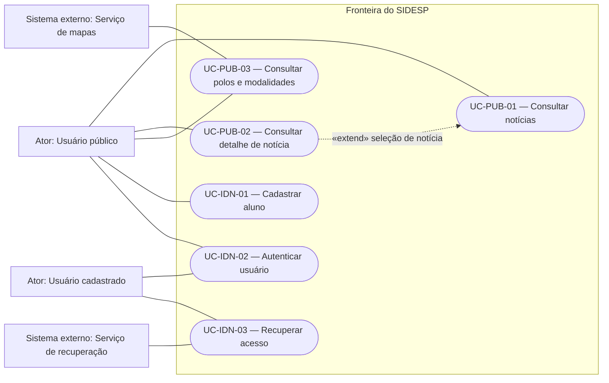
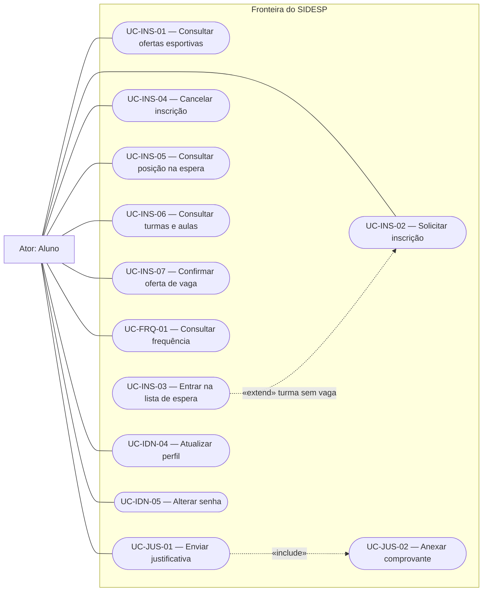
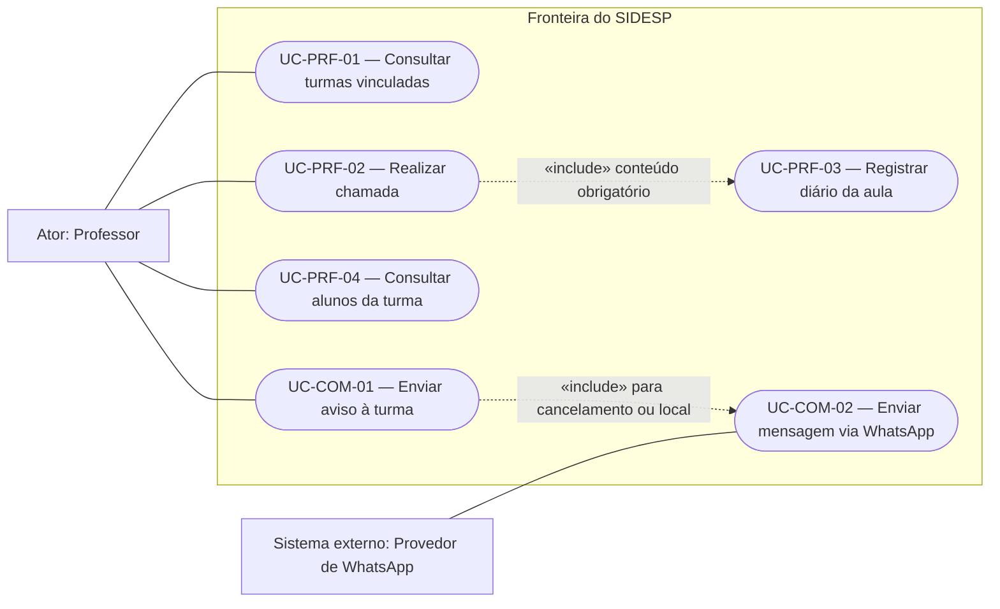
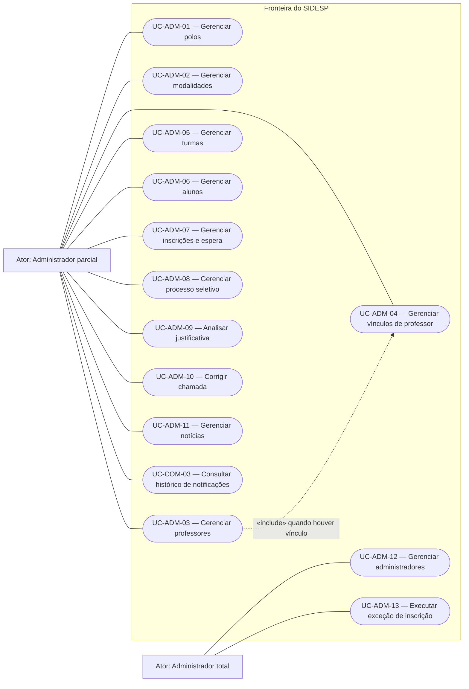
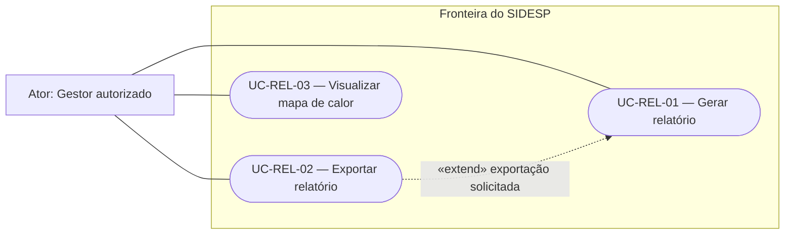
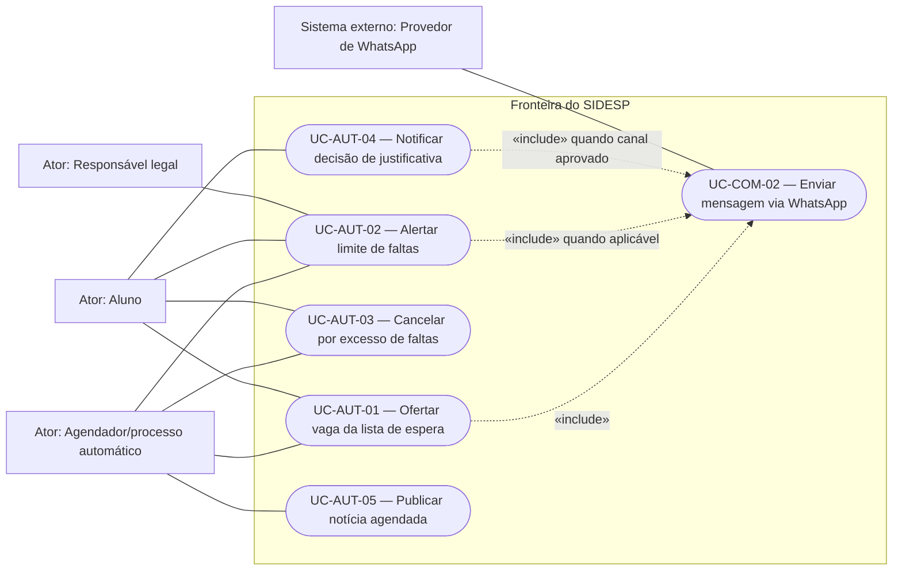

# Casos de Uso — SIDESP

> **SIDESP — Sistema Integrado de Desenvolvimento Esportivo Público**  
> Diagramas e especificações textuais do produto completo, abrangendo frontend, backend e integrações.

## Identificação do documento

| Campo | Valor |
| --- | --- |
| Projeto | SIDESP — Sistema Integrado de Desenvolvimento Esportivo Público |
| Órgão demandante | Secretaria de Esportes de Guaratinguetá |
| Documento relacionado | `LEVANTAMENTO_DE_REQUISITOS.md`, versão `0.1.0` |
| Fonte inicial | Documento de Visão — SIDESP, versão `1.0`, seção 6.3 |
| Responsável de negócio | Secretaria de Esportes de Guaratinguetá — representante nominal pendente |
| Product Owner | Lívia Andrade |
| Responsável técnico | Heitor Leite |
| QA | Micael Phillipini |
| Versão | `0.1.0` |
| Data | 12/08/2026 |
| Classificação | Interna |
| Status | Rascunho — não aprovado |
| Próxima revisão | Após resolução das pendências do levantamento de requisitos ou mudança de ator, permissão ou funcionalidade |

## Aprovações

| Papel | Responsável | Situação | Data |
| --- | --- | --- | --- |
| Responsável de negócio | Pendente | Não aprovado | — |
| Product Owner | Lívia Andrade | Pendente de revisão | — |
| Responsável técnico | Heitor Leite | Pendente de revisão | — |
| QA | Micael Phillipini | Pendente de revisão | — |
| Segurança | Pendente | Não avaliado | — |
| Privacidade/Encarregado | Pendente | Não avaliado | — |

## 1. Objetivo e escopo

Este documento representa quem interage com o SIDESP e quais objetivos cada ator pode alcançar. Ele refina os diagramas presentes no Documento de Visão.

Os diagramas foram divididos por domínio para preservar a legibilidade. Todos representam a mesma fronteira de produto. Autenticação, autorização, auditoria, privacidade e validações críticas serão aplicadas no backend, ainda que a interação comece no frontend.

### 1.1 Convenções

- Os IDs atuais seguem o padrão modular `UC-<DOMÍNIO>-<NÚMERO>`.
- Os IDs `UC01` a `UC42` do Documento de Visão são preservados na matriz de rastreabilidade como IDs legados.
- **Proposto:** comportamento planejado e ainda não implementado no produto alvo.
- **Pendente:** comportamento que depende de decisão externa.
- Associação contínua indica interação entre ator e caso de uso.
- `«include»` indica comportamento obrigatório e reutilizado pelo caso de origem.
- `«extend»` indica comportamento condicional ou opcional que amplia o caso de destino.
- Autenticação é pré-condição dos fluxos protegidos; não é incluída graficamente em todos eles para evitar relações UML artificiais.
- Os códigos Mermaid são a fonte editável dos diagramas e podem ser renderizados pelo GitHub e por editores compatíveis.

## 2. Atores

| Ator | Tipo | Responsabilidade e limite |
| --- | --- | --- |
| Usuário público | Humano | Consultar conteúdo público e iniciar cadastro ou autenticação. Não acessa dados internos. |
| Usuário cadastrado | Humano abstrato | Generaliza comportamentos comuns de aluno, professor e administrador, como autenticação e recuperação de acesso. |
| Aluno | Humano | Gerenciar a própria participação, consultar os próprios dados e enviar justificativa de falta. |
| Responsável legal | Humano | Receber notificações relativas ao aluno menor. Portal ou autenticação própria permanecem pendentes. |
| Professor | Humano | Atuar somente nas turmas às quais estiver vinculado, realizar chamadas, registrar diário e enviar avisos. |
| Administrador parcial | Humano | Executar somente as funções administrativas explicitamente concedidas. A matriz granular está pendente. |
| Administrador total | Humano | Herda permissões administrativas parciais e pode executar funções restritas, como conceder papéis, conforme aprovação. |
| Gestor autorizado | Humano | Consultar relatórios e análises. Pode coincidir com um administrador, mas o acesso deve ser concedido explicitamente. |
| Agendador/processo automático | Sistema auxiliar | Disparar eventos temporais e regras automáticas. Não representa um usuário nem substitui autorização. |
| Provedor de WhatsApp | Sistema externo | Receber solicitações mínimas de mensagem e devolver o resultado da entrega. |
| Serviço de recuperação | Sistema externo | Entregar token de recuperação por canal previamente verificado, se adotado. |
| Serviço de mapas | Sistema externo | Exibir/geocodificar polos ou dados agregados autorizados, se adotado. |

### 2.1 Generalização de atores

- `Aluno`, `Professor`, `Administrador parcial` e `Administrador total` são especializações de `Usuário cadastrado`.
- `Administrador total` herda os casos permitidos ao `Administrador parcial`, mas o inverso é proibido.
- `Gestor autorizado` é um papel de leitura analítica e não recebe automaticamente poderes administrativos.

## 3. Diagramas

### 3.1 Contexto, conteúdo público e identidade

### 3.2 Aluno, inscrições, frequência e perfil

### 3.3 Professor e operação das aulas

### 3.4 Administração e gestão operacional

> As associações do administrador parcial indicam capacidades possíveis, não concessão automática. A matriz de permissões definirá quais delas cada conta parcial poderá exercer.

### 3.5 Relatórios e análises

### 3.6 Automações e integrações

## 4. Catálogo e rastreabilidade com o Documento de Visão

| ID atual | Caso de uso | Ator principal | ID legado | Requisitos relacionados | Status |
| --- | --- | --- | --- | --- | --- |
| `UC-PUB-01` | Consultar notícias | Usuário público | `UC01` | `RF-PUB-001` | Proposto |
| `UC-PUB-02` | Consultar detalhe de notícia | Usuário público | `UC02` | `RF-PUB-002` | Proposto |
| `UC-PUB-03` | Consultar polos e modalidades | Usuário público | `UC03` | `RF-PUB-003` | Proposto |
| `UC-IDN-01` | Cadastrar aluno | Usuário público | `UC04` | `RF-IDN-001` | Proposto |
| `UC-IDN-02` | Autenticar usuário | Usuário cadastrado | `UC05` | `RF-IDN-002` | Proposto |
| `UC-IDN-03` | Recuperar acesso | Usuário cadastrado | `UC06` | `RF-IDN-003` | Proposto |
| `UC-IDN-04` | Atualizar perfil | Aluno | `UC16` | `RF-IDN-004` | Proposto |
| `UC-IDN-05` | Alterar senha | Aluno | `UC17` | `RF-IDN-004` | Proposto |
| `UC-INS-01` | Consultar ofertas esportivas | Aluno | `UC07` | `RF-PUB-003`, `RF-INS-001` | Proposto |
| `UC-INS-02` | Solicitar inscrição | Aluno | `UC08` | `RF-INS-001` | Proposto |
| `UC-INS-03` | Entrar na lista de espera | Aluno | `UC09` | `RF-INS-002` | Proposto |
| `UC-INS-04` | Cancelar inscrição | Aluno | `UC10` | `RF-INS-003` | Proposto |
| `UC-INS-05` | Consultar posição na espera | Aluno | `UC11` | `RF-INS-002`, `RF-INS-006` | Proposto; visibilidade pendente |
| `UC-INS-06` | Consultar turmas e aulas | Aluno | `UC12` | `RF-INS-005` | Proposto |
| `UC-INS-07` | Confirmar oferta de vaga | Aluno | Novo | `RF-INS-004` | Proposto; prazo pendente |
| `UC-FRQ-01` | Consultar frequência | Aluno | `UC13` | `RF-FRQ-001` | Proposto |
| `UC-JUS-01` | Enviar justificativa | Aluno | `UC14` | `RF-JUS-001` | Proposto; elegibilidade pendente |
| `UC-JUS-02` | Anexar comprovante | Aluno | `UC15` | `RF-JUS-001` | Proposto; formatos e retenção pendentes |
| `UC-PRF-01` | Consultar turmas vinculadas | Professor | `UC18` | `RF-FRQ-002` | Proposto |
| `UC-PRF-02` | Realizar chamada | Professor | `UC19` | `RF-FRQ-003` | Proposto |
| `UC-PRF-03` | Registrar diário da aula | Professor | `UC20` | `RF-FRQ-004` | Proposto |
| `UC-PRF-04` | Consultar alunos da turma | Professor | `UC21` | `RF-FRQ-005` | Proposto |
| `UC-COM-01` | Enviar aviso à turma | Professor | `UC22` | `RF-COM-001` | Proposto |
| `UC-COM-02` | Enviar mensagem via WhatsApp | SIDESP/Provedor | `UC23` | `RF-COM-001`, `RF-COM-004` | Proposto; fornecedor pendente |
| `UC-ADM-01` | Gerenciar polos | Administrador autorizado | `UC24` | `RF-ADM-001` | Proposto |
| `UC-ADM-02` | Gerenciar modalidades | Administrador autorizado | `UC25` | `RF-ADM-002` | Proposto |
| `UC-ADM-03` | Gerenciar professores | Administrador autorizado | `UC26` | `RF-ADM-003` | Proposto |
| `UC-ADM-04` | Gerenciar vínculos de professor | Administrador autorizado | `UC27` | `RF-ADM-003` | Proposto; vigência pendente |
| `UC-ADM-05` | Gerenciar turmas | Administrador autorizado | `UC28` | `RF-ADM-004` | Proposto |
| `UC-ADM-06` | Gerenciar alunos | Administrador autorizado | `UC30` | `RF-ADM-005` | Proposto |
| `UC-ADM-07` | Gerenciar inscrições e lista de espera | Administrador autorizado | `UC31` | `RF-INS-006` | Proposto; limites da intervenção pendentes |
| `UC-ADM-08` | Gerenciar processo seletivo | Administrador autorizado | `UC32` | `RF-INS-007` | Proposto; estados e critérios pendentes |
| `UC-ADM-09` | Analisar justificativa | Administrador autorizado | `UC33` | `RF-JUS-002` | Proposto |
| `UC-ADM-10` | Corrigir chamada | Administrador autorizado | Novo | `RF-FRQ-006` | Proposto |
| `UC-ADM-11` | Gerenciar notícias | Administrador autorizado | `UC37` | `RF-ADM-006` | Proposto |
| `UC-ADM-12` | Gerenciar administradores | Administrador total | `UC38` | `RF-ADM-007` | Proposto; matriz pendente |
| `UC-ADM-13` | Executar exceção de inscrição | Administrador total autorizado | Novo | `RF-INS-008` | Proposto; alcance pendente |
| `UC-COM-03` | Consultar histórico de notificações | Administrador autorizado | `UC39` | `RF-COM-004` | Proposto; retenção pendente |
| `UC-REL-01` | Gerar relatório | Gestor autorizado | `UC34` | `RF-REL-001` | Proposto; fórmulas pendentes |
| `UC-REL-02` | Exportar relatório | Gestor autorizado | `UC35` | `RF-REL-002` | Proposto; limites pendentes |
| `UC-REL-03` | Visualizar mapa de calor | Gestor autorizado | `UC36` | `RF-REL-003` | Proposto; limiar pendente |
| `UC-AUT-01` | Ofertar vaga da lista de espera | Processo automático | `UC29` | `RF-INS-004` | Proposto; prazo pendente |
| `UC-AUT-02` | Alertar limite de faltas | Processo automático | `UC41`, `UC42` | `RF-COM-002` | Proposto; regra de contagem pendente |
| `UC-AUT-03` | Cancelar por excesso de faltas | Processo automático | `UC40` | `RF-COM-003` | Proposto; ordem dos eventos pendente |
| `UC-AUT-04` | Notificar decisão de justificativa | Processo automático | Novo | `RF-JUS-003` | Proposto |
| `UC-AUT-05` | Publicar notícia agendada | Processo automático | Parte de `UC37` | `RF-ADM-006` | Proposto |

### 4.1 Ajustes em relação ao diagrama original

- `UC01 — Visualizar Tela Inicial` foi refinado como `UC-PUB-01 — Consultar notícias`, pois uma tela é meio de interação, não objetivo de negócio.
- O login foi mantido como caso próprio, mas passou a ser pré-condição dos fluxos protegidos; relações `include` repetidas foram removidas.
- `UC27 — Vincular Professor a Polo/Modalidade` foi refinado para vínculo com turma, coerente com `RN013`, `SE021` e `RF-ADM-003`. Vínculo adicional com polo/modalidade depende de validação.
- `UC29 — Puxar Alunos da Lista de Espera` foi refinado como oferta automática da vaga, preservando ordem, prazo e confirmação.
- Os atores genéricos `Sistema` e `API` foram substituídos por responsabilidades concretas: processo automático, provedor de WhatsApp, serviço de recuperação e serviço de mapas.
- `Responsável legal` foi incluído como ator porque recebe notificações relativas ao menor.
- Foram acrescentados casos necessários ao levantamento: confirmar oferta de vaga, corrigir chamada, executar exceção administrativa, notificar decisão de justificativa e publicar notícia agendada.

## 5. Regras comuns às especificações

- Casos protegidos exigem conta ativa, sessão válida e autorização verificada pelo backend.
- A interface não concede permissão; ocultar botão ou rota não substitui autorização por perfil e objeto.
- Requisições repetidas não podem duplicar inscrições, chamadas, decisões, ofertas ou notificações.
- Erros apresentados ao ator devem ser úteis e seguros, sem revelar dados de terceiros, credenciais ou detalhes internos.
- Eventos críticos devem registrar ator/processo, ação, alvo, instante, resultado e identificador de correlação, respeitando minimização e retenção pendentes.
- Os dados mencionados em cada caso são categorias iniciais; campos definitivos dependem do inventário e da avaliação de privacidade.
- Todos os casos permanecem no status `Proposto` até existirem implementação, testes e aceite.

## 6. Especificações textuais — público e identidade

### UC-PUB-01 — Consultar notícias

| Campo | Especificação |
| --- | --- |
| Ator principal | Usuário público |
| Objetivo | Conhecer as notícias já publicadas pela Secretaria. |
| Pré-condições | SIDESP disponível; nenhuma autenticação exigida. |
| Gatilho | O ator acessa a área pública de notícias. |
| Fluxo principal | 1. O sistema identifica o instante atual no fuso aprovado. 2. Recupera somente notícias publicadas e ativas. 3. Ordena conforme regra aprovada. 4. Exibe título, resumo e data. |
| Alternativas e erros | Sem notícias: exibir estado vazio. Falha: exibir indisponibilidade sem conteúdo futuro ou interno. Ordenação em empate permanece pendente. |
| Pós-condições | Nenhum dado de negócio é alterado. |
| Permissão, dados e auditoria | Conteúdo público; telemetria não deve identificar usuário sem necessidade. |
| Requisitos relacionados | `RF-PUB-001`, `RN-021`; legado `UC01`. |
| Critério de aceite | Notícia futura ou inativa nunca aparece; notícias elegíveis aparecem na ordem definida. |

### UC-PUB-02 — Consultar detalhe de notícia

| Campo | Especificação |
| --- | --- |
| Ator principal | Usuário público |
| Objetivo | Ler o conteúdo completo de uma notícia publicada. |
| Pré-condições | Notícia existente, ativa e com publicação efetivada. |
| Gatilho | O ator seleciona uma notícia na listagem ou abre seu endereço público. |
| Fluxo principal | 1. O sistema valida a condição pública da notícia. 2. Recupera título, conteúdo e data autorizados. 3. Exibe o conteúdo completo. |
| Alternativas e erros | Notícia inexistente, futura ou inativa: não expor dados e apresentar recurso indisponível. |
| Pós-condições | Nenhum dado de negócio é alterado. |
| Permissão, dados e auditoria | Somente conteúdo público; autoria interna só aparece se aprovada. |
| Requisitos relacionados | `RF-PUB-002`, `RN-021`; legado `UC02`. |
| Critério de aceite | Acesso direto não contorna a data de publicação nem a inativação. |

### UC-PUB-03 — Consultar polos e modalidades

| Campo | Especificação |
| --- | --- |
| Ator principal | Usuário público |
| Atores secundários | Serviço de mapas, se adotado. |
| Objetivo | Localizar polos e conhecer modalidades esportivas disponíveis. |
| Pré-condições | Polos/modalidades com dados públicos cadastrados. |
| Gatilho | O ator abre a consulta e opcionalmente informa filtros. |
| Fluxo principal | 1. O sistema valida os filtros. 2. Consulta itens ativos. 3. Exibe lista e, se disponível, mapa com informações públicas. |
| Alternativas e erros | Sem resultados: lista vazia. Provedor de mapas indisponível: manter a consulta textual. Filtro inválido: solicitar correção. |
| Pós-condições | Nenhum cadastro é alterado. |
| Permissão, dados e auditoria | Endereço público, modalidade e horários aprovados; dados internos e de alunos são proibidos. |
| Requisitos relacionados | `RF-PUB-003`; legados `UC03` e parcialmente `UC07`. |
| Critério de aceite | A consulta retorna somente registros ativos e permanece utilizável sem o mapa externo. |

### UC-IDN-01 — Cadastrar aluno

| Campo | Especificação |
| --- | --- |
| Ator principal | Usuário público |
| Ator secundário | Responsável legal, quando o futuro aluno for menor, conforme fluxo pendente. |
| Objetivo | Criar uma conta de aluno válida e única. |
| Pré-condições | Pessoa ainda não cadastrada com o mesmo CPF; dados obrigatórios e termos aprovados. |
| Gatilho | O ator solicita novo cadastro. |
| Fluxo principal | 1. O sistema apresenta campos aprovados. 2. O ator informa os dados. 3. O sistema valida formato, consistência, idade e unicidade normalizada do CPF. 4. Quando aplicável, registra vínculo com responsável. 5. Cria a conta no estado definido e confirma sem expor dados desnecessários. |
| Alternativas e erros | CPF duplicado, dado inválido ou responsável obrigatório ausente: rejeitar com mensagem segura. Requisição repetida: não criar duplicidade. |
| Pós-condições | Conta de aluno criada; ativação/verificação de contato depende de política pendente. |
| Permissão, dados e auditoria | Nome, CPF, contato, nascimento e dados aprovados; registrar criação sem senha em claro. |
| Requisitos relacionados | `RF-IDN-001`, `RN-016`, `SE001`; legado `UC04`. |
| Critério de aceite | Duas requisições concorrentes com o mesmo CPF resultam em no máximo uma conta. |

### UC-IDN-02 — Autenticar usuário

| Campo | Especificação |
| --- | --- |
| Ator principal | Usuário cadastrado |
| Objetivo | Iniciar sessão com o perfil e as permissões efetivamente concedidas. |
| Pré-condições | Conta existente e ativa; credencial configurada. |
| Gatilho | O ator informa CPF ou e-mail e senha. |
| Fluxo principal | 1. O sistema normaliza o identificador. 2. Valida a senha sem expor o cadastro. 3. Avalia bloqueios e fatores adicionais aprovados. 4. Cria sessão com expiração e privilégios mínimos. 5. Registra o resultado e direciona ao contexto permitido. |
| Alternativas e erros | Credencial inválida, conta inativa ou limite excedido: resposta genérica e nenhuma sessão. MFA administrativo permanece pendente. |
| Pós-condições | Sessão válida criada ou tentativa negada e registrada. |
| Permissão, dados e auditoria | Identificador, resultado, instante e origem técnica necessária; nunca senha, token ou motivo que permita enumeração. |
| Requisitos relacionados | `RF-IDN-002`, `RN-017`, `RNF-SEG-001/003/004/005`; legado `UC05`. |
| Critério de aceite | Credencial inválida não revela existência da conta; perfil não acessa função além da autorização do backend. |

### UC-IDN-03 — Recuperar acesso

| Campo | Especificação |
| --- | --- |
| Ator principal | Usuário cadastrado |
| Ator secundário | Serviço de recuperação. |
| Objetivo | Definir nova senha após comprovar controle de canal previamente verificado. |
| Pré-condições | Conta elegível e canal de recuperação validado anteriormente. |
| Gatilho | O ator solicita recuperação com CPF ou e-mail. |
| Fluxo principal | 1. O sistema aceita o identificador e devolve resposta neutra. 2. Se elegível, gera token aleatório, de uso único e curta duração. 3. Envia-o pelo canal verificado. 4. O ator apresenta token válido e nova senha. 5. O sistema altera a credencial, invalida o token e aplica revogação de sessões conforme política. |
| Alternativas e erros | Conta inexistente, token inválido, expirado ou reutilizado: não alterar credencial e manter resposta segura. CPF isolado nunca comprova identidade. |
| Pós-condições | Senha alterada e token invalidado, ou nenhuma mudança. |
| Permissão, dados e auditoria | Registrar solicitação e resultado sem token, senha ou identificação excessiva. |
| Requisitos relacionados | `RF-IDN-003`, `SE003`, `RNF-SEG-003/004/005`; legado `UC06`. |
| Critério de aceite | Token expirado/reutilizado falha; respostas iniciais não permitem distinguir conta existente de inexistente. |

### UC-IDN-04 — Atualizar perfil

| Campo | Especificação |
| --- | --- |
| Ator principal | Aluno |
| Objetivo | Manter atualizados os próprios campos editáveis. |
| Pré-condições | Sessão válida e perfil pertencente ao ator. |
| Gatilho | O aluno abre o perfil, altera campos permitidos e confirma. |
| Fluxo principal | 1. O sistema apresenta somente campos editáveis. 2. Valida os novos valores. 3. Atualiza os dados autorizados. 4. Registra campos alterados sem replicar conteúdo sensível no log. |
| Alternativas e erros | Tentativa de alterar CPF, papel ou vínculo: rejeitar. Contato duplicado/inválido: solicitar correção. |
| Pós-condições | Perfil atualizado ou preservado integralmente em caso de erro. |
| Permissão, dados e auditoria | Próprio perfil; lista de campos e reverificação de contato permanecem pendentes. |
| Requisitos relacionados | `RF-IDN-004`, `RN-017`, `SE013`; legado `UC16`. |
| Critério de aceite | Alterações fora da lista permitida falham mesmo por chamada direta à API. |

### UC-IDN-05 — Alterar senha

| Campo | Especificação |
| --- | --- |
| Ator principal | Aluno; aplicável aos demais usuários conforme política comum. |
| Objetivo | Substituir a senha conhecida por uma nova senha válida. |
| Pré-condições | Sessão válida e verificação exigida pela política. |
| Gatilho | O ator informa a senha atual e uma nova senha. |
| Fluxo principal | 1. O sistema valida senha atual e requisitos da nova senha. 2. Armazena apenas novo hash forte. 3. Revoga/renova sessões conforme política. 4. Confirma a alteração. |
| Alternativas e erros | Senha atual incorreta ou nova senha inválida: nenhuma alteração. Tentativas excessivas: aplicar limitação. |
| Pós-condições | Credencial atualizada de forma atômica ou inalterada. |
| Permissão, dados e auditoria | Somente o próprio usuário; registrar evento sem conteúdo de senha. |
| Requisitos relacionados | `RF-IDN-004`, `RNF-SEG-003/004/005`; legado `UC17`. |
| Critério de aceite | Senha antiga deixa de autenticar após conclusão; nenhum log ou resposta contém senha. |

## 7. Especificações textuais — aluno e inscrições

### UC-INS-01 — Consultar ofertas esportivas

| Campo | Especificação |
| --- | --- |
| Ator principal | Aluno |
| Objetivo | Identificar modalidades e turmas adequadas para possível inscrição. |
| Pré-condições | Sessão válida; ofertas ativas cadastradas. |
| Gatilho | O aluno abre a área de modalidades/turmas. |
| Fluxo principal | 1. O sistema lista ofertas ativas. 2. Aplica filtros solicitados. 3. Exibe polo, modalidade, faixa etária, horário, disponibilidade e processo seletivo conforme dados públicos. |
| Alternativas e erros | Nenhuma oferta compatível: estado vazio. Informação indisponível: não inferir vaga. |
| Pós-condições | Nenhum vínculo é criado. |
| Permissão, dados e auditoria | Dados da oferta; nenhum dado de outro aluno ou fila nominal. |
| Requisitos relacionados | `RF-PUB-003`, `RF-INS-001`, `RN-008/012`; legado `UC07`. |
| Critério de aceite | Itens inativos não aparecem; disponibilidade exibida corresponde ao estado transacional atual ou informa atualização necessária. |

### UC-INS-02 — Solicitar inscrição

| Campo | Especificação |
| --- | --- |
| Ator principal | Aluno |
| Objetivo | Obter inscrição confirmada em turma elegível ou encaminhamento correto à espera/seleção. |
| Pré-condições | Conta ativa; oferta ativa; aluno não possui vínculo duplicado. |
| Gatilho | O aluno confirma interesse em uma turma. |
| Fluxo principal | 1. O sistema valida idade na data aprovada, limite de modalidades, conflito de horário quando definido, situação da turma e processo seletivo. 2. Havendo vaga direta, cria inscrição confirmada de forma atômica. 3. Exibe estado final. |
| Alternativas e erros | Sem vaga: executar `UC-INS-03`. Processo seletivo: criar candidatura para `UC-ADM-08`. Inelegibilidade: rejeitar com motivo seguro. Repetição: retornar o mesmo resultado sem duplicar. |
| Pós-condições | Inscrição confirmada, posição de espera/candidatura criada, ou nenhuma alteração. |
| Permissão, dados e auditoria | Próprio aluno e turma solicitada; registrar decisão e regras aplicadas. |
| Requisitos relacionados | `RF-INS-001`, `RN-001/008/012/018`; legado `UC08`. |
| Critério de aceite | Concorrência pela última vaga não excede a capacidade; terceira participação simultânea é rejeitada salvo exceção aprovada. |

### UC-INS-03 — Entrar na lista de espera

| Campo | Especificação |
| --- | --- |
| Ator principal | Aluno, por meio da solicitação de inscrição. |
| Objetivo | Reservar posição rastreável quando uma turma elegível não possui vaga. |
| Pré-condições | `UC-INS-02` validou elegibilidade e detectou capacidade esgotada. |
| Gatilho | Ausência de vaga durante a inscrição. |
| Fluxo principal | 1. O sistema impede duplicidade na mesma fila. 2. Atribui posição por ordem transacional de chegada. 3. Registra horário e estado. 4. Informa a inclusão conforme política de visibilidade. |
| Alternativas e erros | Vaga surgir antes da confirmação da fila: resolver atomicamente conforme ordem. Falha: não apresentar posição não persistida. |
| Pós-condições | Entrada única e ordenada criada. |
| Permissão, dados e auditoria | Aluno consulta apenas a própria posição; lista nominal fica restrita. |
| Requisitos relacionados | `RF-INS-002`, `RN-009`; legado `UC09`. |
| Critério de aceite | Solicitações concorrentes produzem ordem única; o mesmo aluno não ocupa duas posições na turma. |

### UC-INS-04 — Cancelar inscrição

| Campo | Especificação |
| --- | --- |
| Ator principal | Aluno |
| Objetivo | Encerrar uma inscrição própria e liberar a vaga de maneira rastreável. |
| Pré-condições | Inscrição pertencente ao aluno e em estado cancelável. |
| Gatilho | O aluno solicita cancelamento e confirma. |
| Fluxo principal | 1. O sistema valida propriedade, estado e eventual prazo. 2. Cancela logicamente a inscrição. 3. Registra motivo/origem. 4. Libera a vaga uma única vez e aciona `UC-AUT-01` quando aplicável. |
| Alternativas e erros | Inscrição alheia, já encerrada ou não cancelável: negar sem alterar dados. Repetição: manter resultado anterior. |
| Pós-condições | Inscrição cancelada com histórico e vaga disponibilizada. |
| Permissão, dados e auditoria | Somente inscrição própria; registrar aluno, turma, instante e resultado. |
| Requisitos relacionados | `RF-INS-003`, `RN-010`; legado `UC10`. |
| Critério de aceite | Cancelamento repetido não libera duas vagas nem apaga histórico. |

### UC-INS-05 — Consultar posição na espera

| Campo | Especificação |
| --- | --- |
| Ator principal | Aluno |
| Objetivo | Acompanhar a própria situação na fila de uma turma. |
| Pré-condições | Entrada de espera pertencente ao aluno. |
| Gatilho | O aluno consulta suas inscrições/esperas. |
| Fluxo principal | 1. O sistema localiza a entrada do aluno. 2. Calcula/exibe estado e posição conforme política aprovada. 3. Informa oferta ativa e prazo, se houver. |
| Alternativas e erros | Entrada encerrada: exibir estado histórico permitido. Fila alheia: negar. Política pode optar por não mostrar número exato. |
| Pós-condições | Nenhuma posição é alterada. |
| Permissão, dados e auditoria | Somente a própria entrada; não expor nomes ou posições identificáveis de terceiros. |
| Requisitos relacionados | `RF-INS-002/006`, `RN-009/011`; legado `UC11`. |
| Critério de aceite | Alterar identificador da requisição não permite consultar fila de outro aluno. |

### UC-INS-06 — Consultar turmas e aulas

| Campo | Especificação |
| --- | --- |
| Ator principal | Aluno |
| Objetivo | Consultar turmas em que participa, horários, aulas e dados permitidos do professor. |
| Pré-condições | Sessão válida. |
| Gatilho | O aluno abre sua agenda/turmas. |
| Fluxo principal | 1. O sistema recupera somente vínculos do aluno. 2. Exibe turma, polo, modalidade, horários, aulas e informações permitidas do professor. 3. Reflete mudanças aprovadas. |
| Alternativas e erros | Sem turmas: estado vazio. Turma inativa com histórico: exibir conforme regra sem permitir nova ação. |
| Pós-condições | Nenhum dado é alterado. |
| Permissão, dados e auditoria | Próprios vínculos e dados profissionais mínimos do professor. |
| Requisitos relacionados | `RF-INS-005`, `RN-017`, `SE012`; legado `UC12`. |
| Critério de aceite | O aluno não consegue consultar turmas de terceiros por alteração de identificador. |

### UC-INS-07 — Confirmar oferta de vaga

| Campo | Especificação |
| --- | --- |
| Ator principal | Aluno |
| Objetivo | Aceitar ou recusar a vaga temporariamente oferecida pela fila. |
| Pré-condições | Oferta ativa, pertencente ao aluno, ainda dentro do prazo e com vaga reservada. |
| Gatilho | O aluno abre a oferta e escolhe confirmar ou recusar. |
| Fluxo principal | 1. O sistema valida propriedade, prazo e estado. 2. Ao confirmar, converte a oferta em inscrição e encerra a entrada da fila. 3. Ao recusar, libera a reserva e aciona o próximo elegível. 4. Registra o resultado. |
| Alternativas e erros | Oferta expirada, já consumida ou concorrência no limite: negar com estado atual; nunca confirmar duas pessoas para a mesma reserva. |
| Pós-condições | Inscrição confirmada ou vaga encaminhada ao próximo. |
| Permissão, dados e auditoria | Somente destinatário da oferta; registrar decisão e instante. |
| Requisitos relacionados | `RF-INS-004`, `RN-010/011`; caso novo. |
| Critério de aceite | Confirmação dentro do prazo efetiva uma única inscrição; expiração/recusa avança a fila sem duplicidade. |

### UC-FRQ-01 — Consultar frequência

| Campo | Especificação |
| --- | --- |
| Ator principal | Aluno |
| Objetivo | Acompanhar presenças, faltas e histórico de aulas próprios. |
| Pré-condições | Sessão válida; chamadas existentes ou período consultável. |
| Gatilho | O aluno abre sua frequência. |
| Fluxo principal | 1. O sistema aplica o escopo do próprio aluno e filtros de período/turma. 2. Recupera chamadas válidas e correções. 3. Exibe presença, falta, conteúdo permitido e totais segundo fórmula aprovada. |
| Alternativas e erros | Sem aulas: estado vazio. Chamada corrigida: exibir estado vigente e histórico somente se permitido. |
| Pós-condições | Nenhum registro de chamada é alterado. |
| Permissão, dados e auditoria | Somente frequência própria. |
| Requisitos relacionados | `RF-FRQ-001`, `RN-017`; legado `UC13`. |
| Critério de aceite | Resultado reflete a correção administrativa válida e nunca mistura dados de outro aluno. |

### UC-JUS-01 — Enviar justificativa

| Campo | Especificação |
| --- | --- |
| Ator principal | Aluno |
| Caso incluído | `UC-JUS-02 — Anexar comprovante`. |
| Objetivo | Solicitar análise administrativa de uma falta elegível. |
| Pré-condições | Falta pertencente ao aluno, elegível e dentro do prazo; regra de elegibilidade ainda pendente. |
| Gatilho | O aluno seleciona uma falta e solicita justificativa. |
| Fluxo principal | 1. O sistema valida vínculo, elegibilidade, prazo e ausência de solicitação incompatível. 2. Coleta informações mínimas. 3. Executa `UC-JUS-02`. 4. Registra solicitação em análise. 5. Confirma o protocolo. |
| Alternativas e erros | Falta inelegível, prazo expirado, duplicidade ou arquivo recusado: não enviar e explicar o motivo permitido. |
| Pós-condições | Justificativa pendente de análise e comprovante protegido. |
| Permissão, dados e auditoria | Própria falta; registrar protocolo, estado e instante sem copiar conteúdo sensível para logs. |
| Requisitos relacionados | `RF-JUS-001`, `RN-003/004`; legado `UC14`. |
| Critério de aceite | Solicitação sem comprovante válido não alcança o estado “em análise”. |

### UC-JUS-02 — Anexar comprovante

| Campo | Especificação |
| --- | --- |
| Ator principal | Aluno, como parte de `UC-JUS-01`. |
| Objetivo | Associar um documento comprobatório válido à justificativa. |
| Pré-condições | Fluxo de justificativa ativo; regras de arquivo aprovadas. |
| Gatilho | O aluno seleciona o arquivo. |
| Fluxo principal | 1. O sistema valida quantidade, tamanho, extensão, tipo real, nome e conteúdo. 2. Gera identificador seguro. 3. Armazena fora da área pública. 4. Associa o arquivo à justificativa sem expor caminho interno. |
| Alternativas e erros | Arquivo excessivo, inconsistente, malicioso ou corrompido: rejeitar e descartar temporários. |
| Pós-condições | Arquivo protegido associado ou nenhum arquivo persistido. |
| Permissão, dados e auditoria | Aluno próprio e administrador aprovador; formatos, varredura, criptografia e retenção pendentes. |
| Requisitos relacionados | `RF-JUS-001`, `RN-004`, `RNF-SEG-006`; legado `UC15`. |
| Critério de aceite | O arquivo não é publicamente endereçável e só pode ser baixado após autorização por objeto. |

## 8. Especificações textuais — professor e comunicação

### UC-PRF-01 — Consultar turmas vinculadas

| Campo | Especificação |
| --- | --- |
| Ator principal | Professor |
| Objetivo | Visualizar somente as turmas nas quais pode atuar. |
| Pré-condições | Professor ativo, autenticado e com vínculo vigente. |
| Gatilho | O professor acessa suas turmas. |
| Fluxo principal | 1. O backend obtém a identidade. 2. Filtra vínculos vigentes. 3. Exibe turma, polo, modalidade, agenda e ações permitidas. |
| Alternativas e erros | Sem vínculos: estado vazio. Vínculo expirado/inativo: não permitir ação nova; histórico conforme política. |
| Pós-condições | Nenhum vínculo é alterado. |
| Permissão, dados e auditoria | Somente turmas vinculadas; consulta direta de turma alheia é negada. |
| Requisitos relacionados | `RF-FRQ-002`, `RN-013`; legado `UC18`. |
| Critério de aceite | Alterar o ID da turma não concede acesso sem vínculo vigente. |

### UC-PRF-02 — Realizar chamada

| Campo | Especificação |
| --- | --- |
| Ator principal | Professor |
| Caso incluído | `UC-PRF-03 — Registrar diário da aula`. |
| Objetivo | Registrar presença ou falta dos alunos elegíveis em uma aula. |
| Pré-condições | Professor vinculado; aula válida e chamada ainda não encerrada; estratégia para conexão instável pendente. |
| Gatilho | O professor abre a aula, marca os alunos e solicita salvamento. |
| Fluxo principal | 1. O sistema valida vínculo, aula e lista de alunos. 2. O professor define um estado válido para cada aluno. 3. Executa `UC-PRF-03`. 4. O sistema salva chamada e diário atomicamente. 5. Confirma e inicia regras de faltas aplicáveis. |
| Alternativas e erros | Vínculo ausente, aula inválida, campo obrigatório vazio ou chamada já salva: não alterar. Requisição repetida: retornar resultado persistido sem duplicar. |
| Pós-condições | Chamada salva e bloqueada para alteração pelo professor. |
| Permissão, dados e auditoria | Professor vinculado; registrar turma, aula, autor e resultado. |
| Requisitos relacionados | `RF-FRQ-003`, `RN-013/019`; legado `UC19`. |
| Critério de aceite | Salvamento é atômico; professor não altera nem exclui chamada concluída. |

### UC-PRF-03 — Registrar diário da aula

| Campo | Especificação |
| --- | --- |
| Ator principal | Professor, como parte de `UC-PRF-02`. |
| Objetivo | Registrar o conteúdo ministrado e observações permitidas da aula. |
| Pré-condições | Aula e chamada válidas; professor vinculado. |
| Gatilho | O professor preenche o diário antes de salvar a chamada. |
| Fluxo principal | 1. O sistema exige conteúdo não vazio. 2. Valida tamanho e conteúdo. 3. Associa diário à aula e à chamada na mesma operação. |
| Alternativas e erros | Conteúdo vazio ou observação proibida/excessiva: bloquear salvamento e preservar rascunho somente se houver estratégia aprovada. |
| Pós-condições | Diário associado à aula, sem registro órfão. |
| Permissão, dados e auditoria | Professor vinculado; observações não devem virar campo livre para dado de saúde desnecessário. |
| Requisitos relacionados | `RF-FRQ-004`, `RN-014`; legado `UC20`. |
| Critério de aceite | Chamada não pode ser concluída sem conteúdo válido. |

### UC-PRF-04 — Consultar alunos da turma

| Campo | Especificação |
| --- | --- |
| Ator principal | Professor |
| Objetivo | Consultar dados mínimos e frequência necessários à condução de suas turmas. |
| Pré-condições | Professor vinculado à turma e aluno participante no período aplicável. |
| Gatilho | O professor seleciona a turma ou um aluno da turma. |
| Fluxo principal | 1. O sistema valida o vínculo por turma e vigência. 2. Recupera somente alunos e campos permitidos. 3. Exibe frequência e informações operacionais aprovadas. |
| Alternativas e erros | Aluno/turma fora do vínculo: negar. Dados de saúde: não exibir antes de definição de finalidade e permissão específica. |
| Pós-condições | Nenhum dado do aluno é alterado. |
| Permissão, dados e auditoria | Campos mínimos; acessos a dado sensível, se aprovados, devem ser auditados. |
| Requisitos relacionados | `RF-FRQ-005`, `RN-013/017`; legado `UC21`. |
| Critério de aceite | Professor não acessa aluno de turma alheia nem campo além de sua permissão. |

### UC-COM-01 — Enviar aviso à turma

| Campo | Especificação |
| --- | --- |
| Ator principal | Professor |
| Caso incluído | `UC-COM-02` para cancelamento ou mudança de local; demais tipos dependem da regra de canal. |
| Objetivo | Comunicar um aviso operacional aos alunos de uma turma vinculada. |
| Pré-condições | Professor vinculado; tipo e conteúdo de aviso permitidos; destinatários ativos. |
| Gatilho | O professor seleciona turma, tipo de aviso, conteúdo/modelo e confirma. |
| Fluxo principal | 1. O backend valida vínculo e tipo. 2. Calcula destinatários sem aceitar lista arbitrária do cliente. 3. Registra aviso interno. 4. Quando obrigatório, executa `UC-COM-02`. 5. Exibe o resultado agregado. |
| Alternativas e erros | Turma alheia ou mensagem inválida: rejeitar. Falha externa: manter aviso interno e registrar falha/fallback conforme política. |
| Pós-condições | Aviso criado e tentativas de entrega registradas. |
| Permissão, dados e auditoria | Professor vinculado; conteúdo, turma, autor e resultados, sem dados excessivos. |
| Requisitos relacionados | `RF-COM-001`, `RN-020`; legado `UC22`. |
| Critério de aceite | Destinatários são determinados pelo servidor e todas as tentativas possuem resultado rastreável. |

### UC-COM-02 — Enviar mensagem via WhatsApp

| Campo | Especificação |
| --- | --- |
| Ator principal | SIDESP, acionado por caso de negócio. |
| Ator secundário | Provedor de WhatsApp. |
| Objetivo | Entregar mensagem aprovada pelo canal externo e registrar o resultado. |
| Pré-condições | Fornecedor, contrato, template, base/consentimento, destinatário e segredo de integração aprovados. |
| Gatilho | Aviso, oferta, falta ou decisão gera comunicação pelo canal. |
| Fluxo principal | 1. O sistema monta template com dados mínimos. 2. Envia de forma autenticada e idempotente. 3. Recebe identificador do provedor. 4. Registra tentativa e estado. 5. Processa retorno de entrega quando disponível. |
| Alternativas e erros | Timeout/erro: registrar falha, repetir dentro do limite e aplicar fallback. Número inválido/opt-out: não insistir fora da política. |
| Pós-condições | Tentativa rastreável, entregue ou falha; a operação principal não é corrompida. |
| Permissão, dados e auditoria | Telefone, template e parâmetros mínimos; nunca segredo, comprovante ou dado sensível desnecessário em log. |
| Requisitos relacionados | `RF-COM-001/002/004`, `RN-020`; legado `UC23`. |
| Critério de aceite | Repetição não envia mensagens ilimitadas; falha externa permanece visível sem duplicar o evento de negócio. |

### UC-COM-03 — Consultar histórico de notificações

| Campo | Especificação |
| --- | --- |
| Ator principal | Administrador autorizado |
| Objetivo | Diagnosticar tentativas e resultados de notificações sem acessar conteúdo desnecessário. |
| Pré-condições | Permissão específica e registros dentro da retenção. |
| Gatilho | O administrador informa filtros permitidos. |
| Fluxo principal | 1. O sistema valida permissão e filtros. 2. Retorna evento, destinatário referenciado/mascarado, canal, instante, template, resultado e identificador técnico permitido. 3. Registra acesso quando necessário. |
| Alternativas e erros | Filtro excessivo, registro expirado ou acesso negado: não retornar dados. |
| Pós-condições | Nenhum estado de entrega é alterado. |
| Permissão, dados e auditoria | Acesso restrito; conteúdo integral e telefone devem ser minimizados/mascarados conforme função. |
| Requisitos relacionados | `RF-COM-004`, `SE035`; legado `UC39`. |
| Critério de aceite | Histórico não exibe segredo, token ou conteúdo pessoal além da necessidade de suporte. |

## 9. Especificações textuais — administração

### UC-ADM-01 — Gerenciar polos

| Campo | Especificação |
| --- | --- |
| Ator principal | Administrador autorizado |
| Objetivo | Cadastrar, consultar, alterar e inativar polos. |
| Pré-condições | Permissão administrativa correspondente. |
| Gatilho | O administrador escolhe uma operação sobre polo. |
| Fluxo principal | 1. O sistema valida campos e unicidade. 2. Cria ou atualiza o polo. 3. Na desativação, inativa logicamente. 4. Registra autor e alteração. |
| Alternativas e erros | Campo inválido/duplicado: rejeitar. Polo referenciado: nunca excluir fisicamente; bloquear novos usos após inativação. |
| Pós-condições | Polo consistente e histórico preservado. |
| Permissão, dados e auditoria | Endereço e metadados públicos/internos separados; auditar escrita. |
| Requisitos relacionados | `RF-ADM-001`, `RN-015`; legado `UC24`. |
| Critério de aceite | Inativação preserva turmas históricas e impede novo vínculo quando aplicável. |

### UC-ADM-02 — Gerenciar modalidades

| Campo | Especificação |
| --- | --- |
| Ator principal | Administrador autorizado |
| Objetivo | Manter modalidades e suas regras de faixa etária e faltas. |
| Pré-condições | Permissão administrativa; valores de regra aprovados. |
| Gatilho | O administrador cria, edita ou inativa modalidade. |
| Fluxo principal | 1. O sistema valida identificação, faixa etária e limite de faltas. 2. Persiste nova versão/vigência sem reescrever histórico. 3. Inativa logicamente quando solicitado. 4. Audita a mudança. |
| Alternativas e erros | Faixa invertida, limite inválido ou duplicidade: rejeitar. Mudança com turmas ativas: aplicar regra de vigência aprovada. |
| Pós-condições | Modalidade válida e regras rastreáveis. |
| Permissão, dados e auditoria | Regra antiga/nova, autor e vigência. |
| Requisitos relacionados | `RF-ADM-002`, `RN-002/008/015`; legado `UC25`. |
| Critério de aceite | Alterar modalidade não modifica retroativamente a regra usada em período encerrado. |

### UC-ADM-03 — Gerenciar professores

| Campo | Especificação |
| --- | --- |
| Ator principal | Administrador autorizado |
| Caso incluído | `UC-ADM-04` quando a operação também atribuir vínculo. |
| Objetivo | Cadastrar, consultar, atualizar e inativar professores. |
| Pré-condições | Permissão correspondente; campos obrigatórios aprovados. |
| Gatilho | O administrador escolhe uma operação sobre professor. |
| Fluxo principal | 1. O sistema valida dados e CPF único. 2. Cria/atualiza o cadastro. 3. Opcionalmente gerencia vínculos. 4. Inativa sem apagar histórico. 5. Audita. |
| Alternativas e erros | CPF duplicado ou dado inválido: rejeitar. Inativação: impedir autenticação e novos vínculos, preservando aulas passadas. |
| Pós-condições | Professor consistente e vínculos/histórico preservados. |
| Permissão, dados e auditoria | Dados pessoais profissionais mínimos; escrita auditada. |
| Requisitos relacionados | `RF-ADM-003`, `RN-013/015/016`; legado `UC26`. |
| Critério de aceite | Professor inativo não atua em nova chamada, mas continua identificado no histórico. |

### UC-ADM-04 — Gerenciar vínculos de professor

| Campo | Especificação |
| --- | --- |
| Ator principal | Administrador autorizado |
| Objetivo | Conceder ou encerrar vínculo do professor com turmas e vigência definidas. |
| Pré-condições | Professor e turma ativos; permissão correspondente. |
| Gatilho | O administrador seleciona professor, turma e período de vínculo. |
| Fluxo principal | 1. O sistema valida existência, vigência e conflitos definidos. 2. Cria/altera/encerra o vínculo sem apagar histórico. 3. Atualiza acesso efetivo no período. 4. Audita. |
| Alternativas e erros | Vínculo duplicado, período inválido ou entidade inativa: rejeitar. Substituição temporária depende de regra aprovada. |
| Pós-condições | Acesso do professor coerente com vínculo vigente. |
| Permissão, dados e auditoria | Professor, turma, vigência, autor e resultado. |
| Requisitos relacionados | `RF-ADM-003`, `RF-FRQ-002`, `RN-013`; legado `UC27` refinado. |
| Critério de aceite | Encerrar vínculo remove acesso futuro sem apagar autoria de chamadas passadas. |

### UC-ADM-05 — Gerenciar turmas

| Campo | Especificação |
| --- | --- |
| Ator principal | Administrador autorizado |
| Objetivo | Criar, consultar, alterar e inativar turmas, aulas e configurações operacionais. |
| Pré-condições | Polo/modalidade ativos e permissão correspondente. |
| Gatilho | O administrador escolhe operação sobre turma. |
| Fluxo principal | 1. Informa modalidade, polo, agenda, capacidade, professor e indicação de processo seletivo. 2. O sistema valida consistência. 3. Persiste a turma/aulas. 4. Inativa logicamente quando solicitado. 5. Audita. |
| Alternativas e erros | Capacidade abaixo de inscrições ativas, conflito de horário ou referência inativa: bloquear ou exigir tratamento aprovado; nunca cancelar silenciosamente. |
| Pós-condições | Turma válida e histórico preservado. |
| Permissão, dados e auditoria | Configuração, antes/depois, autor e data. |
| Requisitos relacionados | `RF-ADM-004`, `RN-012/015/018`; legado `UC28`. |
| Critério de aceite | Inscrições confirmadas não ultrapassam a capacidade, salvo exceção explicitamente autorizada e auditada. |

### UC-ADM-06 — Gerenciar alunos

| Campo | Especificação |
| --- | --- |
| Ator principal | Administrador autorizado |
| Objetivo | Consultar e manter cadastros de alunos dentro das permissões concedidas. |
| Pré-condições | Permissão e finalidade para os campos solicitados. |
| Gatilho | O administrador pesquisa ou solicita alteração/inativação. |
| Fluxo principal | 1. O sistema valida escopo e filtros. 2. Exibe campos mínimos. 3. Valida e aplica alteração permitida. 4. Inativa logicamente quando aprovado. 5. Audita ação crítica. |
| Alternativas e erros | Acesso a campo restrito, alteração de CPF indevida ou operação em massa sem permissão: negar. |
| Pós-condições | Cadastro atualizado/inativado sem perda do histórico necessário. |
| Permissão, dados e auditoria | Dados pessoais; saúde e documentos exigem permissão distinta e finalidade aprovada. |
| Requisitos relacionados | `RF-ADM-005`, `RN-015/016/017`; legado `UC30`. |
| Critério de aceite | Administrador parcial não acessa campo ou ação fora da matriz, inclusive pela API. |

### UC-ADM-07 — Gerenciar inscrições e lista de espera

| Campo | Especificação |
| --- | --- |
| Ator principal | Administrador autorizado |
| Objetivo | Acompanhar e executar intervenções permitidas em inscrições e filas. |
| Pré-condições | Permissão específica; turma e aluno identificados. |
| Gatilho | O administrador consulta a operação ou solicita ação permitida. |
| Fluxo principal | 1. O sistema exibe inscrições/fila conforme escopo. 2. Valida a intervenção e seu motivo. 3. Aplica a mudança preservando ordem e histórico. 4. Recalcula ofertas quando necessário. 5. Audita. |
| Alternativas e erros | Alteração silenciosa de posição, remoção sem motivo ou permissão insuficiente: rejeitar. Exceção de regra usa `UC-ADM-13`. |
| Pós-condições | Estados consistentes e trilha completa. |
| Permissão, dados e auditoria | Lista nominal restrita; antes/depois, motivo e autor obrigatórios em intervenção. |
| Requisitos relacionados | `RF-INS-006`, `RN-009/010/023`; legado `UC31`. |
| Critério de aceite | Intervenção manual não apaga ordem original nem acontece sem identificação do responsável. |

### UC-ADM-08 — Gerenciar processo seletivo

| Campo | Especificação |
| --- | --- |
| Ator principal | Administrador autorizado |
| Objetivo | Avaliar candidaturas de turmas seletivas em fluxo Kanban aprovado. |
| Pré-condições | Turma marcada como seletiva; candidatura existente; estados e critérios aprovados. |
| Gatilho | O administrador abre o painel ou move uma candidatura. |
| Fluxo principal | 1. O sistema lista candidaturas autorizadas. 2. O administrador avalia critérios. 3. Solicita transição válida. 4. O sistema valida estado, permissão e capacidade. 5. Registra autor, instante e decisão. 6. Confirma ou encaminha a inscrição. |
| Alternativas e erros | Transição inválida, falta de critério ou capacidade: bloquear. Recurso/reanálise permanece pendente. |
| Pós-condições | Candidatura em estado rastreável, sem vaga confirmada antes da aprovação. |
| Permissão, dados e auditoria | Dados mínimos do candidato; toda transição auditada. |
| Requisitos relacionados | `RF-INS-007`, `RN-018`; legado `UC32`. |
| Critério de aceite | Nenhuma candidatura salta estados ou obtém vaga sem decisão autorizada. |

### UC-ADM-09 — Analisar justificativa

| Campo | Especificação |
| --- | --- |
| Ator principal | Administrador autorizado |
| Objetivo | Aceitar ou recusar justificativa de falta com decisão rastreável. |
| Pré-condições | Justificativa em estado analisável e permissão específica. |
| Gatilho | O administrador abre a justificativa e decide. |
| Fluxo principal | 1. O sistema autoriza acesso ao comprovante. 2. O administrador avalia e informa decisão/motivo exigido. 3. O sistema valida transição. 4. Persiste decisor, data e motivo. 5. Aciona `UC-AUT-04`. |
| Alternativas e erros | Professor ou papel sem permissão: negar. Justificativa já decidida: impedir repetição incompatível. Reanálise/recurso pendente. |
| Pós-condições | Justificativa aceita/recusada e notificação preparada. |
| Permissão, dados e auditoria | Documento potencialmente sensível; download e decisão auditados conforme risco. |
| Requisitos relacionados | `RF-JUS-002`, `RN-024/025`; legado `UC33`. |
| Critério de aceite | Professor não lê/decide justificativa; decisão guarda responsável e motivo aplicável. |

### UC-ADM-10 — Corrigir chamada

| Campo | Especificação |
| --- | --- |
| Ator principal | Administrador autorizado |
| Objetivo | Corrigir registro de chamada salvo sem apagar o histórico anterior. |
| Pré-condições | Chamada existente; permissão específica; justificativa de correção. |
| Gatilho | O administrador seleciona a chamada e informa correção. |
| Fluxo principal | 1. O sistema exibe estado vigente. 2. O administrador informa alterações e justificativa. 3. O sistema valida e cria nova versão/correção. 4. Recalcula consequências de faltas conforme ordem aprovada. 5. Audita antes/depois. |
| Alternativas e erros | Sem justificativa, papel inadequado ou alteração inválida: rejeitar. Efeitos já executados exigem compensação definida. |
| Pós-condições | Estado corrigido, versão anterior preservada e consequências coerentes. |
| Permissão, dados e auditoria | Ação crítica; antes/depois, motivo, autor e instante obrigatórios. |
| Requisitos relacionados | `RF-FRQ-006`, `RN-019`; caso novo. |
| Critério de aceite | Professor não corrige; administrador não apaga a versão original. |

### UC-ADM-11 — Gerenciar notícias

| Campo | Especificação |
| --- | --- |
| Ator principal | Administrador autorizado |
| Objetivo | Criar, editar, agendar, publicar e inativar notícias. |
| Pré-condições | Permissão editorial; conteúdo válido. |
| Gatilho | O administrador escolhe uma operação editorial. |
| Fluxo principal | 1. Informa título, conteúdo e publicação imediata/futura. 2. O sistema valida conteúdo e fuso. 3. Salva como rascunho/agendada/publicada. 4. Registra autoria e mudanças. 5. Se futura, `UC-AUT-05` efetiva a publicação. |
| Alternativas e erros | Data inválida ou conteúdo proibido: rejeitar. Fluxo de aprovação editorial permanece pendente. |
| Pós-condições | Notícia em estado consistente e publicamente visível apenas quando elegível. |
| Permissão, dados e auditoria | Conteúdo e autoria; não publicar dado pessoal sem autorização. |
| Requisitos relacionados | `RF-ADM-006`, `RF-PUB-001/002`, `RN-021`; legado `UC37`. |
| Critério de aceite | Notícia agendada não aparece antes do instante e inativação remove acesso público direto. |

### UC-ADM-12 — Gerenciar administradores

| Campo | Especificação |
| --- | --- |
| Ator principal | Administrador total autorizado |
| Objetivo | Cadastrar, alterar, inativar e atribuir permissões administrativas. |
| Pré-condições | Autenticação reforçada conforme política; matriz e aprovadores definidos. |
| Gatilho | O administrador total solicita gestão de outra conta administrativa. |
| Fluxo principal | 1. O sistema valida que o ator pode conceder o conjunto solicitado. 2. Valida CPF único e dados. 3. Cria/atualiza conta e permissões explícitas. 4. Impede autoelevação. 5. Audita integralmente a mudança. |
| Alternativas e erros | Concessão acima do próprio poder, autoelevação, último administrador crítico ou falta de aprovação: rejeitar conforme política. |
| Pós-condições | Conta/permissões atualizadas e sessões afetadas revogadas quando necessário. |
| Permissão, dados e auditoria | Ação de alto risco; autor, aprovador, antes/depois e justificativa. |
| Requisitos relacionados | `RF-ADM-007`, `RN-016/017/022`; legado `UC38`. |
| Critério de aceite | Administrador parcial não cria administradores nem amplia o próprio acesso. |

### UC-ADM-13 — Executar exceção de inscrição

| Campo | Especificação |
| --- | --- |
| Ator principal | Administrador total autorizado, até decisão diferente. |
| Objetivo | Criar ou cancelar inscrição por necessidade operacional excepcional e justificada. |
| Pré-condições | Regra excepcionável, permissão e eventual segunda aprovação definidas. |
| Gatilho | O administrador solicita exceção e informa necessidade operacional. |
| Fluxo principal | 1. O sistema identifica regras que seriam contrariadas. 2. Exige justificativa e aprovações. 3. Exibe impacto em capacidade/fila. 4. Executa mudança atomicamente. 5. Registra regra ignorada, autor, aprovador e resultado. |
| Alternativas e erros | Regra não excepcionável, justificativa vazia, risco de inconsistência ou falta de aprovação: rejeitar. |
| Pós-condições | Exceção rastreável sem apagar estado anterior; fila/capacidade reconciliadas. |
| Permissão, dados e auditoria | Ação crítica e restrita; trilha completa e revisão periódica. |
| Requisitos relacionados | `RF-INS-008`, `RN-023`; caso novo. |
| Critério de aceite | Nenhuma exceção ocorre silenciosamente ou por administrador sem poder explícito. |

## 10. Especificações textuais — relatórios e análises

### UC-REL-01 — Gerar relatório

| Campo | Especificação |
| --- | --- |
| Ator principal | Gestor autorizado |
| Objetivo | Obter relatório de participação, frequência ou evasão com critérios reproduzíveis. |
| Pré-condições | Permissão para tipo, campos e população; fórmulas e filtros aprovados. |
| Gatilho | O gestor seleciona tipo, período e filtros e solicita geração. |
| Fluxo principal | 1. O sistema valida permissão e filtros. 2. Obtém dados na fonte oficial. 3. Aplica fórmula e agregação versionadas. 4. Exibe resultado, período, filtros e data de geração. |
| Alternativas e erros | Sem dados: relatório vazio. Filtro inválido/excessivo: rejeitar. Volume acima do limite: encaminhar para processamento controlado quando aprovado. |
| Pós-condições | Resultado apresentado; nenhum dado de origem é alterado. |
| Permissão, dados e auditoria | Campos conforme papel; acesso/exportação de dado pessoal ou sensível deve ser auditado. |
| Requisitos relacionados | `RF-REL-001`, `SE027`; legado `UC34`. |
| Critério de aceite | Mesma versão de dados, fórmula e filtros produz o mesmo resultado e exibe seus parâmetros. |

### UC-REL-02 — Exportar relatório

| Campo | Especificação |
| --- | --- |
| Ator principal | Gestor autorizado |
| Caso estendido | `UC-REL-01 — Gerar relatório`. |
| Objetivo | Obter arquivo PDF ou Excel correspondente ao relatório autorizado. |
| Pré-condições | Relatório/filtros válidos; permissão de exportação e limites aprovados. |
| Gatilho | O gestor seleciona formato e solicita exportação. |
| Fluxo principal | 1. O sistema revalida permissão e parâmetros. 2. Gera arquivo com metadados de filtro/período. 3. Neutraliza fórmulas executáveis na planilha. 4. Disponibiliza por meio protegido e com expiração aprovada. 5. Audita. |
| Alternativas e erros | Falha de geração: não marcar arquivo parcial como sucesso. Volume excessivo: rejeitar ou processar assincronamente. |
| Pós-condições | Arquivo íntegro e temporariamente disponível, ou nenhum artefato. |
| Permissão, dados e auditoria | Arquivo herda a maior classificação dos dados; registrar ator, tipo, filtro e resultado sem duplicar conteúdo. |
| Requisitos relacionados | `RF-REL-002`, `RNF-EXP-001`, `SE028`; legado `UC35`. |
| Critério de aceite | Arquivo corresponde ao relatório, não contém campo não autorizado e não executa fórmula proveniente dos dados. |

### UC-REL-03 — Visualizar mapa de calor

| Campo | Especificação |
| --- | --- |
| Ator principal | Gestor autorizado |
| Objetivo | Analisar concentração ou indicador esportivo por região e filtros aprovados. |
| Pré-condições | Métrica, fonte geográfica, granularidade e limiar de agregação aprovados. |
| Gatilho | O gestor seleciona indicador, período e filtros. |
| Fluxo principal | 1. O sistema valida permissão. 2. Agrega dados na granularidade autorizada. 3. Suprime grupos abaixo do limiar. 4. Exibe mapa, legenda, período e filtros. |
| Alternativas e erros | Grupo pequeno: suprimir/agrupar. Serviço de mapas indisponível: apresentar alternativa tabular agregada. Sem dados: estado vazio. |
| Pós-condições | Nenhum dado de origem é alterado. |
| Permissão, dados e auditoria | Somente agregados; localização individual de aluno é proibida. |
| Requisitos relacionados | `RF-REL-003`, `RNF-PRI-003`, `SE029`; legado `UC36`. |
| Critério de aceite | Não é possível reidentificar aluno por filtros sucessivos ou grupos pequenos. |

## 11. Especificações textuais — automações

### UC-AUT-01 — Ofertar vaga da lista de espera

| Campo | Especificação |
| --- | --- |
| Ator principal | Agendador/processo automático |
| Atores secundários | Aluno e provedor de WhatsApp. |
| Objetivo | Reservar e oferecer uma vaga ao primeiro aluno elegível da fila. |
| Pré-condições | Vaga liberada; fila não vazia; nenhuma oferta ativa ocupando a vaga. |
| Gatilho | Cancelamento, aumento de capacidade, expiração/recusa anterior ou reconciliação autorizada. |
| Fluxo principal | 1. O sistema bloqueia a vaga/fila de forma transacional. 2. Seleciona o primeiro elegível. 3. Cria oferta única com prazo. 4. Reserva a vaga. 5. Aciona comunicação. 6. Aguarda `UC-INS-07`; na expiração, avança ao próximo. |
| Alternativas e erros | Candidato deixou de ser elegível: registrar e avaliar o próximo. Falha de mensagem: aplicar fallback sem oferecer a dois simultaneamente. |
| Pós-condições | Uma oferta ativa ou fila esgotada; histórico preservado. |
| Permissão, dados e auditoria | Processo autenticado; posição, candidato, prazo e resultado auditados. |
| Requisitos relacionados | `RF-INS-004`, `RN-010/011`; legado `UC29`. |
| Critério de aceite | Uma vaga não possui duas ofertas ativas e a ordem aprovada é preservada. |

### UC-AUT-02 — Alertar limite de faltas

| Campo | Especificação |
| --- | --- |
| Ator principal | Agendador/processo automático |
| Atores secundários | Aluno, responsável legal e provedor de WhatsApp. |
| Objetivo | Alertar o aluno e, se menor, o responsável ao atingir o limiar de faltas. |
| Pré-condições | Chamada consolidada; regra de contagem/limiar e canais aprovados. |
| Gatilho | A falta faz o contador atingir o limiar de alerta. |
| Fluxo principal | 1. O sistema calcula faltas pela regra vigente. 2. Verifica se o evento já foi notificado. 3. Identifica aluno e responsável quando aplicável. 4. Cria notificações internas/externas. 5. Registra tentativas. |
| Alternativas e erros | Responsável ausente, contato inválido ou provedor indisponível: registrar pendência/falha e aplicar fallback. Correção de chamada exige compensação definida. |
| Pós-condições | Alerta único por evento/destinatário ou falha rastreável. |
| Permissão, dados e auditoria | Conteúdo mínimo; menoridade e vínculo avaliados na data aprovada. |
| Requisitos relacionados | `RF-COM-002`, `RN-002/006/007`; legados `UC41/UC42`. |
| Critério de aceite | Reprocessamento não duplica alerta; responsável só recebe comunicação do menor ao qual está validamente vinculado. |

### UC-AUT-03 — Cancelar por excesso de faltas

| Campo | Especificação |
| --- | --- |
| Ator principal | Agendador/processo automático |
| Objetivo | Cancelar inscrição que excedeu o limite aplicável sem justificativa válida. |
| Pré-condições | Contagem consolidada, limite vigente, ordem de eventos e tratamento de justificativa pendente aprovados. |
| Gatilho | Nova falta/correção ou rotina de reconciliação detecta excesso. |
| Fluxo principal | 1. O sistema recalcula faltas e justificativas. 2. Confirma elegibilidade do cancelamento e ausência de processamento anterior. 3. Cancela logicamente a inscrição. 4. Registra regra e motivo. 5. Libera vaga uma vez e aciona `UC-AUT-01`. 6. Notifica conforme política. |
| Alternativas e erros | Justificativa em análise ou conflito de regra: suspender decisão até tratamento aprovado. Reprocessamento: manter resultado idempotente. |
| Pós-condições | Inscrição cancelada e vaga encaminhada, ou caso mantido pendente. |
| Permissão, dados e auditoria | Processo autenticado; cálculo, regra, estado anterior/final e correlações. |
| Requisitos relacionados | `RF-COM-003`, `RN-002/003/005`; legado `UC40`. |
| Critério de aceite | O cancelamento não ocorre duas vezes nem enquanto uma condição bloqueadora aprovada estiver presente. |

### UC-AUT-04 — Notificar decisão de justificativa

| Campo | Especificação |
| --- | --- |
| Ator principal | Processo automático |
| Ator secundário | Aluno e provedor de WhatsApp, quando aprovado. |
| Objetivo | Informar ao aluno se a justificativa foi aceita ou recusada. |
| Pré-condições | `UC-ADM-09` concluiu decisão válida e ainda não notificada. |
| Gatilho | Evento de decisão consolidada. |
| Fluxo principal | 1. O sistema monta mensagem mínima com decisão e orientação permitida. 2. Envia pelos canais aprovados. 3. Registra uma notificação por evento/canal. |
| Alternativas e erros | Falha de canal: registrar e repetir/fazer fallback dentro da política. Nova decisão válida: gerar novo evento, sem apagar anterior. |
| Pós-condições | Decisão comunicada ou falha visível para suporte. |
| Permissão, dados e auditoria | Não anexar comprovante nem expor dado sensível na mensagem. |
| Requisitos relacionados | `RF-JUS-003`, `RN-025`; caso novo. |
| Critério de aceite | Uma decisão consolidada não gera notificações duplicadas por reprocessamento. |

### UC-AUT-05 — Publicar notícia agendada

| Campo | Especificação |
| --- | --- |
| Ator principal | Agendador/processo automático |
| Objetivo | Tornar pública uma notícia aprovada no instante configurado. |
| Pré-condições | Notícia agendada, ativa, válida e aprovada segundo fluxo editorial. |
| Gatilho | O instante de publicação é alcançado. |
| Fluxo principal | 1. O sistema seleciona notícias elegíveis no fuso aprovado. 2. Atualiza o estado de publicação de forma idempotente. 3. Registra o evento. 4. A notícia passa a aparecer em `UC-PUB-01/02`. |
| Alternativas e erros | Notícia inativada/cancelada: não publicar. Falha temporária: repetir sem publicar duas vezes. |
| Pós-condições | Notícia pública ou pendência operacional registrada. |
| Permissão, dados e auditoria | Processo autenticado; notícia, instante previsto/real e resultado. |
| Requisitos relacionados | `RF-ADM-006`, `RN-021`; parte do legado `UC37`. |
| Critério de aceite | A notícia não aparece antes do horário e reprocessamento não duplica estado/evento. |

## 12. Permissões resumidas

| Caso ou grupo | Público | Aluno | Professor | Administrador parcial | Administrador total | Gestor autorizado |
| --- | :---: | :---: | :---: | :---: | :---: | :---: |
| `UC-PUB-*` | Sim | Sim | Sim | Sim | Sim | Sim |
| `UC-IDN-01/02/03` | Iniciar/usar conforme caso | Sim | Sim | Sim | Sim | Sim |
| `UC-IDN-04/05` | Não | Próprio perfil | Próprio perfil, quando generalizado | Próprio perfil | Próprio perfil | Próprio perfil |
| `UC-INS-*`, `UC-FRQ-01`, `UC-JUS-01/02` | Não | Próprios dados | Não | Somente pelos casos administrativos | Somente pelos casos administrativos | Não por padrão |
| `UC-PRF-*`, `UC-COM-01` | Não | Não | Turmas vinculadas | Não por padrão | Não por padrão | Não |
| `UC-ADM-01` a `UC-ADM-11`, `UC-COM-03` | Não | Não | Não | Se explicitamente concedido | Sim, conforme segregação | Não por padrão |
| `UC-ADM-12/13` | Não | Não | Não | Não | Se explicitamente concedido | Não |
| `UC-REL-*` | Não | Não | Não | Se também for gestor | Se também for gestor | Sim |
| `UC-AUT-*` | Não aplicável | Destinatário quando indicado | Não aplicável | Não aplicável | Não aplicável | Não aplicável |

> Esta tabela não substitui a futura matriz granular de permissões. “Administrador total” também permanece sujeito a segregação, auditoria e menor privilégio.

## 13. Eventos de auditoria mínimos

| Evento | Casos de uso |
| --- | --- |
| Cadastro, autenticação, recuperação, alteração de senha e mudança de perfil | `UC-IDN-*` |
| Solicitação, cancelamento, fila, oferta, confirmação e exceção de inscrição | `UC-INS-*`, `UC-ADM-07/13`, `UC-AUT-01/03` |
| Chamada, diário e correção administrativa | `UC-PRF-02/03`, `UC-ADM-10` |
| Envio, leitura administrativa e decisão de justificativa | `UC-JUS-*`, `UC-ADM-09`, `UC-AUT-04` |
| Criação, alteração, inativação e mudança de vínculo/permissão | `UC-ADM-01` a `UC-ADM-06`, `UC-ADM-11/12` |
| Processo seletivo e transições | `UC-ADM-08` |
| Mensagens, tentativas, falhas e retorno do provedor | `UC-COM-*`, `UC-AUT-01/02/04` |
| Relatório, exportação e consulta analítica sensível | `UC-REL-*` |
| Publicação agendada | `UC-AUT-05` |

Logs e auditoria não devem registrar senha, token, cookie, segredo de integração, conteúdo integral de comprovante ou dado de saúde sem necessidade formal.

## 14. Pendências que afetam os casos de uso

| ID | Decisão pendente | Casos afetados | Efeito no diagrama/especificação |
| --- | --- | --- | --- |
| `Q-001` | Compatibilizar limite por modalidade, terceira falta justificável e alerta na segunda falta | `UC-JUS-01`, `UC-AUT-02/03`, `UC-ADM-02/10` | Fluxos e condições ainda não podem ser fechados |
| `Q-002` | Definir modalidade/turma simultânea e conflito de horário | `UC-INS-02`, `UC-ADM-05/13` | Validações de inscrição pendentes |
| `Q-003` | Prazo e canal alternativo da oferta de vaga | `UC-AUT-01`, `UC-INS-07`, `UC-COM-02` | Temporização e exceções pendentes |
| `Q-004` | Data de referência da idade | `UC-IDN-01`, `UC-INS-02`, `UC-ADM-02` | Elegibilidade pendente |
| `Q-005` | Contagem mensal e efeito de correções/aulas canceladas | `UC-PRF-02`, `UC-ADM-10`, `UC-AUT-02/03` | Cálculo e compensação pendentes |
| `Q-006` | Alcance e aprovação da exceção administrativa | `UC-ADM-13` | Ator, pré-condições e limites pendentes |
| `Q-007/008` | Dados de saúde, menores e responsável legal | `UC-IDN-01`, `UC-PRF-04`, `UC-AUT-02` | Campos, acessos e ator responsável pendentes |
| `Q-009/017` | Obrigatoriedade e governança do WhatsApp | `UC-COM-01/02/03`, `UC-AUT-01/02/04` | Integração, fallback e consentimento/base pendentes |
| `Q-010/011` | Política de autenticação e matriz administrativa | `UC-IDN-*`, `UC-ADM-*`, `UC-REL-*` | Permissões e fatores de acesso pendentes |
| `Q-012` | Estados e critérios do processo seletivo | `UC-INS-02`, `UC-ADM-08` | Fluxo Kanban pendente |
| `Q-013/014` | Fórmulas, filtros, granularidade e limiar de agregação | `UC-REL-*` | Relatórios e mapa ainda não aprováveis |
| `Q-015/016` | Retenção, descarte, volumes, desempenho e arquivos | Todos, especialmente `UC-JUS-02`, `UC-COM-03`, `UC-REL-02` | RNFs e critérios operacionais pendentes |
| `Q-018` | Comportamento com internet instável | `UC-PRF-02/03` | Rascunho/offline/reenvio pendente |
| `Q-019` | Aprovação editorial | `UC-ADM-11`, `UC-AUT-05` | Papel aprovador e estados pendentes |
| `Q-020` | Múltiplos professores e substituição | `UC-ADM-04`, `UC-PRF-*` | Cardinalidade e vigência pendentes |
| `Q-021` | Reentrada e posição na fila | `UC-INS-03/05`, `UC-ADM-07`, `UC-AUT-01` | Ordenação e histórico pendentes |
| `Q-022` | Uso de QR Code na presença | `UC-PRF-02` | Não incluído por não existir requisito funcional aprovado |

## 15. Critérios de aprovação deste documento

- [ ] Todos os atores foram validados pelo responsável de negócio.
- [ ] A matriz de permissões detalha administrador parcial, total e gestor.
- [ ] Casos de uso e levantamento de requisitos possuem rastreabilidade bidirecional.
- [ ] Relações `include` e `extend` foram revisadas pela equipe.
- [ ] Fluxos principais, alternativos, erros e pós-condições foram aceitos.
- [ ] Dados pessoais e sensíveis acessados por cada ator foram aprovados por privacidade.
- [ ] Eventos de auditoria e limites de acesso foram revisados por segurança.
- [ ] Pendências bloqueadoras foram resolvidas ou formalmente aceitas como risco.
- [ ] Diagramas continuam legíveis após renderização no repositório.
- [ ] Product Owner, responsável de negócio, QA e responsável técnico registraram aprovação.

## 16. Rastreabilidade com testes e implementação

- Casos `UC-*` devem aparecer no nome ou metadado dos cenários de teste correspondentes.
- Testes funcionais usarão IDs `CT-<DOMÍNIO>-<NÚMERO>` e citarão o caso/requisito coberto.
- Testes de autorização devem cobrir acesso vertical, horizontal e por objeto, não apenas navegação de tela.
- Casos com concorrência ou repetição (`UC-INS-02/03/04/07`, `UC-PRF-02`, `UC-AUT-01/03`, `UC-COM-02`) exigem cenários de idempotência.
- Casos com arquivos e exportações (`UC-JUS-02`, `UC-REL-02`) exigem cenários de segurança de arquivo.
- Quando houver código, PRs e commits devem citar os IDs dos casos/requisitos alterados.
- Um caso só muda de `Proposto` para `Parcial` ou `Atual` após evidência de implementação e teste aceito.

## 17. Histórico de versões

| Versão | Data | Autor | Alterações | Situação |
| --- | --- | --- | --- | --- |
| `0.1.0` | 12/08/2026 | Heitor Leite | Refinamento dos diagramas do Documento de Visão; divisão por domínio; inclusão de atores externos, especificações textuais, permissões, auditoria, pendências e rastreabilidade com requisitos | Rascunho |

