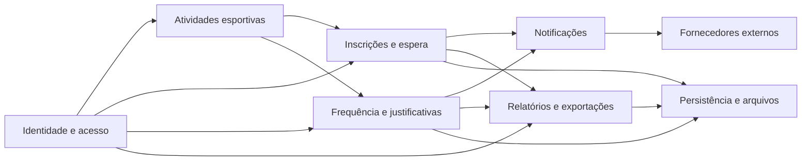
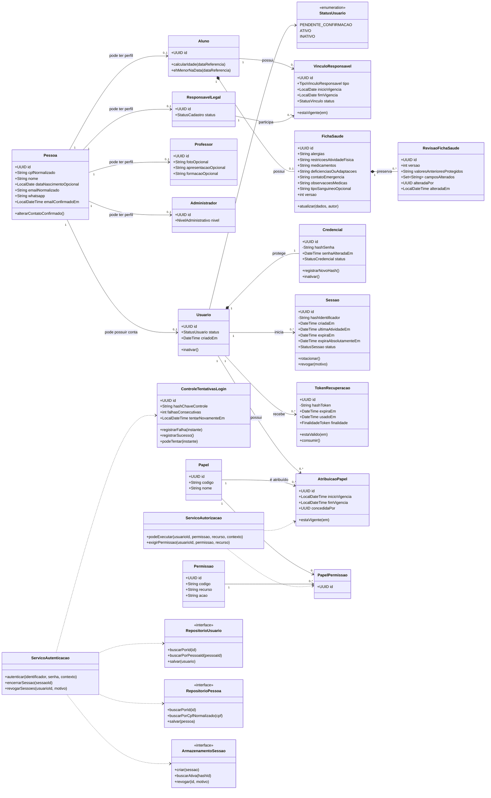
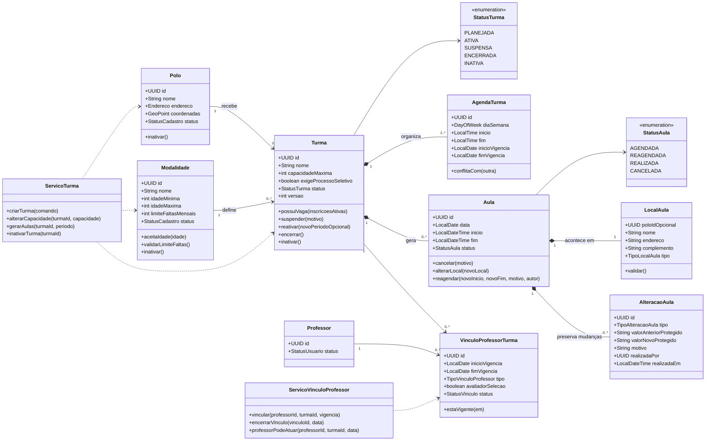
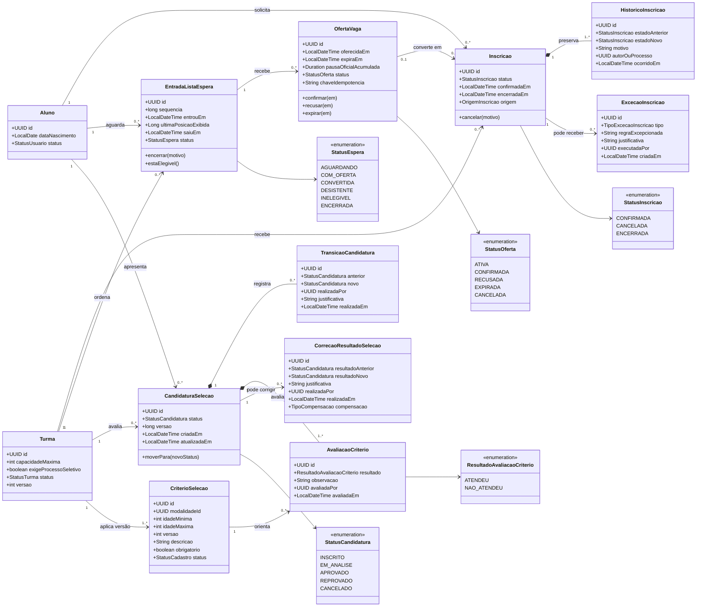
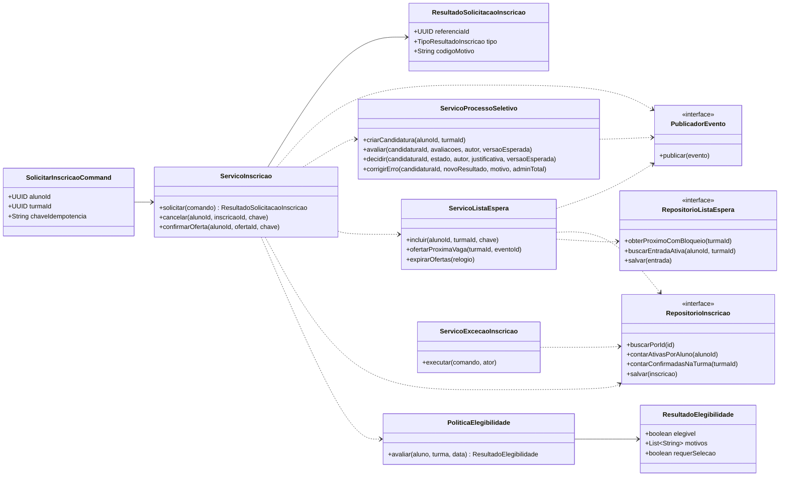
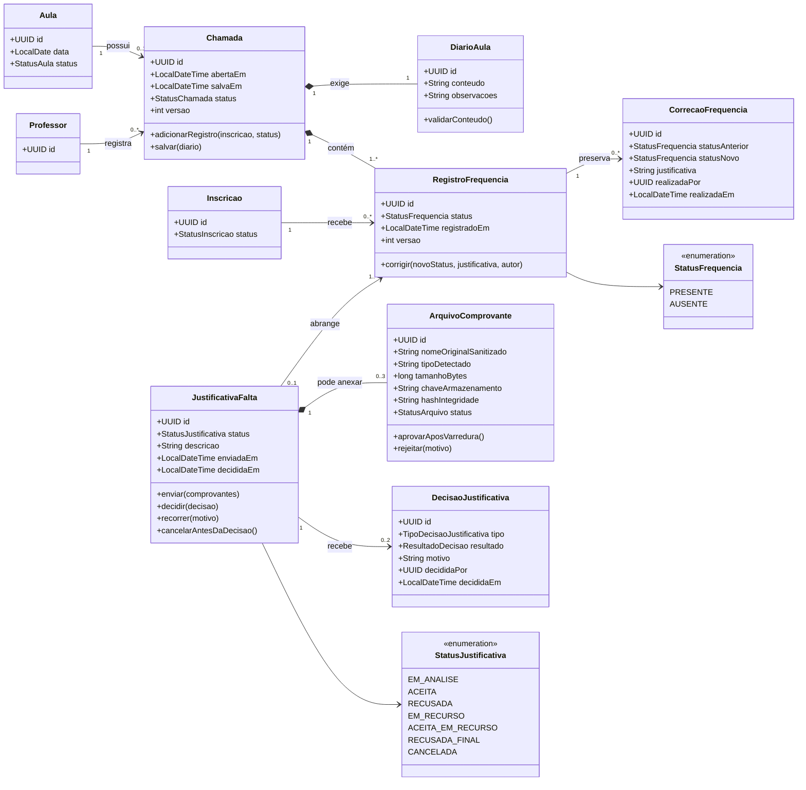
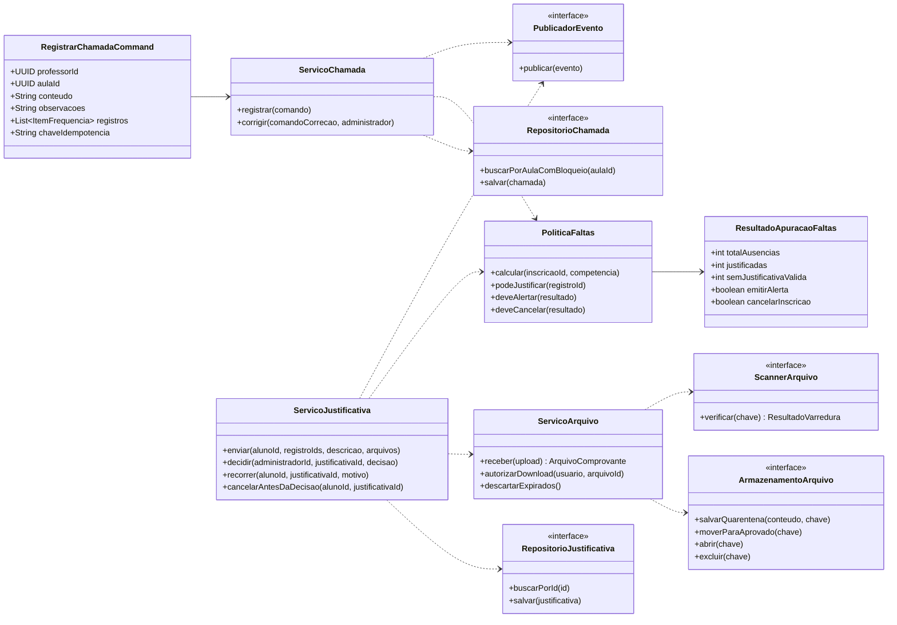
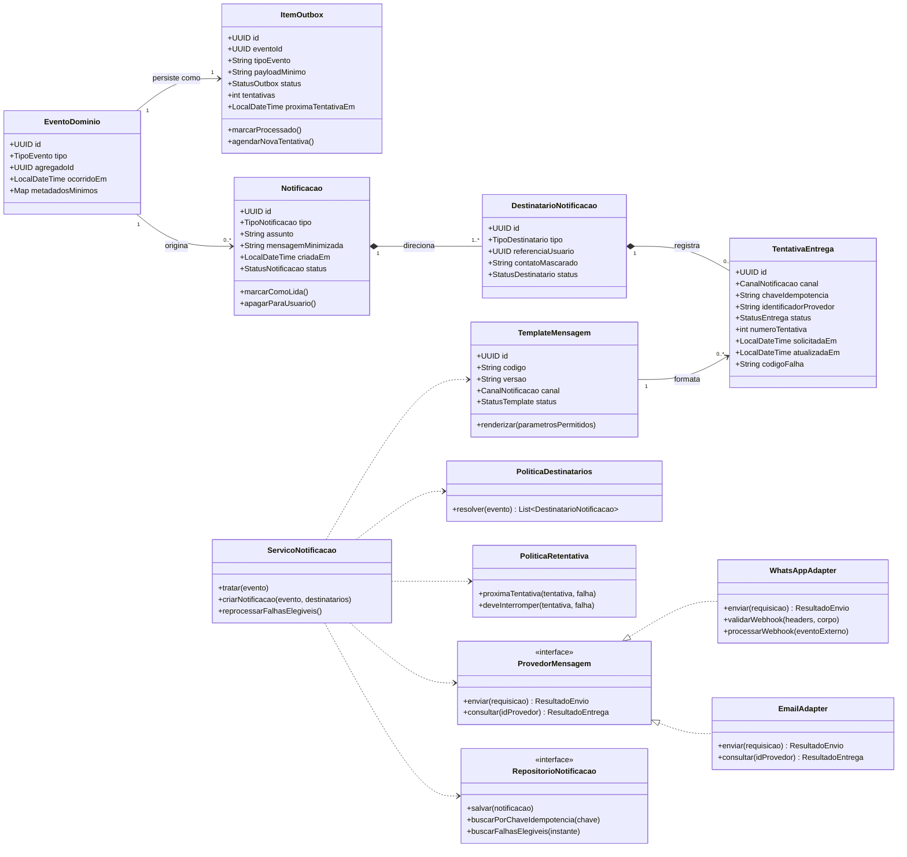
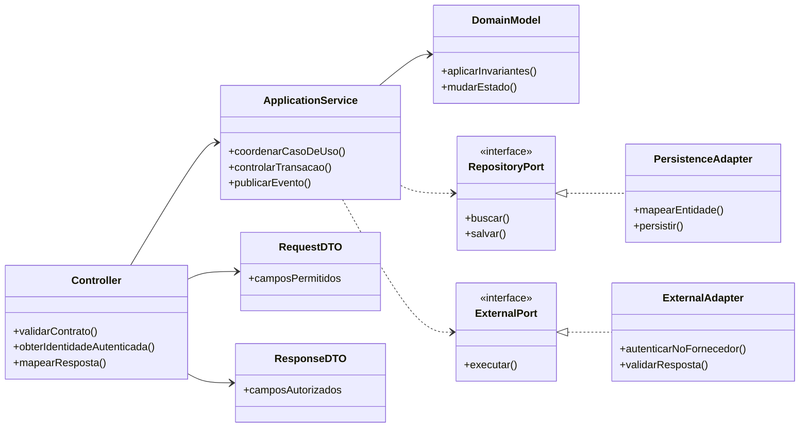

# Classes e Componentes dos Fluxos Críticos — SIDESP

> **SIDESP — Sistema Integrado de Desenvolvimento Esportivo Público**  
> Modelo conceitual de classes, serviços e interfaces para orientar frontend, backend Java/Spring Boot, persistência e integrações.

## Identificação do documento

| Campo | Valor |
| --- | --- |
| Projeto | SIDESP — Sistema Integrado de Desenvolvimento Esportivo Público |
| Órgão demandante | Secretaria de Esportes de Guaratinguetá |
| Documentos relacionados | `LEVANTAMENTO_DE_REQUISITOS.md` `0.2.0`; `CASOS_DE_USO.md` `0.2.0`; `SEGURANCA.md` `0.2.0` |
| Fonte inicial | Documento de Visão — SIDESP, versão `1.0`, seção 6.4 |
| Responsável técnico / Segurança / Privacidade interna | Heitor Leite |
| Responsável de negócio / Scrum Master | Kauãn Raphael |
| Product Owner | Livia Andrade |
| QA | Micael Phillipini |
| Versão | `0.2.0` |
| Data | 17/08/2026 |
| Classificação | Interna |
| Status | Pronto para revisão — modelo proposto, ainda não implementado |
| Próxima revisão | Revisão formal e aprovação pela equipe |

## Aprovações

| Papel | Responsável | Situação | Data |
| --- | --- | --- | --- |
| Responsável de negócio / Scrum Master | Kauãn Raphael | Pendente de revisão | — |
| Product Owner | Livia Andrade | Pendente de revisão | — |
| Responsável técnico | Heitor Leite | Pendente de revisão | — |
| QA | Micael Phillipini | Pendente de revisão das invariantes | — |
| Segurança e privacidade interna | Heitor Leite | Pendente de revisão | — |
| Validação institucional de privacidade | Prefeitura/Embrass, antes da implantação real | Fora da aprovação acadêmica atual | — |

## 1. Objetivo e escopo

Este documento detalha as classes necessárias aos fluxos de maior risco e complexidade do SIDESP:

1. identidade, sessão e autorização;
2. estrutura das atividades esportivas e vínculos de professores;
3. inscrição, lista de espera e processo seletivo;
4. chamada, frequência e justificativa de falta;
5. notificações internas e e-mail;
6. componentes futuros de WhatsApp, relatórios, exportações e mapas de calor.

Os diagramas representam o **modelo planejado do produto completo**. A primeira versão terá frontend Angular, API e backend Java/Spring Boot e MySQL 8.x. WhatsApp, relatórios, exportações, mapas e QR Code aparecem apenas como evolução futura. Os diagramas não são código Java pronto, não impõem tabelas com o mesmo formato e não substituem `ARQUITETURA.md`, `../database/BANCO_DE_DADOS.md` ou o futuro contrato OpenAPI.

Classes de notícias e consultas públicas não receberam um diagrama próprio nesta versão por apresentarem menor risco estrutural. Elas deverão entrar no modelo completo quando o fluxo editorial e a arquitetura forem detalhados.

### 1.1 Por que os diagramas foram separados

Um único diagrama com todas as classes ficaria difícil de revisar e esconderia relações importantes. As classes compartilhadas aparecem em mais de um diagrama apenas para dar contexto; isso não significa duplicação na implementação.

### 1.2 Convenções

- Classes de domínio representam conceitos e invariantes do negócio.
- Serviços de aplicação coordenam casos de uso; não armazenam estado de negócio durável.
- Interfaces representam dependências que a arquitetura poderá implementar com banco, storage ou fornecedor externo.
- DTOs são contratos de fronteira e não substituem entidades de domínio.
- `Proposto` significa que ainda não existe implementação confirmada.
- `Pendente` significa que uma decisão da equipe ainda pode alterar a classe ou relação.
- Atributos como `id`, `versao`, `criadoEm` e `atualizadoEm` são conceituais; tipo e estratégia definitivos pertencem à arquitetura e ao banco.
- Senhas, tokens e segredos nunca aparecem em DTOs de saída nem em logs.

### 1.3 Glossário técnico

| Termo | Significado neste documento |
| --- | --- |
| Classe de domínio | Representação de um conceito do negócio, como aluno, turma ou inscrição. |
| Entidade | Classe com identidade própria e histórico, mesmo que alguns dados mudem. |
| Objeto de valor | Conjunto de dados definido pelo conteúdo, como endereço ou período. |
| Invariante | Regra que deve continuar verdadeira antes e depois de qualquer operação. |
| Cardinalidade | Quantidade de relações permitidas, como um responsável ligado a vários alunos. |
| DTO | Objeto usado para receber ou devolver dados pela API, sem expor diretamente as entidades internas. |
| Interface ou porta | Contrato que permite trocar banco, armazenamento ou fornecedor sem mudar a regra de negócio. |
| Adaptador | Implementação de uma interface para uma tecnologia específica, como MySQL ou serviço de e-mail. |
| Idempotência | Garantia de que repetir o mesmo comando não duplica o resultado. |
| Outbox | Registro de um evento na mesma transação do dado principal, para que uma notificação possa ser enviada depois sem ser perdida. |
| Operação compensatória | Nova ação que corrige os efeitos de uma operação concluída sem apagar o histórico. |
| Concorrência | Situação em que duas requisições tentam alterar o mesmo dado ao mesmo tempo. |

## 2. Visão modular

## 3. Fluxo crítico 1 — identidade, sessão e autorização

### 3.1 Diagrama

### 3.2 Responsabilidades e decisões

| Elemento | Responsabilidade |
| --- | --- |
| `Pessoa` | Cadastro único por CPF, com dados pessoais e contato confirmado compartilhados pelos perfis. |
| `Usuario` | Conta opcional da pessoa, com estado e credencial. Uma pessoa responsável não recebe conta automaticamente. |
| `Aluno`, `Professor`, `Administrador`, `ResponsavelLegal` | Perfis que uma mesma pessoa pode acumular sem duplicar CPF ou dados de contato. |
| `ResponsavelLegal`/`VinculoResponsavel` | Representar o papel de responsável e seus vínculos com vários alunos. |
| `Credencial` | Guardar somente hash e estado da credencial. O algoritmo e os parâmetros ficam em componente técnico protegido. |
| `ControleTentativasLogin` | Aplicar a espera progressiva separadamente do estado da conta, inclusive sem revelar se o usuário existe. |
| `FichaSaude`/`RevisaoFichaSaude` | Manter a ficha atual e versões anteriores protegidas. O log comum registra somente autor, instante e nomes dos campos alterados. |
| `Sessao` | Ciclo de vida da sessão opaca, expiração, rotação e revogação. |
| `TokenRecuperacao` | Token de uso único, curto e armazenado somente como hash. |
| `Papel`/`Permissao` | RBAC granular para administrador parcial/total e demais perfis. |
| `ServicoAutorizacao` | Combinar papel, ação, objeto, vínculo e contexto. Não confiar em botão ou rota do frontend. |

### 3.3 Invariantes

- `Pessoa.cpfNormalizado` deve ser único em todo o sistema.
- uma pessoa pode possuir vários perfis, mas no máximo uma conta `Usuario` e uma `Credencial`.
- perfis de aluno, professor e administrador exigem data de nascimento na pessoa; o perfil apenas de responsável não adiciona essa obrigatoriedade na primeira versão.
- `StatusUsuario` possui somente `PENDENTE_CONFIRMACAO`, `ATIVO` e `INATIVO`; falhas de login não transformam a conta em `BLOQUEADO`.
- a espera progressiva começa na terceira falha e fica em `ControleTentativasLogin`; login válido reinicia a contagem.
- `Credencial.hashSenha` nunca pode ser devolvido por API ou serializado em log.
- sessão inativa, expirada ou revogada não autoriza requisição.
- usuário inativo não cria nova sessão.
- papel não concede permissão fora de sua vigência.
- administrador não pode elevar o próprio acesso.
- o perfil de responsável não cria `Usuario`, `Credencial`, `Sessao` ou papel de acesso automaticamente.
- um responsável pode participar de vários vínculos, mas cada comunicação exige vínculo vigente com o aluno correspondente.
- o e-mail do responsável deve estar confirmado antes da criação da conta do menor.
- depois da nova confirmação, alteração de e-mail ou WhatsApp da pessoa responsável vale para todos os seus vínculos e gera aviso aos alunos vinculados.
- cada aluno possui no máximo uma ficha de saúde atual; versões anteriores ficam protegidas e só são acessíveis a administrador autorizado e Heitor Leite.
- o registro comum de auditoria da ficha guarda autor, instante e campos alterados, sem copiar os valores médicos.

### 3.4 Rastreabilidade

`RF-IDN-001` a `RF-IDN-004`; `RF-ADM-005/007`; `RF-FRQ-005`; `RN-016`, `RN-017`, `RN-022`, `RN-029/031`; `UC-IDN-*`, `UC-ADM-12/14`, `UC-PRF-04`; `SEG-IDN-*`, `SEG-SES-*`, `SEG-AUTZ-*`.

## 4. Fluxo crítico 2 — estrutura esportiva e vínculos

### 4.1 Diagrama

### 4.2 Invariantes

- polo, modalidade, professor e turma são inativados; referências históricas não são excluídas.
- `idadeMinima` não pode ser maior que `idadeMaxima`.
- `capacidadeMaxima` deve ser positiva.
- reduzir capacidade abaixo das inscrições confirmadas é bloqueado; nunca cancela alunos silenciosamente.
- aula pertence a uma única turma.
- cada ocorrência possui um `LocalAula`, que pode referenciar um polo cadastrado ou guardar nome, endereço e complemento de um local temporário.
- alterar o local de uma ocorrência não muda o polo permanente da turma.
- professor só atua em aula cuja turma possua vínculo vigente na data aplicável.
- turma `SUSPENSA` preserva inscrições e fila, mas não aceita novas inscrições nem gera novas aulas ou faltas enquanto durar a suspensão.
- suspender uma turma não amplia automaticamente sua data final; na reativação, o administrador decide o novo período e as novas ocorrências e notifica os alunos.
- reagendamento preserva o mesmo identificador da aula e cria `AlteracaoAula` com valores anterior e novo, motivo, autor e instante.
- aula fica `REAGENDADA` até acontecer e então passa a `REALIZADA`.
- alterações de regra possuem vigência e não reescrevem histórico encerrado.

### 4.3 Rastreabilidade

`RF-ADM-001` a `RF-ADM-004`; `RF-FRQ-002`; `RN-002`, `RN-008`, `RN-012`, `RN-013`, `RN-015`, `RN-018`; `UC-ADM-01` a `UC-ADM-05`, `UC-PRF-01`.

## 5. Fluxo crítico 3 — inscrição, lista de espera e seleção

### 5.1 Diagrama de domínio

### 5.2 Diagrama de serviços e interfaces

### 5.3 Responsabilidades

| Elemento | Responsabilidade |
| --- | --- |
| `Inscricao` | Vínculo confirmado ou encerrado entre aluno e turma; não carrega posição de espera. |
| `EntradaListaEspera` | Ordem de chegada própria da turma, posição ativa e última posição/instante após a saída. |
| `OfertaVaga` | Reserva temporária, prazo de 48 horas de disponibilidade e resposta do aluno; indisponibilidade oficial registrada pausa a contagem. |
| `CandidaturaSelecao` | Fluxo com `INSCRITO`, `EM_ANALISE`, `APROVADO`, `REPROVADO` e `CANCELADO`, usando versão para impedir sobrescrita concorrente. |
| `CriterioSelecao`/`AvaliacaoCriterio` | Versionar critérios obrigatórios ou opcionais e registrar `ATENDEU`/`NAO_ATENDEU`; resultados orientam, mas não tomam a decisão humana final. |
| `CorrecaoResultadoSelecao` | Corrigir erro administrativo e registrar eventual compensação após a matrícula, sem alterar ordem ou critérios. |
| `ExcecaoInscricao` | Registro explícito da regra ignorada, justificativa e administrador total executor. Não altera silenciosamente a regra global. |
| `PoliticaElegibilidade` | Reúne limite de duas modalidades distintas, idade, capacidade, duplicidade, status e aviso de conflito de horário. |
| `ServicoListaEspera` | Coordena concorrência, ordem, oferta, expiração e idempotência. |

### 5.4 Invariantes transacionais

- cada critério seletivo informa se é obrigatório ou opcional, mas nenhum resultado aprova ou reprova automaticamente; professor ou administrador responsável registra a decisão humana final.

- aluno não mantém duas inscrições ativas na mesma turma.
- solicitação termina diretamente em inscrição `CONFIRMADA`, entrada na fila, candidatura seletiva ou rejeição; `SOLICITADA` não é persistido.
- aluno mantém no máximo duas modalidades distintas considerando inscrições confirmadas e candidaturas em andamento; fila não conta.
- duas turmas ativas da mesma modalidade são proibidas; conflito de horário gera aviso e confirmação, mas não bloqueio.
- capacidade não é excedida por corrida entre requisições comuns.
- `(turma, aluno)` possui no máximo uma entrada ativa na fila.
- `sequencia` é única e crescente dentro da turma; após a saída, guardam-se última posição e instante sem novo cálculo ativo.
- cada vaga liberada mantém no máximo uma `OfertaVaga` ativa.
- confirmar/recusar/expirar oferta é idempotente.
- indisponibilidade oficial registrada pausa `OfertaVaga`; problema particular de conexão não altera o prazo.
- professor só avalia seleção com vínculo vigente e `avaliadorSelecao = true`; administrador depende de permissão explícita.
- aprovação com critério obrigatório não atendido exige justificativa na transição.
- sem capacidade, a candidatura permanece `EM_ANALISE`; não existe `APROVADO` sem vaga ou exceção de capacidade do administrador total.
- a primeira decisão seletiva confirmada para uma versão prevalece; tentativa concorrente com versão antiga falha sem sobrescrever.
- inscrição, histórico, encerramento da fila e evento de notificação devem ser gravados juntos ou com outbox confiável.
- exceção administrativa exige administrador total e justificativa, sem segunda aprovação; nunca altera fila ou critérios seletivos.

### 5.5 Rastreabilidade

`RF-INS-001` a `RF-INS-008`; `RN-001`, `RN-008` a `RN-012`, `RN-018`, `RN-023`; `UC-INS-*`, `UC-ADM-07/08/13`, `UC-AUT-01`; `SEG-API-008`, `SEG-AUTZ-*`, `SEG-RES-002`.

## 6. Fluxo crítico 4 — chamada, frequência e justificativa

### 6.1 Diagrama de domínio

### 6.2 Diagrama de serviços

### 6.3 Refinamentos sobre o modelo original

- `Presenca.presente: boolean` foi substituída por `RegistroFrequencia.status`, permitindo estados explícitos sem ambiguidade.
- `Chamada` e `DiarioAula` formam uma operação única; o conteúdo é obrigatório antes do salvamento.
- correção administrativa cria `CorrecaoFrequencia`; não sobrescreve silenciosamente o valor anterior.
- `JustificativaFalta` referencia uma ausência concreta, não apenas o aluno.
- comprovante virou `ArquivoComprovante`, com estado de quarentena, hash e chave privada; caminho físico não é exposto.
- decisão foi separada da justificativa para registrar administrador, motivo e instante.

### 6.4 Invariantes

- uma aula possui no máximo uma chamada salva e versionada.
- somente professor vinculado à turma na data da aula registra a chamada.
- chamada salva pelo professor não pode ser alterada ou excluída por ele.
- cada inscrição elegível possui no máximo um registro por chamada.
- diário sem conteúdo válido impede o salvamento completo.
- correção exige administrador autorizado e justificativa; valor anterior permanece rastreável.
- uma justificativa abrange uma ou várias ausências do mesmo aluno, inclusive de modalidades diferentes, quando estiverem cobertas pelo mesmo motivo ou comprovante.
- cada ausência selecionada deve estar dentro do próprio prazo de 7 dias e pode participar de no máximo uma justificativa ativa.
- justificativa exige descrição, mas pode ser enviada sem comprovante ou com até três arquivos.
- todo comprovante anexado precisa ser aprovado pela varredura antes de ficar disponível para análise.
- aluno cancela a justificativa somente em `EM_ANALISE` e antes da primeira decisão; o sistema avisa que as ausências voltarão a contar e recalcula eventual cancelamento da inscrição.
- recusa inicial pode passar uma única vez para `EM_RECURSO`; outro administrador decide `ACEITA_EM_RECURSO` ou `RECUSADA_FINAL`.
- a justificativa guarda no máximo duas decisões: inicial e recurso.
- frequência possui somente `PRESENTE` ou `AUSENTE`; justificativa aceita permanece vinculada à ausência, mas faz com que ela não conte no limite.
- aula cancelada não possui chamada nem registros de frequência.
- professor não acessa comprovante nem decisão administrativa.
- efeitos de alerta/cancelamento decorrentes de correção devem ser compensados de forma idempotente.

### 6.5 Rastreabilidade

`RF-FRQ-001` a `RF-FRQ-006`; `RF-JUS-001` a `RF-JUS-003`; `RN-002` a `RN-007`, `RN-013`, `RN-014`, `RN-019`, `RN-024`, `RN-025`; `UC-FRQ-01`, `UC-PRF-02/03/04`, `UC-JUS-*`, `UC-ADM-09/10`, `UC-AUT-02/03/04`; `SEG-ARQ-*`, `SEG-AUTZ-006/007`.

## 7. Fluxo crítico 5 — notificações internas, e-mail e WhatsApp futuro

### 7.1 Diagrama

### 7.2 Eventos iniciais

| Evento | Origem | Destinatários propostos |
| --- | --- | --- |
| `INSCRICAO_CONFIRMADA_OU_CANCELADA` | `Inscricao` | Aluno e responsável quando menor |
| `VAGA_OFERECIDA` | `OfertaVaga` | Aluno e responsável quando menor |
| `RESULTADO_PROCESSO_SELETIVO` | `CandidaturaSelecao` | Aluno e responsável quando menor |
| `LIMITE_FALTAS_ATINGIDO` | `PoliticaFaltas` | Aluno e responsável vigente quando menor |
| `INSCRICAO_CANCELADA_POR_FALTAS` | `Inscricao` | Aluno e responsável quando aplicável |
| `JUSTIFICATIVA_DECIDIDA` | `DecisaoJustificativa` | Aluno e responsável quando menor |
| `AULA_CANCELADA_OU_ALTERADA` | `Aula` | Alunos ativos e responsáveis dos menores |

### 7.3 Invariantes

- evento e item outbox são gravados na mesma transação do estado de negócio que os originou.
- evento não contém comprovante, dado de saúde, token ou segredo.
- destinatários são calculados no backend, nunca aceitos como lista arbitrária do cliente.
- uma chave de idempotência identifica evento, destinatário, canal e template.
- callback repetido do fornecedor não duplica estado ou mensagem.
- “aceito pelo provedor” e “entregue ao destinatário” são estados distintos.
- e-mail possui no máximo três tentativas: imediata, após 5 minutos e após 30 minutos; falha final cria pendência administrativa sem desfazer a operação principal.
- notificação interna é obrigatória para o aluno; o usuário pode marcá-la como lida ou apagá-la sem eliminar o registro técnico mínimo durante a retenção.
- telefone completo e conteúdo não aparecem em log comum.
- `EmailAdapter` é o canal externo da primeira versão. `WhatsAppAdapter` permanece futuro e depende de fornecedor ainda não aprovado.

### 7.4 Rastreabilidade

`RF-COM-001` a `RF-COM-006`; `RF-INS-004`; `RF-JUS-003`; `RN-006`, `RN-007`, `RN-010`, `RN-011`, `RN-020`, `RN-025`; `UC-COM-*`, `UC-AUT-01/02/03/04`; `SEG-WA-*`, `SEG-INT-*`, `SEG-LOG-*`.

## 8. Fluxo crítico futuro 6 — relatórios, exportações e mapas de calor

### 8.1 Diagrama

### 8.2 Responsabilidades

| Elemento | Responsabilidade |
| --- | --- |
| `DefinicaoIndicador` | Versionar fórmula e significado; evita relatórios com interpretações divergentes. |
| `FiltroRelatorio` | Aceitar somente filtros documentados e limitados. |
| `PoliticaAgregacao` | Aplicar granularidade, limiar mínimo e resistência a filtros de reidentificação. |
| `ResultadoRelatorio` | Guardar resultado reproduzível com versão dos dados e instante. |
| `ExportacaoRelatorio` | Controlar estado, formato, classificação, expiração e auditoria do arquivo. |
| `GeradorExcel` | Neutralizar formula injection e produzir somente colunas autorizadas. |
| `ServicoExportacao` | Revalidar permissão no pedido e no download; visualização não implica exportação. |

### 8.3 Invariantes

- solicitante precisa de permissão específica para tipo, campos e exportação.
- filtro e definição de indicador usados ficam associados ao resultado.
- o servidor escolhe campos exportados; o cliente não envia lista arbitrária.
- grupo abaixo do limiar aprovado é suprimido ou agregado.
- mapa de calor não contém localização individual de aluno.
- arquivo exportado herda a maior classificação dos dados.
- download exige autorização atual e expira; URL não é permanente.
- planilha neutraliza fórmula; PDF não incorpora script/anexo ativo.
- arquivo expirado é descartado segundo retenção aprovada.

### 8.4 Rastreabilidade

`RF-REL-001` a `RF-REL-003`; `UC-REL-*`; `RNF-PRI-003`, `RNF-EXP-001`; `SEG-EXP-*`, `SEG-MAP-*`, `SEG-AUTZ-008`.

## 9. Padrão de camadas proposto para o backend

### 9.1 Regras de dependência

- controller trata HTTP, contrato e identidade; não implementa regra de negócio.
- serviço de aplicação coordena transação, autorização contextual e eventos.
- modelo de domínio protege invariantes mesmo quando chamado por job ou integração.
- repositórios e fornecedores são interfaces voltadas para o domínio/aplicação.
- adaptadores dependem das interfaces; o domínio não depende de Spring, JPA ou SDK de fornecedor externo.
- entidade persistida não deve ser serializada diretamente como resposta da API.
- DTO de entrada não possui `papel`, `dono`, `status interno`, `criadoPor` ou campos controlados pelo servidor sem caso explícito.

## 10. Catálogo consolidado de classes

| Módulo | Entidades/objetos de valor | Serviços | Interfaces/adaptadores |
| --- | --- | --- | --- |
| Identidade | `Pessoa`, `Usuario`, `Aluno`, `Professor`, `Administrador`, `ResponsavelLegal`, `VinculoResponsavel`, `FichaSaude`, `RevisaoFichaSaude`, `Credencial`, `ControleTentativasLogin`, `Sessao`, `TokenRecuperacao`, `Papel`, `Permissao` | `ServicoAutenticacao`, `ServicoAutorizacao` | `RepositorioPessoa`, `RepositorioUsuario`, `ArmazenamentoSessao` |
| Atividades | `Polo`, `Modalidade`, `Turma`, `AgendaTurma`, `Aula`, `LocalAula`, `AlteracaoAula`, `VinculoProfessorTurma` | `ServicoTurma`, `ServicoVinculoProfessor` | Repositórios específicos a definir no banco/arquitetura |
| Inscrições | `Inscricao`, `EntradaListaEspera`, `OfertaVaga`, `CandidaturaSelecao`, `CriterioSelecao`, `AvaliacaoCriterio`, `TransicaoCandidatura`, `CorrecaoResultadoSelecao`, `ExcecaoInscricao`, `HistoricoInscricao` | `ServicoInscricao`, `ServicoListaEspera`, `ServicoProcessoSeletivo`, `ServicoExcecaoInscricao`, `PoliticaElegibilidade` | `RepositorioInscricao`, `RepositorioListaEspera`, `PublicadorEvento` |
| Frequência | `Chamada`, `DiarioAula`, `RegistroFrequencia`, `CorrecaoFrequencia` | `ServicoChamada`, `PoliticaFaltas` | `RepositorioChamada`, `PublicadorEvento` |
| Justificativas | `JustificativaFalta`, `ArquivoComprovante`, `DecisaoJustificativa` | `ServicoJustificativa`, `ServicoArquivo` | `RepositorioJustificativa`, `ArmazenamentoArquivo`, `ScannerArquivo` |
| Comunicação | `EventoDominio`, `ItemOutbox`, `Notificacao`, `DestinatarioNotificacao`, `TentativaEntrega`, `TemplateMensagem` | `ServicoNotificacao`, `PoliticaDestinatarios`, `PoliticaRetentativa` | `ProvedorMensagem`, `EmailAdapter`, futuro `WhatsAppAdapter`, `RepositorioNotificacao` |
| Relatórios futuros | `SolicitacaoRelatorio`, `FiltroRelatorio`, `DefinicaoIndicador`, `ResultadoRelatorio`, `ConjuntoAgregado`, `ExportacaoRelatorio`, `ArquivoExportado` | `ServicoRelatorio`, `ServicoExportacao`, `PoliticaAgregacao` | `ConsultaAnalitica`, `GeradorArquivoRelatorio`, `GeradorPdf`, `GeradorExcel` |

## 11. Estados principais

As enumerações abaixo são candidatas iniciais. Alteração de estado deve ocorrer por método de domínio ou serviço autorizado, nunca por atribuição livre recebida da API.

| Conceito | Estados propostos | Pendência |
| --- | --- | --- |
| Usuário | `PENDENTE_CONFIRMACAO`, `ATIVO`, `INATIVO` | Espera progressiva de login fica em `ControleTentativasLogin`, sem estado `BLOQUEADO` |
| Turma | `PLANEJADA`, `ATIVA`, `SUSPENSA`, `ENCERRADA`, `INATIVA` | Suspensão preserva inscrições e fila, mas interrompe novas aulas, inscrições e faltas |
| Aula | `AGENDADA`, `REAGENDADA`, `REALIZADA`, `CANCELADA` | Reagendamento preserva a aula e seu histórico; aula cancelada não possui chamada |
| Inscrição | `CONFIRMADA`, `CANCELADA`, `ENCERRADA` | Pedido não persiste `SOLICITADA`; fila e seleção possuem modelos próprios |
| Lista de espera | `AGUARDANDO`, `COM_OFERTA`, `CONVERTIDA`, `DESISTENTE`, `INELEGIVEL`, `ENCERRADA` | Saída preserva última posição e instante; retorno entra no final |
| Oferta | `ATIVA`, `CONFIRMADA`, `RECUSADA`, `EXPIRADA`, `CANCELADA` | `ATIVA` dura 48 horas de disponibilidade; indisponibilidade oficial registrada pausa o prazo |
| Candidatura | `INSCRITO`, `EM_ANALISE`, `APROVADO`, `REPROVADO`, `CANCELADO` | Não há recurso do aluno na primeira versão; erro administrativo é corrigido separadamente |
| Chamada | `ABERTA`, `SALVA`, `CORRIGIDA` | Professor salva em até 24 horas; rascunho local não é `SALVA` antes da confirmação do servidor |
| Frequência | `PRESENTE`, `AUSENTE` | Justificativa aceita não muda o estado, mas desconsidera a ausência no limite |
| Justificativa | `EM_ANALISE`, `ACEITA`, `RECUSADA`, `EM_RECURSO`, `ACEITA_EM_RECURSO`, `RECUSADA_FINAL`, `CANCELADA` | Cancelamento pelo aluno somente antes da primeira decisão |
| Arquivo | `EM_QUARENTENA`, `APROVADO`, `REJEITADO`, `EXPIRADO`, `EXCLUIDO` | Até 3 arquivos opcionais; retenção conforme levantamento |
| Entrega | `PENDENTE`, `ENVIADA_AO_PROVEDOR`, `ENTREGUE`, `FALHA_TEMPORARIA`, `FALHA_FINAL` | E-mail na primeira versão; WhatsApp somente no futuro |
| Exportação futura | `SOLICITADA`, `PROCESSANDO`, `DISPONIVEL`, `FALHA`, `EXPIRADA`, `EXCLUIDA` | Só será refinada quando a Secretaria definir relatórios e exportações |

## 12. Regras transversais de modelagem

### 12.1 Identidade e auditoria

- IDs externos devem ser opacos; não são autorização.
- entidades críticas devem possuir controle de versão para concorrência otimista quando apropriado.
- toda alteração administrativa relevante registra ator, instante, motivo e estado anterior/novo.
- exclusão lógica não substitui política de retenção e descarte; cada caso deve distinguir histórico obrigatório de dado que deve ser eliminado.
- auditoria não deve guardar senha, token, comprovante integral ou dado de saúde desnecessário.

### 12.2 Concorrência e idempotência

- inscrição, cancelamento, chamada, decisão, oferta e envio devem aceitar uma chave de idempotência ou identificador de comando quando houver risco de repetição.
- capacidade e ordem de fila devem ser protegidas por constraint, bloqueio transacional ou estratégia equivalente aprovada.
- evento externo deve ter identificador único do provedor e proteção contra replay.
- retries nunca podem repetir efeito de negócio sem verificação do estado atual.

### 12.3 Datas e vigência

- instantes técnicos usam timezone/offset ou UTC na persistência; apresentação inicial usa `America/Sao_Paulo` após ratificação.
- datas de negócio sem horário usam `LocalDate`.
- cálculo de idade, limite mensal, prazo da oferta e vigência de vínculo usam um `Relogio` injetável/testável.
- alteração de regra deve preservar qual versão foi aplicada ao evento histórico.

### 12.4 Segurança e privacidade

- CPF e e-mail são normalizados para unicidade, mas a exibição deve ser minimizada/mascarada conforme contexto.
- hash de senha, hash de token, chave de storage e identificador interno do fornecedor são restritos.
- arquivos ficam fora do banco principal quando a arquitetura assim definir, mas seus metadados e autorização permanecem no domínio.
- dados de saúde ficam em `FichaSaude`, separados dos dados gerais do aluno, com versões anteriores protegidas, acesso restrito e auditoria minimizada.
- localização individual de aluno não faz parte do modelo analítico.

## 13. Ajustes em relação ao Documento de Visão

| Modelo original | Refinamento proposto | Motivo |
| --- | --- | --- |
| `Usuario.senha` | `Credencial.hashSenha` separado | Impedir senha em entidade/DTO/log e controlar ciclo de vida. |
| Dados pessoais repetidos por papel | `Pessoa` única por CPF + perfis e `Usuario` opcional | Evitar duplicidade quando a mesma pessoa for responsável, aluno, professor ou administrador. |
| `Aluno.responsavel: String` | Perfil `ResponsavelLegal` + `VinculoResponsavel` | Permitir vários menores e contato compartilhado confirmado, sem criar conta automaticamente. |
| `Aluno.modalidade[]: Inscricao` | `Aluno → Inscricao → Turma → Modalidade` | Representar o vínculo correto e preservar histórico. |
| `Professor.turmas[]` | `VinculoProfessorTurma` com vigência | Autorizar chamada por turma e data, inclusive substituição futura. |
| Local fixo diretamente na turma | `Aula` + `LocalAula` | Permitir que uma ocorrência use polo cadastrado ou local temporário sem alterar o polo permanente da turma. |
| `Inscricao.posicaoEspera` | `EntradaListaEspera.sequencia` | Separar inscrição confirmada de fila e suportar concorrência. |
| Ausência de oferta | `OfertaVaga` | Representar prazo, reserva, confirmação, recusa e expiração. |
| `Presenca.presente: boolean` | `RegistroFrequencia.status` | Evitar booleano ambíguo e permitir estados explícitos. |
| Alteração direta de chamada | `CorrecaoFrequencia` | Preservar antes/depois, justificativa e autor administrativo. |
| `Justificativa.documento: String` | `ArquivoComprovante` | Controlar storage privado, varredura, integridade e retenção. |
| `Notificacao.destinatario: String` | `DestinatarioNotificacao` + `TentativaEntrega` | Suportar múltiplos canais, mascaramento, estados e retentativas. |
| Relação direta com WhatsApp | `ProvedorMensagem` + `EmailAdapter` atual + `WhatsAppAdapter` futuro | Usar e-mail na primeira versão e isolar o futuro fornecedor de WhatsApp. |
| Relatório implícito | Modelo analítico e exportação explícitos | Proteger campos, agregação, formula injection e expiração. |

## 14. Rastreabilidade consolidada

| Fluxo | Requisitos | Regras | Casos de uso | Segurança |
| --- | --- | --- | --- | --- |
| Identidade e acesso | `RF-IDN-*`, `RF-ADM-005/007`, `RF-FRQ-005` | `RN-016/017/022/029/031` | `UC-IDN-*`, `UC-ADM-12/14`, `UC-PRF-04` | `SEG-IDN-*`, `SEG-SES-*`, `SEG-AUTZ-*` |
| Estrutura esportiva | `RF-ADM-001` a `RF-ADM-004`, `RF-FRQ-002` | `RN-002/008/012/013/015/018` | `UC-ADM-01` a `UC-ADM-05`, `UC-PRF-01` | `SEG-AUTZ-003`, `SEG-DB-*` |
| Inscrição e espera | `RF-INS-*` | `RN-001`, `RN-008` a `RN-012`, `RN-018/023` | `UC-INS-*`, `UC-ADM-07/08/13`, `UC-AUT-01` | `SEG-API-008`, `SEG-RES-002`, `SEG-AUTZ-*` |
| Frequência e justificativa | `RF-FRQ-*`, `RF-JUS-*` | `RN-002` a `RN-007`, `RN-013/014/019/024/025` | `UC-FRQ-01`, `UC-PRF-*`, `UC-JUS-*`, `UC-ADM-09/10`, `UC-AUT-02/03/04` | `SEG-ARQ-*`, `SEG-AUTZ-006/007`, `SEG-LOG-*` |
| Notificações | `RF-COM-*`, `RF-INS-004`, `RF-JUS-003` | `RN-006/007/010/011/020/025` | `UC-COM-*`, `UC-AUT-01/02/04` | `SEG-WA-*`, `SEG-INT-*` |
| Relatórios futuros | `RF-REL-*` | Regras de dados aplicáveis | `UC-REL-*` | `SEG-EXP-*`, `SEG-MAP-*`, `SEG-PRI-*` |

## 15. Decisões incorporadas e questões específicas restantes

As decisões transversais `Q-001` a `Q-023` já foram resolvidas no levantamento de requisitos e incorporadas ao modelo: e-mail no lugar de WhatsApp, relatórios e mapas como componentes futuros, processo seletivo com cinco estados e decisão humana, oferta com 48 horas de disponibilidade, fila sem reordenação, chamada com rascunho local e regras de retenção aprovadas.

Esta primeira rodada específica do modelo também foi aceita:

| ID | Decisão incorporada | Classes afetadas | Situação |
| --- | --- | --- | --- |
| `Q-CLS-001` | Responsável mantém CPF, não possui conta e pode estar vinculado a vários alunos. | `ResponsavelLegal`, `VinculoResponsavel` | Aceita em 14/08/2026 |
| `Q-CLS-002` | Justificativa exige descrição e aceita de zero a três comprovantes opcionais. | `JustificativaFalta`, `ArquivoComprovante` | Aceita em 14/08/2026 |
| `Q-CLS-003` | Frequência usa apenas `PRESENTE` e `AUSENTE`; justificativa aceita desconsidera a ausência; aula cancelada não tem chamada. | `RegistroFrequencia`, `JustificativaFalta`, `Chamada` | Aceita em 14/08/2026 |
| `Q-CLS-004` | Local de uma ocorrência pode ser polo cadastrado ou local temporário com nome, endereço e complemento. | `Aula`, `LocalAula`, `Polo` | Aceita em 14/08/2026 |
| `Q-CLS-005` | Turma usa `PLANEJADA`, `ATIVA`, `SUSPENSA`, `ENCERRADA` e `INATIVA`; suspensão preserva vínculos e interrompe novas inscrições, aulas e faltas. | `Turma`, `StatusTurma` | Aceita em 14/08/2026 |

A segunda rodada também foi incorporada:

| ID | Decisão incorporada | Classes afetadas | Situação |
| --- | --- | --- | --- |
| `Q-CLS-006` | Conta usa `PENDENTE_CONFIRMACAO`, `ATIVO` e `INATIVO`; espera progressiva fica em controle separado, sem `BLOQUEADO`. | `Usuario`, `Credencial`, `ControleTentativasLogin` | Aceita em 14/08/2026 |
| `Q-CLS-007` | Uma justificativa pode abranger várias ausências do mesmo aluno e motivo/período, inclusive de modalidades diferentes, respeitando o prazo individual. | `JustificativaFalta`, `RegistroFrequencia` | Aceita em 14/08/2026 |
| `Q-CLS-008` | Ficha de saúde mantém versão atual e histórico protegido; log comum guarda somente autor, instante e campos alterados. | `FichaSaude`, `RevisaoFichaSaude` | Aceita em 14/08/2026 |
| `Q-CLS-009` | Suspensão não amplia automaticamente a turma; administrador decide novo período e ocorrências ao reativar. | `Turma`, `AgendaTurma`, `Aula` | Aceita em 14/08/2026 |
| `Q-CLS-010` | Reagendamento preserva a aula e cria histórico de valores, motivo, autor e instante; depois da realização, o estado muda para `REALIZADA`. | `Aula`, `AlteracaoAula` | Aceita em 14/08/2026 |

A rodada estrutural final também foi aceita:

| ID | Decisão incorporada | Classes afetadas | Situação |
| --- | --- | --- | --- |
| `Q-CLS-011` | Manter uma `Pessoa` única por CPF, com conta opcional e um ou mais perfis; ser responsável não cria conta automaticamente. | `Pessoa`, `Usuario`, perfis e `ResponsavelLegal` | Aceita em 14/08/2026 |
| `Q-CLS-012` | Depois da nova confirmação, atualizar o contato da pessoa responsável em todos os vínculos e notificar os alunos vinculados. | `Pessoa`, `VinculoResponsavel` | Aceita em 14/08/2026 |
| `Q-CLS-013` | Critérios obrigatórios ou opcionais são avaliados com `ATENDEU`/`NAO_ATENDEU`, mas a decisão final é humana; vínculo/designação, justificativa excepcional, capacidade e concorrência seguem o Diagrama de Atividades. | `CriterioSelecao`, `AvaliacaoCriterio`, `CandidaturaSelecao`, `VinculoProfessorTurma` | Complementada em 17/08/2026 |
| `Q-CLS-014` | Não persistir `SOLICITADA`; o pedido produz inscrição confirmada, fila, candidatura ou rejeição. | `Inscricao`, `EntradaListaEspera`, `CandidaturaSelecao` | Aceita em 14/08/2026 |
| `Q-CLS-015` | Usar os sete estados de justificativa e permitir cancelamento pelo aluno somente antes da primeira decisão, após aviso dos efeitos. | `JustificativaFalta`, `DecisaoJustificativa` | Aceita em 14/08/2026 |

Não restam decisões estruturais abertas para a revisão desta versão. Componentes futuros de WhatsApp, relatórios, exportações, mapas e QR Code deverão passar por refinamento próprio antes do desenvolvimento.

## 16. Critérios de aprovação

- [ ] Entidades e termos correspondem ao vocabulário validado pela Secretaria.
- [ ] Cardinalidades foram confirmadas pelo Product Owner e Tech Lead.
- [ ] Estados e transições possuem fonte e critérios de aceite.
- [ ] Regras críticas estão protegidas pelo domínio e serão reforçadas por constraints/transações.
- [ ] Matriz de permissões está coerente com serviços e classes sensíveis.
- [ ] Arquivos, dados de saúde e menores foram avaliados por segurança/privacidade.
- [ ] Modelo não expõe senha, token, segredo, storage ou dado interno em DTO de saída.
- [ ] Diagramas são coerentes com requisitos, casos de uso e segurança.
- [ ] Banco de dados definirá chaves, constraints, índices, retenção e migrações.
- [ ] Arquitetura definirá pacotes, tecnologias, transações, eventos e adaptadores.
- [ ] QA derivou cenários de teste das invariantes.
- [ ] Elementos implementados serão marcados como `Parcial` ou `Atual` somente após evidência.

## 17. Histórico de versões

| Versão | Data | Autor | Alterações | Situação |
| --- | --- | --- | --- | --- |
| `0.1.0` | 13/08/2026 | Heitor Leite | Refinamento do diagrama de classes do Documento de Visão em seis fluxos críticos; inclusão de serviços, interfaces, estados, invariantes, segurança, concorrência e rastreabilidade | Rascunho |
| `0.2.0` | 17/08/2026 | Heitor Leite | Incorporação das decisões funcionais e estruturais; pessoa única por CPF, perfis e conta opcional, saúde versionada, estados definidos, fila e seleção humana com concorrência/capacidade, oferta com pausa oficial, justificativas, ocorrências de aula, e-mail atual, integrações futuras e glossário | Pronto para revisão |
