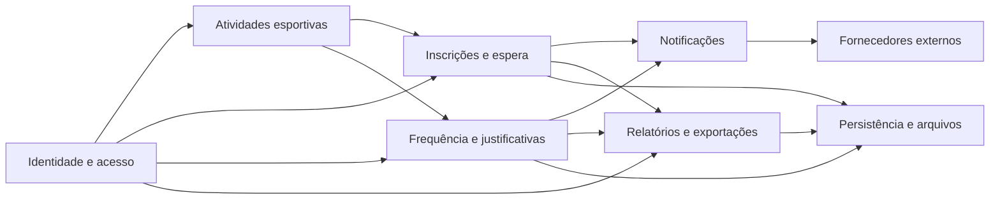
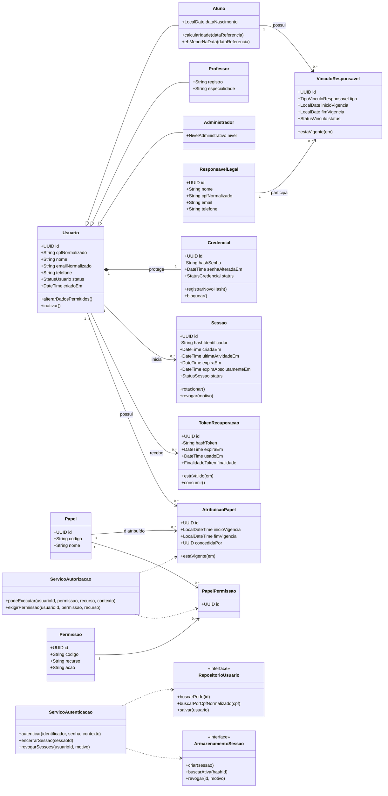
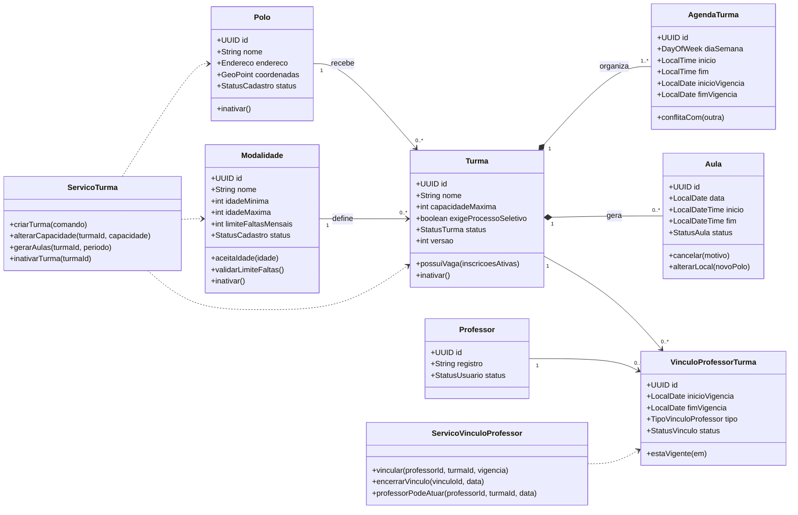
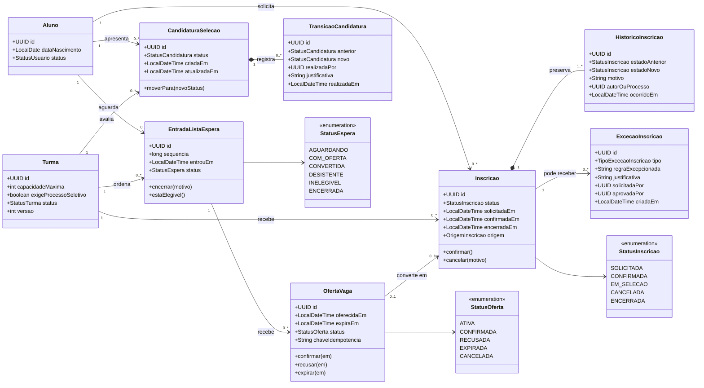
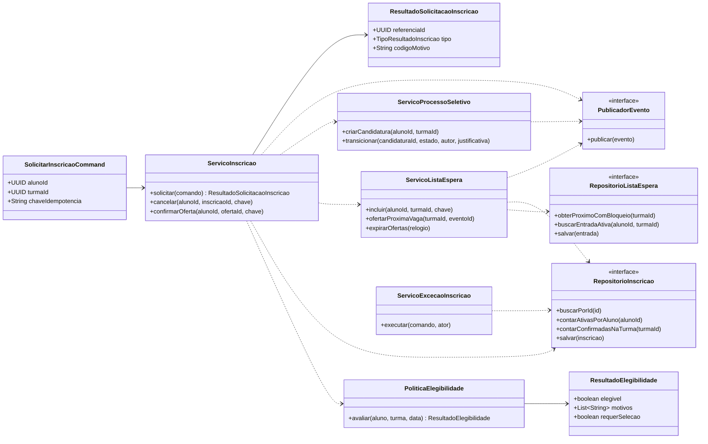
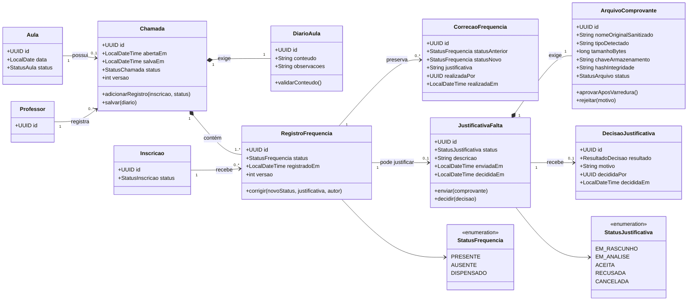
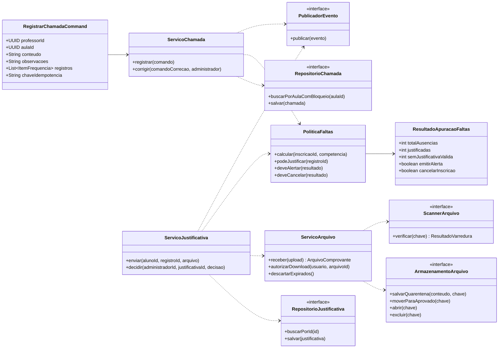
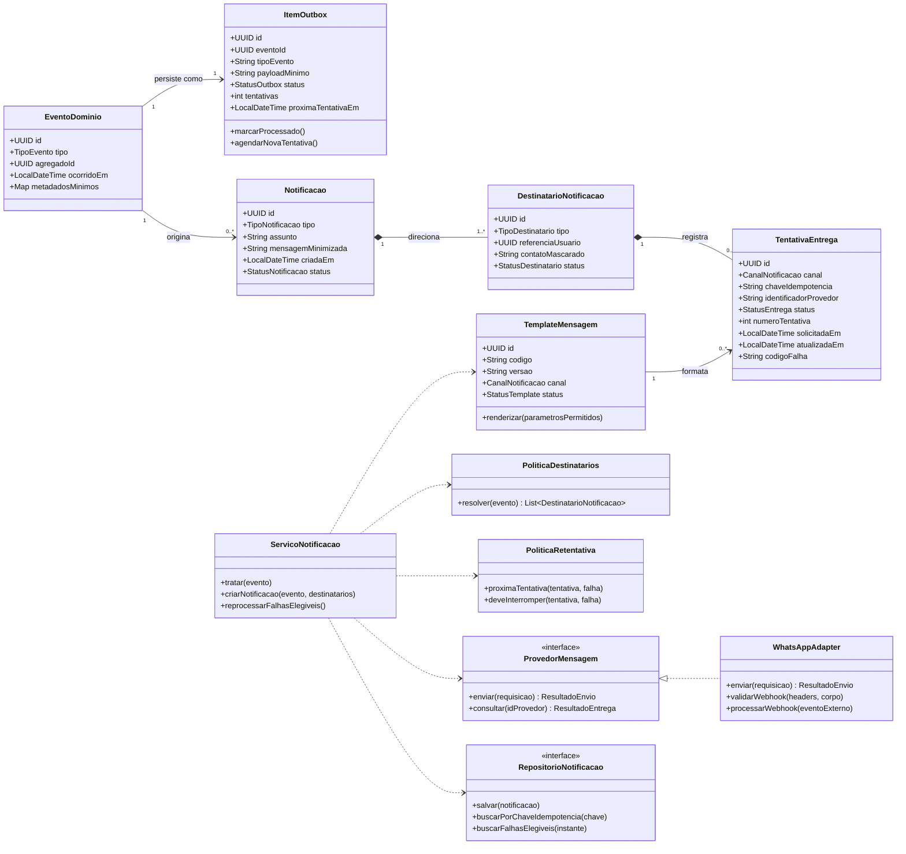
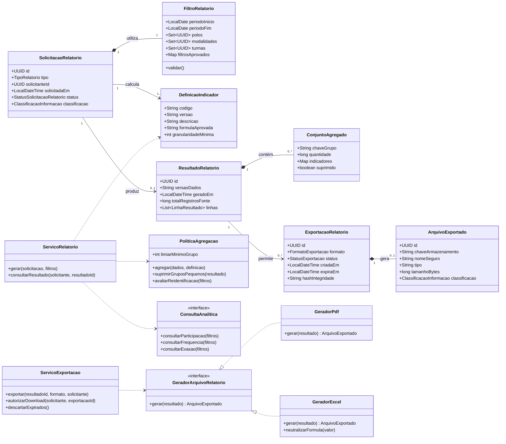
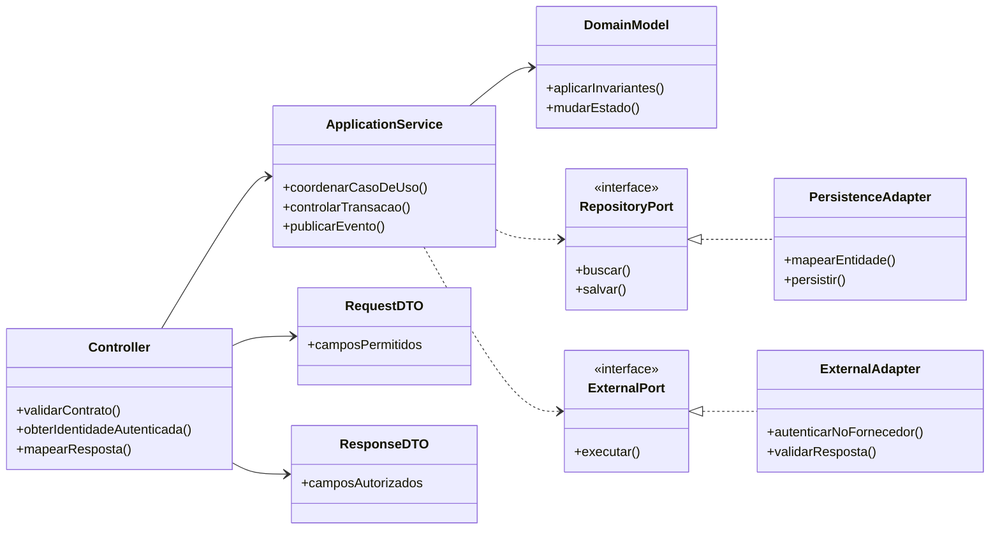

# Classes e Componentes dos Fluxos Críticos — SIDESP

> **SIDESP — Sistema Integrado de Desenvolvimento Esportivo Público**  
> Modelo conceitual de classes, serviços e interfaces para orientar frontend, backend Java/Spring Boot, persistência e integrações.

## Identificação do documento

| Campo | Valor |
| --- | --- |
| Projeto | SIDESP — Sistema Integrado de Desenvolvimento Esportivo Público |
| Órgão demandante | Secretaria de Esportes de Guaratinguetá |
| Documentos relacionados | `LEVANTAMENTO_DE_REQUISITOS.md` `0.1.0`; `CASOS_DE_USO.md` `0.1.0`; `SEGURANCA.md` `0.1.0` |
| Fonte inicial | Documento de Visão — SIDESP, versão `1.0`, seção 6.4 |
| Responsável técnico | Heitor Leite — Tech Lead |
| Responsável de negócio | Secretaria de Esportes — representante nominal pendente |
| Versão | `0.1.0` |
| Data | 13/08/2026 |
| Classificação | Interna |
| Status | Rascunho — modelo proposto, ainda não implementado |
| Próxima revisão | Após resolução das pendências da seção 15 ou mudança de regra, contrato, persistência ou arquitetura |

## Aprovações

| Papel | Responsável | Situação | Data |
| --- | --- | --- | --- |
| Responsável de negócio | Pendente | Não aprovado | — |
| Product Owner | Lívia Andrade | Pendente de revisão | — |
| Tech Lead | Heitor Leite | Pendente de revisão | — |
| QA | Micael Phillipini | Pendente de revisão das invariantes | — |
| Segurança/Privacidade | Pendente | Não avaliado | — |

## 1. Objetivo e escopo

Este documento detalha as classes necessárias aos fluxos de maior risco e complexidade do SIDESP:

1. identidade, sessão e autorização;
2. estrutura das atividades esportivas e vínculos de professores;
3. inscrição, lista de espera e processo seletivo;
4. chamada, frequência e justificativa de falta;
5. notificações e integração com WhatsApp;
6. relatórios, exportações e proteção contra reidentificação.

Os diagramas representam o **modelo planejado do produto completo**. Eles não são código Java pronto, não impõem tabelas com o mesmo formato e não substituem `ARQUITETURA.md`, `../database/BANCO_DE_DADOS.md` ou o contrato OpenAPI.

Classes de notícias e consultas públicas não receberam um diagrama próprio nesta versão por apresentarem menor risco estrutural. Elas deverão entrar no modelo completo quando o fluxo editorial e a arquitetura forem detalhados.

### 1.1 Por que os diagramas foram separados

Um único diagrama com todas as classes ficaria difícil de revisar e esconderia relações importantes. As classes compartilhadas aparecem em mais de um diagrama apenas para dar contexto; isso não significa duplicação na implementação.

### 1.2 Convenções

- Classes de domínio representam conceitos e invariantes do negócio.
- Serviços de aplicação coordenam casos de uso; não armazenam estado de negócio durável.
- Interfaces representam dependências que a arquitetura poderá implementar com banco, storage ou fornecedor externo.
- DTOs são contratos de fronteira e não substituem entidades de domínio.
- `Proposto` significa que ainda não existe implementação confirmada.
- `Pendente` significa que uma decisão externa ainda pode alterar a classe ou relação.
- Atributos como `id`, `versao`, `criadoEm` e `atualizadoEm` são conceituais; tipo e estratégia definitivos pertencem à arquitetura e ao banco.
- Senhas, tokens e segredos nunca aparecem em DTOs de saída nem em logs.

## 2. Visão modular

## 3. Fluxo crítico 1 — identidade, sessão e autorização

### 3.1 Diagrama

### 3.2 Responsabilidades e decisões

| Elemento | Responsabilidade |
| --- | --- |
| `Usuario` | Identidade comum e estado da conta. CPF único e normalizado. Não armazena senha em claro. |
| `Aluno`, `Professor`, `Administrador` | Especializações com dados próprios. O papel efetivo continua explícito para permitir permissões granulares. |
| `ResponsavelLegal`/`VinculoResponsavel` | Representar responsável e vigência sem presumir portal próprio. |
| `Credencial` | Guardar somente hash e estado da credencial. O algoritmo e os parâmetros ficam em componente técnico protegido. |
| `Sessao` | Ciclo de vida da sessão opaca, expiração, rotação e revogação. |
| `TokenRecuperacao` | Token de uso único, curto e armazenado somente como hash. |
| `Papel`/`Permissao` | RBAC granular para administrador parcial/total e demais perfis. |
| `ServicoAutorizacao` | Combinar papel, ação, objeto, vínculo e contexto. Não confiar em botão ou rota do frontend. |

### 3.3 Invariantes

- `Usuario.cpfNormalizado` deve ser único.
- `Credencial.hashSenha` nunca pode ser devolvido por API ou serializado em log.
- sessão inativa, expirada ou revogada não autoriza requisição.
- usuário inativo não cria nova sessão.
- papel não concede permissão fora de sua vigência.
- administrador não pode elevar o próprio acesso.
- vínculo de responsável deve ser comprovado e vigente antes de comunicação sobre menor.

### 3.4 Rastreabilidade

`RF-IDN-001` a `RF-IDN-004`; `RF-ADM-007`; `RN-016`, `RN-017`, `RN-022`; `UC-IDN-*`, `UC-ADM-12`; `SEG-IDN-*`, `SEG-SES-*`, `SEG-AUTZ-*`.

## 4. Fluxo crítico 2 — estrutura esportiva e vínculos

### 4.1 Diagrama

### 4.2 Invariantes

- polo, modalidade, professor e turma são inativados; referências históricas não são excluídas.
- `idadeMinima` não pode ser maior que `idadeMaxima`.
- `capacidadeMaxima` deve ser positiva.
- reduzir capacidade abaixo de inscrições confirmadas exige decisão operacional explícita; nunca cancela alunos silenciosamente.
- aula pertence a uma única turma.
- professor só atua em aula cuja turma possua vínculo vigente na data aplicável.
- alterações de regra possuem vigência e não reescrevem histórico encerrado.

### 4.3 Rastreabilidade

`RF-ADM-001` a `RF-ADM-004`; `RF-FRQ-002`; `RN-002`, `RN-008`, `RN-012`, `RN-013`, `RN-015`, `RN-018`; `UC-ADM-01` a `UC-ADM-05`, `UC-PRF-01`.

## 5. Fluxo crítico 3 — inscrição, lista de espera e seleção

### 5.1 Diagrama de domínio

### 5.2 Diagrama de serviços e interfaces

### 5.3 Responsabilidades

| Elemento | Responsabilidade |
| --- | --- |
| `Inscricao` | Vínculo confirmado ou encerrado entre aluno e turma; não carrega posição de espera. |
| `EntradaListaEspera` | Ordem de chegada própria da turma e estado na fila. |
| `OfertaVaga` | Reserva temporária, prazo e resposta do aluno. Uma vaga não pode possuir duas ofertas ativas. |
| `CandidaturaSelecao` | Fluxo separado para turmas seletivas; estados ainda dependem de `Q-012`. |
| `ExcecaoInscricao` | Registro explícito da regra ignorada, justificativa e aprovadores. Não altera silenciosamente a regra global. |
| `PoliticaElegibilidade` | Reúne limite, idade, capacidade, duplicidade, status e futuras regras de conflito de horário. |
| `ServicoListaEspera` | Coordena concorrência, ordem, oferta, expiração e idempotência. |

### 5.4 Invariantes transacionais

- aluno não mantém duas inscrições ativas na mesma turma.
- o limite de duas modalidades/inscrições simultâneas depende da definição de `Q-002`.
- capacidade não é excedida por corrida entre requisições comuns.
- `(turma, aluno)` possui no máximo uma entrada ativa na fila.
- `sequencia` é única e crescente dentro da turma; a posição exibida pode ser calculada.
- cada vaga liberada mantém no máximo uma `OfertaVaga` ativa.
- confirmar/recusar/expirar oferta é idempotente.
- inscrição, histórico, encerramento da fila e evento de notificação devem ser persistidos atomicamente ou por padrão outbox confiável.
- exceção administrativa exige permissão, justificativa e aprovação definidas; a classe não autoriza o ator por si só.

### 5.5 Rastreabilidade

`RF-INS-001` a `RF-INS-008`; `RN-001`, `RN-008` a `RN-012`, `RN-018`, `RN-023`; `UC-INS-*`, `UC-ADM-07/08/13`, `UC-AUT-01`; `SEG-API-008`, `SEG-AUTZ-*`, `SEG-RES-002`.

## 6. Fluxo crítico 4 — chamada, frequência e justificativa

### 6.1 Diagrama de domínio

### 6.2 Diagrama de serviços

### 6.3 Refinamentos sobre o modelo original

- `Presenca.presente: boolean` foi substituída por `RegistroFrequencia.status`, permitindo estados explícitos sem ambiguidade.
- `Chamada` e `DiarioAula` formam uma operação única; o conteúdo é obrigatório antes do salvamento.
- correção administrativa cria `CorrecaoFrequencia`; não sobrescreve silenciosamente o valor anterior.
- `JustificativaFalta` referencia uma ausência concreta, não apenas o aluno.
- comprovante virou `ArquivoComprovante`, com estado de quarentena, hash e chave privada; caminho físico não é exposto.
- decisão foi separada da justificativa para registrar administrador, motivo e instante.

### 6.4 Invariantes

- uma aula possui no máximo uma chamada salva e versionada.
- somente professor vinculado à turma na data da aula registra a chamada.
- chamada salva pelo professor não pode ser alterada ou excluída por ele.
- cada inscrição elegível possui no máximo um registro por chamada.
- diário sem conteúdo válido impede o salvamento completo.
- correção exige administrador autorizado e justificativa; valor anterior permanece rastreável.
- justificativa só pode apontar para registro `AUSENTE` e elegível conforme regra aprovada.
- justificativa em análise exige um comprovante aprovado pela varredura.
- professor não acessa comprovante nem decisão administrativa.
- efeitos de alerta/cancelamento decorrentes de correção devem ser compensados de forma idempotente.

### 6.5 Rastreabilidade

`RF-FRQ-001` a `RF-FRQ-006`; `RF-JUS-001` a `RF-JUS-003`; `RN-002` a `RN-007`, `RN-013`, `RN-014`, `RN-019`, `RN-024`, `RN-025`; `UC-FRQ-01`, `UC-PRF-02/03/04`, `UC-JUS-*`, `UC-ADM-09/10`, `UC-AUT-02/03/04`; `SEG-ARQ-*`, `SEG-AUTZ-006/007`.

## 7. Fluxo crítico 5 — notificações e WhatsApp

### 7.1 Diagrama

### 7.2 Eventos iniciais

| Evento | Origem | Destinatários propostos |
| --- | --- | --- |
| `VAGA_OFERECIDA` | `OfertaVaga` | Aluno elegível |
| `LIMITE_FALTAS_ATINGIDO` | `PoliticaFaltas` | Aluno e responsável vigente quando menor |
| `INSCRICAO_CANCELADA_POR_FALTAS` | `Inscricao` | Aluno e responsável quando aplicável |
| `JUSTIFICATIVA_DECIDIDA` | `DecisaoJustificativa` | Aluno |
| `AULA_CANCELADA` | `Aula` | Alunos com inscrição ativa na turma |
| `LOCAL_AULA_ALTERADO` | `Aula` | Alunos com inscrição ativa na turma |

### 7.3 Invariantes

- evento e item outbox são gravados na mesma transação do estado de negócio que os originou.
- evento não contém comprovante, dado de saúde, token ou segredo.
- destinatários são calculados no backend, nunca aceitos como lista arbitrária do cliente.
- uma chave de idempotência identifica evento, destinatário, canal e template.
- callback repetido do fornecedor não duplica estado ou mensagem.
- “aceito pelo provedor” e “entregue ao destinatário” são estados distintos.
- retentativas têm limite, backoff e falha final visível.
- telefone completo e conteúdo não aparecem em log comum.
- `WhatsAppAdapter` depende de fornecedor ainda não aprovado; `ProvedorMensagem` permite substituição e testes.

### 7.4 Rastreabilidade

`RF-COM-001` a `RF-COM-004`; `RF-INS-004`; `RF-JUS-003`; `RN-006`, `RN-007`, `RN-010`, `RN-011`, `RN-020`, `RN-025`; `UC-COM-*`, `UC-AUT-01/02/04`; `SEG-WA-*`, `SEG-INT-*`, `SEG-LOG-*`.

## 8. Fluxo crítico 6 — relatórios, exportações e mapas de calor

### 8.1 Diagrama

### 8.2 Responsabilidades

| Elemento | Responsabilidade |
| --- | --- |
| `DefinicaoIndicador` | Versionar fórmula e significado; evita relatórios com interpretações divergentes. |
| `FiltroRelatorio` | Aceitar somente filtros documentados e limitados. |
| `PoliticaAgregacao` | Aplicar granularidade, limiar mínimo e resistência a filtros de reidentificação. |
| `ResultadoRelatorio` | Guardar resultado reproduzível com versão dos dados e instante. |
| `ExportacaoRelatorio` | Controlar estado, formato, classificação, expiração e auditoria do arquivo. |
| `GeradorExcel` | Neutralizar formula injection e produzir somente colunas autorizadas. |
| `ServicoExportacao` | Revalidar permissão no pedido e no download; visualização não implica exportação. |

### 8.3 Invariantes

- solicitante precisa de permissão específica para tipo, campos e exportação.
- filtro e definição de indicador usados ficam associados ao resultado.
- o servidor escolhe campos exportados; o cliente não envia lista arbitrária.
- grupo abaixo do limiar aprovado é suprimido ou agregado.
- mapa de calor não contém localização individual de aluno.
- arquivo exportado herda a maior classificação dos dados.
- download exige autorização atual e expira; URL não é permanente.
- planilha neutraliza fórmula; PDF não incorpora script/anexo ativo.
- arquivo expirado é descartado segundo retenção aprovada.

### 8.4 Rastreabilidade

`RF-REL-001` a `RF-REL-003`; `UC-REL-*`; `RNF-PRI-003`, `RNF-EXP-001`; `SEG-EXP-*`, `SEG-MAP-*`, `SEG-AUTZ-008`.

## 9. Padrão de camadas proposto para o backend

### 9.1 Regras de dependência

- controller trata HTTP, contrato e identidade; não implementa regra de negócio.
- serviço de aplicação coordena transação, autorização contextual e eventos.
- modelo de domínio protege invariantes mesmo quando chamado por job ou integração.
- repositórios e fornecedores são interfaces voltadas para o domínio/aplicação.
- adaptadores dependem das interfaces; o domínio não depende de Spring, JPA ou SDK de WhatsApp.
- entidade persistida não deve ser serializada diretamente como resposta da API.
- DTO de entrada não possui `papel`, `dono`, `status interno`, `criadoPor` ou campos controlados pelo servidor sem caso explícito.

## 10. Catálogo consolidado de classes

| Módulo | Entidades/objetos de valor | Serviços | Interfaces/adaptadores |
| --- | --- | --- | --- |
| Identidade | `Usuario`, `Aluno`, `Professor`, `Administrador`, `ResponsavelLegal`, `VinculoResponsavel`, `Credencial`, `Sessao`, `TokenRecuperacao`, `Papel`, `Permissao` | `ServicoAutenticacao`, `ServicoAutorizacao` | `RepositorioUsuario`, `ArmazenamentoSessao` |
| Atividades | `Polo`, `Modalidade`, `Turma`, `AgendaTurma`, `Aula`, `VinculoProfessorTurma` | `ServicoTurma`, `ServicoVinculoProfessor` | Repositórios específicos a definir no banco/arquitetura |
| Inscrições | `Inscricao`, `EntradaListaEspera`, `OfertaVaga`, `CandidaturaSelecao`, `TransicaoCandidatura`, `ExcecaoInscricao`, `HistoricoInscricao` | `ServicoInscricao`, `ServicoListaEspera`, `ServicoProcessoSeletivo`, `ServicoExcecaoInscricao`, `PoliticaElegibilidade` | `RepositorioInscricao`, `RepositorioListaEspera`, `PublicadorEvento` |
| Frequência | `Chamada`, `DiarioAula`, `RegistroFrequencia`, `CorrecaoFrequencia` | `ServicoChamada`, `PoliticaFaltas` | `RepositorioChamada`, `PublicadorEvento` |
| Justificativas | `JustificativaFalta`, `ArquivoComprovante`, `DecisaoJustificativa` | `ServicoJustificativa`, `ServicoArquivo` | `RepositorioJustificativa`, `ArmazenamentoArquivo`, `ScannerArquivo` |
| Comunicação | `EventoDominio`, `ItemOutbox`, `Notificacao`, `DestinatarioNotificacao`, `TentativaEntrega`, `TemplateMensagem` | `ServicoNotificacao`, `PoliticaDestinatarios`, `PoliticaRetentativa` | `ProvedorMensagem`, `WhatsAppAdapter`, `RepositorioNotificacao` |
| Relatórios | `SolicitacaoRelatorio`, `FiltroRelatorio`, `DefinicaoIndicador`, `ResultadoRelatorio`, `ConjuntoAgregado`, `ExportacaoRelatorio`, `ArquivoExportado` | `ServicoRelatorio`, `ServicoExportacao`, `PoliticaAgregacao` | `ConsultaAnalitica`, `GeradorArquivoRelatorio`, `GeradorPdf`, `GeradorExcel` |

## 11. Estados principais

As enumerações abaixo são candidatas iniciais. Alteração de estado deve ocorrer por método de domínio ou serviço autorizado, nunca por atribuição livre recebida da API.

| Conceito | Estados propostos | Pendência |
| --- | --- | --- |
| Usuário | `PENDENTE`, `ATIVO`, `BLOQUEADO`, `INATIVO` | Fluxo de ativação/verificação ainda não definido |
| Turma | `PLANEJADA`, `ATIVA`, `SUSPENSA`, `ENCERRADA`, `INATIVA` | Transições e vigência pendentes |
| Aula | `AGENDADA`, `REALIZADA`, `CANCELADA`, `REAGENDADA` | Efeito de reagendamento na chamada pendente |
| Inscrição | `SOLICITADA`, `CONFIRMADA`, `EM_SELECAO`, `CANCELADA`, `ENCERRADA` | Conceito de simultaneidade em `Q-002` |
| Lista de espera | `AGUARDANDO`, `COM_OFERTA`, `CONVERTIDA`, `DESISTENTE`, `INELEGIVEL`, `ENCERRADA` | Reentrada e perda de posição em `Q-021` |
| Oferta | `ATIVA`, `CONFIRMADA`, `RECUSADA`, `EXPIRADA`, `CANCELADA` | Prazo em `Q-003` |
| Candidatura | `INSCRITA`, `EM_ANALISE`, `PENDENTE`, `APROVADA`, `RECUSADA`, `CANCELADA` | Estados reais em `Q-012` |
| Chamada | `ABERTA`, `SALVA`, `CORRIGIDA` | Janela operacional e conectividade em `Q-018` |
| Frequência | `PRESENTE`, `AUSENTE`, `DISPENSADO` | Estado adicional só após validação do negócio |
| Justificativa | `EM_RASCUNHO`, `EM_ANALISE`, `ACEITA`, `RECUSADA`, `CANCELADA` | Reanálise/recurso pendentes |
| Arquivo | `EM_QUARENTENA`, `APROVADO`, `REJEITADO`, `EXPIRADO`, `EXCLUIDO` | Scanner e retenção pendentes |
| Entrega | `PENDENTE`, `ENVIADA_AO_PROVEDOR`, `ENTREGUE`, `FALHA_TEMPORARIA`, `FALHA_FINAL` | Estados do fornecedor pendentes |
| Exportação | `SOLICITADA`, `PROCESSANDO`, `DISPONIVEL`, `FALHA`, `EXPIRADA`, `EXCLUIDA` | Prazo/volume pendentes |

## 12. Regras transversais de modelagem

### 12.1 Identidade e auditoria

- IDs externos devem ser opacos; não são autorização.
- entidades críticas devem possuir controle de versão para concorrência otimista quando apropriado.
- toda alteração administrativa relevante registra ator, instante, motivo e estado anterior/novo.
- exclusão lógica não substitui política de retenção e descarte; cada caso deve distinguir histórico obrigatório de dado que deve ser eliminado.
- auditoria não deve guardar senha, token, comprovante integral ou dado de saúde desnecessário.

### 12.2 Concorrência e idempotência

- inscrição, cancelamento, chamada, decisão, oferta e envio devem aceitar uma chave de idempotência ou identificador de comando quando houver risco de repetição.
- capacidade e ordem de fila devem ser protegidas por constraint, bloqueio transacional ou estratégia equivalente aprovada.
- evento externo deve ter identificador único do provedor e proteção contra replay.
- retries nunca podem repetir efeito de negócio sem verificação do estado atual.

### 12.3 Datas e vigência

- instantes técnicos usam timezone/offset ou UTC na persistência; apresentação inicial usa `America/Sao_Paulo` após ratificação.
- datas de negócio sem horário usam `LocalDate`.
- cálculo de idade, limite mensal, prazo da oferta e vigência de vínculo usam um `Relogio` injetável/testável.
- alteração de regra deve preservar qual versão foi aplicada ao evento histórico.

### 12.4 Segurança e privacidade

- CPF e e-mail são normalizados para unicidade, mas a exibição deve ser minimizada/mascarada conforme contexto.
- hash de senha, hash de token, chave de storage e identificador interno do fornecedor são restritos.
- arquivos ficam fora do banco principal quando a arquitetura assim definir, mas seus metadados e autorização permanecem no domínio.
- dado de saúde não foi modelado como atributo genérico de aluno porque finalidade, campos e acessos ainda não foram aprovados.
- localização individual de aluno não faz parte do modelo analítico.

## 13. Ajustes em relação ao Documento de Visão

| Modelo original | Refinamento proposto | Motivo |
| --- | --- | --- |
| `Usuario.senha` | `Credencial.hashSenha` separado | Impedir senha em entidade/DTO/log e controlar ciclo de vida. |
| `Aluno.responsavel: String` | `ResponsavelLegal` + `VinculoResponsavel` | Validar identidade, contato, vigência e relação com o menor. |
| `Aluno.modalidade[]: Inscricao` | `Aluno → Inscricao → Turma → Modalidade` | Representar o vínculo correto e preservar histórico. |
| `Professor.turmas[]` | `VinculoProfessorTurma` com vigência | Autorizar chamada por turma e data, inclusive substituição futura. |
| `Inscricao.posicaoEspera` | `EntradaListaEspera.sequencia` | Separar inscrição confirmada de fila e suportar concorrência. |
| Ausência de oferta | `OfertaVaga` | Representar prazo, reserva, confirmação, recusa e expiração. |
| `Presenca.presente: boolean` | `RegistroFrequencia.status` | Evitar booleano ambíguo e permitir estados explícitos. |
| Alteração direta de chamada | `CorrecaoFrequencia` | Preservar antes/depois, justificativa e autor administrativo. |
| `Justificativa.documento: String` | `ArquivoComprovante` | Controlar storage privado, varredura, integridade e retenção. |
| `Notificacao.destinatario: String` | `DestinatarioNotificacao` + `TentativaEntrega` | Suportar múltiplos canais, mascaramento, estados e retentativas. |
| Relação direta com WhatsApp | `ProvedorMensagem` + `WhatsAppAdapter` | Isolar fornecedor e facilitar testes/substituição. |
| Relatório implícito | Modelo analítico e exportação explícitos | Proteger campos, agregação, formula injection e expiração. |

## 14. Rastreabilidade consolidada

| Fluxo | Requisitos | Regras | Casos de uso | Segurança |
| --- | --- | --- | --- | --- |
| Identidade e acesso | `RF-IDN-*`, `RF-ADM-007` | `RN-016/017/022` | `UC-IDN-*`, `UC-ADM-12` | `SEG-IDN-*`, `SEG-SES-*`, `SEG-AUTZ-*` |
| Estrutura esportiva | `RF-ADM-001` a `RF-ADM-004`, `RF-FRQ-002` | `RN-002/008/012/013/015/018` | `UC-ADM-01` a `UC-ADM-05`, `UC-PRF-01` | `SEG-AUTZ-003`, `SEG-DB-*` |
| Inscrição e espera | `RF-INS-*` | `RN-001`, `RN-008` a `RN-012`, `RN-018/023` | `UC-INS-*`, `UC-ADM-07/08/13`, `UC-AUT-01` | `SEG-API-008`, `SEG-RES-002`, `SEG-AUTZ-*` |
| Frequência e justificativa | `RF-FRQ-*`, `RF-JUS-*` | `RN-002` a `RN-007`, `RN-013/014/019/024/025` | `UC-FRQ-01`, `UC-PRF-*`, `UC-JUS-*`, `UC-ADM-09/10`, `UC-AUT-02/03/04` | `SEG-ARQ-*`, `SEG-AUTZ-006/007`, `SEG-LOG-*` |
| Notificações | `RF-COM-*`, `RF-INS-004`, `RF-JUS-003` | `RN-006/007/010/011/020/025` | `UC-COM-*`, `UC-AUT-01/02/04` | `SEG-WA-*`, `SEG-INT-*` |
| Relatórios | `RF-REL-*` | Regras de dados aplicáveis | `UC-REL-*` | `SEG-EXP-*`, `SEG-MAP-*`, `SEG-PRI-*` |

## 15. Pendências que podem alterar o modelo

| ID | Decisão pendente | Classes afetadas |
| --- | --- | --- |
| `Q-001` | Compatibilizar limite por modalidade, terceira falta justificável e alerta na segunda | `Modalidade`, `PoliticaFaltas`, `ResultadoApuracaoFaltas`, `JustificativaFalta` |
| `Q-002` | Definir “duas modalidades” e simultaneidade/conflito de horário | `Inscricao`, `PoliticaElegibilidade`, `AgendaTurma` |
| `Q-003` | Prazo e canal alternativo da oferta | `OfertaVaga`, `ServicoListaEspera`, `Notificacao` |
| `Q-004` | Data de referência da idade | `Aluno`, `PoliticaElegibilidade`, `Relogio` |
| `Q-005` | Contagem mensal, aula cancelada, correção e justificativa em análise | `PoliticaFaltas`, `CorrecaoFrequencia`, `JustificativaFalta` |
| `Q-006` | Escopo, papel e segunda aprovação de exceção | `ExcecaoInscricao`, `ServicoExcecaoInscricao`, `Permissao` |
| `Q-007/008` | Dados de saúde, menores e responsável legal | `Aluno`, futuro modelo de saúde, `ResponsavelLegal`, `VinculoResponsavel` |
| `Q-009/017` | Fornecedor e obrigatoriedade do WhatsApp | `ProvedorMensagem`, `WhatsAppAdapter`, `TemplateMensagem` |
| `Q-010/011` | Autenticação, sessão e matriz administrativa | `Credencial`, `Sessao`, `Papel`, `Permissao`, `AtribuicaoPapel` |
| `Q-012` | Estados, critérios e documentos do processo seletivo | `CandidaturaSelecao`, `TransicaoCandidatura` |
| `Q-013/014` | Fórmulas, campos e limiar dos relatórios/mapas | `DefinicaoIndicador`, `PoliticaAgregacao`, `FiltroRelatorio` |
| `Q-015/016` | Retenção, volumes, arquivos, RPO/RTO | `ArquivoComprovante`, `ArquivoExportado`, repositórios e storage |
| `Q-018` | Operação offline/parcial durante chamada | `Chamada`, DTOs de sincronização e controle de versão |
| `Q-020` | Múltiplos professores e substituição temporária | `VinculoProfessorTurma` |
| `Q-021` | Reentrada e posição na fila | `EntradaListaEspera`, `HistoricoInscricao` |
| `Q-022` | Uso de QR Code na chamada | Futuro `TokenPresenca`/validador; não modelado sem requisito aprovado |

## 16. Critérios de aprovação

- [ ] Entidades e termos correspondem ao vocabulário validado pela Secretaria.
- [ ] Cardinalidades foram confirmadas pelo Product Owner e Tech Lead.
- [ ] Estados e transições possuem fonte e critérios de aceite.
- [ ] Regras críticas estão protegidas pelo domínio e serão reforçadas por constraints/transações.
- [ ] Matriz de permissões está coerente com serviços e classes sensíveis.
- [ ] Arquivos, dados de saúde e menores foram avaliados por segurança/privacidade.
- [ ] Modelo não expõe senha, token, segredo, storage ou dado interno em DTO de saída.
- [ ] Diagramas são coerentes com requisitos, casos de uso e segurança.
- [ ] Banco de dados definirá chaves, constraints, índices, retenção e migrações.
- [ ] Arquitetura definirá pacotes, tecnologias, transações, eventos e adaptadores.
- [ ] QA derivou cenários de teste das invariantes.
- [ ] Elementos implementados serão marcados como `Parcial` ou `Atual` somente após evidência.

## 17. Histórico de versões

| Versão | Data | Autor | Alterações | Situação |
| --- | --- | --- | --- | --- |
| `0.1.0` | 13/08/2026 | Heitor Leite | Refinamento do diagrama de classes do Documento de Visão em seis fluxos críticos; inclusão de serviços, interfaces, estados, invariantes, segurança, concorrência e rastreabilidade | Rascunho |
